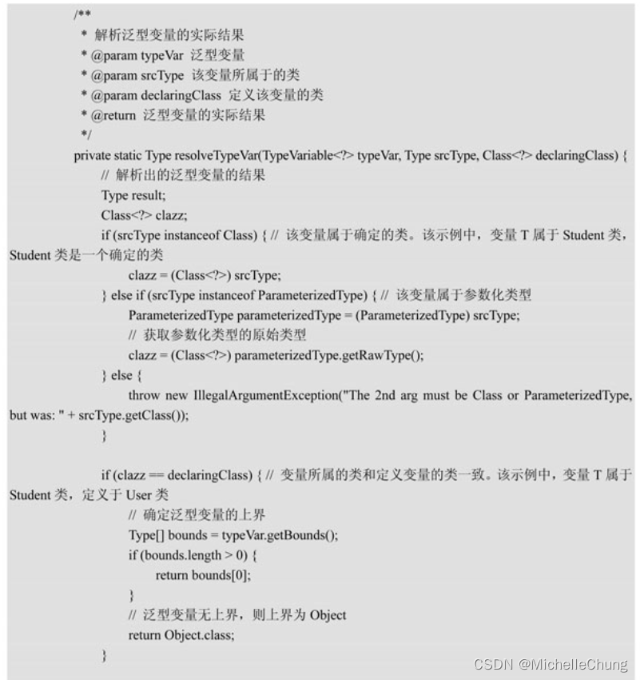

# 泛型解析器 TypeParameterResolver
- - -
## 前言
最近结合着源码书学习 `MyBatis`，毫不夸张的说，我所接触过的项目或多或少都有使用 `MyBatis`，即使不是直接使用，也有使用 `MyBatis-Plus` 这样的框架。

之前结合 `RuoYi-Vue-Plus` 框架也有对 `MyBatis-Plus` 底层的一些源码进行过分析，前不久在分析框架新的加密功能的时候，接触到了 `MyBatis` 拦截器，我才意识到之前因为觉得源码阅读比较吃力所以一直忽视了 `MyBatis` 这个重要的框架，刚好接触到了 [《通用源码阅读指导书：MyBatis源码详解》](https://weread.qq.com/web/bookDetail/de732ba071f94a8ede7dc94) 这本书，所以新开了 [《MyBatis 学习笔记》](https://blog.csdn.net/michelle_zhong/category_12206338.html)专栏，打算结合着这本书的学习记录一下学习笔记。

因为之前看过的一些内容还没有整理，所以本篇不是从一开始进行说明，本篇的内容是关于泛型解析器 `TypeParameterResolver`。

## 参考目录
- [《通用源码阅读指导书：MyBatis源码详解》](https://weread.qq.com/web/bookDetail/de732ba071f94a8ede7dc94) 
本文主要内容来自 `6.10 泛型解析器`。
- [《通用源码阅读指导书——MyBatis源码详解》配套示例](https://github.com/yeecode/MyBatisDemo) 
书中涉及的 Demo 示例，本文示例为 `Demo6`。

需要说明的是，书中使用的框架版本和本文（本专栏）使用的版本不一样。

| 名称          | 书中版本  | 专栏版本    |
|-------------|-------|---------|
| MyBatis     | 3.5.2 | 3.5.11+ |
| Spring Boot | 2.X   | 3.X     |
| JDK         | 8     | 17+     |

虽然版本不同，但是还是属于比较新的教材，所以不影响学习。

## 问题引入
本文的内容从一个问题开始，探究的是子类从父类中继承的方法的返回值。

> 

书中通过 `MyBatis` 泛型解析器的 `resolveReturnType` 方法来进行了分析： 

运行结果如下： 

书中使用 Debug 来分析了这一过程，本文参照书中的说明简单整理了 Debug 流程。

## 流程分析
注：以下 Debug 流程是获取 `type2` 的过程。

### `TypeParameterResolver#resolveReturnType`

### `TypeParameterResolver#resolveType`

- `TypeVariable`：类型变量，如 `Map<K, V>` 中的 `K`，`V`
- `ParameterizedType`：参数化类型，如 `Collection<String>`
- `GenericArrayType`：包含 `ParameterizedType` 或者 `TypeVariable` 元素的列表

> 
### `TypeParameterResolver#resolveParameterizedType`

- `TypeVariable`：类型变量，如 `List<T>`
- `ParameterizedType`：参数化类型，`如 List<List<T>>`
- `WildcardType`：通配符泛型，如 `List<? extends Number>`

> 

### `TypeParameterResolver#resolveTypeVar`

`TypeParameterResolver#scanSuperTypes` 

回到上一级： 

> 
> 

经过以上步骤，最终可得到运行结果。

（完）