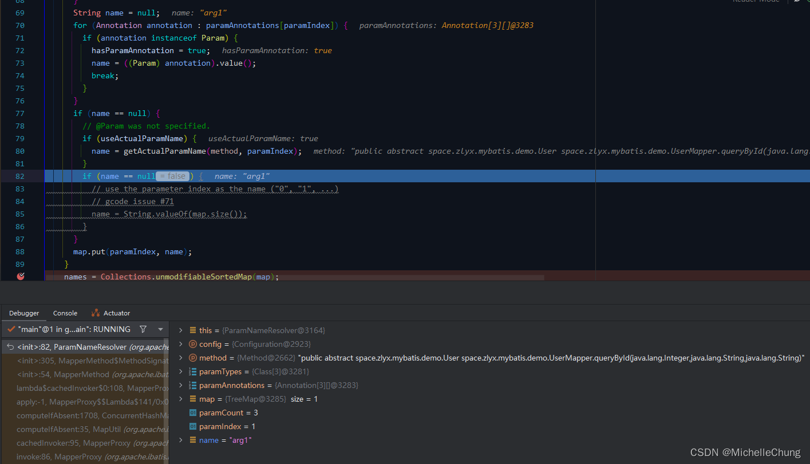
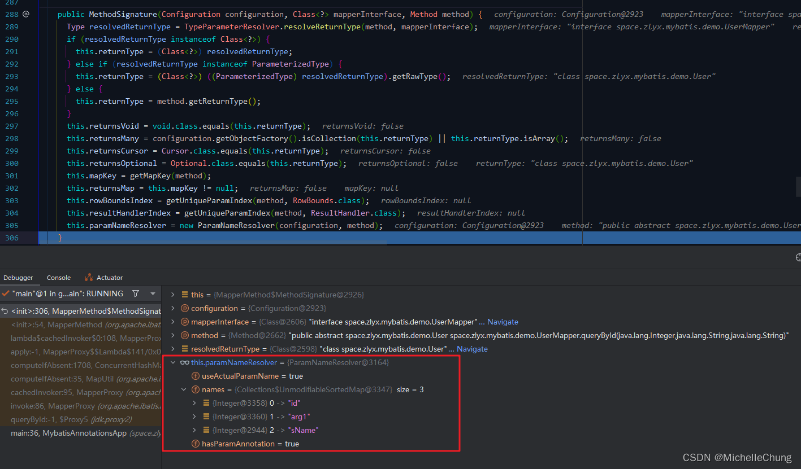

# Java 元注解以及 MyBatis @Param 注解分析
- - -
## 前言
本文内容对应的是书本第 7 章的内容，主要是关于Java 元注解以及 `@Param` 注解的分析。

## 参考目录
- [《通用源码阅读指导书：MyBatis源码详解》](https://weread.qq.com/web/bookDetail/de732ba071f94a8ede7dc94) 
本文主要内容来自 ` 第7章 annotations包与lang包`。
- [《通用源码阅读指导书——MyBatis源码详解》配套示例](https://github.com/yeecode/MyBatisDemo) 
书中涉及的 Demo 示例，本文示例在 `Demo1` 的基础上进行了简单改造。

与上篇一样，需要说明的是，书中使用的框架版本和本文（本专栏）使用的版本不一样。

|名称  | 书中版本 | 专栏版本 |
|--|--|--|
| MyBatis | 3.5.2 | 3.5.11+ |
| Spring Boot| 2.X | 3.X |
| JDK | 8 | 17+ |

随着版本的升级迭代，会有一些内容不尽相同，需要结合着进行学习。

## 学习笔记
### 1、Java 注解
### 1.1、Java 元注解

> 

两处划红色虚线的位置是我做了想法标注，由于作者使用的 JDK 版本并不是最新的，因此和现在的有差异，下面来说明一下。

Java中一共有 **七个** 元注解，分别是`@Documented`、`@Target`、`@Retention`、`@Inherited`、`@Repeatable`、`@Native`、`@ContentType`。

- `@Native`：这个注解用于标记一个方法是本地方法（native method）。本地方法是由非 Java 代码实现的方法，通常是用 C 或 C++ 等语言编写的。使用本地方法可以实现与Java虚拟机之外的底层系统或资源的交互。在声明本地方法时需要使用该注解，同时还需要在本地方法中使用 JNI（Java Native Interface）来和非 Java 代码交互。
- `@ContentType`：用于指定注解所表示的内容类型，例如时间跨度或频率。

### 1.2、Java ElementType 枚举值

> 

在 JDK 17 中，又多了两种枚举值 `MODULE` 以及 `RECORD_COMPONENT`。

具体查看源码可知： 

和 ChatGPT 唠了一下关于这两者： 

### 1.3、自定义注解
关于自定义注解，书中有进行举例说明。

结合前面学习的内容，本文以前几篇文章中分析 `RuoYi-Vue-Plus` 框架中的自定义注解 `@Translation` 为例对元注解的使用进行简单说明： 

### 2、`@Param` 注解分析
完成了对 Java 注解的基本了解之后，书中对 MyBatis 自定义注解 `@Param` 注解进行了分析，并结合代码分析了关于 Mapper 接口中定义的参数进行解析的过程。

### 2.1、`@Param` 注解

### 2.2、测试方法
参照书中的举例，结合 `Demo1` 进行了一些改造，其他不变，重点是观察 Mapper 接口的参数解析过程。

### 2.3、流程分析（重点：`ParamNameResolver`）
Debug 过程如下：

`MapperProxy#invoke` 

此方法是最终执行 SQL 查询的主要方法。参数的解析方法在第一步 `cachedInvoker(method)` 时完成。

`MapperProxy#cachedInvoker` 

`MapperMethod#MapperMethod` 

创建映射方法，创建 SQL 命令以及方法签名 `MethodSignature`。

`MethodSignature#MethodSignature` 

该方法的最后会创建一个参数名称解析器 `ParamNameResolver`，也是`@Param` 注解能够生效的原因所在。

`ParamNameResolver#ParamNameResolver` 

> 

由于测试方法中第二个参数没有标注注解，来看下它的参数名实际上是什么： 

最终完成三个参数参数名称的解析： 

所有的名称会被存在 names 中： 

回到上一级完成了方法签名的创建： 

最终返回到 `invoke` 方法执行 SQL 语句。 

本章节的重点是分析参数名称解析器 `ParamNameResolver` 的执行过程，对于其他方法会在后续的章节中再展开说明。

（完）