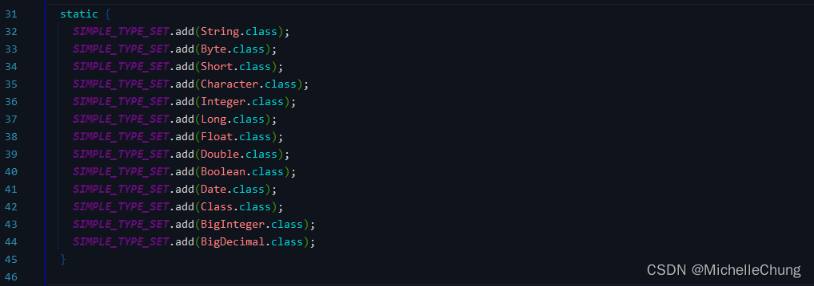
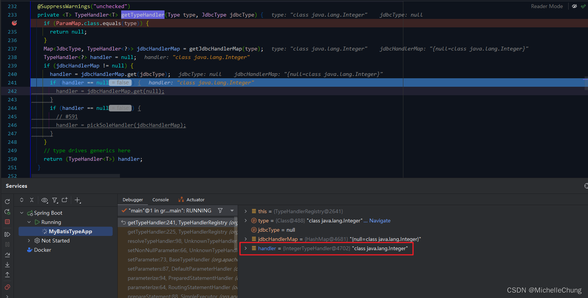

# 类型处理器 TypeHandler
- - -
## 前言
本文内容对应的是书本第 8 章的内容，主要是关于类型处理器  `TypeHandler` 的学习。

这一章节的学习有些地方理解还不算深入，Debug 之后还是有些不太能够理解的地方，到了后面的章节深入学习之后，再回头看希望会有新的收获。

## 参考目录
- [《通用源码阅读指导书：MyBatis源码详解》](https://weread.qq.com/web/bookDetail/de732ba071f94a8ede7dc94)<br>
本文主要内容来自 ` 第8章 type包`。

与上篇一样，需要说明的是，书中使用的框架版本和本文（本专栏）使用的版本不一样。

| 名称          | 书中版本  | 专栏版本    |
|-------------|-------|---------|
| MyBatis     | 3.5.2 | 3.5.11+ |
| Spring Boot | 2.X   | 3.X     |
| JDK         | 8     | 17+     |

随着版本的升级迭代，会有一些内容不尽相同，需要结合着进行学习。

## 学习笔记
### 1、`type` 包中类的归类总结
本章开篇首先对包中的所有类进行了分类，因为篇幅比较长，所以我整理了以下表格方便以后查阅。

| 组别      | 数量                                 | 类名称                                                                                                | 说明                                                                                                       |
|---------|------------------------------------|----------------------------------------------------------------------------------------------------|----------------------------------------------------------------------------------------------------------|
| 类型处理器   | 1接口<br/>1基础实现类<br/>1辅助类 <br/>43实现类 | 1接口：`TypeHandler`  <br/>1基础实现类：`BaseTypeHandler`<br/>1辅助类：`TypeReference`<br/>43实现类：`*TypeHandler` | `TypeHandler`：类型处理器接口<br/>`BaseTypeHandler`：类型处理器基础实现<br/>`TypeReference`：类型参考器<br/>`*TypeHandler`：类型处理器 |
| 类型注册表   | 3                                  | `SimpleTypeRegistry`、<br/>`TypeAliasRegistry`、<br/>`TypeHandlerRegistry`                           | `SimpleTypeRegistry`：基本类型注册表<br/>`TypeAliasRegistry`：类写别名注册表<br/>`TypeHandlerRegistry`：类型处理器注册表          |
| 注解      | 3                                  | `@Alias`、<br/>`@MappedJdbcTypes`、<br/>`@MappedTypes`                                               | `@Alias`：设置别名<br/>`@MappedJdbcTypes`：配置JDBC类型处理器<br/>`@MappedTypes`：配置Java类型处理器                          |
| 异常类     | 1                                  | `TypeException`                                                                                    | 类型处理相关异常                                                                                                 |
| 工具类     | 1                                  | `ByteArrayUtils`                                                                                   | 数组转换工具                                                                                                   |
| 枚举      | 1                                  | `JdbcType`                                                                                         | JDBC类型                                                                                                   |

本章的着重点在于表格前两组，即 `类型处理器` 以及 `类型注册表`。

### 2、类型处理器
类型处理器的设计使用了模板模式。

> 
### 2.1、`TypeReference` 类

### 3、类型注册表

类型注册表一共三个，分别是 `SimpleTypeRegistry`，`TypeAliasRegistry`， `TypeHandlerRegistry`。

> SimpleTypeRegistry 是一个非常简单的注册表，其内部使用一个SIMPLE_TYPE_SET变量维护所有 Java基本类型。



> TypeAliasRegistry是一个类型别名注册表，其内部使用 typeAliases变量维护类型的别名与类型的对应关系。


> TypeHandlerRegistry 是这三个注册表中最为核心的一个，数据类型和相关处理器的对应关系就是由它维护的。


> 

运行时保存的内容：

```java
// JDBC 类型与对应类型处理器的映射
private final Map<JdbcType, TypeHandler<?>> jdbcTypeHandlerMap = new EnumMap<>(JdbcType.class);
```


```java
// Java 类型与 Map<JdbcType, TypeHandler<?>> 的映射
private final Map<Type, Map<JdbcType, TypeHandler<?>>> typeHandlerMap = new ConcurrentHashMap<>();
```

### 3.1、`TypeHandlerRegistry#getTypeHandler`


> 




（完）