# 从 MapperMethod 简单分析一条 SQL 的映射操作流程
- - -

## 前言
本文内容对应的是书本第 13 章的内容，主要是关于 `binding` 包的学习，学习了本章之后就可以知道 MyBatis 如何将 Java 接口映射成为 SQL 语句执行。

## 参考目录
- [《通用源码阅读指导书：MyBatis源码详解》](https://weread.qq.com/web/bookDetail/de732ba071f94a8ede7dc94) 
本文主要内容来自 ` 第13章 binding包`。
- [《通用源码阅读指导书——MyBatis源码详解》配套示例](https://github.com/yeecode/MyBatisDemo) 
书中涉及的 Demo 示例，本文示例在 `Demo1` 的基础上进行了简单改造。

与上篇一样，需要说明的是，书中使用的框架版本和本文（本专栏）使用的版本不一样。

| 名称          | 书中版本   | 专栏版本    |
|-------------|--------|---------|
| MyBatis     | 3.5.2  | 3.5.11+ |
| Spring Boot | 2.X    | 3.X     |
| JDK         | 8      | 17+     |

随着版本的升级迭代，会有一些内容不尽相同，需要结合着进行学习。

## 学习笔记
由于书中讲述的内容并不是按照执行的流程来进行说明的，所以在结合 Debug 的情况下通读了两三遍之后，也大概能够理解清楚作者所说明的内容，下面将按照调用的实际顺序进行简单分析。

### 1、测试代码说明
代码和前面的 Demo 类似，为了测试，所以在 Mapper 中加了一个默认方法：
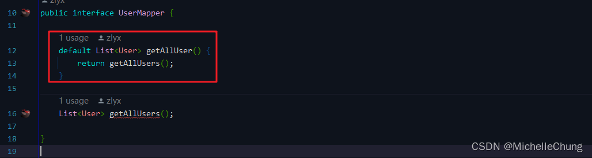

默认方法的作用下面再展开说明。

本文的流程主要是下面两行代码的执行流程：
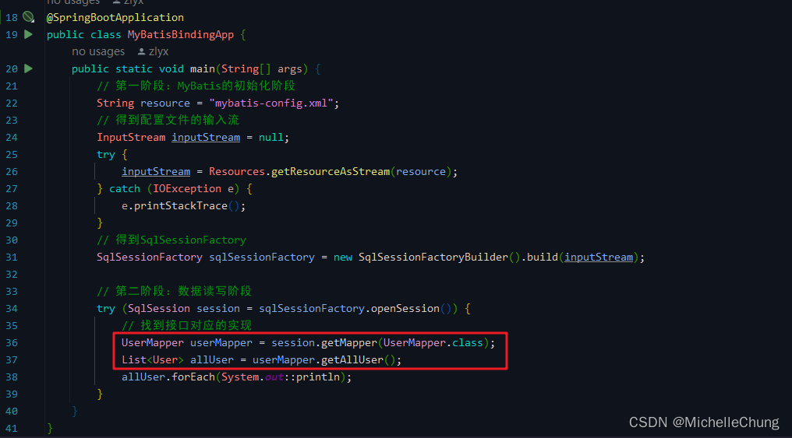

下面的说明也由两部分组成：
- 第一部分是关于 Mapper 接口实例的获取流程
- 第二部分是关于 SQL 语句执行流程

### 2、binding 包的主要功能

> binding包具有以下两个功能。 
> - 维护映射接口中抽象方法与数据库操作节点之间的关联关系； 
> - 为映射接口中的抽象方法接入对应的数据库操作。

### 3、获取 Mapper 接口实例过程
在阅读到后面之前，思考书中的说明：

> 每个MapperMethod对象都对应了一个数据库操作节点，调用 MapperMethod实例中的 execute方法就可以触发节点中的 SQL语句。

如果查看源码的话，这其实是一个反向推导的过程，从 `MapperMethod#execute` 方法开始往前回溯：

 - `MapperMethod` 调用具体的 SQL 语句：`MapperMethod#execute`
 - 前一步骤由 `MapperProxy` 进行调用的：`MapperProxy.PlainMethodInvoker#invoke`
 - `MapperProxy` 的实例化：`MapperRegistry#getMapper`

有了初步的梳理之后，下面再 Debug 进行查看。

`MapperRegistry#getMapper` 
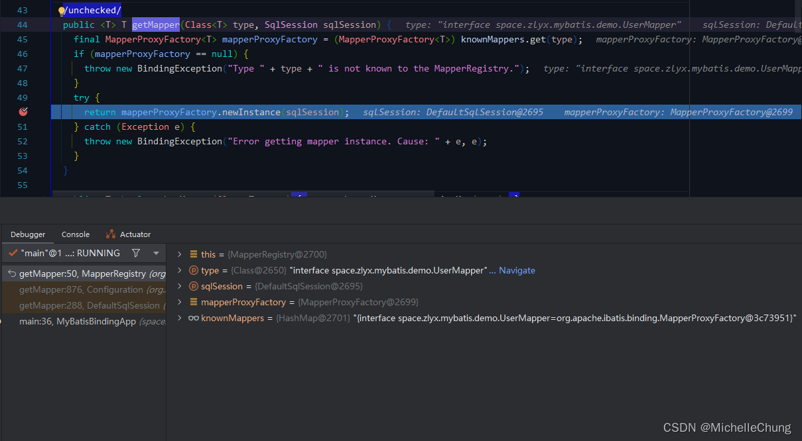

`MapperProxyFactory#newInstance` 
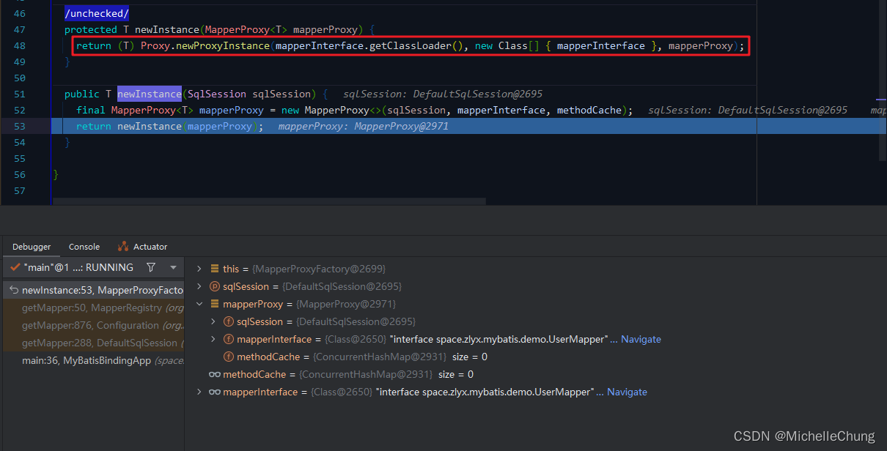

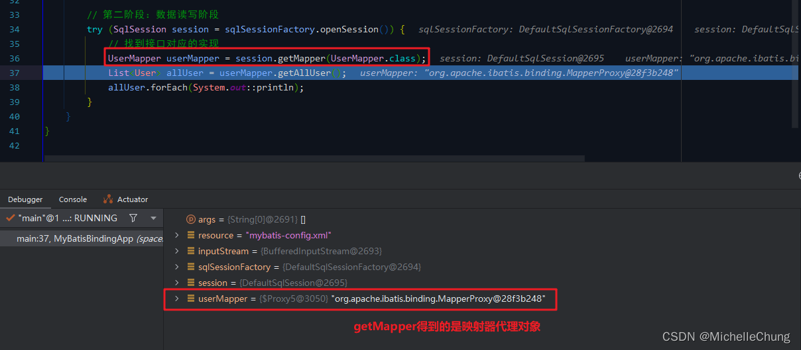
### 4、SQL 语句执行流程
有步骤 `#3` 可知，Mapper 接口实例是一个代理对象，由代理对象来调用 `MapperMethod#execute` 方法。

将上面回溯的步骤再进行细化和简单的补充：
- `MapperProxy.PlainMethodInvoker#invoke` 方法是 `MapperProxy#cachedInvoker` 进行调用的，该方法是获取一个方法调用器。
- 再向上一层则是 `MapperProxy#invoke`，此处暂时不展开。

`MapperProxy#invoke` 
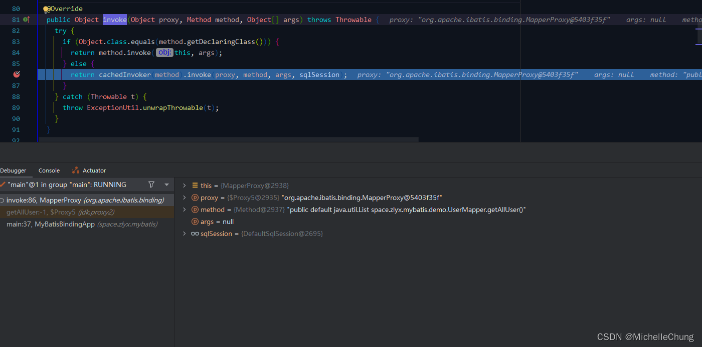

### 4.1、方法调用器
`MapperProxy#cachedInvoker` 
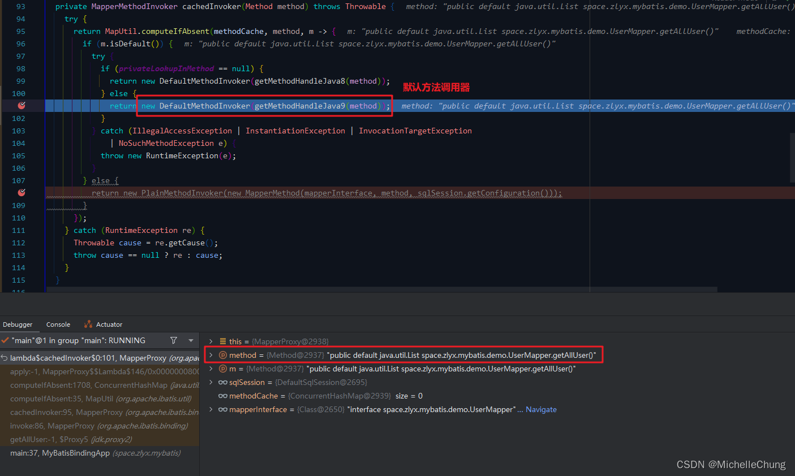

由于调用的是 Mapper 中的默认方法，所以会先获取默认方法的调用器，然后默认方法中由调用了 Mapper.xml 的方法，所以第二次是下面的普通方法调用器。

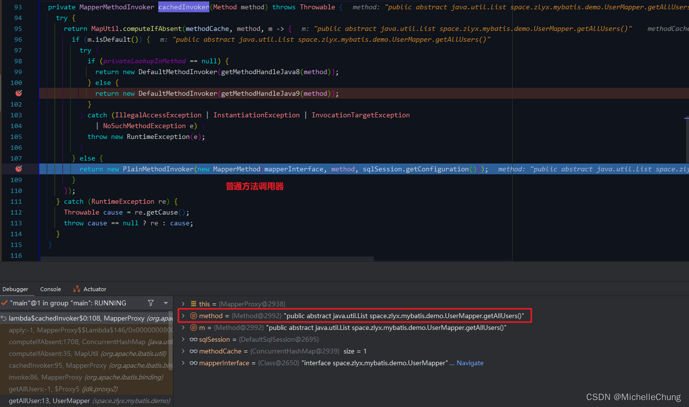

> DefaultMethodInvoker是一个针对Java 8及以上版本的特性进行实现的类，用于调用接口中的默认方法。 
> PlainMethodInvoker是一个普通的方法调用器，用于调用Mapper接口中的普通方法。当Mapper接口中的方法不是默认方法时，就使用这个调用器执行方法调用。

两个默认方法调用器因为 JDK 版本不同所以有不同的实现方法：
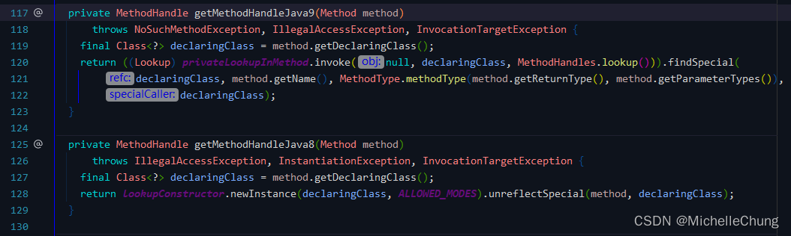

具体的我请教了一下 ChatGPT： 
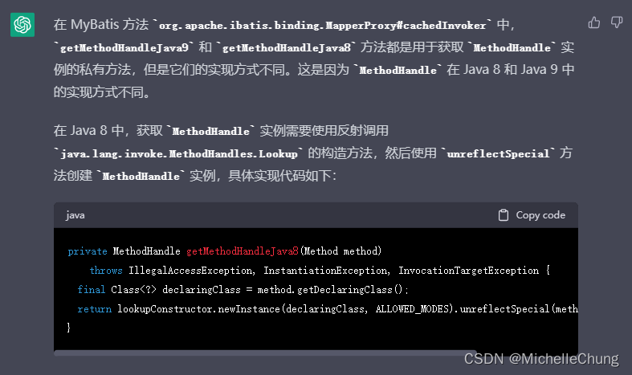

### 4.2、`MapperMethod` 绑定方法

该类有两个子类 `SqlCommand` 和 `MethodSignature` 分别对应了数据库操作和 Java 方法。

> 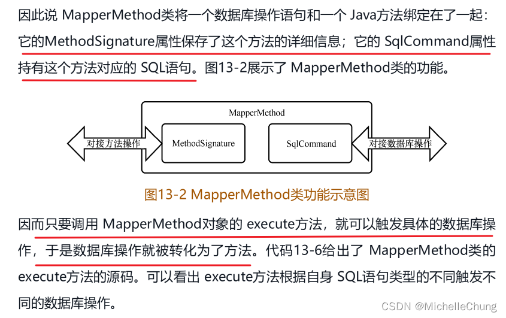

普通方法调用器会创建一个 `MapperMethod` 对象：

`MapperMethod#MapperMethod` 

### 4.2.1、`SqlCommand`
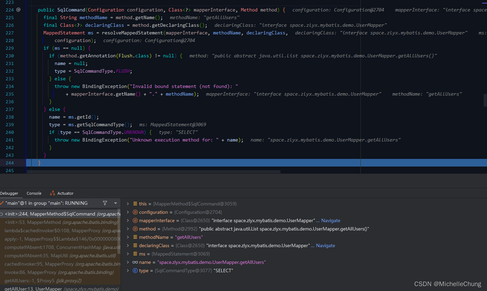

### 4.2.2、`MethodSignature`
方法签名在之前学习参数解析的时候也有接触过。 
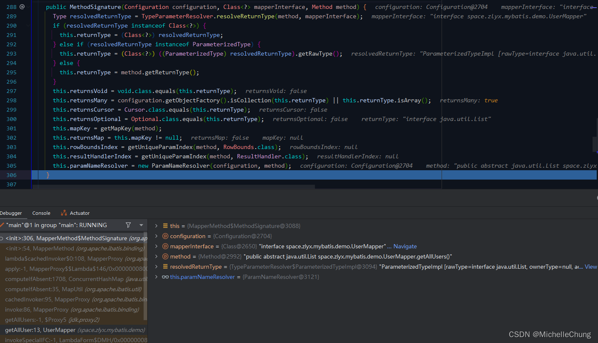

`MapperMethod` 对象创建完成： 
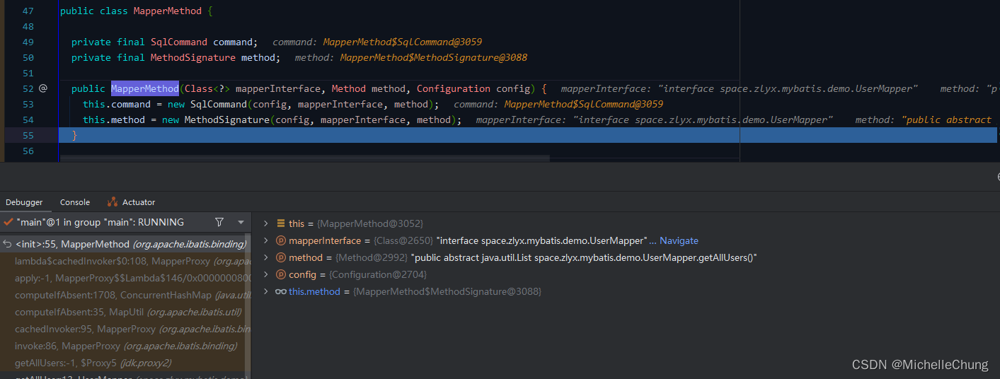

### 4.3、`MapperMethod#execute`
`MapperProxy.PlainMethodInvoker#invoke` 
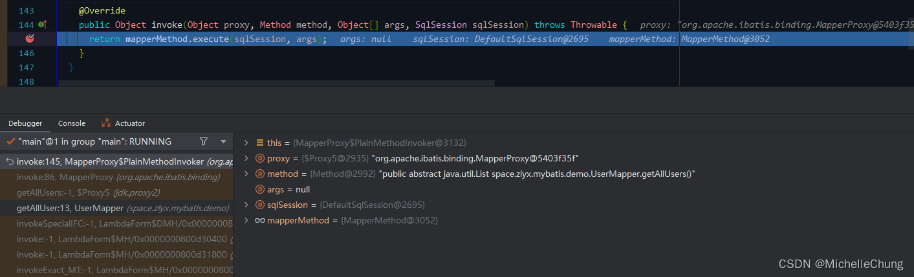

`MapperMethod#execute` 
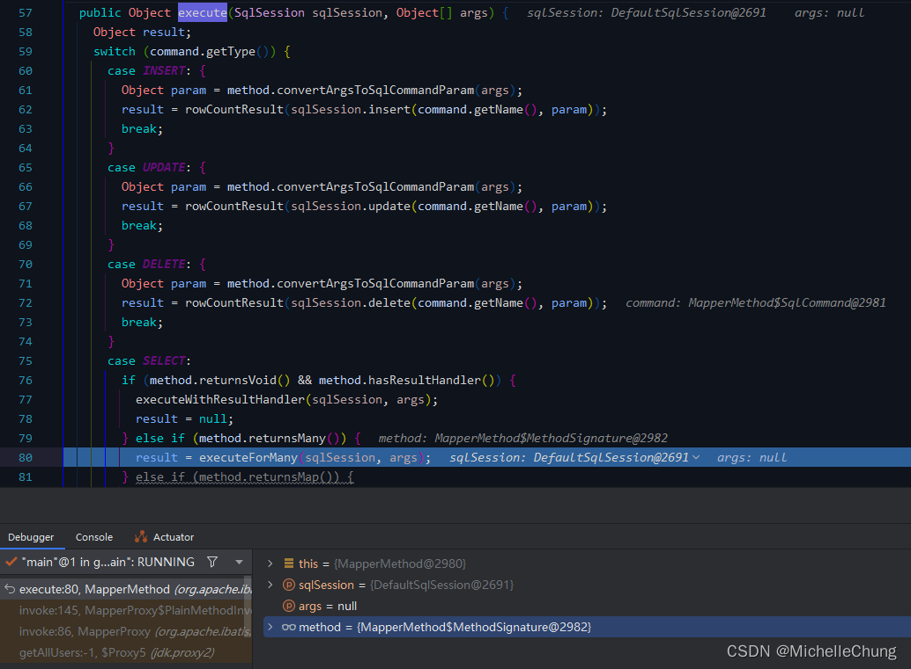

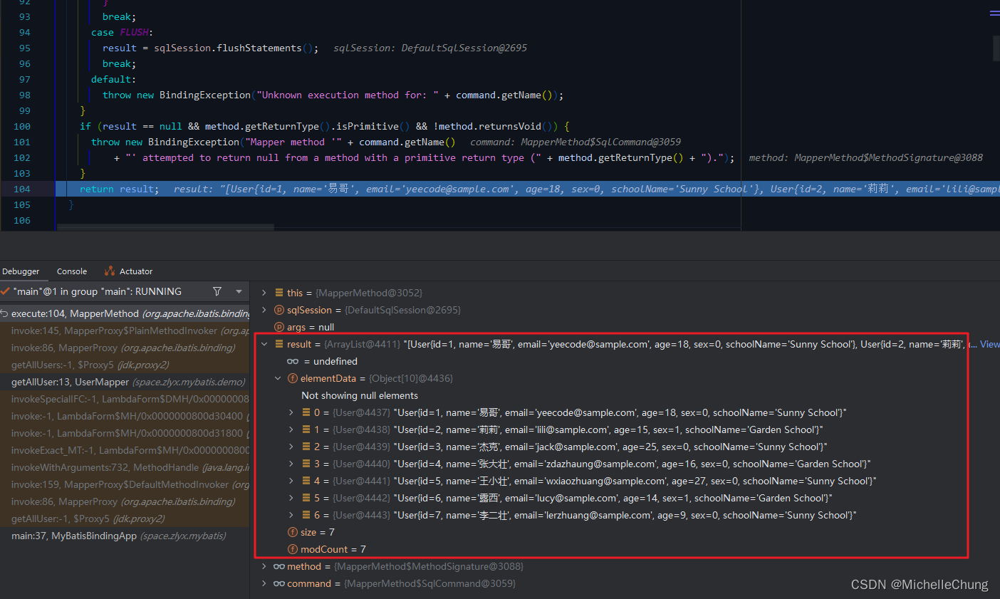

至此完成了一次数据库方法的调用。

（完）
