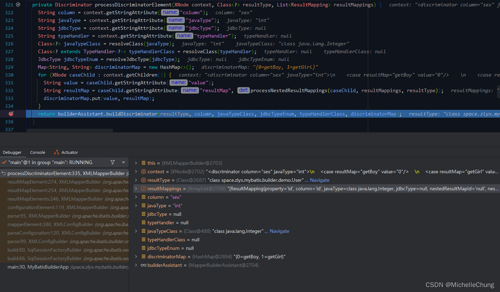
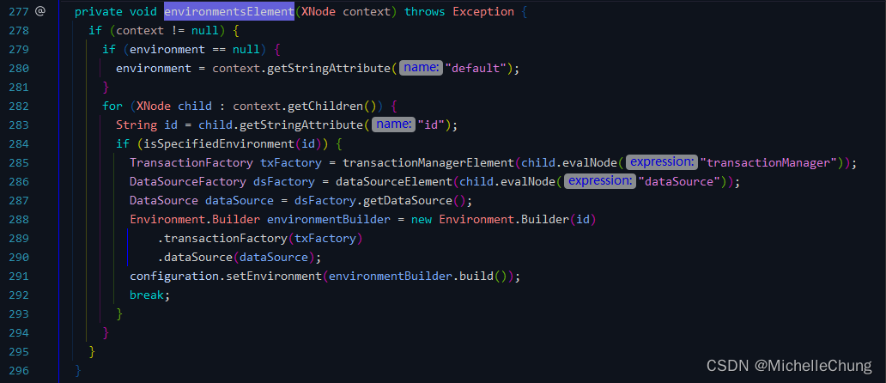
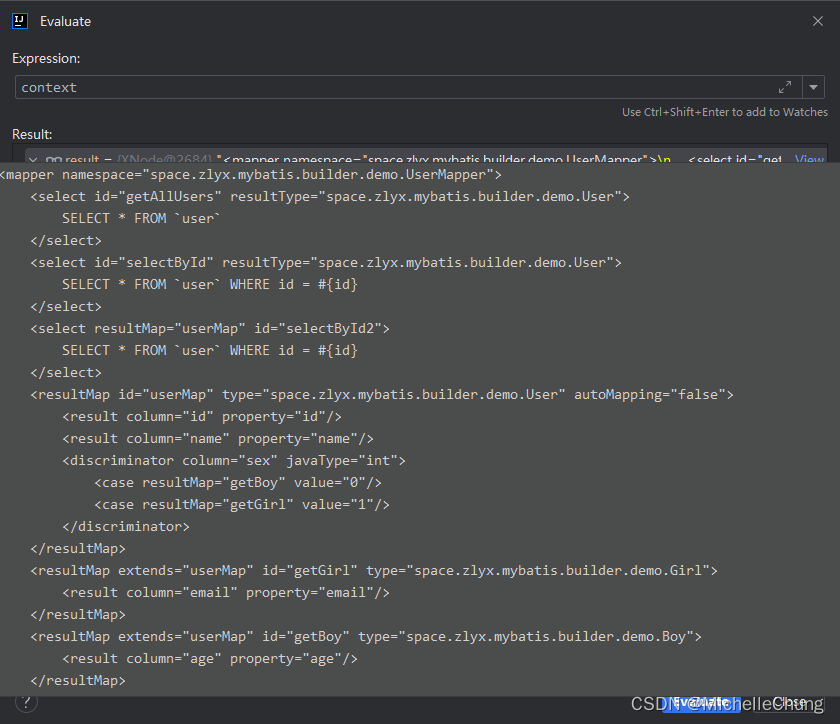
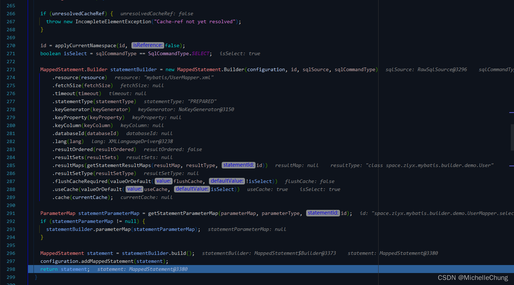

# 关于 xml 文件解析的分析
- - -
## 前言
本文内容对应的是书本第 14 章的内容，主要是关于 `builder` 包的学习，本章节的内容比较多，每一小节都有相应的例子进行说明，也附带了源码的注释说明，因此本文只是选择了本章节一部分的内容来进行 Debug 分析说明。

## 参考目录
- [《通用源码阅读指导书：MyBatis源码详解》](https://weread.qq.com/web/bookDetail/de732ba071f94a8ede7dc94)<br>
本文主要内容来自 ` 第14章 builder包`。
- [《通用源码阅读指导书——MyBatis源码详解》配套示例](https://github.com/yeecode/MyBatisDemo)<br>
书中涉及的 Demo 示例，本文示例在 `Demo13` 的基础上进行了简单改造。

与上篇一样，需要说明的是，书中使用的框架版本和本文（本专栏）使用的版本不一样。

| 名称          | 书中版本  | 专栏版本    |
|-------------|-------|---------|
| MyBatis     | 3.5.2 | 3.5.11+ |
| Spring Boot | 2.X   | 3.X     |
| JDK         | 8     | 17+     |

随着版本的升级迭代，会有一些内容不尽相同，需要结合着进行学习。

## 学习笔记
### 1、章节目录概览
由于我在微信读书看书的时候，电子版对于书本章节里面的小节并没有进行详细的划分，有些小节的内容并没有在目录体现出来，对于想要快速查找资料不太方便，所以下面简单的做了整理，方便后面复习时进行对照查找。

**（加粗的部分是下面会进行分析的内容）**

- 14.1 建造者模式
- 14.2 建造者基类与工具类
- **14.3 SqlSourceBuilder类与StaticSqlSource类**
- 14.4 CacheRefResolver类和ResultMapResolver类
	- 14.4.1 CacheRefResolver类
	- **14.4.2 ResultMapResolver类**
- 14.5 ParameterExpression类
- **14.6 XML文件解析**
	- **14.6.1 XML文件的声明解析**
	- **14.6.2 配置文件解析**
	- **14.6.3 数据库操作语句解析**
	- **14.6.4 Statement解析**
	- 14.6.5 引用解析
- 14.7 注解映射的解析
	- 14.7.1 注解映射的使用
	- 14.7.2 注解映射解析的触发
	- 14.7.3 直接注解映射的解析
	- 14.7.4 间接注解映射的解析

### 2、`14.3`：`SqlSourceBuilder` 类与 `StaticSqlSource` 类

> SqlSourceBuilder 类能够将 DynamicSqlSource 和 RawSqlSource 中的“＃{}”符号替换掉，从而将它们转化为 StaticSqlSource。

`#{}` 其实是 xml 文件中很重要的参数占位符，而 `SqlSourceBuilder` 的作用就是把占位符解析并转换成为 SQL，下面通过一个简单的示例来 Debug 看一下这个过程。

测试的SQL：

```xml
	<select id="selectById" resultType="User">
        SELECT * FROM `user` WHERE id = #{id}
    </select>
```

`SqlSourceBuilder#parse`<br>


`GenericTokenParser#parse`<br>


解析完成后，返回 `SqlSourceBuilder#parse` 方法构建 `StaticSqlSource`：


`StaticSqlSource#StaticSqlSource`<br>


### 3、`14.4.2`：`ResultMapResolver` 类

> 借助于 MapperBuilderAssistant 的 addResultMap 方法，ResultMapResolver 完成了ResultMap 的继承关系解析，最终给出一个解析完继承关系之后的ResultMap 对象。

### 3.1、测试代码说明
跟参考目录 Demo 中的 `Demo13` 类似，测试代码如下：


ResultMap 对象的解析由主节点到子节点依次进行，下面的分析也分成三个部分，分别是 `userMap`，`getGirl` 以及 `discriminator`。

### 3.2、结果集 `userMap` 解析流程

`XMLMapperBuilder#resultMapElements`<br>


`XMLMapperBuilder#resultMapElement`<br>


> resultMap 继承关系的解析由 ResultMapResolver 类来完成。

`ResultMapResolver#resolve`<br>


> 借助于 MapperBuilderAssistant 的 addResultMap 方法，ResultMapResolver 完成了ResultMap 的继承关系解析，最终给出一个解析完继承关系之后的ResultMap 对象。

`MapperBuilderAssistant#addResultMap`<br>


### 3.3、结果集 `getGirl` 解析流程
`XMLMapperBuilder#resultMapElements`<br>


`XMLMapperBuilder#resultMapElement`<br>


`ResultMapResolver#resolve`<br>


`MapperBuilderAssistant#addResultMap`<br>


### 3.4、鉴别器 `discriminator` 解析流程
`XMLMapperBuilder#resultMapElement`<br>


`XMLMapperBuilder#processDiscriminatorElement`<br>


解析结果：<br>


### 4、`14.6`：XML 文件解析
解析的语句：

```xml
<!DOCTYPE mapper   PUBLIC "-//mybatis.org//DTD Mapper 3.0//EN" "http://mybatis.org/dtd/mybatis-3-mapper.dtd">
```


### 5、`14.6.2`：配置文件解析
先抛出结论：

> XMLConfigBuilder在 MyBatis的配置解析中起到了引导的作用，正是从它的parse方法开始，引发了配置文件和映射文件的解析。

放到代码当中，实际上是创建 `SqlSessionFactory` 时，`XMLConfigBuilder` 对 XML 文件进行解析。

执行方法的调用链如下：
- `org.apache.ibatis.session.SqlSessionFactoryBuilder#build`
	-  `org.apache.ibatis.builder.xml.XMLConfigBuilder#parse`
		-  `org.apache.ibatis.builder.xml.XMLConfigBuilder#parseConfiguration`
			- `org.apache.ibatis.builder.xml.XMLConfigBuilder#environmentsElement`

XML 配置文件 `mybatis-config.xml`<br>


`XMLConfigBuilder#parseConfiguration`<br>


`XMLConfigBuilder#environmentsElement`<br>


一共三部分：默认环境，事务管理器 `TransactionFactory`，数据源 `DataSourceFactory`。

参数 `XNode context`：<br>


默认环境<br>


事务管理器 `TransactionFactory`

`XMLConfigBuilder#transactionManagerElement`<br>


数据源 `DataSourceFactory`

`XMLConfigBuilder#dataSourceElement`<br>


最终解析完成 `XMLConfigBuilder#environmentsElement`：<br>


### 6、`14.6.3`：数据库操作语句解析

> parse 方法为解析的入口方法，然后调用configurationElement 方法逐层完成解析。

和配置文件解析过程类似，执行方法的调用链如下：
- `org.apache.ibatis.builder.xml.XMLConfigBuilder#parseConfiguration`
	- `org.apache.ibatis.builder.xml.XMLConfigBuilder#mapperElement`
		- `org.apache.ibatis.builder.xml.XMLMapperBuilder#parse`
			- `org.apache.ibatis.builder.xml.XMLMapperBuilder#configurationElement`

> 由 configurationElement（parser.evalNode（"/mapper"））语句触发后，系统会依次解析映射文件的各个节点。

`XMLMapperBuilder#parse`<br>


参数 `XNode context`：<br>


 - `cacheRefElement`：缓存引用
 - `cacheElement`：缓存
 - `parameterMapElement`：参数映射
 - `resultMapElements`：结果映射
 - `sqlElement`：sql
 - `buildStatementFromContext`：从上下文构建语句

### 7、`14.6.4`：Statement 解析
这里主要是承接上一小节对 `buildStatementFromContext` 方法进行了说明。

执行方法的调用链如下：
- `org.apache.ibatis.builder.xml.XMLMapperBuilder#buildStatementFromContext`
	- `org.apache.ibatis.builder.xml.XMLStatementBuilder#parseStatementNode`

`XMLStatementBuilder#parseStatementNode`<br>


`MapperBuilderAssistant#addMappedStatement`<br>




解析完成的 `statement`：<br>


### 8、`14.7`：注解映射的解析
这里主要是对于书中没有详细说明的 `泛型桥接方法` 进行简单的拓展。

关于这一方面我和 ChatGPT 来回讨论了几次然后有了以下说明：


还有一些补充说明作为辅助理解：<br>


关于该方法的参数讨论：<br>


（完）