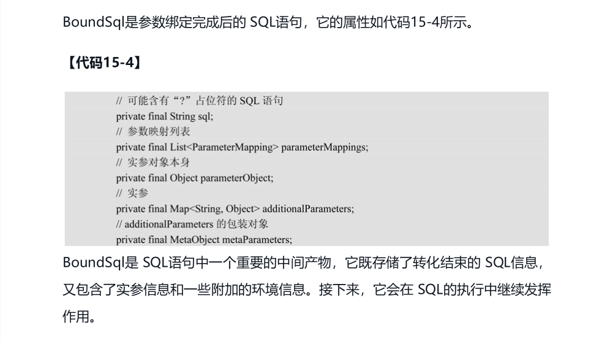
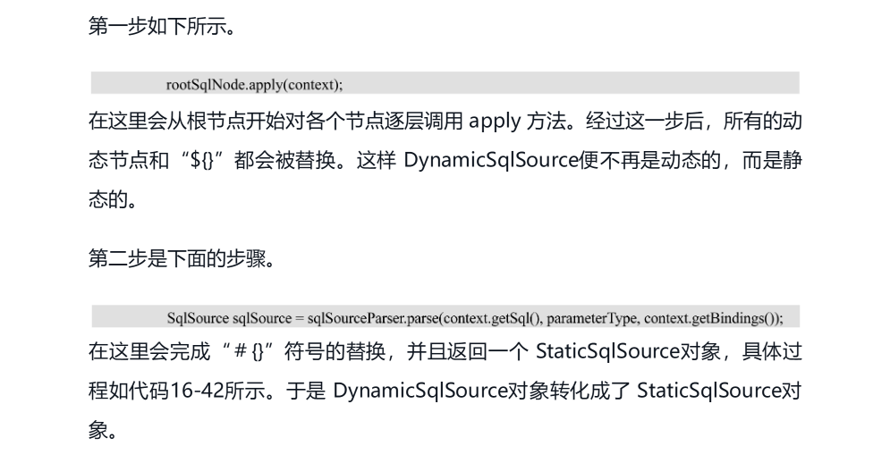
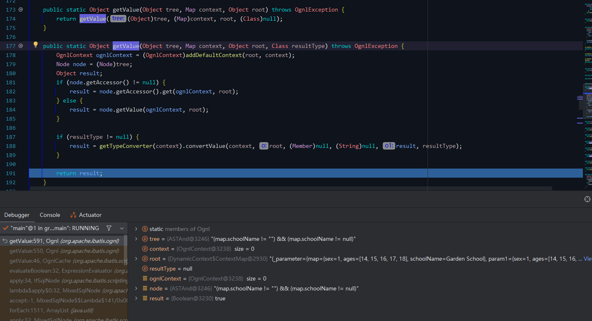
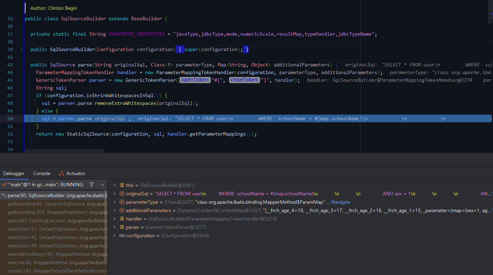

# 关于 xml 文件 SQL 解析流程（从 DynamicSqlSource 到 StaticSqlSource）
- - -

## 前言
本文内容对应的是书本第 15、16 章的内容。在 [上一篇](https://blog.csdn.net/Michelle_Zhong/article/details/129294081) 文章中（对应书本第 14 章）有提及过 `SqlSourceBuilder` 对于 SQL 语句中 `#{}` 占位符的转换过程，但是在该章节中并没有对复杂的 SQL 解析进行展开说明，因为相关的类分别在 `mapping` 包（第 15 章）和 `scripting` 包（第 16 章）中。

后面两个章节对此基础上进行了展开，本文主要是挑选了其中关于 `DynamicSqlSource` 解析变成 `StaticSqlSource` 的内容进行说明。

先来个图简单说明一下这篇文章要说啥。
> 
## 参考目录
- [《通用源码阅读指导书：MyBatis源码详解》](https://weread.qq.com/web/bookDetail/de732ba071f94a8ede7dc94)<br>
本文主要内容来自 `第15章 mapping包`  和 `第16章 scripting包` 。
- [《通用源码阅读指导书——MyBatis源码详解》配套示例](https://github.com/yeecode/MyBatisDemo)<br>
书中涉及的 Demo 示例。

与上篇一样，需要说明的是，书中使用的框架版本和本文（本专栏）使用的版本不一样。

| 名称          | 书中版本   | 专栏版本    |
|-------------|--------|---------|
| MyBatis     | 3.5.2  | 3.5.11+ |
| Spring Boot | 2.X    | 3.X     |
| JDK         | 8      | 17+     |

随着版本的升级迭代，会有一些内容不尽相同，需要结合着进行学习。

## 学习笔记
### 1、前置内容
对于这两个章节的学习其实都不算太难，跟着作者的思路读源码是比较容易上手的，这里先对书中一些重点的内容进行梳理，有利于后面问题的展开分析。
### 1.1、关于 SqlSource （`15.1.2 SqlSource类`）
> SqlSource是一个解析实体接口，它对应了 MappedStatement中的 SQL语句。<br>
> 接口中只定义了一个用以返回一个 BoundSql 对象的方法。


> SqlSource接口有四种实现类。


SqlSource接口的四种实现类的区别：

| 类名                | 说明        | 含义                                                   | 来源     |
|:------------------|:----------|:-----------------------------------------------------|:-------|
| DynamicSqlSource  | 动态 SQL 语句 | 指含有动态 SQL节点（如 `if` 节点）或者含有 `${}` 占位符的语句。             | XML 文件 |
| RawSqlSource      | 原生 SQL 语句 | 指非动态语句，语句中可能含 `#{}` 占位符，但不含有动态 SQL节点，也不含有 `${}` 占位符。 | XML 文件 |
| StaticSqlSource   | 静态语句      | 语句中可能含有 `?`，可以直接提交给数据库执行。                            | XML 文件 |
| ProviderSqlSource | 注解 SQL 语句 | 通过注解映射的形式获取的 SQL 语句。                                 | 注解映射   |

> DynamicSqlSource 和 RawSqlSource 都会被处理成 StaticSqlSource，然后再通过StaticSqlSource的 getBoundSql方法得到 SqlSource对象。

### 1.2、关于 BoundSql（`15.1.3 BoundSql`）
> 
### 1.3、关于 SqlNode（`16.4.4 SQL节点及其解析`）
>  <br>
>
> 

### 2、提出问题
问题来自于 `16.5.2 DynamicSqlSource的转化`：
> DynamicSqlSource类在 scripting包的 xmltags子包中，它表示含有动态 SQL节点（如if节点）或者含有“${}”占位符的语句，即动态 SQL语句。<br>
> 在 15.1.2节中介绍过，DynamicSqlSource和 RawSqlSource都会转化为StaticSqlSource，然后才能给出一个 BoundSql对象。那这个转化过程是怎样的？

### 3、`DynamicSqlSource` 的转化

这一转化过程其实就是 XML 文件中 SQL 语句的解析过程。涉及到的方法只有一个：

`DynamicSqlSource#getBoundSql`


### 3.1、先看看书里怎么说
>  <br>
>
> 
> <br>
>
> 
> 

### 3.2、测试 Demo
为了能够加深理解，最好的方法当然是 Debug，所以写一个简单的 Demo 来看看这一过程。

Demo 可以看看上面参考目录里面的源码配套示例，也可以自己写，自己写的话可以尽可能多的尝试不同的 SQL 节点，来观察一下相关的解析过程。

`Mapper` 接口：


`XML` 文件：


`main` 方法：


### 3.3、调用流程


```java
DynamicContext context = new DynamicContext(configuration, parameterObject);
```
`DynamicContext#DynamicContext`


### 3.3.1、替换所有的动态节点和 `"${}"`
```java
// 从根节点开始替换所有的动态节点和 "${}"
rootSqlNode.apply(context);
```

这里的根节点是 `MixedSqlNode`。根节点的解析通过方法 `XMLScriptBuilder#parseDynamicTags` 实现。


> parseDynamicTags 会逐级分析 XML 文件中的节点并使用对应的NodeHandler 实现来处理该节点，最终将所有的节点整合到一个MixedSqlNode 对象中。MixedSqlNode对象就是 SQL节点树。<br>
> 在整合节点树的过程中，只要存在一个动态节点，则 SQL节点树就是动态的。动态的SQL节点树将用来创建 DynamicSqlSource对象，否则就创建 RawSqlSource对象。


针对不同的节点，由不同的 `SqlNode` 实现类进行解析处理。

#### `MixedSqlNode#apply`

#### `StaticTextSqlNode#apply`


这里的逻辑比较简单，就是将文本内容拼接到上下文 sql 中。

`DynamicContext#appendSql`


完成之后返回 `true`，代表解析成功。


#### `IfSqlNode#apply`

以第一个节点为例说明。

```xml
<if test="map.schoolName != '' and map.schoolName != null">
    AND schoolName = #{map.schoolName}
</if>
```


> IfSqlNode对应着数据库操作节点中的 if节点。通过 if节点可以让 MyBatis根据参数等信息决定是否写入一段 SQL片段。<br>
> IfSqlNode的 apply方法非常简单：直接调用表达式求值器计算 if节点中表达式的值，如果表达式的值为真，则将 if 节点中的内容添加到环境上下文的末尾。

`ExpressionEvaluator#evaluateBoolean`


简单看下 OGNL 解析过程：

`OgnlCache#getValue`


`Ognl#getValue`


计算结果为 `true`，将 `if` 节点内容加入上下文。


#### `ForEachSqlNode#apply`
```xml
AND age IN
<foreach collection="map.ages" item="age" open="(" separator="," close=")">
    #{age}
</foreach>
```


`foreach` 节点的拼接通过循环来进行（废话）。

先来看看入参：


循环的过程如下：


观察一下循环中 sql 的变化。

第一次循环结束：


第二次循环结束：


循环结束：


#### `TextSqlNode#apply`


`${}` 解析替换过程：

`GenericTokenParser#parse`


### 3.3.2、替换 `#{}`

`SqlSourceBuilder#parse`


和 `${}` 替换使用的是同一个方法 `GenericTokenParser#parse`。

入参：


解析完成：


### 3.3.3、完成解析

完成解析，最终返回 `BoundSql` 对象。


### 3.4、输出

控制台输出如下：


### 4、总结
> 


（完）