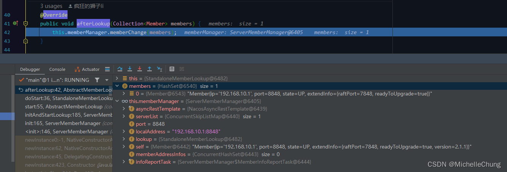

# Nacos（一）寻址机制之单机寻址分析

## 前言
国庆放假回了一趟老家，然后回来连续搬砖七天（整个人快魔怔了），嘛，调整一下心情重新回到学习的路上。

之前 [狮子大佬](https://blog.csdn.net/weixin_40461281?type=blog) 有提议要不要研究一下【RuoYi-Cloud-Plus】，因为之前没有用过 Cloud 框架，对于相关的一些知识只是看过一些视频浅浅了解过，所以决定还是要从简单的开始入手学习一下这个框架，当然【RuoYi-Vue-Plus】也会继续更新下去。

## 参考文档
- [框架 wiki](https://gitee.com/JavaLionLi/RuoYi-Cloud-Plus/wikis/%E9%A1%B9%E7%9B%AE%E7%AE%80%E4%BB%8B)
- [Nacos 官方文档](https://nacos.io/zh-cn/docs/what-is-nacos.html)
- [Nacos架构&原理](https://developer.aliyun.com/ebook/36?spm=a2c6h.20345107.ebook-index.18.152c2984fsi5ST) 
强烈推荐阅读一下这本官方教程。

本文是在阅读上述教程《Nacos架构&原理》章节 `Nacos 寻址机制` 时，对于其内容在源码实现说明上的补充。

本文内容也相对简单，主要是关于单机寻址，也即目前框架中使用的方式（后面会再写关于集群模式以及文件寻址的内容）。

> 关于单机寻址的描述： 
> 
## 源码分析
### 1、配置单机模式
`com.alibaba.nacos.Nacos` 

### 2、`StandaloneProfileApplicationListener#onAppliationEvent`
 

启动 Nacos，会自动注册 `StandaloneProfileApplicationListener`。 

 

在前面启动类 main 方法中配置了单机模式，所以此处会加入这个配置。

### 3、`ServerMemberManager`

> ServerMemberManager 存储着本节点所知道的所有成员节点列表信息，提供了针对成员节点的
增删改查操作，同时维护了⼀个 MemberLookup 列表，方便进行动态切换成员节点寻址方式。

`ServerMemberManager#init` 

### 4、初始化寻址模式  `ServerMemberManager#initAndStartLookup`

通过 `LookupFactory` 创建。

### 4.1、`LookupFactory#createLookUp`

创建单机寻址对象 `new StandaloneMemberLookup()`。 

关于 `LOOK_UP.injectMemberManager(memberManager)` ： 

> 用于将 ServerMemberManager 注入到 MemberLookup 中，方便利用 ServerMemberManager 的存储、查询能力。

### 4.2、`AbstractMemberLookup#start`

`StandaloneMemberLookup#doStart` 

`MemberUtil#readServerConf` 

### 4.2.1、 `AbstractMemberLookup#afterLookup`

> afterLookup 则是个事件接口，当 MemberLookup 需要进行成员节点信息更新时，会将当前最新的成员节点列表信息通过该函数进行通知给 ServerMemberManager，具体的节点管理方式，则是隐藏到具体的 MemberLookup 实现中。

`ServerMemberManager#memberChange` 

至此，`ServerMemberManager` 初始化完毕。

Nacos 启动完成。

