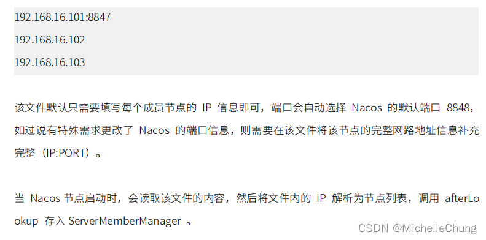
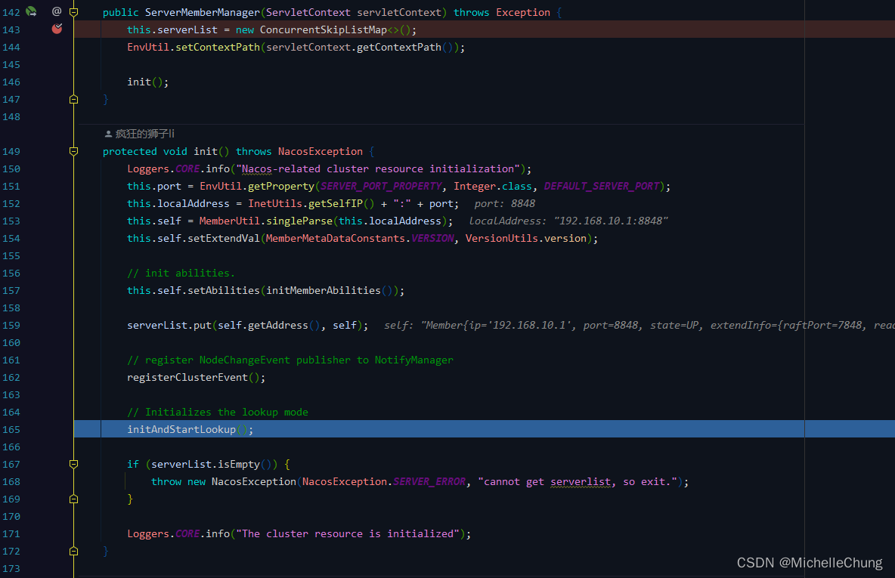
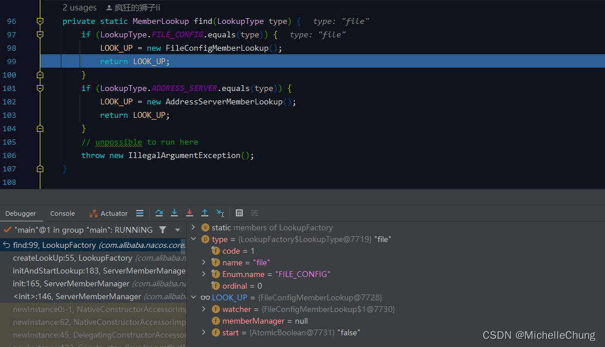

# Nacos（二）寻址机制之文件寻址分析

## 前言
承接上一篇博客，讨论完单机寻址模式后这篇来讨论一下文件寻址模式。

同样地，本文还是在[《Nacos架构&原理》]((https://developer.aliyun.com/ebook/36?spm=a2c6h.20345107.ebook-index.18.152c2984fsi5ST))章节 `Nacos 寻址机制` 的基础上对源码进行分析和学习。

## 参考文档
- [框架 wiki](https://gitee.com/dromara/RuoYi-Cloud-Plus/wikis/%E9%A1%B9%E7%9B%AE%E7%AE%80%E4%BB%8B)
- [Nacos 官方文档](https://nacos.io/zh-cn/docs/what-is-nacos.html)
- [Nacos架构&原理](https://developer.aliyun.com/ebook/36?spm=a2c6h.20345107.ebook-index.18.152c2984fsi5ST)

## 关于文件寻址

> 
> 

第一段话其实就已经涵盖了最重要的内容：

1. 集群模式下的默认寻址模式
2. 需要维护一个 cluster.conf 文件

## 框架集成
本文使用的【RuoYi-Cloud-Plus】框架版本是 `V1.3.0`。<br>
<br>

Nacos采用的是源码集成方式，版本为 `V2.1.1`。<br>


## 集群启动演示
关于集群启动的测试，很多教程是复制三份源码进行操作，本文稍微偷懒一下，在 idea（版本 2022.1）里面启动三次服务来模拟集群，具体步骤请看下文。

### 步骤一：创建 conf 文件
上文有说到，文件寻址模式需要每个节点都维护一份 conf 文件，因此三个节点需要三份 `cluster.conf`。

在本地创建三个节点（地址自定义）：<br>

`F:/study/Nacos/test`<br>
<br>

在每个节点下都需要创建 `conf` 文件夹，然后在此文件夹下创建 `cluster.conf` 文件：<br>
<br>

注：路径 `/conf/cluster.conf` 是默认路径：<br>
<br>

变量值：<br>


编辑 `cluster.conf` 文件，配置节点 `IP:PORT` 信息：<br>

```conf
192.168.10.1:8848
192.168.10.1:8858
192.168.10.1:8868
```

### 步骤二：修改 Nacos 启动类
修改 Nacos 启动类，将单机模式修改为 `false`：<br>

### 步骤三：设置 IDEA 启动项


设置允许多个服务启动：<br>


设置完成会出现：<br>


复制三份配置，分别设置启动项参数：<br>


```bash
# Nacos-8848
-Dserver.port=8848 -Dnacos.home=F:/study/Nacos/test/nacos1

# Nacos-8858
-Dserver.port=8858 -Dnacos.home=F:/study/Nacos/test/nacos2

# Nacos-8868
-Dserver.port=8868 -Dnacos.home=F:/study/Nacos/test/nacos3
```

### 步骤四：启动服务


## 源码分析
### 寻址模式初始化流程图（重要）

对于寻址模式初始化流程做了简单的流程图，下面的分析基于此图。

### 1、`ServerMemberManager` 节点管理器初始化
`ServerMemberManager#init`<br>



### 2、初始化寻址模式  `ServerMemberManager#initAndStartLookup`


该方法主要有两个步骤：

1. 创建 `MemberLookup` 寻址对象
2. 开始寻址

### 2.1、创建寻址对象实例 `LookupFactory#createLookUp`


此处先进行判断，如果是单机模式，则直接创建对象。而非单机模式，会进入 if 方法体：

1. 从配置环境获取寻址模式类型
2. 根据类型选择寻址模式枚举 `LookupFactory#chooseLookup`
3. 根据枚举获取寻址模式对象 `LookupFactory#find`

此处没有设置 `LOOKUP_MODE_TYPE`。<br>


根据 `lookupType` 获取枚举信息：<br>

`LookupFactory#chooseLookup`<br>


根据返回的枚举信息获取寻址对象：<br>

`LookupFactory#find`<br>


注入 `ServerMemberManager` 属性，返回寻址对象到上一层。


### 2.2、开始寻址 `AbstractMemberLookup#start`
`ServerMemberManager#initAndStartLookup`<br>


`AbstractMemberLookup#start`<br>


### 3、文件寻址模式 `FileConfigMemberLookup#doStart`

### 3.1、从磁盘读取集群配置 `FileConfigMemberLookup#readClusterConfFromDisk`


同上篇单机模式，`AbstractMemberLookup#afterLookup` 通知服务变更信息。

### 3.2、注册文件监控中心 `WatchFileCenter#registerWatcher`


至此，文件寻址初始化完成。