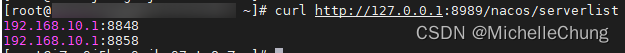
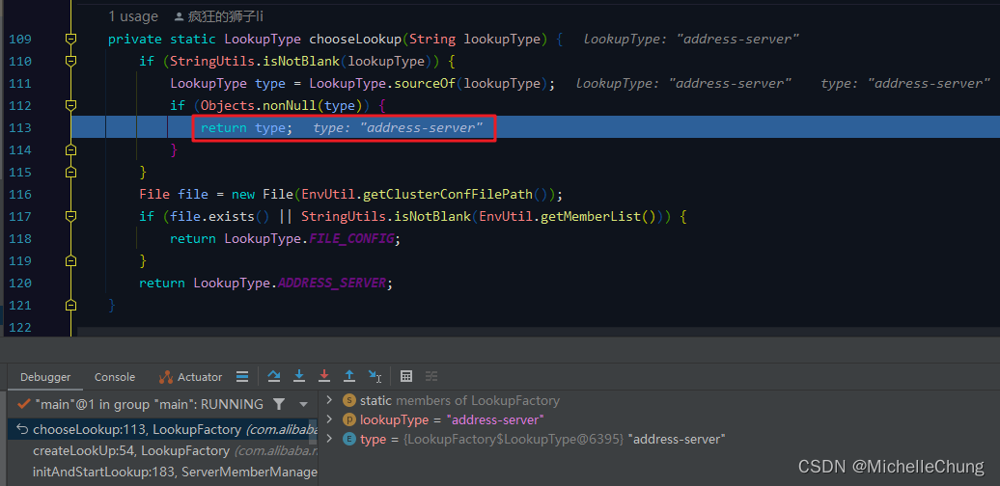

# Nacos（三）使用 Nginx 实现地址服务器寻址及其原理分析

## 前言
Nacos 的寻址机制一共有三种，前两篇分别介绍了 [单机寻址](/ruoyi-cloud-plus/nacos/01_StandaloneMemberLookup.md) 和 [文件寻址](/ruoyi-cloud-plus/nacos/02_FileConfigMemberLookup.md)，本篇来介绍最后一种地址服务器寻址。

## 参考文档
- [框架 wiki](https://gitee.com/dromara/RuoYi-Cloud-Plus/wikis/%E9%A1%B9%E7%9B%AE%E7%AE%80%E4%BB%8B)
- [Nacos 官方文档](https://nacos.io/zh-cn/docs/what-is-nacos.html)
- [Nacos架构&原理](https://developer.aliyun.com/ebook/36?spm=a2c6h.20345107.ebook-index.18.152c2984fsi5ST)

## 关于地址服务器寻址
在上一篇文件寻址操作中，如果遇到需要扩缩容的情况，就需要去修改每一个节点的配置文件 `cluster.conf`，并且还可能存在修改失败导致的节点数据不一致的问题。

> <br>
> <br>
> <br>

为了解决上述问题，因而有了更为方便的地址服务器寻址方式。

> <br>
> <br>

## 框架集成
本文使用的【RuoYi-Cloud-Plus】框架版本是 `V1.3.0`。<br>
<br>

Nacos采用的是源码集成方式，版本为 `V2.1.1`。<br>

## 集群启动演示
关于集群启动的部分，和上一篇一样采用的是 IDEA 启动多个服务的方式，不再需要单独创建 `cluster.conf` 配置文件。
### 步骤一：使用 Nginx 作为地址服务器
首先需要说明的是，地址服务器形式多样，并不一定是 Nginx，也可以是 Web 服务器等。

修改 Nginx 配置文件：

```bash
server {
	listen 8989;
	server_name nacoslist;
	
	location /nacos/serverlist {
	    add_header Content_type text/plain;
	    return 200 '192.168.10.1:8848\r\n192.168.10.1:8858\r\n192.168.10.1:8868\r\n';
	}
}
```

监听的端口号是 `8989`，一共三个节点。Nacos 底层解析节点时是按行解析，因此需要用 `\r\n`。

修改后查看返回结果是否正确：<br>
<br>

**注：此处使用的 Nginx 是 Linux 云服务器上的。一开始在 Win10 环境下使用会出现节点同步异常的问题，改用了 Linux 虚拟机，也出现了节点同步异常的情况，因此最后采用的是 Linux 云服务器。**

如果没有云服务器的情况下，可以使用接口进行模拟。

```java
@GetMapping("/nacos/serverlist")
public String serverlist() {
    return "192.168.10.1:8848\r\n192.168.10.1:8858\r\n192.168.10.1:8868\n";
}
```

### 步骤二：修改 Nacos 配置文件
`ruoyi-visual/ruoyi-nacos/src/main/resources/application.properties`<br>
<br>

请需要注意寻址类型的写法！<br>

路径前缀直接使用 IP 访问，如果有域名也可以设置域名。<br>

### 步骤三：修改 Nacos 启动类（同上篇）
修改 Nacos 启动类，将单机模式修改为 `false`：<br>

### 步骤四：设置 IDEA 启动项（同上篇）
<br>

设置允许多个服务启动：<br>
<br>

<br>

设置完成会出现：<br>


为了和文件寻址配置地址区分开，这里设置的home地址分别是 nacos4、nacos5、nacos6：
```bash
# Nacos-8848
-Dserver.port=8848 -Dnacos.home=F:/study/Nacos/test/nacos4

# Nacos-8858
-Dserver.port=8858 -Dnacos.home=F:/study/Nacos/test/nacos5

# Nacos-8868
-Dserver.port=8868 -Dnacos.home=F:/study/Nacos/test/nacos6
```
这里的 home 文件夹会在 Nacos 启动时自动创建。

### 步骤五：启动服务


新生成的文件：<br>
<br>

生成的配置文件内容：<br>
<br>

Nacos 控制台：<br>
<br>
### 拓展步骤：缩容
去掉 `8868` 节点。

修改地址服务器配置（即修改 Nginx 配置文件）<br>
<br>

查看Nacos控制台：<br>
<br>

操作成功。

### 拓展步骤：扩容
在上一步缩容的基础上增加 `8878` 节点。

修改地址服务器配置（即修改 Nginx 配置文件）<br>
<br>

启动节点并查看 Nacos 控制台：<br>
<br>

操作成功。

## 源码分析
### 寻址模式初始化流程图（重要）
在上一篇流程图的基础上进行了细化和整理，重新画了一张流程图，可以根据流程图进行分析。


### 1、`ServerMemberManager` 节点管理器初始化
`ServerMemberManager#init`<br>


### 2、初始化寻址模式  `ServerMemberManager#initAndStartLookup`


该方法主要有两个步骤：

1. 创建 `MemberLookup` 寻址对象
2. 开始寻址

### 2.1、创建寻址对象实例 `LookupFactory#createLookUp`


此处先进行判断，如果是单机模式，则直接创建对象。而非单机模式，会进入 if 方法体：

1. 从配置环境获取寻址模式类型
2. 根据类型选择寻址模式枚举 `LookupFactory#chooseLookup`
3. 根据枚举获取寻址模式对象 `LookupFactory#find`

此处在配置文件中设置了 `LOOKUP_MODE_TYPE` 为 `address-server`。<br>
<br>

根据 `lookupType` 获取枚举信息：<br>

<br>

`LookupType#sourceOf`<br>
<br>

`LookupFactory#chooseLookup`<br>
<br>

根据返回的枚举信息获取寻址对象：<br>
<br>

`LookupFactory#find`<br>
<br>

注入 `ServerMemberManager` 属性，返回寻址对象到上一层。<br>

<br>
### 2.2、开始寻址 `AbstractMemberLookup#start`
`ServerMemberManager#initAndStartLookup`<br>


`AbstractMemberLookup#start`<br>

### 3、地址服务器寻址 `AddressServerMemberLookup#doStart`

### 3.1、初始化地址服务 `AddressServerMemberLookup#initAddressSys`

### 3.2、运行 `AddressServerMemberLookup#run`


同步节点 url：（定时任务也是调用此方法）<br>
`AddressServerMemberLookup#syncFromAddressUrl`<br>


至此，地址服务器寻址初始化完成。