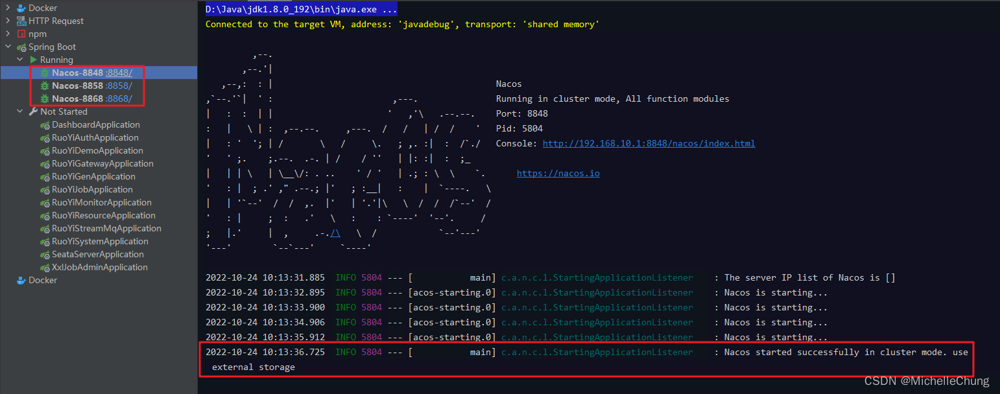
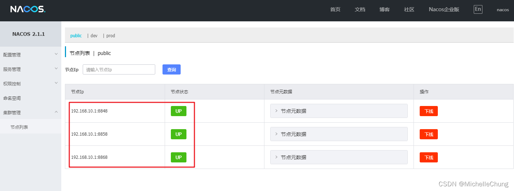
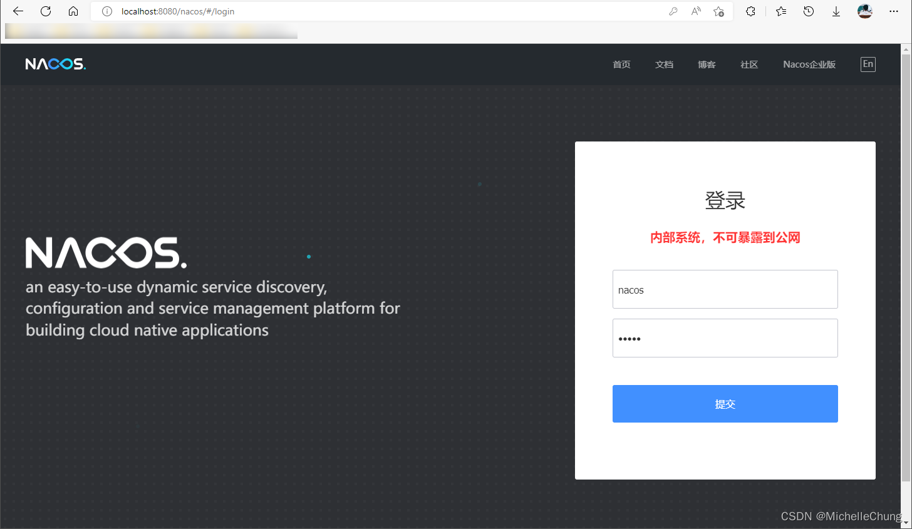
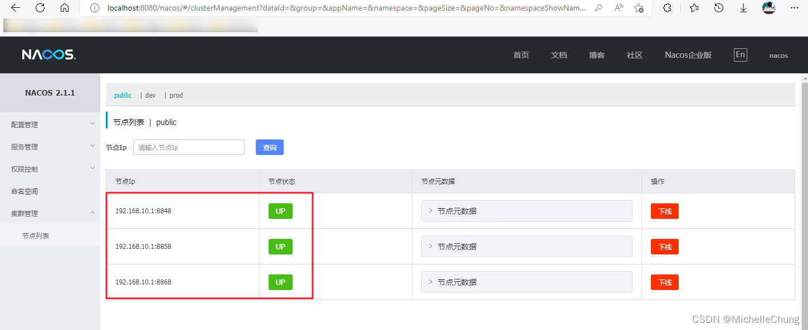
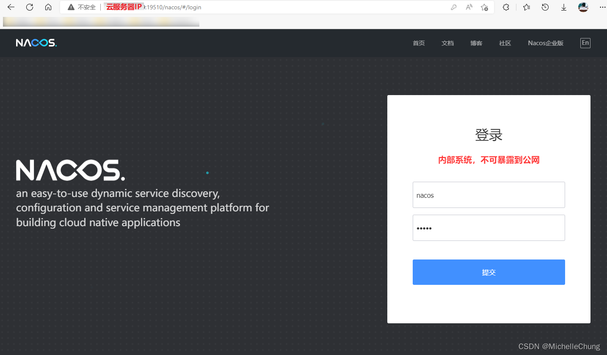
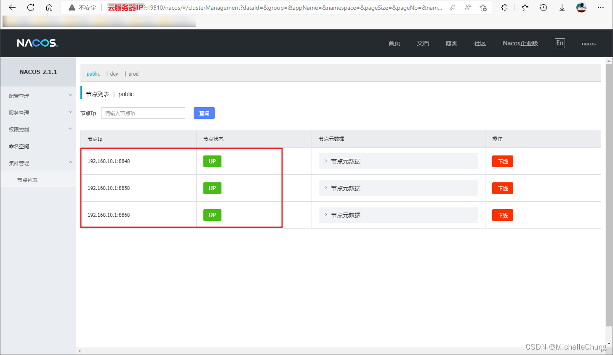

# Nacos（四）使用 Nginx 简单实现 Nacos 集群负载均衡

## 前言
上篇使用地址服务器寻址方式搭建完成 Nacos 集群后，本篇将使用 Nginx 实现简单的集群负载均衡（理论较少，属于应用篇）。

## 参考文档
- [框架 wiki](https://gitee.com/dromara/RuoYi-Cloud-Plus/wikis/%E9%A1%B9%E7%9B%AE%E7%AE%80%E4%BB%8B)
- [Nacos 官方文档](https://nacos.io/zh-cn/docs/what-is-nacos.html)
- [Nacos架构&原理](https://developer.aliyun.com/ebook/36?spm=a2c6h.20345107.ebook-index.18.152c2984fsi5ST)
- [Nginx - ngx_http_upstream_module](http://nginx.org/en/docs/http/ngx_http_upstream_module.html#upstream)

## 前置条件

1. 完成 Nacos 集群搭建（[传送门](/ruoyi-cloud-plus/nacos/03_AddressServerMemberLookup.md)）
2. 本地 Nginx （版本 `V1.17.3`）
3. 基于云服务器实现的 frp 内网穿透（可选项，[传送门](https://blog.csdn.net/Michelle_Zhong/article/details/124530795)）

首先说明一下，第一点搭建使用的地址服务器（即云服务器 Nginx ）与第二点无关，第二点 Nginx 是作为负载均衡的实现。

因为之前搭建的集群是在 win10 本机上搭建的，所以第二点选用了本地 Nginx。

第三点 frp 是可以通过外网访问到本地的 Nacos 集群，如果有条件的情况下可以进行尝试。

## 实现步骤
### 前置步骤
本地集群启动成功：<br>


查看 Nacos 控制台（任一节点 8848 / 8858 / 8868）：<br>

### 步骤一：修改本地 Nginx
修改 `nginx.conf` 文件，增加以下配置：

```bash
	upstream nacos_cluster {
        server 192.168.10.1:8848;
        server 192.168.10.1:8858;
        server 192.168.10.1:8868;
    }

    server {
        listen 8080;
        server_name nacos_cluster;

        location / {
            proxy_pass http://nacos_cluster;
        }
    }
```

需要注意以下几点：

1. `upstream` 默认采用轮询机制，也可以配置权重等，具体请参考官方文档进行配置。
2. `upstream` 后面的命名自定义，但需要和 `server` 转发地址 `proxy_pass` 后面的名称一致。
3. 命名不要使用中划线 `-`，会出现 `400` 异常，如果使用下划线也异常，则 **直接使用字母命名**。

### 步骤二：启动 Nginx，本地访问测试
启动 Nginx，访问 `http://localhost:8080/nacos/` 。 <br>


搭建成功：<br>

### 步骤三（可选）：基于 frp 实现内网穿透
再次强调，**本步骤需要云服务器**，再放一次搭建步骤： [传送门](https://blog.csdn.net/Michelle_Zhong/article/details/124530795)

搭建完成后，本地以及服务器分别启动 frp，本地服务端口为 `8080`，远程访问端口为 `19510`，访问 `http://云服务器 IP:19510/nacos/`。<br>


搭建成功：<br>

