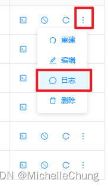

# Seata Server 部署（Windows、Docker 基于 Jpom）

---


## 前言
上篇文章上来就是先从事务模式入手，使用 seata-server 也是直接用 GitHub 上下载的 zip 解压后的脚本运行的，结果也没有好好地说明一下关于 seata-server 的部署，因此这篇文章先来补充一下部署的两种方式。

## 参考目录
- [Seata 部署指南](https://seata.io/zh-cn/docs/ops/deploy-guide-beginner.html)
- [Jpom - 离线安装实践](https://jpom.top/pages/af288b/)

## 版本说明
- `Seata`：`V1.7.0`
- `Jpom`：`V2.10.43`

## Windows 部署 seata-server
这种方式比较简单直接，上一篇文章就是用的这种方式。

### 1：下载压缩包
在 [GitHub](https://github.com/seata/seata/releases) 选择下载需要的版本：


### 2：文件存储模式

> Server端存储模式（store.mode）现有file、db、redis三种（后续将引入raft,mongodb），file模式无需改动，直接启动即可。

直接运行脚本，sessionStore 是运行后生成的本地存储文件。


但是文件存储的方式一般很少用，本文使用的是 db 存储模式。

### 3：db 存储模式
### 3.1：建表
> 全局事务-->分支事务-->全局锁，对应表global_table、branch_table、lock_table

在 GitHub 上有 [sql 脚本](https://github.com/seata/seata/blob/master/script/server/db/mysql.sql)：


这里贴一下 mysql.sql 脚本内容：

```sql
-- -------------------------------- The script used when storeMode is 'db' --------------------------------
-- the table to store GlobalSession data
CREATE TABLE IF NOT EXISTS `global_table`
(
    `xid`                       VARCHAR(128) NOT NULL,
    `transaction_id`            BIGINT,
    `status`                    TINYINT      NOT NULL,
    `application_id`            VARCHAR(32),
    `transaction_service_group` VARCHAR(32),
    `transaction_name`          VARCHAR(128),
    `timeout`                   INT,
    `begin_time`                BIGINT,
    `application_data`          VARCHAR(2000),
    `gmt_create`                DATETIME,
    `gmt_modified`              DATETIME,
    PRIMARY KEY (`xid`),
    KEY `idx_status_gmt_modified` (`status` , `gmt_modified`),
    KEY `idx_transaction_id` (`transaction_id`)
) ENGINE = InnoDB
  DEFAULT CHARSET = utf8mb4;

-- the table to store BranchSession data
CREATE TABLE IF NOT EXISTS `branch_table`
(
    `branch_id`         BIGINT       NOT NULL,
    `xid`               VARCHAR(128) NOT NULL,
    `transaction_id`    BIGINT,
    `resource_group_id` VARCHAR(32),
    `resource_id`       VARCHAR(256),
    `branch_type`       VARCHAR(8),
    `status`            TINYINT,
    `client_id`         VARCHAR(64),
    `application_data`  VARCHAR(2000),
    `gmt_create`        DATETIME(6),
    `gmt_modified`      DATETIME(6),
    PRIMARY KEY (`branch_id`),
    KEY `idx_xid` (`xid`)
) ENGINE = InnoDB
  DEFAULT CHARSET = utf8mb4;

-- the table to store lock data
CREATE TABLE IF NOT EXISTS `lock_table`
(
    `row_key`        VARCHAR(128) NOT NULL,
    `xid`            VARCHAR(128),
    `transaction_id` BIGINT,
    `branch_id`      BIGINT       NOT NULL,
    `resource_id`    VARCHAR(256),
    `table_name`     VARCHAR(32),
    `pk`             VARCHAR(36),
    `status`         TINYINT      NOT NULL DEFAULT '0' COMMENT '0:locked ,1:rollbacking',
    `gmt_create`     DATETIME,
    `gmt_modified`   DATETIME,
    PRIMARY KEY (`row_key`),
    KEY `idx_status` (`status`),
    KEY `idx_branch_id` (`branch_id`),
    KEY `idx_xid` (`xid`)
) ENGINE = InnoDB
  DEFAULT CHARSET = utf8mb4;

CREATE TABLE IF NOT EXISTS `distributed_lock`
(
    `lock_key`       CHAR(20) NOT NULL,
    `lock_value`     VARCHAR(20) NOT NULL,
    `expire`         BIGINT,
    primary key (`lock_key`)
) ENGINE = InnoDB
  DEFAULT CHARSET = utf8mb4;

INSERT INTO `distributed_lock` (lock_key, lock_value, expire) VALUES ('AsyncCommitting', ' ', 0);
INSERT INTO `distributed_lock` (lock_key, lock_value, expire) VALUES ('RetryCommitting', ' ', 0);
INSERT INTO `distributed_lock` (lock_key, lock_value, expire) VALUES ('RetryRollbacking', ' ', 0);
INSERT INTO `distributed_lock` (lock_key, lock_value, expire) VALUES ('TxTimeoutCheck', ' ', 0);
```

### 3.2：修改配置文件
路径：
```shell
seata/conf/application.yml
```

可以从 `application.example.yml` 文件中复制，但需要注意的是不同的 MySQL 版本需要修改驱动类名称（默认的配置不支持 MySQL 8）。

- MySQL 5.7（默认）：`com.mysql.jdbc.Driver`
- MySQL 8：`com.mysql.cj.jdbc.Driver`


```yml
seata:
  store:
    # support: file 、 db 、 redis
    mode: db
    session:
      mode: db
    lock:
      mode: db
    db:
      datasource: druid
      db-type: mysql
      driver-class-name: com.mysql.cj.jdbc.Driver
      url: jdbc:mysql://127.0.0.1:3306/seata_test1?rewriteBatchedStatements=true
      user: root
      password: root
      min-conn: 10
      max-conn: 100
      global-table: global_table
      branch-table: branch_table
      lock-table: lock_table
      distributed-lock-table: distributed_lock
      query-limit: 1000
      max-wait: 5000
```

### 3.3：启动脚本

同文件模式一样，直接双击启动即可。


### 4：源码部署
源码部署也比较简单，拉取代码到本地之后，修改配置，启动 main 方法即可，这里不再展开说明。


## Docker 部署 seata-server （基于 Jpom）
Docker 部署也很简单，按照官方文档的部署步骤一步步操作下来即可。

既然要写的话就写点不一样的，之前有写过关于 Jpom 部署 RabbitMQ 的文章，本文同样以 Jpom 操作来说明如何部署 seata-server。

### 1：安装 Jpom（安装包方式）
之前文章里面用的是 Docker 一键安装，这里说明一下安装包的方式。

之所以用安装包安装，是因为在 Jpom 构建项目的时候，如果使用 Docker 安装，只支持容器构建，不支持本地构建。容器构建需要写 DSL 构建文档，本地构建则可以写构建命令（比较像 Jenkins 编写部署脚本，容易入手）。

文章开篇的参考目录里面就已经贴出了 Jpom 安装的官方文档，跟着文档操作即可，下面简单列举一下操作命令。

### 1.1：jpom-agent 安装
创建文件夹：
```shell
cd /usr/local/jpom/
mkdir jpom-agent
```
将安装包传到新建的文件夹中。

解压：
```shell
tar -zxf agent-2.10.43-release.tar.gz -C ./jpom-agent
```

运行：

```shell
cd /usr/local/jpom/jpom-agent/bin/
bash ./Agent.sh start
```


### 1.2：jpom-server 安装
创建文件夹：
```shell
cd /usr/local/jpom/
mkdir jpom-server
```
将安装包传到新建的文件夹中。

解压：
```shell
tar -zxf server-2.10.43-release.tar.gz -C ./jpom-server
```

运行：

```shell
cd /usr/local/jpom/jpom-server/bin/
bash ./Server.sh start
```


### 1.3：访问测试

访问路径：
```url
http://192.168.2.158:2122/
```

初始化的一些操作这里就不再进行说明了，可以参考官方文档进行设置。
### 2：Jpom Docker部署 seata-server

首先在系统管理里面对相关的设备信息进行设置。


### 2.1：拉取镜像

菜单：功能管理 —— Docker 管理 —— Docker 列表 —— 控制台


进入镜像列表拉取镜像：


填写镜像名称 `seataio/seata-server:1.7.0`，点击拉取。

如果不知道镜像名称，可以去 dockerhub 上复制一下。


如果是使用服务器终端进行拉取，可以直接复制拉取命令：
```shell
docker pull seataio/seata-server:1.7.0
```

点击拉取之后会出现拉取日志：


等待拉取完成即可：


如果是使用终端命令拉取：


### 2.2：创建容器
拉取完成后刷新镜像列表，可以看到 seata-server 镜像。


点击创建容器：


修改容器信息：


容器创建完成：


如果是使用命令创建：
```bash
 docker run --name seata-server -p 8091:8091 -p 7091:7091 seataio/seata-server:1.7.0
```

### 2.3：查看容器日志

右侧按钮展开查看日志：




### 2.4：访问测试
访问路径：
```url
http://192.168.2.158:7091/
```


### 2.5：启动 Demo
首先修改 demo 配置的 ip 地址：


启动所有模块，查看容器日志：


（完）