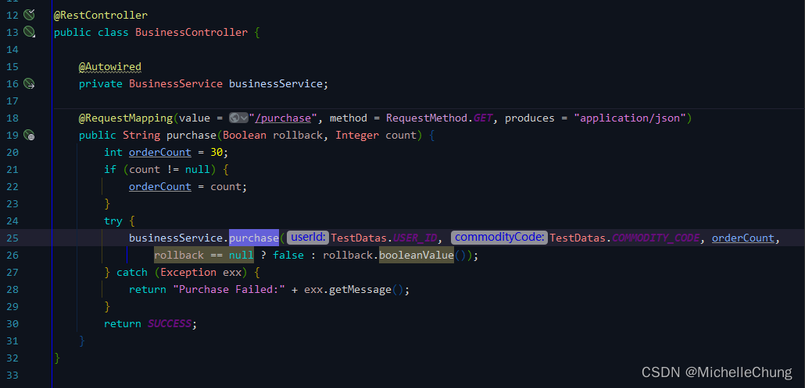
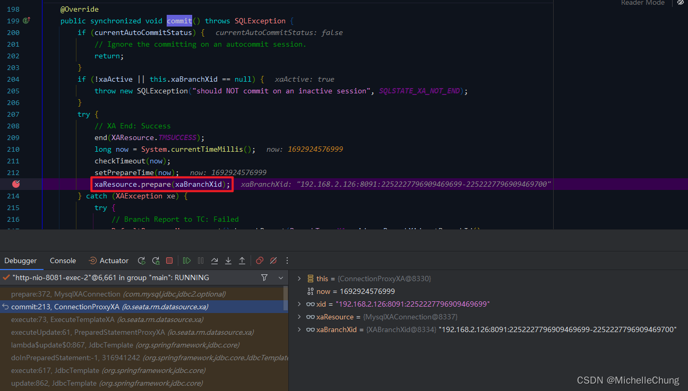

# （一）Seata XA 模式 Demo 调用流程分析

---


## 前言
事务一直以来都是系统中基础而又重要的组成部分。事务的定义：
> 数据库事务（简称：事务）是数据库管理系统执行过程中的一个逻辑单位，由一个有限的数据库操作序列构成。（From：维基百科）

对于分布式系统而言，事务的控制变得更为重要，所以来学习一下分布式事务框架 Seata。

## 参考目录
- [Seata 官方文档](https://seata.io/zh-cn/docs/overview/what-is-seata.html)
- [Seata 官方 Demo ：seata-xa](https://github.com/seata/seata-samples/tree/master/seata-xa)
- [Seata XA 模式](https://seata.io/zh-cn/docs/dev/mode/xa-mode.html)
- [《阿里云云原生架构实践》](https://weread.qq.com/web/bookDetail/731327d07248f2dd7319578)<br>
书本章节 3.5 介绍了分布式事务模式的相关内容。

## 版本说明
由于官方 Demo 版本较低，本文使用的版本如下：
- `Seata`：`V1.7.0`
- `druid-spring-boot-starter`：`V1.2.16`

## 前置知识
### 1、关于事务的理论知识
这一部分不详细展开，简单带过一下。

事务（Transaction）四大特性：ACID。
- 原子性（Atomic） 
- 一致性（Consistency）
- 隔离性（Isolation）
- 持久性（Durability）

CAP 理论（布鲁尔定理）：
> 对于一个分布式计算系统来说，不可能同时满足以下三点：
> - 一致性（Consistency） （等同于所有节点访问同一份最新的数据副本）
> - 可用性（Availability）（每次请求都能获取到非错的响应——但是不保证获取的数据为最新数据）
> - 分区容错性（Partition tolerance）（以实际效果而言，分区相当于对通信的时限要求。系统如果不能在时限内达成数据一致性，就意味着发生了分区的情况，必须就当前操作在C和A之间做出选择。）
>
> 根据定理，分布式系统只能满足三项中的两项而不可能满足全部三项。理解CAP理论的最简单方式是想象两个节点分处分区两侧。允许至少一个节点更新状态会导致数据不一致，即丧失了C性质。如果为了保证数据一致性，将分区一侧的节点设置为不可用，那么又丧失了A性质。除非两个节点可以互相通信，才能既保证C又保证A，这又会导致丧失P性质。

对于分布式系统来说，某种条件下 C 和 A 是相互矛盾的，因此只能保证 CP （强一致性）或 AP（最终一致性）。

### 2、关于 Seata
Seata（Simpe Extensible Autonomous Transcaction Architecture），简单可扩展自主事务架构。首先引用一下官方文档的说明：

> Seata 是一款开源的分布式事务解决方案，致力于提供高性能和简单易用的分布式事务服务。Seata 将为用户提供了 AT、TCC、SAGA 和 XA 事务模式，为用户打造一站式的分布式解决方案。

关于各个模式后面的文章会一一展开介绍，本文主要介绍的是 XA 模式。

顺便一提，XA 模式实际上是一种协议，使用的模式是二阶段提交（2PC），遵循的是 CP 强一致性。

> （截图自《阿里云云原生架构实践》）<br>
> 

### 3、Seata 领域模型
关于领域模型，可以查看 [官方文档](https://seata.io/zh-cn/docs/dev/domain/overviewDomainModel.html) 。

按照官方文档的图，我重新绘制了一张：


在 Seata 中，事务管理者 TM、资源管理者 RM、事务协调者 TC是三个重要概念，所有操作都围绕着这三者进行展开。

在代码调试之前，根据模型大致列举了一下关于这三者之间的关系：


这些接口包含了主要的操作方法，根据不同的事务模式有不同的实现类。
## 测试 Demo
### 1、模块说明


Demo 一共四个模块，是经典的下单流程。**按照如下顺序启动**：
- 账户模块（Port：8083） 
- 订单模块（Port：8082） 
- 库存模块（Port：8081） 
- 业务模块（Port：8084） 

模块间使用 openfeign 进行调用。
### 2、调用逻辑说明
入口：业务模块
```url
http://127.0.0.1:8084/purchase
```
业务逻辑：
1. 调用业务模块接口（business-xa）
2. 扣减商品库存（stock-xa）
3. 新增账户订单（order-xa）
4. 账户余额扣减（account-xa）


> （截图自 GitHub README.md）<br>
> 
### 3、分析流程说明
从领域模型可以知道，整个下单操作是一个全局事务，各个模块分属于各个分支事务。下面对源码进行分析时只对其中一个分支操作进行说明，其余分支操作都是相同的，就不再展开说明。

分析分为 Commit 和 Rollback 两种流程。

[官方文档](https://seata.io/zh-cn/docs/dev/mode/xa-mode.html) 对于 XA 模式有详细的说明，本文在此基础上进行展开。

### 4、注意事项
由于文章整理准备的时间比较长，调试的流程是反复进行的，因此在调试过程中也常常出现超时异常回滚，下面的流程分析当中，全局事务id（xid）等一些参数也许是不同的，所以特此提出以免出现误解。

为了完整体现整个全局事务流程，也在不断点的情况下对流程进行了截取分析并制作了流程图，详细的见下文。
## Seata XA 模式 Commit 调用流程分析
### 1、调用流程图


步骤前面由数字标识，根据各模块控制台输出整理，详细见附录。

### 2、XA 模式流程以及操作命令
因为本文主要是 Seata XA 模式的说明，因此了解 XA 操作指令对于后文的调用流程也有帮助。以 Demo 中的业务流程为例进行说明：

```sql
-- 开启 XA 事务
xa start '192.168.2.126:8091:2252227458314035239';

-- SQL 执行 --
-- 库存扣减
update stock_tbl set count = count - 30 where commodity_code = 'C100000';
-- 订单新增
insert order_tbl(user_id,commodity_code,count,money) values('U100000','C100000',30,3000)
-- 余额扣减
update account_tbl set money = money - 3000 where user_id = 'U100000'
-- SQL 执行结束 --

-- XA 事务第一阶段: Prepare
xa prepare '192.168.2.126:8091:2252227458314035239';

-- XA 事务第二阶段: Commit
xa commit '192.168.2.126:8091:2252227458314035239';
```
### 3、业务模块：流程入口
`io.seata.sample.controller.BusinessController`



`io.seata.sample.service.BusinessService#purchase`


接口参数：


### 3.1、全局事务注解 `@GlobalTransactional`
`io.seata.spring.annotation.GlobalTransactionalInterceptor#invoke`


### 3.2、开启全局事务
`io.seata.tm.api.TransactionalTemplate#execute`


`io.seata.tm.api.TransactionalTemplate#beginTransaction`


`io.seata.tm.api.DefaultGlobalTransaction#begin`


`io.seata.tm.DefaultTransactionManager#begin`


使用 Netty 同步发送全局事务开启请求。

`io.seata.tm.DefaultTransactionManager#syncCall`


请求成功，返回全局事务id（xid）。


返回 `io.seata.tm.api.DefaultGlobalTransaction#begin`，绑定 xid。
```java
RootContext.bind(xid);
```
`io.seata.core.context.RootContext#bind`


至此，全局事务开启完成。进入分支事务流程。

### 4、分支事务
以库存模块为例，分析库存扣减事务分支流程。

`io.seata.sample.service.StockService#deduct`


`io.seata.rm.datasource.xa.PreparedStatementProxyXA#executeUpdate`


`io.seata.rm.datasource.xa.ExecuteTemplateXA#execute`


这个方法包含了 XA 模式第一阶段的所有步骤（如下图）：


下面分步骤进行说明。

### 4.1、XA Start


`io.seata.rm.datasource.xa.ConnectionProxyXA#setAutoCommit`


### 4.1.1、分支事务注册
`io.seata.rm.DefaultResourceManager#branchRegister`


`io.seata.rm.AbstractResourceManager#branchRegister`


控制台输出：


### 4.1.2、XA start


`io.seata.rm.datasource.xa.ConnectionProxyXA#start`


`com.mysql.jdbc.jdbc2.optional.MysqlXAConnection#start`


执行完毕，返回上级。

`io.seata.rm.datasource.xa.ConnectionProxyXA#setAutoCommit`


### 4.2、XA End & Prepare
在 XA start 逻辑执行完成之后，会执行 SQL 语句（略），然后到这一步骤。

`io.seata.rm.datasource.xa.ExecuteTemplateXA#execute`


`io.seata.rm.datasource.xa.ConnectionProxyXA#commit`


`io.seata.rm.datasource.xa.ConnectionProxyXA#end`


`com.mysql.jdbc.jdbc2.optional.MysqlXAConnection#end`


`io.seata.rm.datasource.xa.ExecuteTemplateXA#execute`



`com.mysql.jdbc.jdbc2.optional.MysqlXAConnection#prepare`


### 4.3、分支事务提交
`io.seata.core.rpc.processor.client.RmBranchCommitProcessor#process`


`io.seata.rm.AbstractRMHandler#onRequest`


`io.seata.rm.AbstractRMHandler#handle`


`io.seata.core.exception.AbstractExceptionHandler#exceptionHandleTemplate`


`io.seata.rm.AbstractRMHandler#handle`


`io.seata.rm.AbstractRMHandler#doBranchCommit`


`io.seata.rm.datasource.xa.ResourceManagerXA#branchCommit`


`io.seata.rm.datasource.xa.ResourceManagerXA#finishBranch`


`io.seata.rm.datasource.xa.ConnectionProxyXA#xaCommit`


`com.mysql.jdbc.jdbc2.optional.MysqlXAConnection#commit`


### 5、全局事务提交
`io.seata.tm.api.TransactionalTemplate#execute`


`io.seata.tm.api.TransactionalTemplate#commitTransaction`


`io.seata.tm.api.DefaultGlobalTransaction#commit`


`io.seata.tm.DefaultTransactionManager#commit`


`io.seata.tm.api.DefaultGlobalTransaction#commit`


`io.seata.tm.api.DefaultGlobalTransaction#suspend`


`io.seata.tm.api.TransactionalTemplate#commitTransaction`


事务提交完成。控制台打印如下：


## Seata XA 模式 Rollback 调用流程分析
### 1、调用流程图


步骤前面由数字标识，根据各模块控制台输出整理，详细见附录。

### 2、XA 模式流程以及操作命令

```sql
-- 开启 XA 事务
xa start '192.168.2.126:8091:2252227796909469729';

-- SQL 执行 --
-- 库存扣减
update stock_tbl set count = count - 30 where commodity_code = 'C100000';
-- 订单新增
insert order_tbl(user_id,commodity_code,count,money) values('U100000','C100000',30,3000)
-- 余额扣减 出现异常
update account_tbl set money = money - 3000 where user_id = 'U100000'
-- SQL 执行结束 --

-- XA 事务第一阶段: Prepare
xa prepare '192.168.2.126:8091:2252227796909469729';

-- XA 事务第二阶段: Rollback
xa rollback '192.168.2.126:8091:2252227796909469729';
```

由于全局事务开启步骤以及分支注册步骤相同，在此不再赘述。
### 3、事务回滚
**注：在进行回滚操作断点调试时，很容易由于超时出现异常，并且会一直处于回滚重试状态（直到重试超时才会解除），该状态下 MySQL 表数据无法修改，也可能导致各模块无法正常启动运行。因此下面列举的回滚相关方法可能并没有断点操作。**

当没有足够的余额时，抛出异常。

`io.seata.sample.service.AccountService#reduce`


`io.seata.tm.api.TransactionalTemplate#execute`


`io.seata.tm.api.TransactionalTemplate#completeTransactionAfterThrowing`


`io.seata.rm.datasource.xa.ConnectionProxyXA#rollback`


`io.seata.rm.datasource.xa.ConnectionProxyXA#xaRollback`


`com.mysql.jdbc.jdbc2.optional.MysqlXAConnection#rollback`


### 3.1、分支事务回滚
`io.seata.core.rpc.processor.client.RmBranchRollbackProcessor#process`


`io.seata.rm.AbstractRMHandler#handle`


`io.seata.rm.AbstractRMHandler#doBranchRollback`


`io.seata.rm.DefaultResourceManager#branchRollback`


`io.seata.rm.datasource.xa.ResourceManagerXA#branchRollback`


`io.seata.rm.datasource.xa.ConnectionProxyXA#xaRollback`


`com.mysql.jdbc.jdbc2.optional.MysqlXAConnection#rollback`


### 3.2、 全局事务回滚
`io.seata.tm.api.DefaultGlobalTransaction#rollback`


`io.seata.tm.DefaultTransactionManager#rollback`


## 附录
### Commit 调用流程控制台输出
#### 业务模块（business-xa）
```bash
2023-08-24 11:30:27.497  INFO 13604 --- [nio-8084-exec-6] i.seata.tm.api.DefaultGlobalTransaction  : Begin new global transaction [192.168.2.126:8091:2252227458314035239]
2023-08-24 11:30:27.498  INFO 13604 --- [nio-8084-exec-6] io.seata.sample.service.BusinessService  : New Transaction Begins: 192.168.2.126:8091:2252227458314035239
2023-08-24 11:30:33.591  INFO 13604 --- [nio-8084-exec-6] i.seata.tm.api.DefaultGlobalTransaction  : transaction 192.168.2.126:8091:2252227458314035239 will be commit
2023-08-24 11:30:33.641  INFO 13604 --- [nio-8084-exec-6] i.seata.tm.api.DefaultGlobalTransaction  : transaction end, xid = 192.168.2.126:8091:2252227458314035239
2023-08-24 11:30:33.641  INFO 13604 --- [nio-8084-exec-6] i.seata.tm.api.DefaultGlobalTransaction  : [192.168.2.126:8091:2252227458314035239] commit status: Committed
```
#### 库存模块（stock-xa）

```bash
2023-08-24 11:30:27.501  INFO 4312 --- [nio-8081-exec-3] io.seata.sample.service.StockService     : deduct stock balance in transaction: 192.168.2.126:8091:2252227458314035239
2023-08-24 11:30:30.306  INFO 4312 --- [nio-8081-exec-3] io.seata.rm.AbstractResourceManager      : branch register success, xid:192.168.2.126:8091:2252227458314035239, branchId:2252227458314035240, lockKeys:null
2023-08-24 11:30:33.595  INFO 4312 --- [h_RMROLE_1_3_16] i.s.c.r.p.c.RmBranchCommitProcessor      : rm client handle branch commit process:BranchCommitRequest{xid='192.168.2.126:8091:2252227458314035239', branchId=2252227458314035240, branchType=XA, resourceId='jdbc:mysql://127.0.0.1:3306/seata', applicationData='null'}
2023-08-24 11:30:33.596  INFO 4312 --- [h_RMROLE_1_3_16] io.seata.rm.AbstractRMHandler            : Branch committing: 192.168.2.126:8091:2252227458314035239 2252227458314035240 jdbc:mysql://127.0.0.1:3306/seata null
2023-08-24 11:30:33.601  INFO 4312 --- [h_RMROLE_1_3_16] i.s.rm.datasource.xa.ResourceManagerXA   : 192.168.2.126:8091:2252227458314035239-2252227458314035240 was committed.
2023-08-24 11:30:33.601  INFO 4312 --- [h_RMROLE_1_3_16] io.seata.rm.AbstractRMHandler            : Branch commit result: PhaseTwo_Committed
```

#### 订单模块（order-xa）

```bash
2023-08-24 11:30:30.319  INFO 5272 --- [nio-8082-exec-4] io.seata.sample.service.OrderService     : create order in transaction: 192.168.2.126:8091:2252227458314035239
2023-08-24 11:30:32.237  INFO 5272 --- [nio-8082-exec-4] io.seata.rm.AbstractResourceManager      : branch register success, xid:192.168.2.126:8091:2252227458314035239, branchId:2252227458314035241, lockKeys:null
2023-08-24 11:30:33.606  INFO 5272 --- [h_RMROLE_1_2_16] i.s.c.r.p.c.RmBranchCommitProcessor      : rm client handle branch commit process:BranchCommitRequest{xid='192.168.2.126:8091:2252227458314035239', branchId=2252227458314035241, branchType=XA, resourceId='jdbc:mysql://127.0.0.1:3306/seata', applicationData='null'}
2023-08-24 11:30:33.607  INFO 5272 --- [h_RMROLE_1_2_16] io.seata.rm.AbstractRMHandler            : Branch committing: 192.168.2.126:8091:2252227458314035239 2252227458314035241 jdbc:mysql://127.0.0.1:3306/seata null
2023-08-24 11:30:33.611  INFO 5272 --- [h_RMROLE_1_2_16] i.s.rm.datasource.xa.ResourceManagerXA   : 192.168.2.126:8091:2252227458314035239-2252227458314035241 was committed.
2023-08-24 11:30:33.611  INFO 5272 --- [h_RMROLE_1_2_16] io.seata.rm.AbstractRMHandler            : Branch commit result: PhaseTwo_Committed
```

#### 账户模块（account-xa）

```bash
2023-08-24 11:30:32.889  INFO 20808 --- [nio-8083-exec-3] io.seata.rm.AbstractResourceManager      : branch register success, xid:192.168.2.126:8091:2252227458314035239, branchId:2252227458314035242, lockKeys:null
2023-08-24 11:30:32.890  INFO 20808 --- [nio-8083-exec-3] io.seata.sample.service.AccountService   : reduce account balance in transaction: 192.168.2.126:8091:2252227458314035239
2023-08-24 11:30:33.583  INFO 20808 --- [nio-8083-exec-3] io.seata.sample.service.AccountService   : balance after transaction: 7000
2023-08-24 11:30:33.629  INFO 20808 --- [h_RMROLE_1_4_16] i.s.c.r.p.c.RmBranchCommitProcessor      : rm client handle branch commit process:BranchCommitRequest{xid='192.168.2.126:8091:2252227458314035239', branchId=2252227458314035242, branchType=XA, resourceId='jdbc:mysql://127.0.0.1:3306/seata', applicationData='null'}
2023-08-24 11:30:33.631  INFO 20808 --- [h_RMROLE_1_4_16] io.seata.rm.AbstractRMHandler            : Branch committing: 192.168.2.126:8091:2252227458314035239 2252227458314035242 jdbc:mysql://127.0.0.1:3306/seata null
2023-08-24 11:30:33.635  INFO 20808 --- [h_RMROLE_1_4_16] i.s.rm.datasource.xa.ResourceManagerXA   : 192.168.2.126:8091:2252227458314035239-2252227458314035242 was committed.
2023-08-24 11:30:33.635  INFO 20808 --- [h_RMROLE_1_4_16] io.seata.rm.AbstractRMHandler            : Branch commit result: PhaseTwo_Committed
```

#### 按时序整理的完整流程输出

```bash
2023-08-24 11:30:27.497  INFO 13604 --- [nio-8084-exec-6] i.seata.tm.api.DefaultGlobalTransaction  : Begin new global transaction [192.168.2.126:8091:2252227458314035239]
2023-08-24 11:30:27.498  INFO 13604 --- [nio-8084-exec-6] io.seata.sample.service.BusinessService  : New Transaction Begins: 192.168.2.126:8091:2252227458314035239
2023-08-24 11:30:27.501  INFO 4312 --- [nio-8081-exec-3] io.seata.sample.service.StockService     : deduct stock balance in transaction: 192.168.2.126:8091:2252227458314035239
2023-08-24 11:30:30.306  INFO 4312 --- [nio-8081-exec-3] io.seata.rm.AbstractResourceManager      : branch register success, xid:192.168.2.126:8091:2252227458314035239, branchId:2252227458314035240, lockKeys:null
2023-08-24 11:30:30.319  INFO 5272 --- [nio-8082-exec-4] io.seata.sample.service.OrderService     : create order in transaction: 192.168.2.126:8091:2252227458314035239
2023-08-24 11:30:32.237  INFO 5272 --- [nio-8082-exec-4] io.seata.rm.AbstractResourceManager      : branch register success, xid:192.168.2.126:8091:2252227458314035239, branchId:2252227458314035241, lockKeys:null
2023-08-24 11:30:32.889  INFO 20808 --- [nio-8083-exec-3] io.seata.rm.AbstractResourceManager      : branch register success, xid:192.168.2.126:8091:2252227458314035239, branchId:2252227458314035242, lockKeys:null
2023-08-24 11:30:32.890  INFO 20808 --- [nio-8083-exec-3] io.seata.sample.service.AccountService   : reduce account balance in transaction: 192.168.2.126:8091:2252227458314035239
2023-08-24 11:30:33.583  INFO 20808 --- [nio-8083-exec-3] io.seata.sample.service.AccountService   : balance after transaction: 7000
2023-08-24 11:30:33.591  INFO 13604 --- [nio-8084-exec-6] i.seata.tm.api.DefaultGlobalTransaction  : transaction 192.168.2.126:8091:2252227458314035239 will be commit
2023-08-24 11:30:33.595  INFO 4312 --- [h_RMROLE_1_3_16] i.s.c.r.p.c.RmBranchCommitProcessor      : rm client handle branch commit process:BranchCommitRequest{xid='192.168.2.126:8091:2252227458314035239', branchId=2252227458314035240, branchType=XA, resourceId='jdbc:mysql://127.0.0.1:3306/seata', applicationData='null'}
2023-08-24 11:30:33.596  INFO 4312 --- [h_RMROLE_1_3_16] io.seata.rm.AbstractRMHandler            : Branch committing: 192.168.2.126:8091:2252227458314035239 2252227458314035240 jdbc:mysql://127.0.0.1:3306/seata null
2023-08-24 11:30:33.601  INFO 4312 --- [h_RMROLE_1_3_16] i.s.rm.datasource.xa.ResourceManagerXA   : 192.168.2.126:8091:2252227458314035239-2252227458314035240 was committed.
2023-08-24 11:30:33.601  INFO 4312 --- [h_RMROLE_1_3_16] io.seata.rm.AbstractRMHandler            : Branch commit result: PhaseTwo_Committed
2023-08-24 11:30:33.606  INFO 5272 --- [h_RMROLE_1_2_16] i.s.c.r.p.c.RmBranchCommitProcessor      : rm client handle branch commit 
process:BranchCommitRequest{xid='192.168.2.126:8091:2252227458314035239', branchId=2252227458314035241, branchType=XA, resourceId='jdbc:mysql://127.0.0.1:3306/seata', applicationData='null'}
2023-08-24 11:30:33.607  INFO 5272 --- [h_RMROLE_1_2_16] io.seata.rm.AbstractRMHandler            : Branch committing: 192.168.2.126:8091:2252227458314035239 2252227458314035241 jdbc:mysql://127.0.0.1:3306/seata null
2023-08-24 11:30:33.611  INFO 5272 --- [h_RMROLE_1_2_16] i.s.rm.datasource.xa.ResourceManagerXA   : 192.168.2.126:8091:2252227458314035239-2252227458314035241 was committed.
2023-08-24 11:30:33.611  INFO 5272 --- [h_RMROLE_1_2_16] io.seata.rm.AbstractRMHandler            : Branch commit result: PhaseTwo_Committed
2023-08-24 11:30:33.629  INFO 20808 --- [h_RMROLE_1_4_16] i.s.c.r.p.c.RmBranchCommitProcessor      : rm client handle branch commit process:BranchCommitRequest{xid='192.168.2.126:8091:2252227458314035239', branchId=2252227458314035242, branchType=XA, resourceId='jdbc:mysql://127.0.0.1:3306/seata', applicationData='null'}
2023-08-24 11:30:33.631  INFO 20808 --- [h_RMROLE_1_4_16] io.seata.rm.AbstractRMHandler            : Branch committing: 192.168.2.126:8091:2252227458314035239 2252227458314035242 jdbc:mysql://127.0.0.1:3306/seata null
2023-08-24 11:30:33.635  INFO 20808 --- [h_RMROLE_1_4_16] i.s.rm.datasource.xa.ResourceManagerXA   : 192.168.2.126:8091:2252227458314035239-2252227458314035242 was committed.
2023-08-24 11:30:33.635  INFO 20808 --- [h_RMROLE_1_4_16] io.seata.rm.AbstractRMHandler            : Branch commit result: PhaseTwo_Committed
2023-08-24 11:30:33.641  INFO 13604 --- [nio-8084-exec-6] i.seata.tm.api.DefaultGlobalTransaction  : transaction end, xid = 192.168.2.126:8091:2252227458314035239
2023-08-24 11:30:33.641  INFO 13604 --- [nio-8084-exec-6] i.seata.tm.api.DefaultGlobalTransaction  : [192.168.2.126:8091:2252227458314035239] commit status: Committed
```

### Rollback 调用流程控制台输出
#### 业务模块（business-xa）

```bash
2023-08-25 08:56:42.530  INFO 19324 --- [nio-8084-exec-7] i.seata.tm.api.DefaultGlobalTransaction  : Begin new global transaction [192.168.2.126:8091:2252227796909469729]
2023-08-25 08:56:42.530  INFO 19324 --- [nio-8084-exec-7] io.seata.sample.service.BusinessService  : New Transaction Begins: 192.168.2.126:8091:2252227796909469729
2023-08-25 08:56:44.405  INFO 19324 --- [nio-8084-exec-7] i.seata.tm.api.DefaultGlobalTransaction  : transaction 192.168.2.126:8091:2252227796909469729 will be rollback
2023-08-25 08:56:44.428  INFO 19324 --- [nio-8084-exec-7] i.seata.tm.api.DefaultGlobalTransaction  : transaction end, xid = 192.168.2.126:8091:2252227796909469729
2023-08-25 08:56:44.428  INFO 19324 --- [nio-8084-exec-7] i.seata.tm.api.DefaultGlobalTransaction  : [192.168.2.126:8091:2252227796909469729] rollback status: Rollbacked
```

#### 库存模块（stock-xa）

```bash
2023-08-25 08:56:42.532  INFO 19556 --- [nio-8081-exec-1] io.seata.sample.service.StockService     : deduct stock balance in transaction: 192.168.2.126:8091:2252227796909469729
2023-08-25 08:56:42.534  INFO 19556 --- [nio-8081-exec-1] io.seata.rm.AbstractResourceManager      : branch register success, xid:192.168.2.126:8091:2252227796909469729, branchId:2252227796909469730, lockKeys:null
2023-08-25 08:56:44.417  INFO 19556 --- [_RMROLE_1_10_16] i.s.c.r.p.c.RmBranchRollbackProcessor    : rm handle branch rollback process:BranchRollbackRequest{xid='192.168.2.126:8091:2252227796909469729', branchId=2252227796909469730, branchType=XA, resourceId='jdbc:mysql://127.0.0.1:3306/seata', applicationData='null'}
2023-08-25 08:56:44.418  INFO 19556 --- [_RMROLE_1_10_16] io.seata.rm.AbstractRMHandler            : Branch Rollbacking: 192.168.2.126:8091:2252227796909469729 2252227796909469730 jdbc:mysql://127.0.0.1:3306/seata
2023-08-25 08:56:44.422  INFO 19556 --- [_RMROLE_1_10_16] i.s.rm.datasource.xa.ResourceManagerXA   : 192.168.2.126:8091:2252227796909469729-2252227796909469730 was rollbacked
2023-08-25 08:56:44.422  INFO 19556 --- [_RMROLE_1_10_16] io.seata.rm.AbstractRMHandler            : Branch Rollbacked result: PhaseTwo_Rollbacked
```

#### 订单模块（order-xa）

```bash
2023-08-25 08:56:42.554  INFO 17280 --- [nio-8082-exec-9] io.seata.sample.service.OrderService     : create order in transaction: 192.168.2.126:8091:2252227796909469729
2023-08-25 08:56:42.557  INFO 17280 --- [nio-8082-exec-9] io.seata.rm.AbstractResourceManager      : branch register success, xid:192.168.2.126:8091:2252227796909469729, branchId:2252227796909469731, lockKeys:null
java.lang.RuntimeException: Failed to call Account Service. 
	at io.seata.sample.service.OrderService.create(OrderService.java:37)
	at io.seata.sample.controller.OrderController.create(OrderController.java:21)
	at sun.reflect.NativeMethodAccessorImpl.invoke0(Native Method)
	at sun.reflect.NativeMethodAccessorImpl.invoke(NativeMethodAccessorImpl.java:62)
	at sun.reflect.DelegatingMethodAccessorImpl.invoke(DelegatingMethodAccessorImpl.java:43)
	at java.lang.reflect.Method.invoke(Method.java:498)
	at org.springframework.web.method.support.InvocableHandlerMethod.doInvoke(InvocableHandlerMethod.java:190)
	at org.springframework.web.method.support.InvocableHandlerMethod.invokeForRequest(InvocableHandlerMethod.java:138)
	at org.springframework.web.servlet.mvc.method.annotation.ServletInvocableHandlerMethod.invokeAndHandle(ServletInvocableHandlerMethod.java:105)
	at org.springframework.web.servlet.mvc.method.annotation.RequestMappingHandlerAdapter.invokeHandlerMethod(RequestMappingHandlerAdapter.java:879)
	at org.springframework.web.servlet.mvc.method.annotation.RequestMappingHandlerAdapter.handleInternal(RequestMappingHandlerAdapter.java:793)
	at org.springframework.web.servlet.mvc.method.AbstractHandlerMethodAdapter.handle(AbstractHandlerMethodAdapter.java:87)
	at org.springframework.web.servlet.DispatcherServlet.doDispatch(DispatcherServlet.java:1040)
	at org.springframework.web.servlet.DispatcherServlet.doService(DispatcherServlet.java:943)
	at org.springframework.web.servlet.FrameworkServlet.processRequest(FrameworkServlet.java:1006)
	at org.springframework.web.servlet.FrameworkServlet.doGet(FrameworkServlet.java:898)
	at javax.servlet.http.HttpServlet.service(HttpServlet.java:634)
	at org.springframework.web.servlet.FrameworkServlet.service(FrameworkServlet.java:883)
	at javax.servlet.http.HttpServlet.service(HttpServlet.java:741)
	at org.apache.catalina.core.ApplicationFilterChain.internalDoFilter(ApplicationFilterChain.java:231)
	at org.apache.catalina.core.ApplicationFilterChain.doFilter(ApplicationFilterChain.java:166)
	at org.apache.tomcat.websocket.server.WsFilter.doFilter(WsFilter.java:53)
	at org.apache.catalina.core.ApplicationFilterChain.internalDoFilter(ApplicationFilterChain.java:193)
	at org.apache.catalina.core.ApplicationFilterChain.doFilter(ApplicationFilterChain.java:166)
	at org.springframework.web.filter.RequestContextFilter.doFilterInternal(RequestContextFilter.java:100)
	at org.springframework.web.filter.OncePerRequestFilter.doFilter(OncePerRequestFilter.java:119)
	at org.apache.catalina.core.ApplicationFilterChain.internalDoFilter(ApplicationFilterChain.java:193)
	at org.apache.catalina.core.ApplicationFilterChain.doFilter(ApplicationFilterChain.java:166)
	at org.springframework.web.filter.FormContentFilter.doFilterInternal(FormContentFilter.java:93)
	at org.springframework.web.filter.OncePerRequestFilter.doFilter(OncePerRequestFilter.java:119)
	at org.apache.catalina.core.ApplicationFilterChain.internalDoFilter(ApplicationFilterChain.java:193)
	at org.apache.catalina.core.ApplicationFilterChain.doFilter(ApplicationFilterChain.java:166)
	at org.springframework.web.filter.CharacterEncodingFilter.doFilterInternal(CharacterEncodingFilter.java:201)
	at org.springframework.web.filter.OncePerRequestFilter.doFilter(OncePerRequestFilter.java:119)
	at org.apache.catalina.core.ApplicationFilterChain.internalDoFilter(ApplicationFilterChain.java:193)
	at org.apache.catalina.core.ApplicationFilterChain.doFilter(ApplicationFilterChain.java:166)
	at org.apache.catalina.core.StandardWrapperValve.invoke(StandardWrapperValve.java:202)
	at org.apache.catalina.core.StandardContextValve.invoke(StandardContextValve.java:96)
	at org.apache.catalina.authenticator.AuthenticatorBase.invoke(AuthenticatorBase.java:541)
	at org.apache.catalina.core.StandardHostValve.invoke(StandardHostValve.java:139)
	at org.apache.catalina.valves.ErrorReportValve.invoke(ErrorReportValve.java:92)
	at org.apache.catalina.core.StandardEngineValve.invoke(StandardEngineValve.java:74)
	at org.apache.catalina.connector.CoyoteAdapter.service(CoyoteAdapter.java:343)
	at org.apache.coyote.http11.Http11Processor.service(Http11Processor.java:373)
	at org.apache.coyote.AbstractProcessorLight.process(AbstractProcessorLight.java:65)
	at org.apache.coyote.AbstractProtocol$ConnectionHandler.process(AbstractProtocol.java:868)
	at org.apache.tomcat.util.net.NioEndpoint$SocketProcessor.doRun(NioEndpoint.java:1590)
	at org.apache.tomcat.util.net.SocketProcessorBase.run(SocketProcessorBase.java:49)
	at java.util.concurrent.ThreadPoolExecutor.runWorker(ThreadPoolExecutor.java:1149)
	at java.util.concurrent.ThreadPoolExecutor$Worker.run(ThreadPoolExecutor.java:624)
	at org.apache.tomcat.util.threads.TaskThread$WrappingRunnable.run(TaskThread.java:61)
	at java.lang.Thread.run(Thread.java:748)
2023-08-25 08:56:44.410  INFO 17280 --- [h_RMROLE_1_8_16] i.s.c.r.p.c.RmBranchRollbackProcessor    : rm handle branch rollback process:BranchRollbackRequest{xid='192.168.2.126:8091:2252227796909469729', branchId=2252227796909469731, branchType=XA, resourceId='jdbc:mysql://127.0.0.1:3306/seata', applicationData='null'}
2023-08-25 08:56:44.411  INFO 17280 --- [h_RMROLE_1_8_16] io.seata.rm.AbstractRMHandler            : Branch Rollbacking: 192.168.2.126:8091:2252227796909469729 2252227796909469731 jdbc:mysql://127.0.0.1:3306/seata
2023-08-25 08:56:44.413  INFO 17280 --- [h_RMROLE_1_8_16] i.s.rm.datasource.xa.ResourceManagerXA   : 192.168.2.126:8091:2252227796909469729-2252227796909469731 was rollbacked
2023-08-25 08:56:44.413  INFO 17280 --- [h_RMROLE_1_8_16] io.seata.rm.AbstractRMHandler            : Branch Rollbacked result: PhaseTwo_Rollbacked
```

账户模块（account-xa）

```bash
2023-08-25 08:56:42.566  INFO 7760 --- [nio-8083-exec-9] io.seata.rm.AbstractResourceManager      : branch register success, xid:192.168.2.126:8091:2252227796909469729, branchId:2252227796909469732, lockKeys:null
2023-08-25 08:56:42.567  INFO 7760 --- [nio-8083-exec-9] io.seata.sample.service.AccountService   : reduce account balance in transaction: 192.168.2.126:8091:2252227796909469729
2023-08-25 08:56:42.570  INFO 7760 --- [nio-8083-exec-9] io.seata.sample.service.AccountService   : balance after transaction: -2000
2023-08-25 08:56:44.398  INFO 7760 --- [nio-8083-exec-9] i.s.rm.datasource.xa.ConnectionProxyXA   : 192.168.2.126:8091:2252227796909469729-2252227796909469732 was rollbacked
java.lang.RuntimeException: Not Enough Money ...
	at io.seata.sample.service.AccountService.reduce(AccountService.java:31)
	at io.seata.sample.service.AccountService$$FastClassBySpringCGLIB$$533284cb.invoke(<generated>)
	at org.springframework.cglib.proxy.MethodProxy.invoke(MethodProxy.java:218)
	at org.springframework.aop.framework.CglibAopProxy$CglibMethodInvocation.invokeJoinpoint(CglibAopProxy.java:771)
	at org.springframework.aop.framework.ReflectiveMethodInvocation.proceed(ReflectiveMethodInvocation.java:163)
	at org.springframework.aop.framework.CglibAopProxy$CglibMethodInvocation.proceed(CglibAopProxy.java:749)
	at org.springframework.transaction.interceptor.TransactionAspectSupport.invokeWithinTransaction(TransactionAspectSupport.java:367)
	at org.springframework.transaction.interceptor.TransactionInterceptor.invoke(TransactionInterceptor.java:118)
	at org.springframework.aop.framework.ReflectiveMethodInvocation.proceed(ReflectiveMethodInvocation.java:186)
	at org.springframework.aop.framework.CglibAopProxy$CglibMethodInvocation.proceed(CglibAopProxy.java:749)
	at org.springframework.aop.framework.CglibAopProxy$DynamicAdvisedInterceptor.intercept(CglibAopProxy.java:691)
	at io.seata.sample.service.AccountService$$EnhancerBySpringCGLIB$$e159ca86.reduce(<generated>)
	at io.seata.sample.controller.AccountController.reduce(AccountController.java:21)
	at sun.reflect.NativeMethodAccessorImpl.invoke0(Native Method)
	at sun.reflect.NativeMethodAccessorImpl.invoke(NativeMethodAccessorImpl.java:62)
	at sun.reflect.DelegatingMethodAccessorImpl.invoke(DelegatingMethodAccessorImpl.java:43)
	at java.lang.reflect.Method.invoke(Method.java:498)
	at org.springframework.web.method.support.InvocableHandlerMethod.doInvoke(InvocableHandlerMethod.java:190)
	at org.springframework.web.method.support.InvocableHandlerMethod.invokeForRequest(InvocableHandlerMethod.java:138)
	at org.springframework.web.servlet.mvc.method.annotation.ServletInvocableHandlerMethod.invokeAndHandle(ServletInvocableHandlerMethod.java:105)
	at org.springframework.web.servlet.mvc.method.annotation.RequestMappingHandlerAdapter.invokeHandlerMethod(RequestMappingHandlerAdapter.java:879)
	at org.springframework.web.servlet.mvc.method.annotation.RequestMappingHandlerAdapter.handleInternal(RequestMappingHandlerAdapter.java:793)
	at org.springframework.web.servlet.mvc.method.AbstractHandlerMethodAdapter.handle(AbstractHandlerMethodAdapter.java:87)
	at org.springframework.web.servlet.DispatcherServlet.doDispatch(DispatcherServlet.java:1040)
	at org.springframework.web.servlet.DispatcherServlet.doService(DispatcherServlet.java:943)
	at org.springframework.web.servlet.FrameworkServlet.processRequest(FrameworkServlet.java:1006)
	at org.springframework.web.servlet.FrameworkServlet.doGet(FrameworkServlet.java:898)
	at javax.servlet.http.HttpServlet.service(HttpServlet.java:634)
	at org.springframework.web.servlet.FrameworkServlet.service(FrameworkServlet.java:883)
	at javax.servlet.http.HttpServlet.service(HttpServlet.java:741)
	at org.apache.catalina.core.ApplicationFilterChain.internalDoFilter(ApplicationFilterChain.java:231)
	at org.apache.catalina.core.ApplicationFilterChain.doFilter(ApplicationFilterChain.java:166)
	at org.apache.tomcat.websocket.server.WsFilter.doFilter(WsFilter.java:53)
	at org.apache.catalina.core.ApplicationFilterChain.internalDoFilter(ApplicationFilterChain.java:193)
	at org.apache.catalina.core.ApplicationFilterChain.doFilter(ApplicationFilterChain.java:166)
	at org.springframework.web.filter.RequestContextFilter.doFilterInternal(RequestContextFilter.java:100)
	at org.springframework.web.filter.OncePerRequestFilter.doFilter(OncePerRequestFilter.java:119)
	at org.apache.catalina.core.ApplicationFilterChain.internalDoFilter(ApplicationFilterChain.java:193)
	at org.apache.catalina.core.ApplicationFilterChain.doFilter(ApplicationFilterChain.java:166)
	at org.springframework.web.filter.FormContentFilter.doFilterInternal(FormContentFilter.java:93)
	at org.springframework.web.filter.OncePerRequestFilter.doFilter(OncePerRequestFilter.java:119)
	at org.apache.catalina.core.ApplicationFilterChain.internalDoFilter(ApplicationFilterChain.java:193)
	at org.apache.catalina.core.ApplicationFilterChain.doFilter(ApplicationFilterChain.java:166)
	at org.springframework.web.filter.CharacterEncodingFilter.doFilterInternal(CharacterEncodingFilter.java:201)
	at org.springframework.web.filter.OncePerRequestFilter.doFilter(OncePerRequestFilter.java:119)
	at org.apache.catalina.core.ApplicationFilterChain.internalDoFilter(ApplicationFilterChain.java:193)
	at org.apache.catalina.core.ApplicationFilterChain.doFilter(ApplicationFilterChain.java:166)
	at org.apache.catalina.core.StandardWrapperValve.invoke(StandardWrapperValve.java:202)
	at org.apache.catalina.core.StandardContextValve.invoke(StandardContextValve.java:96)
	at org.apache.catalina.authenticator.AuthenticatorBase.invoke(AuthenticatorBase.java:541)
	at org.apache.catalina.core.StandardHostValve.invoke(StandardHostValve.java:139)
	at org.apache.catalina.valves.ErrorReportValve.invoke(ErrorReportValve.java:92)
	at org.apache.catalina.core.StandardEngineValve.invoke(StandardEngineValve.java:74)
	at org.apache.catalina.connector.CoyoteAdapter.service(CoyoteAdapter.java:343)
	at org.apache.coyote.http11.Http11Processor.service(Http11Processor.java:373)
	at org.apache.coyote.AbstractProcessorLight.process(AbstractProcessorLight.java:65)
	at org.apache.coyote.AbstractProtocol$ConnectionHandler.process(AbstractProtocol.java:868)
	at org.apache.tomcat.util.net.NioEndpoint$SocketProcessor.doRun(NioEndpoint.java:1590)
	at org.apache.tomcat.util.net.SocketProcessorBase.run(SocketProcessorBase.java:49)
	at java.util.concurrent.ThreadPoolExecutor.runWorker(ThreadPoolExecutor.java:1149)
	at java.util.concurrent.ThreadPoolExecutor$Worker.run(ThreadPoolExecutor.java:624)
	at org.apache.tomcat.util.threads.TaskThread$WrappingRunnable.run(TaskThread.java:61)
	at java.lang.Thread.run(Thread.java:748)
```

#### 按时序整理的流程输出（省略部分报错信息）

```bash
2023-08-25 08:56:42.530  INFO 19324 --- [nio-8084-exec-7] i.seata.tm.api.DefaultGlobalTransaction  : Begin new global transaction [192.168.2.126:8091:2252227796909469729]
2023-08-25 08:56:42.530  INFO 19324 --- [nio-8084-exec-7] io.seata.sample.service.BusinessService  : New Transaction Begins: 192.168.2.126:8091:2252227796909469729
2023-08-25 08:56:42.532  INFO 19556 --- [nio-8081-exec-1] io.seata.sample.service.StockService     : deduct stock balance in transaction: 192.168.2.126:8091:2252227796909469729
2023-08-25 08:56:42.534  INFO 19556 --- [nio-8081-exec-1] io.seata.rm.AbstractResourceManager      : branch register success, xid:192.168.2.126:8091:2252227796909469729, branchId:2252227796909469730, lockKeys:null
2023-08-25 08:56:42.554  INFO 17280 --- [nio-8082-exec-9] io.seata.sample.service.OrderService     : create order in transaction: 192.168.2.126:8091:2252227796909469729
2023-08-25 08:56:42.557  INFO 17280 --- [nio-8082-exec-9] io.seata.rm.AbstractResourceManager      : branch register success, xid:192.168.2.126:8091:2252227796909469729, branchId:2252227796909469731, lockKeys:null
2023-08-25 08:56:42.566  INFO 7760 --- [nio-8083-exec-9] io.seata.rm.AbstractResourceManager      : branch register success, xid:192.168.2.126:8091:2252227796909469729, branchId:2252227796909469732, lockKeys:null
2023-08-25 08:56:42.567  INFO 7760 --- [nio-8083-exec-9] io.seata.sample.service.AccountService   : reduce account balance in transaction: 192.168.2.126:8091:2252227796909469729
2023-08-25 08:56:42.570  INFO 7760 --- [nio-8083-exec-9] io.seata.sample.service.AccountService   : balance after transaction: -2000
2023-08-25 08:56:44.398  INFO 7760 --- [nio-8083-exec-9] i.s.rm.datasource.xa.ConnectionProxyXA   : 192.168.2.126:8091:2252227796909469729-2252227796909469732 was rollbacked
java.lang.RuntimeException: Not Enough Money ...
2023-08-25 08:56:44.405  INFO 19324 --- [nio-8084-exec-7] i.seata.tm.api.DefaultGlobalTransaction  : transaction 192.168.2.126:8091:2252227796909469729 will be rollback
java.lang.RuntimeException: Failed to call Account Service. 
2023-08-25 08:56:44.410  INFO 17280 --- [h_RMROLE_1_8_16] i.s.c.r.p.c.RmBranchRollbackProcessor    : rm handle branch rollback process:BranchRollbackRequest{xid='192.168.2.126:8091:2252227796909469729', branchId=2252227796909469731, branchType=XA, resourceId='jdbc:mysql://127.0.0.1:3306/seata', applicationData='null'}
2023-08-25 08:56:44.411  INFO 17280 --- [h_RMROLE_1_8_16] io.seata.rm.AbstractRMHandler            : Branch Rollbacking: 192.168.2.126:8091:2252227796909469729 2252227796909469731 jdbc:mysql://127.0.0.1:3306/seata
2023-08-25 08:56:44.413  INFO 17280 --- [h_RMROLE_1_8_16] i.s.rm.datasource.xa.ResourceManagerXA   : 192.168.2.126:8091:2252227796909469729-2252227796909469731 was rollbacked
2023-08-25 08:56:44.413  INFO 17280 --- [h_RMROLE_1_8_16] io.seata.rm.AbstractRMHandler            : Branch Rollbacked result: PhaseTwo_Rollbacked
2023-08-25 08:56:44.417  INFO 19556 --- [_RMROLE_1_10_16] i.s.c.r.p.c.RmBranchRollbackProcessor    : rm handle branch rollback process:BranchRollbackRequest{xid='192.168.2.126:8091:2252227796909469729', branchId=2252227796909469730, branchType=XA, resourceId='jdbc:mysql://127.0.0.1:3306/seata', applicationData='null'}
2023-08-25 08:56:44.418  INFO 19556 --- [_RMROLE_1_10_16] io.seata.rm.AbstractRMHandler            : Branch Rollbacking: 192.168.2.126:8091:2252227796909469729 2252227796909469730 jdbc:mysql://127.0.0.1:3306/seata
2023-08-25 08:56:44.422  INFO 19556 --- [_RMROLE_1_10_16] i.s.rm.datasource.xa.ResourceManagerXA   : 192.168.2.126:8091:2252227796909469729-2252227796909469730 was rollbacked
2023-08-25 08:56:44.422  INFO 19556 --- [_RMROLE_1_10_16] io.seata.rm.AbstractRMHandler            : Branch Rollbacked result: PhaseTwo_Rollbacked
2023-08-25 08:56:44.428  INFO 19324 --- [nio-8084-exec-7] i.seata.tm.api.DefaultGlobalTransaction  : transaction end, xid = 192.168.2.126:8091:2252227796909469729
2023-08-25 08:56:44.428  INFO 19324 --- [nio-8084-exec-7] i.seata.tm.api.DefaultGlobalTransaction  : [192.168.2.126:8091:2252227796909469729] rollback status: Rollbacked
```

（完）