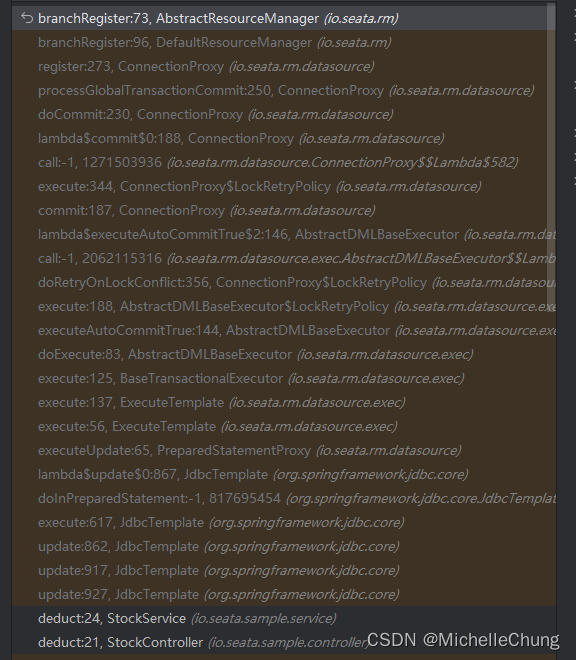
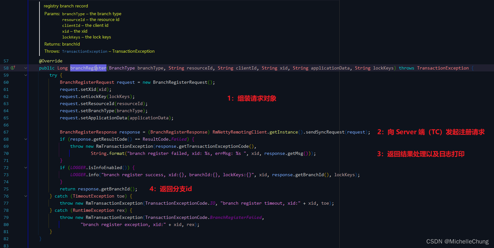

# （三）Seata AT 模式全局锁相关知识简单整理
---


## 前言
上一篇文章介绍了 AT 模式的调用流程，但是有个比较重要的概念没有提及到，所以这一篇来展开说明一下——全局锁。

## 参考目录
- [Seata 官方文档](https://seata.io/zh-cn/docs/overview/what-is-seata.html)
- [Seata 官方 Demo ：seata-xa](https://github.com/seata/seata-samples/tree/master/seata-xa)
- [Seata AT 模式](https://seata.io/zh-cn/docs/dev/mode/at-mode.html)

## 版本说明
由于官方 Demo 版本较低，本文使用的版本如下：
- `Seata`：`V1.7.0`
- `druid-spring-boot-starter`：`V1.2.16`

## 分析整理
### 1、全局锁的引入说明
在官方文档对于 AT 模型的篇章中有进行关于读写隔离的示例说明，这其中就涉及到了全局锁。

> （截图自官方文档）<br>
> 

在 Demo 里面业务主要是进行了写隔离，因此下面的分析也是以此为基础进行展开。

上图简明扼要提出了全局锁的获取时机以及应用场景，下面结合源码来看下。

### 2、全局锁相关源码整理
### 2.1、流程简图
上篇文章有根据输出记录按照时序步骤绘制了流程图，对关键的信息进行提取后加上全局锁的内容，绘制了新的流程图：


简单说明一下：
- 这张简图主要是事务分支相关的操作，因此没有绘制 TM 相关的内容。
- 虚线方框内是同一个方法的操作。
- 主要的方法也一并贴出来方便后续查找。

### 2.2、事务分支注册前的 SQL 相关操作
这一部分在上一篇文章也有提及，这里再简单带过一下。

在分支注册前，回先执行业务逻辑，生成前后镜像，再贴一下堆栈信息图：



`io.seata.rm.datasource.exec.AbstractDMLBaseExecutor#executeAutoCommitFalse`


得到前后镜像是为了生成 UndoLog 方便后续回滚操作。SQL 执行之后还没有 Commit，需要获取到全局锁并且在数据库表中写入 UndoLog 后才会提交。

完成这一步骤之后，继续分支事务操作，方法 `io.seata.rm.datasource.ConnectionProxy#processGlobalTransactionCommit` 完成了三个重要步骤：

 1. 注册分支（包含获取全局锁）
 2. undo_log 记录插入
 3. SQL 提交


本文的分析要点集中在步骤 1 中，对于步骤 2 上一篇博客已经进行了详细的分析，也贴出了相关的 UndoLog 内容，本文就不再进行说明。
### 2.3、注册分支（获取全局锁）
来到 Client 端（RM）注册分支的底层方法：

`io.seata.rm.AbstractResourceManager#branchRegister`



来到 Server 端（TC）的分支注册方法：

`io.seata.server.coordinator.AbstractCore#branchRegister`


该方法的主要逻辑：

 1. 使用 xid 获取到全局会话。
 2. 锁定会话并在事务上下文进行操作。
 3. 全局会话状态检查。
 4. 全局会话添加会话生命周期监听器。
 5. 新建全局事务分支，获得分支会话对象。
 6. **锁定分支会话。**
 7. 将分支会话添加到全局会话中，如果出现异常，解锁分支并抛出异常。
 8. 打印日志并返回分支id。


下面来看看底层是如何实现的：
```java
branchSessionLock(globalSession, branchSession);
```

`io.seata.server.transaction.at.ATCore#branchSessionLock`


根据打印的日志记录来看，应用数据 applicationData 是 null，因此直接进入到子方法。

`io.seata.server.session.BranchSession#lock`


`io.seata.server.lock.AbstractLockManager#acquireLock`


这个方法会从分支会话中获取所有行锁信息。

```java
// get locks of branch
List<RowLock> locks = collectRowLocks(branchSession);
```

`io.seata.server.lock.AbstractLockManager#collectRowLocks`


上图以其中一个事务分支为例对方法进行了简单的逻辑梳理。该方法根据分支注册请求信息构建了锁对象集合并返回。

顺便说一下，`transactionId` 实际上就是 xid 中 IP 端口后面的那一长串数字：
- xid：`192.168.2.117:8091:2252230319988862988`
- transactionId：`2252230319988862988`
- branchId：`2252230319988862990`


回到上一层继续往下深入获取锁。

`io.seata.server.storage.db.lock.DataBaseLocker#acquireLock`


`io.seata.server.storage.db.lock.LockStoreDataBaseDAO#acquireLock`


这是获取全局锁的主要方法，方法逻辑如下：

1. 首先，该方法获取数据库连接 conn，并设置自动提交属性为 false。同时，创建 PreparedStatement 对象 ps 和 ResultSet 对象 rs，以及一个用于存储已存在行键的 HashSet 集合 dbExistedRowKeys。

2. 如果传入的锁对象列表 lockDOs 的大小大于1，则通过过滤去除重复的行键，将其赋值给 lockDOs。这样可以确保锁对象列表中不会存在重复的行键。

3. 如果 skipCheckLock 参数为 false，说明需要进行锁的检查。即先查询数据库中的锁表，判断是否有其他事务正在持有或正在回滚相同的全局锁。

   - 创建一个查询检查锁的 SQL 语句 checkLockSQL，并将锁对象数量作为参数传递给该语句。
   - 通过 PreparedStatement 对象 ps 执行 checkLockSQL，并将锁对象的行键作为参数设置到 PreparedStatement 对象中。
   - 执行查询并遍历 ResultSet 对象 rs。对于每一行记录，检查是否存在其他事务持有相同的全局锁。
     - 如果存在其他事务持有相同的全局锁，则设置 canLock 标志为 false，并终止循环。
     - 同时，将查询到的数据库中已存在的行键添加到 dbExistedRowKeys 集合中。
   - 如果 canLock 标志为 false，表示无法获取锁，执行回滚操作，并根据 autoCommit 参数和锁的状态判断是否需要抛出异常。
   - 如果 dbExistedRowKeys 集合不为空，表示锁在数据库中已存在，因此需要将这些行键从 lockDOs 列表中移除。

4. 如果经过锁的检查后，lockDOs 列表为空，表示锁已全部存在于数据库中，无需再次获取锁，直接提交事务并返回 true。

5. 接下来，执行锁的获取操作。如果 lockDOs 列表中只有一个锁对象，调用 doAcquireLock 方法进行单个锁的获取。如果获取失败，执行回滚操作，并返回 false。

6. 如果 lockDOs 列表中存在多个锁对象，调用 doAcquireLocks 方法进行批量锁的获取。如果获取失败，执行回滚操作，并返回 false。

7. 最后，提交事务，关闭 ResultSet、PreparedStatement 对象，根据原始的自动提交属性设置连接的 autoCommit 属性，并关闭数据库连接。


`io.seata.server.storage.db.lock.LockStoreDataBaseDAO#doAcquireLock`


获取到全局锁后，会把锁信息保存到数据库表 `lock_table` 中，在释放锁后记录也会删除。

（完）
