# Sentinel（一）关于 StatisticSlot 以及 LeapArray

---

## 前言

最近需要整理框架的知识点，Cloud 专栏好长时间不更新了，今天浅学了一下 `Sentinel`，主要看了一下关于滑动窗口 `Sliding Window` 的底层数据结构 `LeapArray` 源码，再补充看了一下 `StatisticSlot`。虽然本文没有涉及到框架的内容，主要是对于源码的逻辑分析理解，但还是整理到 Cloud 专栏里面以便后续学习。
## 参考目录
- [Sentinel 官方文档](https://sentinelguard.io/zh-cn/docs/introduction.html)
- [Sentinel 核心类解析](https://github.com/alibaba/Sentinel/wiki/Sentinel-%E6%A0%B8%E5%BF%83%E7%B1%BB%E8%A7%A3%E6%9E%90) 
强烈建议读一下该文档，对 Sentinel 核心结构有一个大致的理解。
## 学习笔记
### 1、Sentinel 简介
首先还是简单介绍一下 Sentinel（搬运自官方文档）：
> 随着微服务的流行，服务和服务之间的稳定性变得越来越重要。Sentinel 是面向分布式、多语言异构化服务架构的流量治理组件，主要以流量为切入点，从流量路由、流量控制、流量整形、熔断降级、系统自适应过载保护、热点流量防护等多个维度来帮助开发者保障微服务的稳定性。

### 2、Sentinel 架构图
总体架构图（搬运自官方文档）：

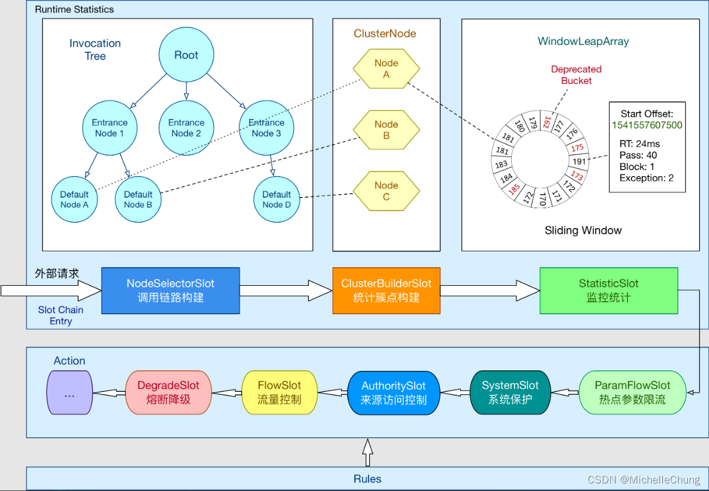

> Sentinel 的核心骨架，将不同的 Slot 按照顺序串在一起（责任链模式），从而将不同的功能（限流、降级、系统保护）组合在一起。slot chain 其实可以分为两部分：统计数据构建部分（statistic）和判断部分（rule checking）。

在整理消化这个架构图时，看到了关于监控统计的介绍：

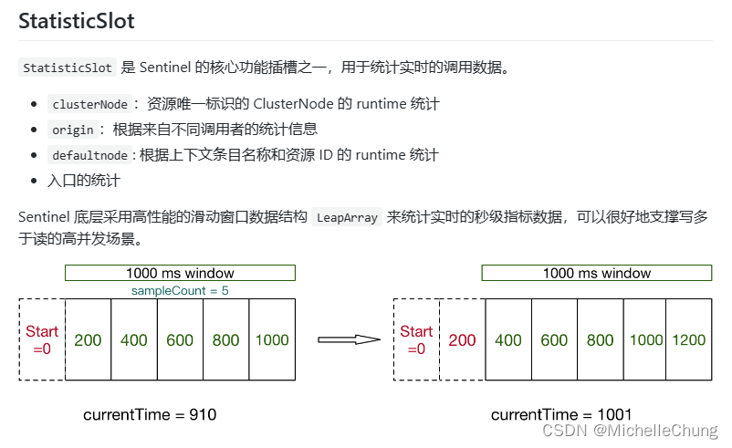

> Sentinel 底层采用高性能的滑动窗口数据结构 LeapArray 来统计实时的秒级指标数据，可以很好地支撑写多于读的高并发场景。

这个滑动窗口实际上就是架构图右上角 Sliding Window 所表示的结构，但是一眼看下去还是不太能看懂，所以不妨去问一下 ChatGPT 以及看看源码。
### 3、Sentinel 源码学习
### 3.1、包结构
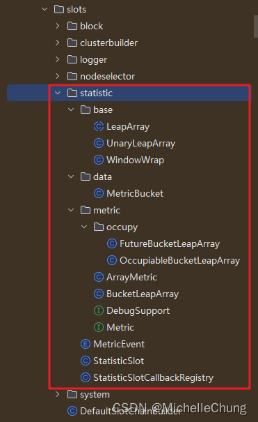

包里面重点的几个类：
- `LeapArray`
- `ArrayMetric`
- `StatisticSlot`

由前面的介绍可知，`LeapArray` 属于底层的滑动窗口数据结构，所以先从这个入手理解一下。
### 3.2、 `LeapArray` （滑动窗口算法的实现）
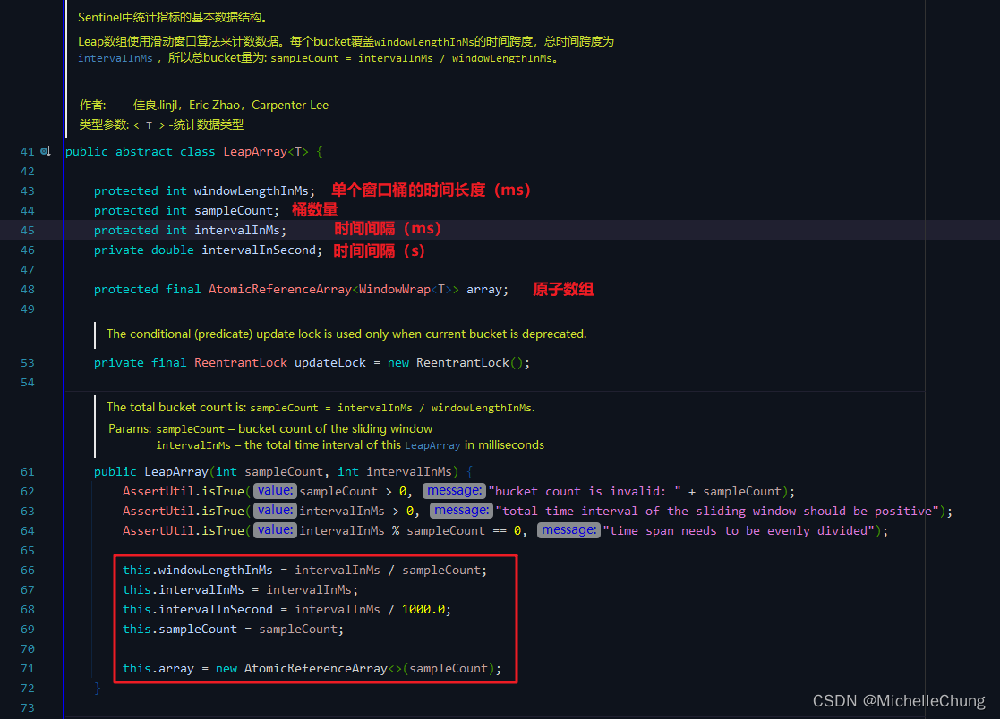

从类的注释可以知道，`LeapArray` 是统计实现的底层数据结构，使用的是 **滑动窗口算法** `Sliding Window` 来对数据进行统计。

简单来说，滑动窗口将一段时间间隔（`intervalInMs`）划分成了由 N个（`sampleCount`）桶（`Bucket`）组成的时间片数组，每个桶的时间长度是 `windowLengthInMs`，桶里面保存了统计的相关数据。

下面来看下滑动窗口的核心方法。

`LeapArray#currentWindow` 
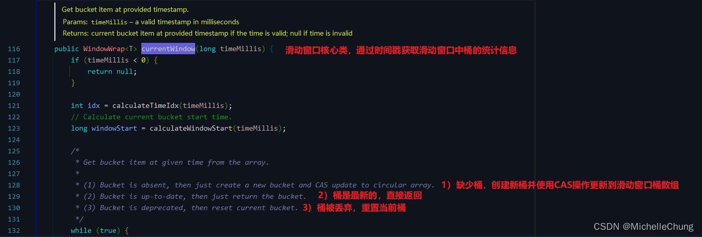

该方法的主要作用是通过时间戳获取到当前滑动窗口桶中的统计信息。该方法的注释也非常详细，下面简单说明一下。

 1. 首先，判断传入的 `timeMillis` 参数是否小于 0，如果小于 0，则返回 `null`。
 2. 接着，根据时间参数 `timeMillis`，计算出对应的时间桶索引 idx 和时间窗口的起始时间 `windowStart`。
 3. 然后，使用 `while(true)` 实现一个无限循环，用来获取桶，即特定时间段内的统计信息。

获取桶一般有以下三种情况：

 - 情况一：缺少桶，需要创建新桶并更新到数组
 - 情况二：最新桶，直接返回
 - 情况三：桶被丢弃，需要重置

情况一： 
判断当前时间段的桶是否存在，如果不存在，则创建一个新的桶，并尝试使用 CAS 操作将其更新到滑动窗口的桶数组中，如果更新成功，则返回新的桶。

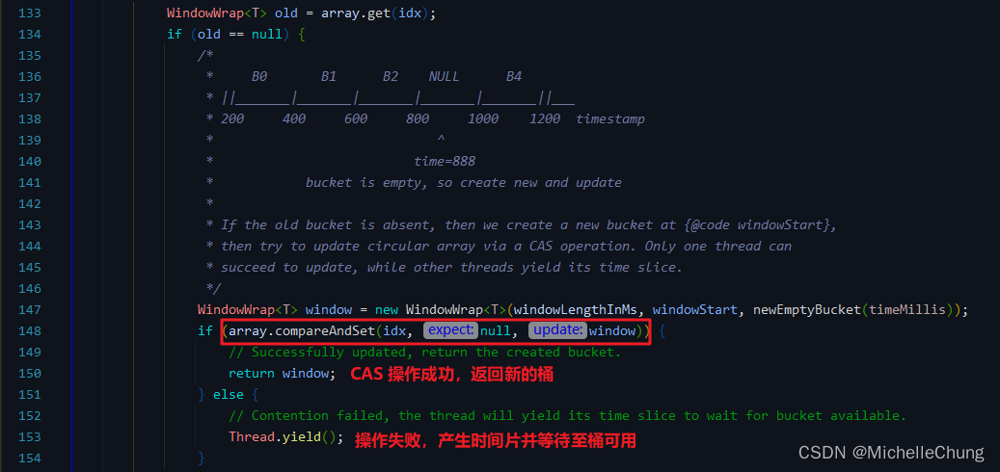

CAS操作： 

情况二： 
如果桶已经存在，并且与当前时间段的起始时间相同，则说明这个桶是最新的，可以直接返回。

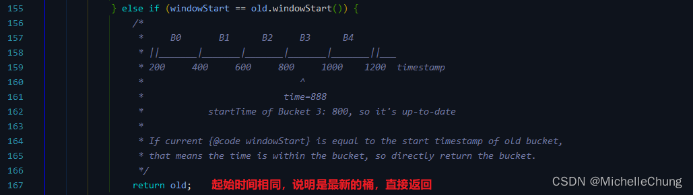

情况三： 
如果桶已经存在，但其起始时间已经过期，则需要更新这个桶。此时，需要使用 `updateLock` 锁来进行同步，防止多个线程同时更新桶的情况。

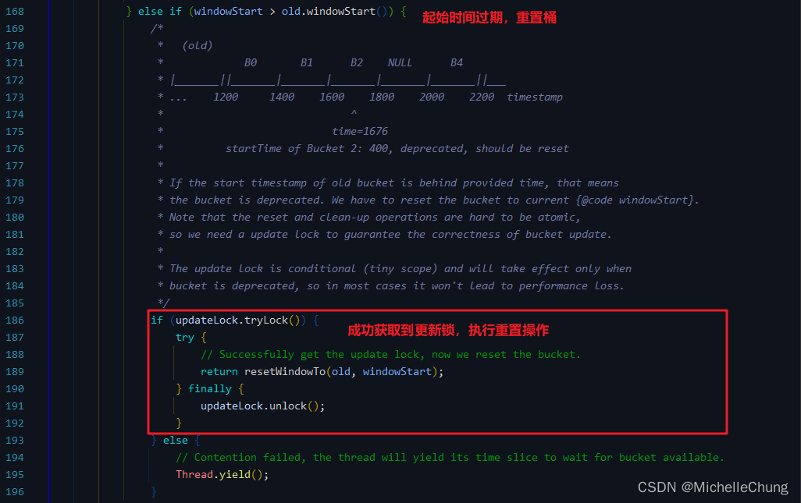

最后，如果时间参数早于桶的起始时间，则创建一个新的空桶并返回。（正常情况下不会进入这个判断，因为提供的时间总会早于当前时间）

关于滑动窗口的优点： 
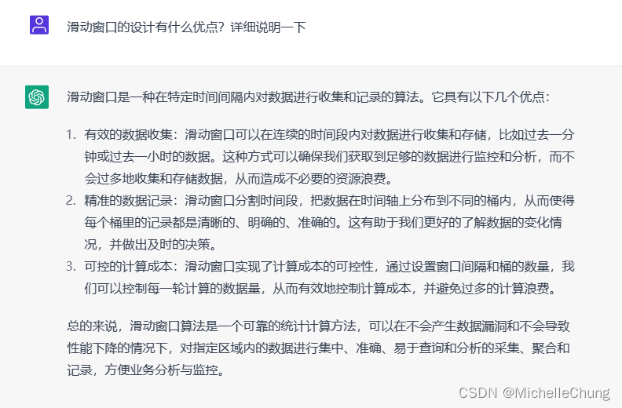

### 3.3、`StatisticSlot`
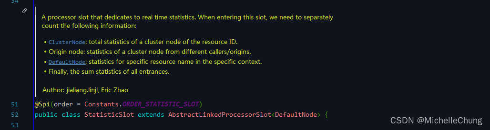

> StatisticSlot 是 Sentinel 最为重要的类之一，用于根据规则判断结果进行相应的统计操作。 
> 
> entry 的时候：依次执行后面的判断 slot。每个 slot 触发流控的话会抛出异常（BlockException 的子类）。若有 BlockException 抛出，则记录 block 数据；若无异常抛出则算作可通过（pass），记录 pass 数据。 
> 
> exit 的时候：若无 error（无论是业务异常还是流控异常），记录 complete（success）以及 RT，线程数-1。 
> 
> 记录数据的维度：线程数+1、记录当前 DefaultNode 数据、记录对应的 originNode 数据（若存在 origin）、累计 IN 统计数据（若流量类型为 IN）。

文档简单介绍了 `StatisticSlot` 类中的方法。

### 3.3.1、`StatisticSlot#entry`
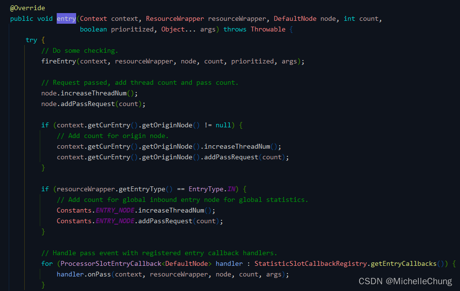

主要方法逻辑：
 1. 调用 fireEntry 方法进行校验，以确保进入当前资源的请求数量不超过限制。
 2. 增加当前节点的线程数和通过请求数。
 3. 如果当前节点有 `originNode`，也将增加其线程数和通过请求数。
 4. 如果当前节点是 `EntryType.IN` 类型，则增加全局入口节点的线程数和通过请求数。
 5. 最后，调用注册的 `Entry` 回调函数，处理通过事件。

异常处理：
- 优先级等待异常（`PriorityWaitException`）
- 阻塞异常（`BlockException`）

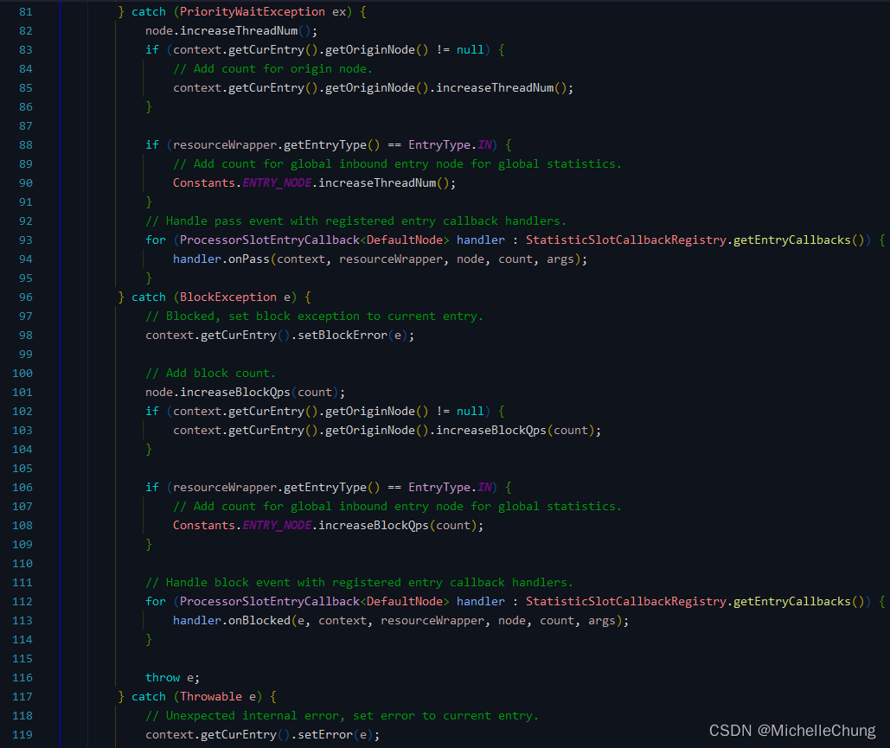

当出现优先级等待异常时，增加当前节点和 `originNode` 的线程数，并调用注册的 `Entry` 回调函数处理通过事件。

当出现阻塞异常时，设置当前入口节点的阻塞异常，并增加当前节点和 `originNode` 的阻塞请求次数、总阻塞时间，并调用注册的 `Entry` 回调函数处理阻塞事件，最后抛出 `BlockException` 异常。

### 3.3.2、`StatisticSlot#exit`
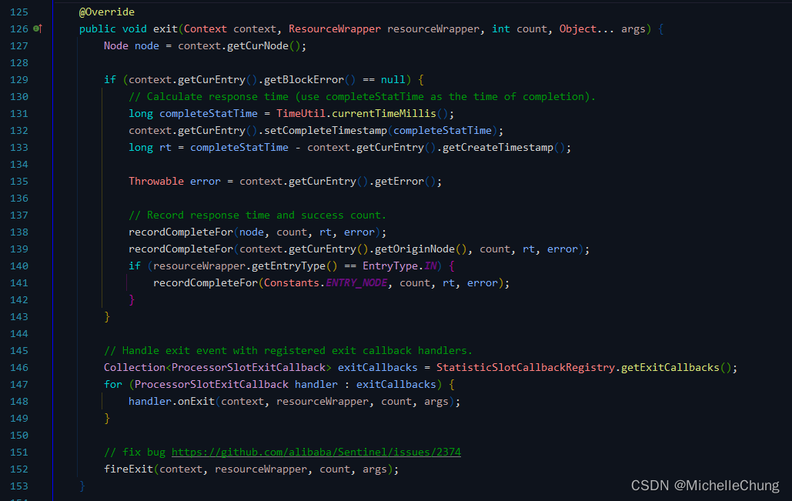

主要方法逻辑：

 1. 计算响应时间 RT
 2. 使用 RT 来记录成功计数和响应时间
 3. 执行已注册的 `ExitCallback` 处理程序
 4. 调用 `fireExit` 函数

### 3.4、`StatisticNode`、`StatisticSlot`、`ArrayMetric`、`LeapArray`

最后来简单总结一下这几个类的关系。

当 Sentinel 监控系统对某个资源进行监控时，会创建一个对应的 `StatisticNode` 节点，该节点通过 `StatisticSlot` 统计槽收集和处理数据，并通过 `ArrayMetric` 数组度量器来维护收集的数据。`LeapArray` 则相当于一个滑动时间窗口，用于按照时间周期将各个 `ArrayMetric` 链接起来，以形成一个时间线的统计图。

`ArrayMetric`

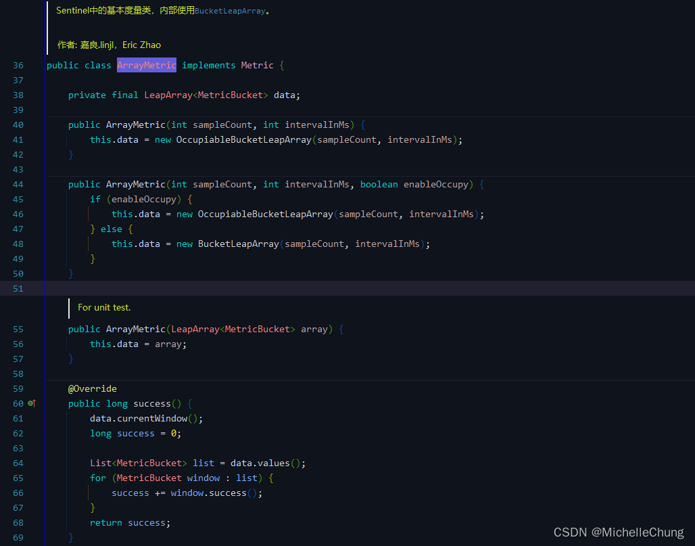

`StatisticNode`

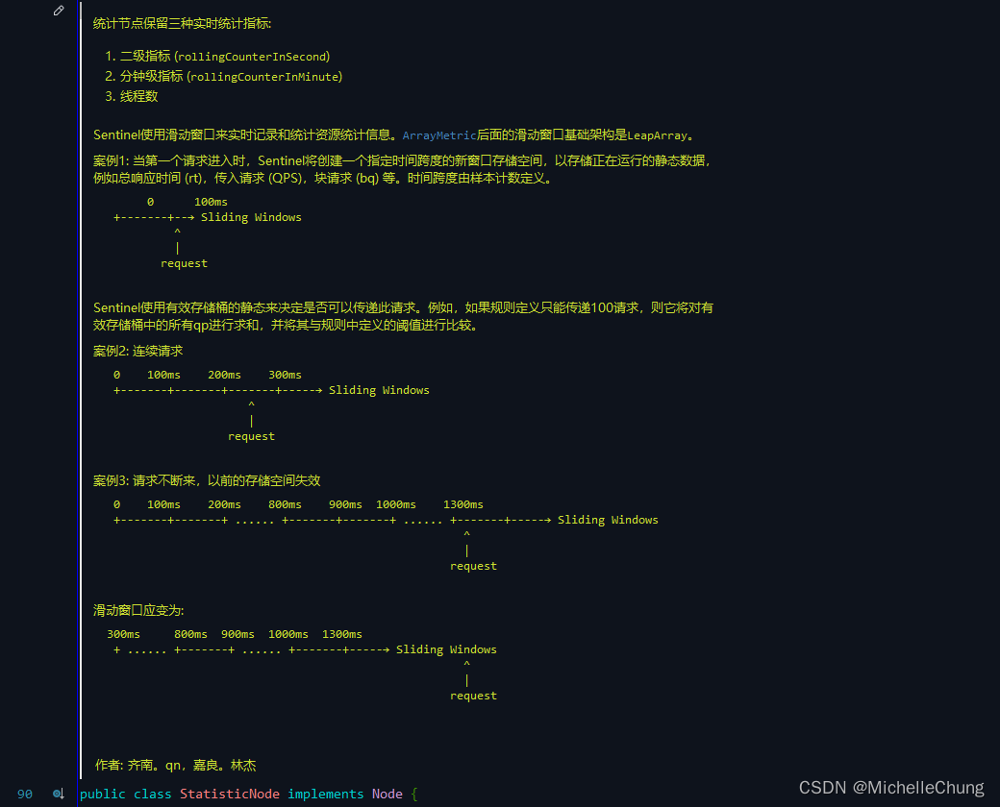

（完）