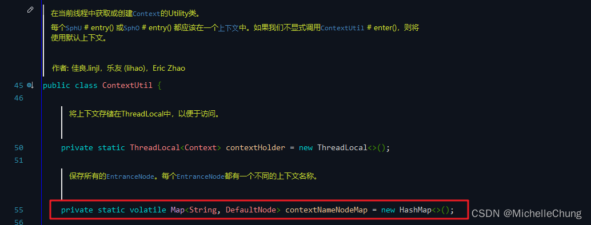

# Sentinel（二）Node & ProcessorSlotChain 总览与知识整理

---

## 前言
上一篇文章中，主要集中的点在于 `StatisticSlot`，一开始只是简单介绍了一下 `Sentinel` 架构，这篇文章暂时把视线拉回来一点，整理一下关于 `Node` 以及 `slot chain` 的相关知识，后续文章再对 `slot` 展开详细分析。

## 参考目录
- [Sentinel 官方文档](https://sentinelguard.io/zh-cn/docs/introduction.html)
- [Sentinel工作主流程](https://github.com/alibaba/Sentinel/wiki/Sentinel%E5%B7%A5%E4%BD%9C%E4%B8%BB%E6%B5%81%E7%A8%8B) 
依托于该文档进行本文 `Slot Chain` 部分的展开。
- [Sentinel 核心类解析](https://github.com/alibaba/Sentinel/wiki/Sentinel-%E6%A0%B8%E5%BF%83%E7%B1%BB%E8%A7%A3%E6%9E%90) 
依托于该文档进行本文 `Node` 部分的展开。
- [《实战Alibaba Sentinel：深度解析微服务高并发流量治理》](https://weread.qq.com/web/bookDetail/19132860813ab6d85g019c35) 
结合该书对一些知识点的梳理。

## 版本说明
- `Sentinel`：`V1.8.6`

## 学习笔记
### 1、Sentinel 架构图
总体架构图（搬运自官方文档）：

还是这张图，先来简单梳理一下各种类型的 `Node`，然后再来分析下面的 `Slot Chain`。

### 2、Node
`Node` 继承关系图如下：

这一部分在文档中分成了三个部分来对各种节点进行描述，分别是简介、构建时机以及维度（数目），下面在文档的基础上结合源码来整理说明一下。

### 2.1、入口节点 `EntranceNode`
- 介绍：
> 入口节点，特殊的链路节点，对应某个 Context 入口的所有调用数据。Constants.ROOT 节点也是入口节点。

- 构建的时机：
> 在 ContextUtil.enter(xxx) 的时候就创建了，然后塞到 Context 里面。

- 维度（数目）：
> 维度是 context，存在 ContextUtil 类的 contextNameNodeMap 里面。

### 2.2、链路节点 `DefaultNode`
- 介绍：
> 用于统计调用链路上某个资源的数据，维持树状结构。

- 构建的时机：
> NodeSelectorSlot：根据 context 创建 DefaultNode，然后 set curNode to context。

该方法 `NodeSelectorSlot#entry` 会在下面介绍 `Slot Chain` 时再作说明。

- 维度（数目）：
> 维度是 resource * context，存在每个 NodeSelectorSlot 的 map 里面。

### 2.3、簇点 `ClusterNode`
- 介绍：
> 用于统计每个资源全局的数据（不区分调用链路），以及存放该资源的按来源区分的调用数据（类型为 StatisticNode）。特别地，Constants.ENTRY_NODE 节点用于统计全局的入口资源数据。

- 构建的时机：
> ClusterBuilderSlot：首先根据 resourceName 创建 ClusterNode，并且 set clusterNode to defaultNode。

同上，该方法 `ClusterBuilderSlot#entry` 会在下面介绍 `Slot Chain` 时再作说明。

- 维度（数目）：
> 维度是 resource。

### 2.4、统计节点 `StatisticNode`

上篇文章的主角，再来回顾一下。

- 介绍：
> 最为基础的统计节点，包含秒级和分钟级两个滑动窗口结构。

- 构建的时机：
> ClusterBuilderSlot：首先根据 resourceName 创建 ClusterNode，并且 set clusterNode to defaultNode；然后再根据 origin 创建来源节点（类型为 StatisticNode），并且 set originNode to curEntry。

`ClusterBuilderSlot#entry`

`ClusterNode#getOrCreateOriginNode`

- 维度（数目）：
> 来源节点（类型为 StatisticNode）的维度是 resource * origin，存在每个 ClusterNode 的 originCountMap 里面。

### 3、`Slot Chain`
**注：由于篇幅所限，处理器链中比较重要的 `slot` （例如限流、熔断等）会在后面的文章单独讲，在文本会简单带过一下。**

还是先回到 Github 文档中开头的那句话：
> Sentinel 的核心骨架，将不同的 Slot 按照顺序串在一起（责任链模式），从而将不同的功能（限流、降级、系统保护）组合在一起。slot chain 其实可以分为两部分：统计数据构建部分（statistic）和判断部分（rule checking）。

可以知道，`Slot` 是按照顺序串联起来的，所以我们也是按照加载顺序来进行说明。

在看《实战Alibaba Sentinel：深度解析微服务高并发流量治理》的时候，也有看到关于这一部分的说明，来简单摘抄如下：
> Sentinel 使用责任链模式将注册的所有 ProcessorSlot 按照一定的顺序串成一个单向链表。

> ProcessorSlotChain 用于将 ProcessorSlot 串成一个单向链表，并且ProcessorSlotChain 由 SlotChainBuilder 构造。DefaultSlotChainBuilder 是默认使用的 SlotChainBuilder。

既然如此，我们就从 `DefaultSlotChainBuilder` 开始。

### 3.1、`DefaultSlotChainBuilder`
`DefaultSlotChainBuilder#build`

该方法的主要逻辑：

 1. 创建一个 `ProcessorSlotChain` 对象。
 2. 通过 SPI 机制获取所有的 `ProcessorSlot` 实现类，并将它们按照 SPI 机制的注解（`@Spi`）中的 `order` 属性进行排序，这里的 `SpiLoader` 是一个工具类用于加载 SPI 实现类。
 3. 在排序后的 `ProcessorSlot` 列表中，只有继承自抽象的`ProcessorSlot` 链节点 `AbstractLinkedProcessorSlot` 的 `ProcessorSlot` 的实例才可以添加到 `ProcessorSlotChain` 中，否则会打印警告并忽略该 `ProcessorSlot`。
 4. 将所有可添加的 `ProcessorSlot` 添加到 `ProcessorSlotChain` 中并返回。

这个方法的重点在于通过 SPI 机制获取所有的 `ProcessorSlot` 实现类。

`SpiLoader#loadInstanceListSorted`

`SpiLoader#load`

这段代码是 SPI 机制的实现代码，用于加载实现某个特定接口的 SPI 实现。

方法的主要逻辑：

 1. 判断是否已加载过该 SPI 实现，若已加载则直接返回。
 2. 根据 SPI 接口名称读取相应的 SPI 文件。
 3. 通过相应的 ClassLoader 获取这个文件的 URL，并遍历每一个 URL 来读取文件内容，解析其中的每一行字符串，提取类名称等信息加入到相应的列表中。如果文件中出现了重名的别名，则会抛出异常。
 4. 将解析出来的类进行一系列操作，比如判断它是否是该 SPI 接口的实现，或者是否是默认实现类等，并将这些类的别名、注解信息等放入相应的 Map 中。
 5. 将这些类集合进行排序并返回。

得到的 slot（未排序）：

### 3.1.1、Slot 排序的实现
通过注解的 `@Spi` 中的 `order` 属性进行排序。

排序比较：

### 3.1.2、SPI 文件读取
如何能够通过 SPI 机制获取所有的 `ProcessorSlot` 实现类？

答案是在资源文件夹中创建和接口名称一致的资源文件。

`sentinel-core-1.8.6.jar` 这里只有 8 个 slot，但是上面截图显示，加载完成的时候有 10 个 slot。这里就不得不说明一下，所有引入的 jar 包都会被扫描，只要名称相同的文件都会被扫描，所以另外两个 slot 分别在 `sentinel-parameter-flow-control-1.8.6.jar` 以及 `sentinel-api-gateway-adapter-common-1.8.6.jar`。

### 3.2、`NodeSelectorSlot`（order = -10000）
这是最先加载的 `slot`。

> 这个 slot 主要负责收集资源的路径，并将这些资源的调用路径以树状结构存储起来，用于根据调用路径进行流量控制。

`NodeSelectorSlot#entry`

主要逻辑：
1. 根据不同的上下文 `context` 和资源封装类 `ResourceWrapper` 创建相应的执行节点 `DefaultNode`，并将其添加到一个 `map` 中进行缓存。
2. 如果 `map` 中已有该上下文 `context` 对应的执行节点，则直接获取该节点；否则需要创建一个新节点添加到 `map` 中，并将其加入调用方上下文的调用栈（即为 `DefaultNode`）的子节点中，以构建所有节点的调用树。
3. 将执行节点和相关参数传递到下一个`ProcessorSlot` 中进行处理。

方法的注释值得一读：
> It's interesting that we use context name rather resource name as the map key.

红色框中还提出了一个思考问题：
> 最快获取到同一个 `resource` 的所有统计值的方法是什么？ 
> 答案是所有具有相同 `resource` 名称的 `DefaultNode` 共享同一个 `ClusterNode`。

### 3.3、`ClusterBuilderSlot`（order = -9000）
> 此插槽用于构建资源的 ClusterNode 以及调用来源节点。ClusterNode 保持某个资源运行统计信息（响应时间、QPS、block 数目、线程数、异常数等）以及调用来源统计信息列表。

上面关于 `ClusterNode` 节点的说明也有提及该方法。

这个方法的作用是创建一个新的 `ClusterNode` 实例，并使用`node.setClusterNode(clusterNode)` 将其分配给给定的 `Node` 对象。如果 `context` 参数具有非空的来源值，则它还会设置一个来源节点。

### 3.4、`LogSlot`（order = -8000）

这一个功能比较简单，继续往下。

### 3.5、`StatisticSlot`（order = -7000）
> StatisticSlot 是 Sentinel 的核心功能插槽之一，用于统计实时的调用数据。

这一个在上篇文章 `#3.3.1` 中详细分析过了，在此也不再赘述。

### 3.6、`AuthoritySlot`（order = -6000）
> 根据配置的黑白名单和调用来源信息，来做黑白名单控制。

### 3.7、`SystemSlot`（order = -5000）
> 这个 slot 会根据对于当前系统的整体情况，对入口资源的调用进行动态调配。其原理是让入口的流量和当前系统的预计容量达到一个动态平衡。 
> 注意系统规则只对入口流量起作用（调用类型为 EntryType.IN），对出口流量无效。可通过 SphU.entry(res, entryType) 指定调用类型，如果不指定，默认是EntryType.OUT。

`SystemRuleManager#checkSystem`

方法的主要逻辑：

 1. 如果 `resourceWrapper` 参数为 null，方法将直接返回。
 2. 如果检查开关 `checkSystemStatus` 为关闭状态，则方法也直接返回。
 3. 该方法只检查入站流量。如果资源类型不是入站类型，则方法直接返回。
 4. 计算当前总的 QPS，如果当前 QPS 加上 `count` 超过了最大 QPS，那么就抛出一个 `SystemBlockException` 异常，异常信息中包含了资源名称和限制类型 ` ("qps")`。
 5. 检查当前线程数是否超过了最大线程数，如果是，则抛出一个 `SystemBlockException` 异常，异常信息中也包含了资源名称和限制类型 `("thread")`。
 6. 计算当前的平均响应时间，如果平均响应时间超过了最大响应时间，那么就抛出一个 `SystemBlockException` 异常，异常信息中同样包含了资源名称和限制类型`("rt")`。
 7. 检查系统负载是否超过了上限。如果最高系统负载已经设置，且当前系统平均负载超过了最高系统负载，那么就调用 `checkBbr` 方法检查是否可以通过 BBR 算法来限制流量。如果不能通过 BBR 算法来限制流量，那么就抛出一个 `SystemBlockException` 异常，异常信息中同样包含了资源名称和限制类型 `("load")`。
 8. 检查当前 CPU 使用率是否超过了最高 CPU 使用率。如果超过了最高 CPU 使用率，那么就抛出一个 `SystemBlockException` 异常，异常信息中同样包含了资源名称和限制类型 `("cpu")`。

关于 BBR 算法：

`SystemRuleManager#checkBbr`

入参 `currentThread` 当前线程数。

判断 currentThread 是否大于 1，如果大于 1，则继续判断是否大于 `Constants.ENTRY_NODE.maxSuccessQps() * Constants.ENTRY_NODE.minRt() / 1000`。
- 如果大于，则返回 `false`，表示当前线程超过了 BBR 算法的限制，应该停止继续运行。
- 如果小于，则返回 `true`，表示当前线程符合 BBR 算法的限制，可以继续运行。

### 3.8、`GatewayFlowSlot`（order = -4000）

方法的主要逻辑：

 1. 如果 `args` 为 `null`，则直接返回。
 2. 获取 `GatewayRuleManager` 对象，并调用 `getConvertedParamRules` 方法获取转化后的参数规则列表。
 3. 如果规则列表为 `null` 或为空，则直接返回。
 4. 遍历规则列表中的每个规则，对于每个规则：
	-	初始化参数度量器。
	-	如果 `passCheck` 不满足条件，则抛出参数流量限制异常 `ParamFlowException`。
5. 返回成功。

### 3.9、`ParamFlowSlot`（order = -3000）

ParamFlowSlot#checkFlow

热点参数限流和网关限流类似，也是通过一系列规则的判断来校验是否能够通过。

### 3.10、`FlowSlot`（order = -2000）
> 这个 slot 主要根据预设的资源的统计信息，按照固定的次序，依次生效。如果一个资源对应两条或者多条流控规则，则会根据如下次序依次检验，直到全部通过或者有一个规则生效为止：
> 指定应用生效的规则，即针对调用方限流的；
> 调用方为 other 的规则；
> 调用方为 default 的规则。

### 3.11、`DegradeSlot`（order = -1000）
> 这个 slot 主要针对资源的平均响应时间（RT）以及异常比率，来决定资源是否在接下来的时间被自动熔断掉。

（完）