# Sentinel（三）流量控制知识整理

---


## 前言
打开 `Sentinel` 官方文档的介绍，概括性的一句话便是：

> Sentinel 是面向分布式、多语言异构化服务架构的流量治理组件，主要以流量为切入点，从流量路由、流量控制、流量整形、熔断降级、系统自适应过载保护、热点流量防护等多个维度来帮助开发者保障微服务的稳定性。

主要以流量为切入点，流量控制是这个框架的一个重要功能，因此本文结合框架wiki 文档，对流量控制的相关方法源码进行简单的整理说明。

## 参考目录
- [Sentinel 官方文档](https://sentinelguard.io/zh-cn/docs/introduction.html)
- [流量控制](https://github.com/alibaba/Sentinel/wiki/%E6%B5%81%E9%87%8F%E6%8E%A7%E5%88%B6)
本文主要参考的文档，在该文档基础上进行知识整理。
- [限流 冷启动](https://github.com/alibaba/Sentinel/wiki/%E9%99%90%E6%B5%81---%E5%86%B7%E5%90%AF%E5%8A%A8)
- [流量控制 匀速排队模式](https://github.com/alibaba/Sentinel/wiki/%E6%B5%81%E9%87%8F%E6%8E%A7%E5%88%B6-%E5%8C%80%E9%80%9F%E6%8E%92%E9%98%9F%E6%A8%A1%E5%BC%8F)
- [《实战Alibaba Sentinel：深度解析微服务高并发流量治理》](https://weread.qq.com/web/bookDetail/19132860813ab6d85g019c35)
结合该书对一些知识点的梳理。

## 版本说明
- `Sentinel`：`V1.8.6`

## 学习笔记
### 1、概述
对于概述部分，wiki 文档进行了很好的说明：

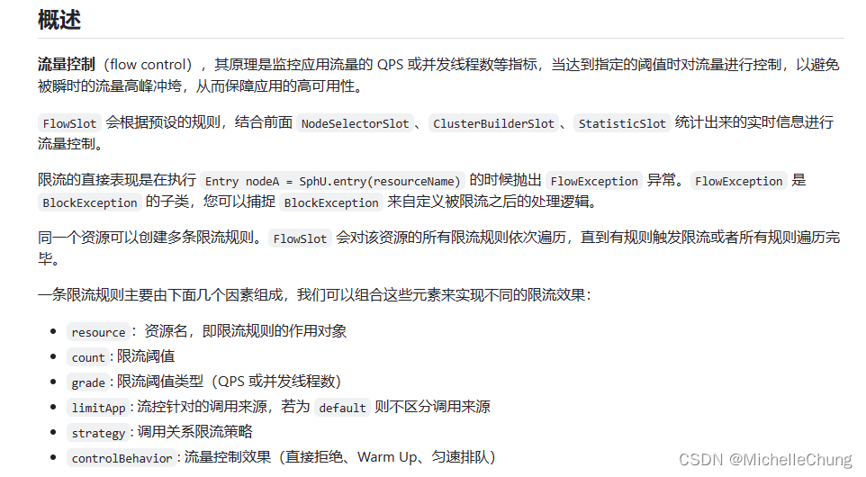

wiki 下文主要介绍了两种流量控制的方式：
- 基于 QPS/并发数 的流量控制
- 基于调用关系的流量控制

本文流量控制的入口方法位于 `FlowSlot`，按照方法调用的先后顺序，先说明 `基于调用关系的流量控制`，再对 `基于 QPS/并发数 的流量控制` 进行展开。

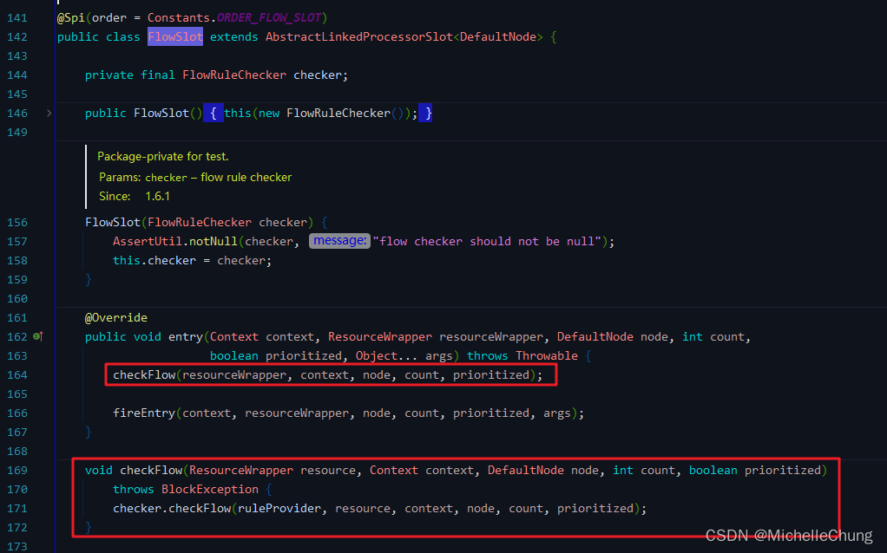
### 2、基于调用关系的流量控制（流控模式）
基于调用关系的流量控制主要有三种：

 - 根据调用方限流 `RuleConstant.STRATEGY_DIRECT`
 - 根据调用链路入口限流：链路限流 `RuleConstant.STRATEGY_CHAIN`
 - 具有关系的资源流量控制：关联流量控制 `RuleConstant.STRATEGY_RELATE`

从方法 `FlowSlot#checkFlow` 一路深入，看看如何选择不同的流控模式。

`FlowRuleChecker#checkFlow`

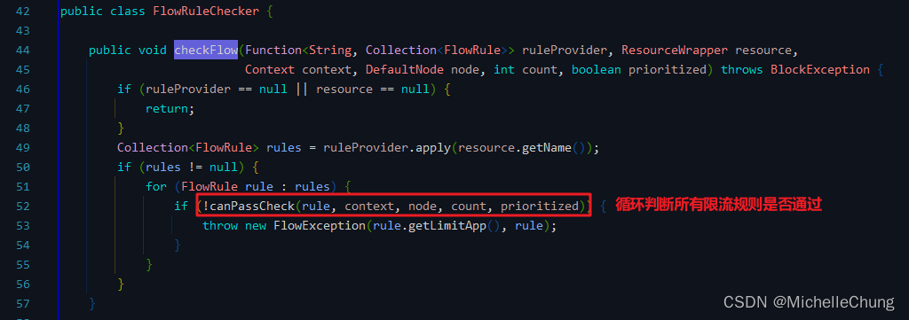

该方法根据资源名称获取所有的限流规则，`canPassCheck` 循环判断是否通过。

`FlowRuleChecker#canPassCheck`

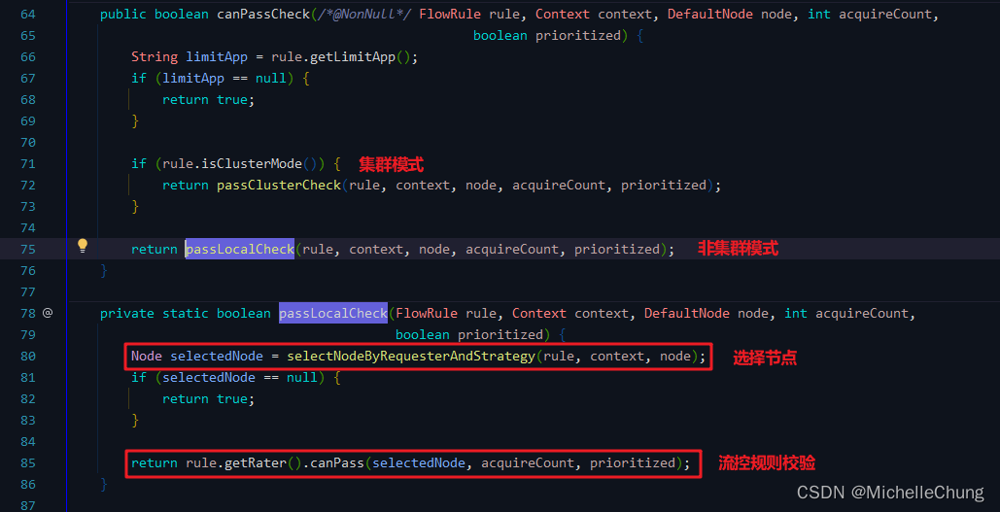
### 2.1、流量规则 `FlowRule`
在方法 `FlowRuleChecker#checkFlow` 中，从 `ruleProvider` 获取流量规则集合：
```java
Collection<FlowRule> rules = ruleProvider.apply(resource.getName());
```

`FlowSlot#ruleProvider`

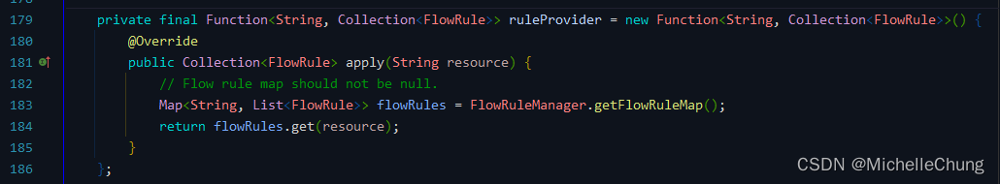

`ruleProvider` 是一个函数变量，是一个实现了 `Function` 接口的匿名内部类，并重写了其中的 `apply` 方法，用于根据资源名称获取到对应的流控规则列表。

流控规则可以自定义配置，通过监听器来更新。

`FlowRuleManager.FlowPropertyListener`

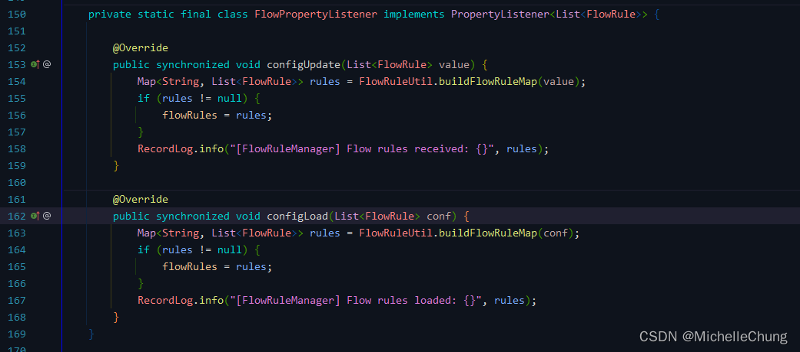

### 2.2、选择节点
`FlowRuleChecker#selectNodeByRequesterAndStrategy`

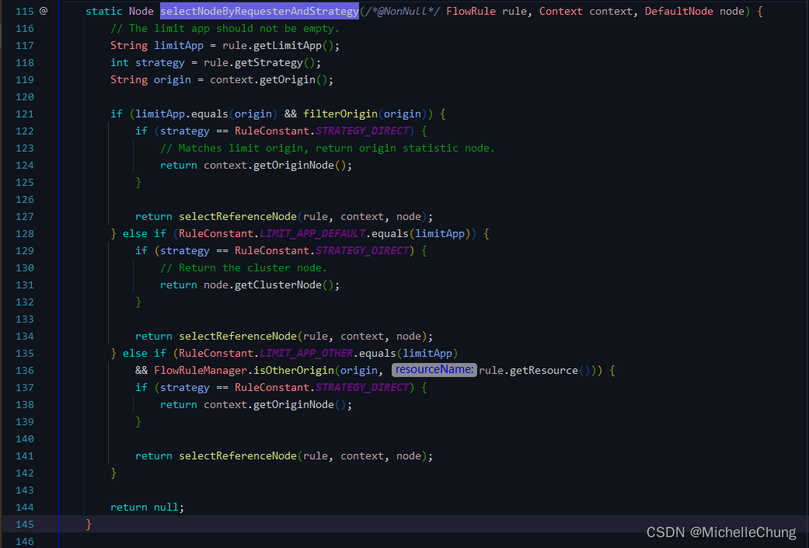

根据请求方法和限流策略选择节点：

1. 获取限流应用 `limitApp`、策略 `strategy` 和请求方信息 `origin`
2. 限流应用与请求方相同，并且通过过滤器验证通过：
 	- `RuleConstant.STRATEGY_DIRECT`：返回 origin statistic node 源节点
 	- `selectReferenceNode`
3. 限流应用为默认应用：
	- `RuleConstant.STRATEGY_DIRECT`：返回 cluster node 簇点
	- `selectReferenceNode`
4. 限流应用为其他应用，并且请求方与资源不同源：
	- `RuleConstant.STRATEGY_DIRECT`：返回 origin statistic node 源节点
	- `selectReferenceNode`
5. 返回 null

`FlowRuleChecker#selectReferenceNode`

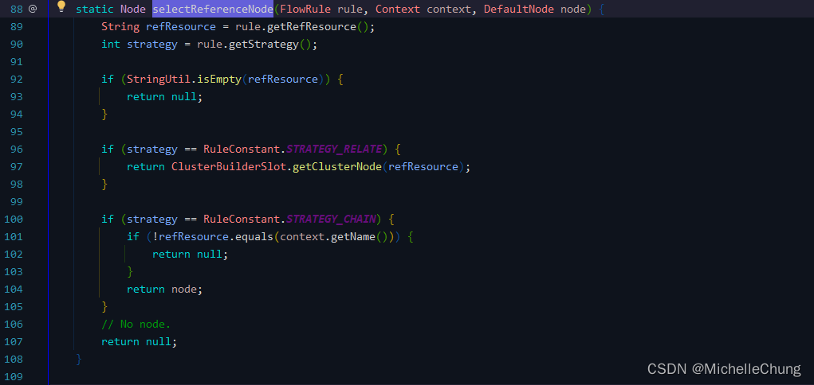

选择参考节点：
1. 获取参考资源和策略信息
2. 参考资源为空，则返回null
3. `RuleConstant.STRATEGY_RELATE`（关联模式）：
返回 `ClusterBuilderSlot.getClusterNode(refResource)` 簇点
4. `RuleConstant.STRATEGY_CHAIN`（链路模式）：
比较参考资源和请求方名称，如果不相等，则返回 null，否则，返回默认节点。
5. 返回 null

### 3、基于QPS/并发数的流量控制（流控效果）
并发线程数控制比较简单：

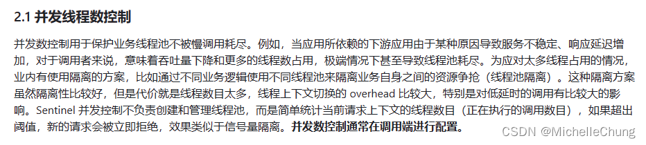

下面主要是QPS流量控制的三种方式：

 - 直接拒绝
 - Warm Up
 - 匀速排队

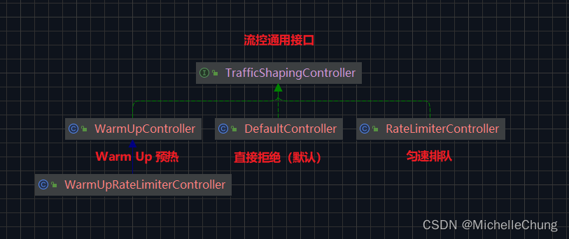

流控通用接口 `TrafficShapingController`：

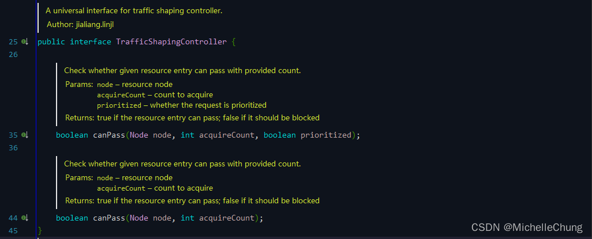

在构建限流规则集合时，底层方法如下：

`FlowRuleUtil#buildFlowRuleMap`

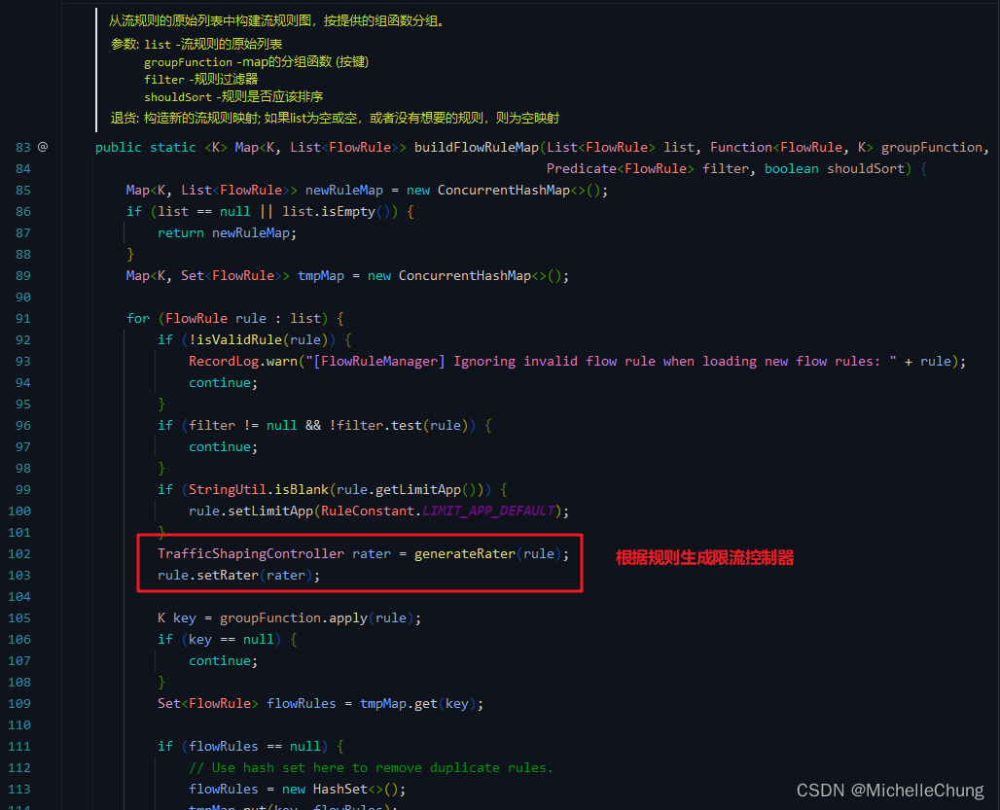

`FlowRuleUtil#generateRater`

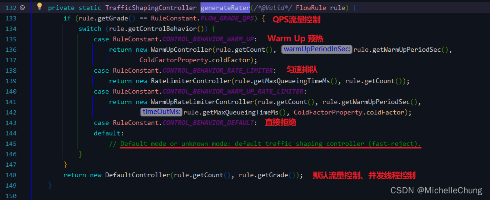

根据不同的规则，有不同的限流方式，下面按照顺序来说明。
### 3.1、默认方式（直接拒绝）

> 直接拒绝（RuleConstant.CONTROL_BEHAVIOR_DEFAULT）方式是默认的流量控制方式，当QPS超过任意规则的阈值后，新的请求就会被立即拒绝，拒绝方式为抛出FlowException。这种方式适用于对系统处理能力确切已知的情况下，比如通过压测确定了系统的准确水位时。

`DefaultController#canPass`

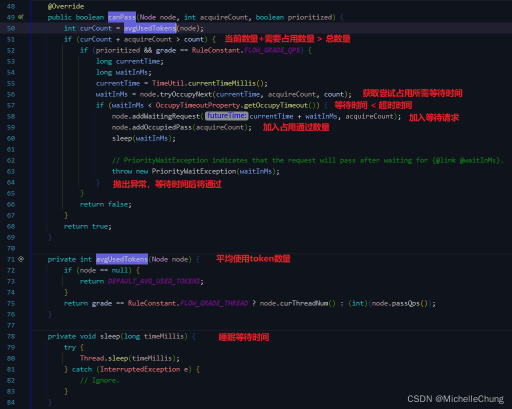

该方法的主要逻辑：
 1. 首先，获取节点当前平均使用的令牌数量。然后，检查当前令牌数量加上希望占用的令牌数量是否超过了节点的总令牌数量。如果超过了，则根据优先处理和流控等级的条件判断是否需要等待。
 2. 如果需要优先处理且流控等级为 QPS 级别，那么获取当前时间和下一次尝试占用令牌的等待时间。如果等待时间小于占用超时的时间，则将当前时间加上等待时间作为等待请求的时间，并将希望占用的令牌数量添加到节点的等待请求中，并将希望占用的令牌数量添加到节点的占用通过数量中。然后，根据等待时间进行睡眠。
 3. 最后，抛出一个 `PriorityWaitException` 异常，表示请求将在等待一段时间后通过。
 4. 如果不需要等待或者等待时间超过了占用超时的时间，则返回 false，表示节点无法通过。
 5. 如果当前令牌数量加上希望占用的令牌数量不超过节点的总令牌数量，则返回 true，表示节点可以通过。

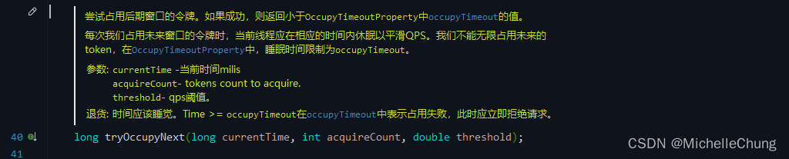

`StatisticNode#tryOccupyNext`

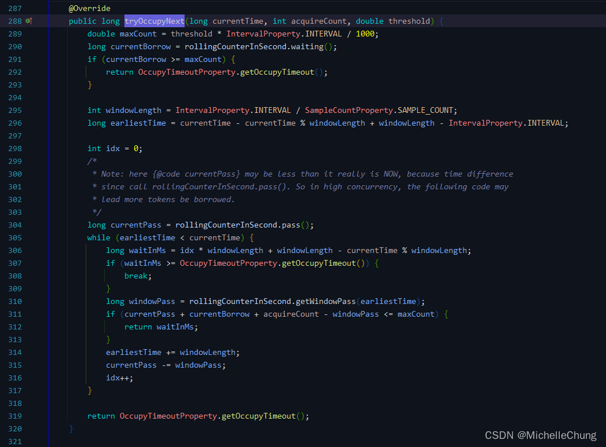

该方法主要是尝试占用令牌，入参为当前时间、希望获取的令牌数量、阈值，返回下一次尝试占用令牌的等待时间。主要逻辑如下：

 1. 首先，根据阈值和时间间隔计算最大令牌数量。阈值 `threshold` 是一个百分比，表示每秒允许占用的最大令牌数量。时间间隔 `IntervalProperty.INTERVAL` 是一个固定的时间段，用于计算令牌的窗口长度。
```java
double maxCount = threshold * IntervalProperty.INTERVAL / 1000;
```
2. 接下来，获取当前等待的令牌数量。如果当前等待的令牌数量已经超过了最大令牌数量，那么直接返回占用超时的时间。
```java
long currentBorrow = rollingCounterInSecond.waiting();
```
3. 然后，计算窗口长度。窗口长度是时间间隔除以样本数量，用于划分时间窗口。
```java
int windowLength = IntervalProperty.INTERVAL / SampleCountProperty.SAMPLE_COUNT;
```
4. 接着，计算最早的时间点。最早的时间点是当前时间减去当前时间与窗口长度的余数，加上窗口长度减去时间间隔。这样可以得到上一个时间窗口的起始时间。
```java
long earliestTime = currentTime - currentTime % windowLength + windowLength - IntervalProperty.INTERVAL;
```
5. 然后，初始化一个索引变量 `idx`，用于迭代时间窗口。接下来，获取当前通过的令牌数量。
**（注释部分）注意，由于调用了rollingCounterInSecond.pass()方法之后可能经过了一段时间，所以当前通过的令牌数量可能小于实际通过的令牌数量。在高并发的情况下，这段代码可能导致更多的令牌被借用。**

6. 然后，进入一个循环，直到最早的时间点大于当前时间为止。在每次循环中，计算等待的时间。
```java
long waitInMs = idx * windowLength + windowLength - currentTime % windowLength;
```
7. 等待的时间是索引乘以窗口长度加上窗口长度减去当前时间与窗口长度的余数。如果等待的时间大于等于占用超时的时间，那么退出循环。
8. 接着，获取窗口通过的令牌数量。如果当前通过的令牌数量加上当前借用的令牌数量加上希望占用的令牌数量减去窗口通过的令牌数量小于等于最大令牌数量，那么返回等待的时间。
```java
long windowPass = rollingCounterInSecond.getWindowPass(earliestTime);
```
9. 然后，更新最早的时间点，将其加上窗口长度。同时，将当前通过的令牌数量减去窗口通过的令牌数量。索引变量加1。
10. 最后，如果没有找到合适的时间窗口，则返回占用超时的时间。

### 3.2、冷启动 Warm Up
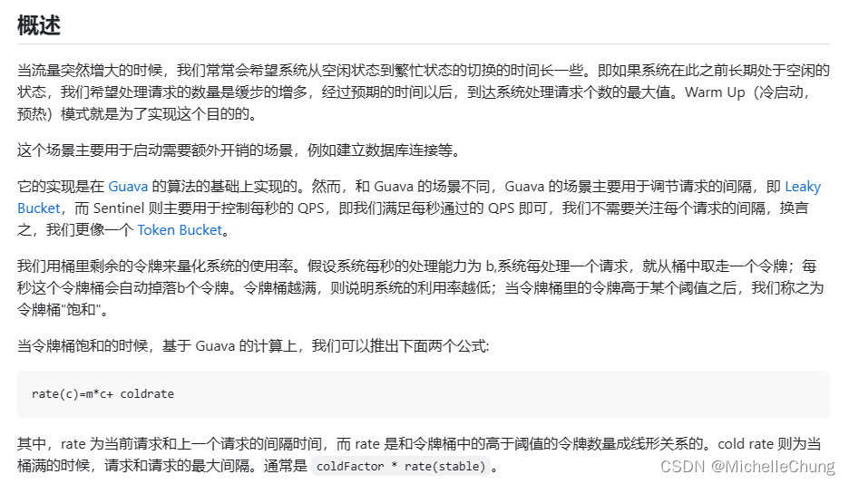

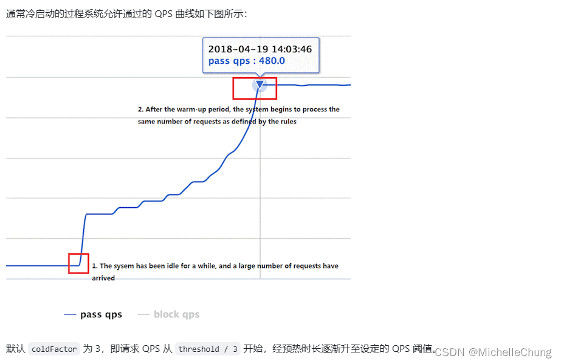

`WarmUpController#canPass`

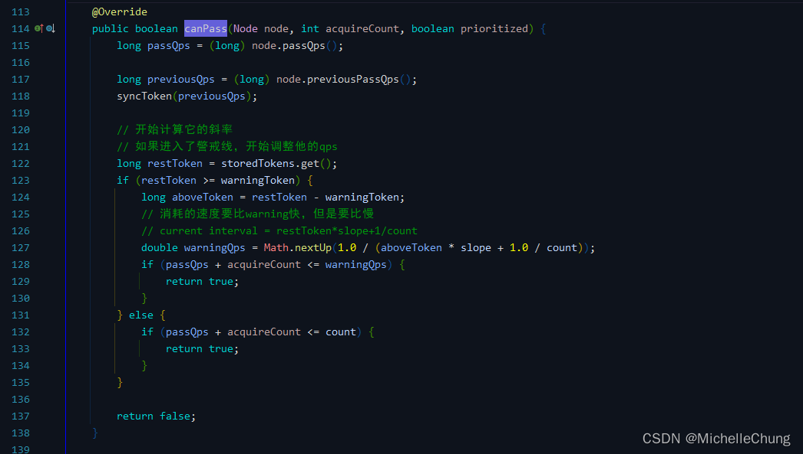

该方法的主要逻辑：

1. 首先，获取节点的当前通过 QPS 和上一个通过 QPS。然后，调用 `syncToken` 方法同步令牌。
```java
long passQps = (long) node.passQps();
long previousQps = (long) node.previousPassQps();
syncToken(previousQps);
```
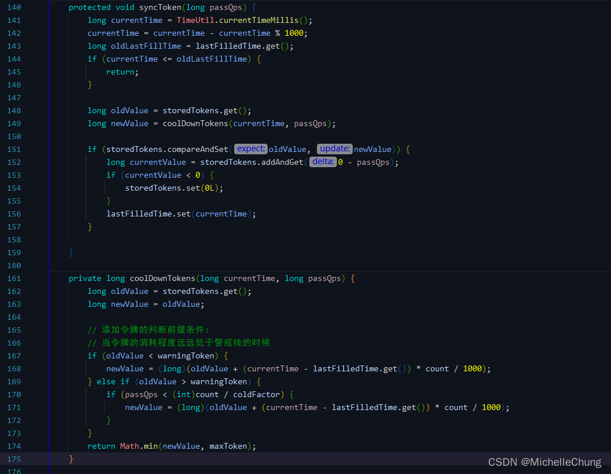

---
`syncToken` 方法用于更新令牌桶中的令牌数量。首先，获取当前时间，并将其取整到秒。然后，获取上一次填充令牌的时间。如果当前时间小于等于上一次填充令牌的时间，则直接返回。

接着，获取令牌桶中的旧令牌数量，并根据当前时间和通过QPS计算新的令牌数量。
```java
long newValue = coolDownTokens(currentTime, passQps);
```
使用 `compareAndSet` 方法将新的令牌数量设置到令牌桶中，并更新令牌桶中的当前令牌数量。如果当前令牌数量小于0，则将其设置为0。最后，更新上一次填充令牌的时间。

---

2. 然后，根据令牌桶中的令牌数量和希望占用的令牌数量进行判断，如果令牌桶中的令牌数量大于等于警戒线以上的令牌数量，即令牌消耗程度较低，那么根据令牌消耗速率和令牌数量计算警戒线以下的 QPS，并判断通过 QPS 加上希望占用的令牌数量是否小于等于警戒线以下的 QPS。如果是，则返回 true，表示节点可以通过。

3. 如果令牌桶中的令牌数量小于警戒线以上的令牌数量，即令牌消耗程度较高，那么根据通过 QPS 和冷却因子的比较判断是否需要添加令牌。如果通过 QPS 小于总令牌数量除以冷却因子，即令牌消耗速率较低，那么根据令牌消耗速率和令牌数量计算新的令牌数量。最后，返回新的令牌数量和最大令牌数量的较小值。

4. 返回 false

### 3.3、匀速排队
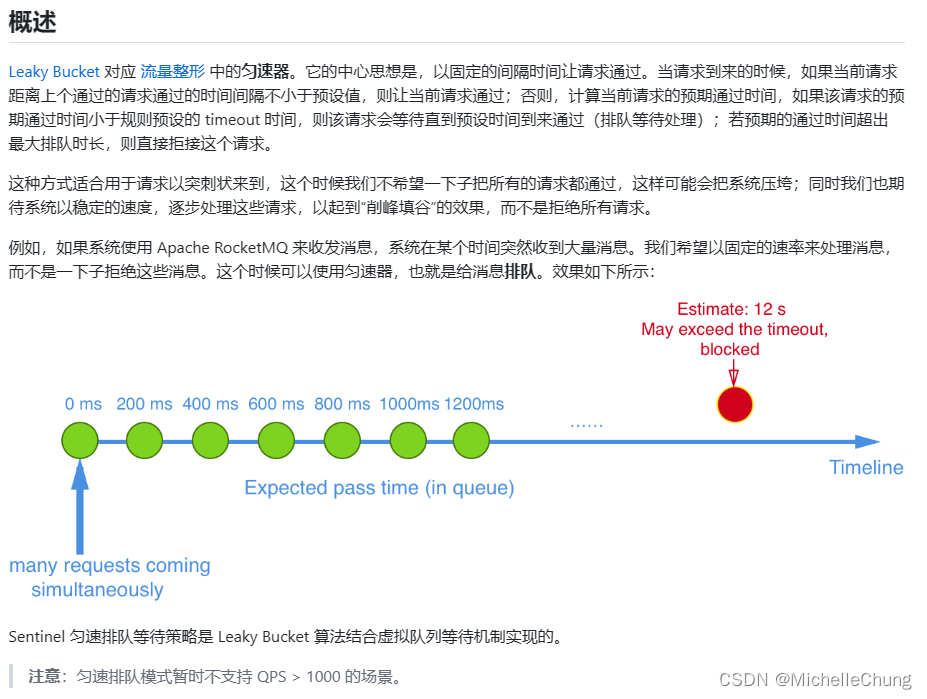

`RateLimiterController#canPass`

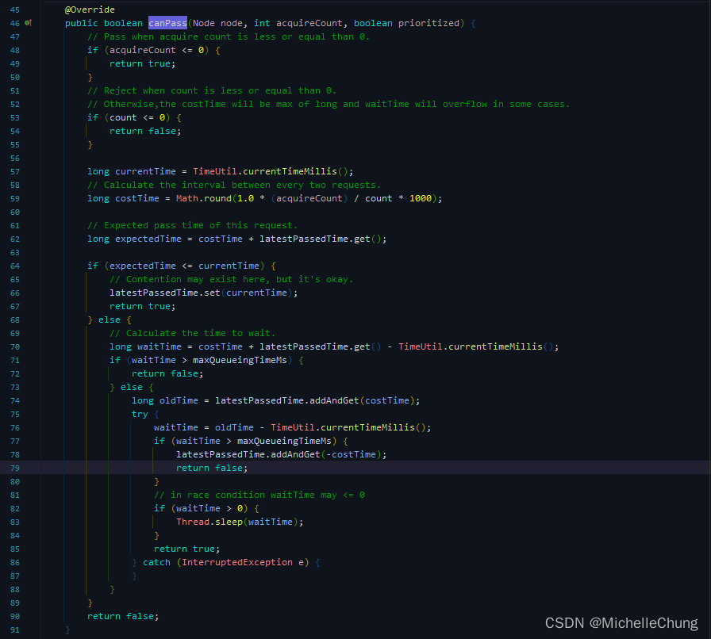

该方法的主要逻辑：
1. 首先判断请求的 `acquireCount` 是否小于等于0，如果是的话，直接返回 true，表示可以通过。
2. 判断资源的数量 count 是否小于等于0，如果是的话，直接返回 false，表示不能通过。
3. 获取当前时间 currentTime。
4. 根据请求的数量 acquireCount 和资源的数量 count 计算每两个请求之间的间隔，即 costTime。
```java
long costTime = Math.round(1.0 * (acquireCount) / count * 1000);
```
5. 计算这个请求的预计通过时间 expectedTime，即 costTime 加上最近通过的请求的时间 latestPassedTime。
```java
long expectedTime = costTime + latestPassedTime.get();
```
6. 如果 expectedTime 小于等于当前时间 currentTime，表示当前请求可以通过。这里可能会存在竞争条件，但是没有关系。将最近通过的时间 latestPassedTime设置为当前时间 currentTime，然后返回 true。
7. 如果 expectedTime 大于当前时间 currentTime，表示当前请求需要等待一段时间才能通过。
8. 计算需要等待的时间 waitTime，即 costTime 加上最近通过的请求的时间 latestPassedTime 减去当前时间 currentTime。
```java
long waitTime = costTime + latestPassedTime.get() - TimeUtil.currentTimeMillis();
```
9. 如果 waitTime 大于最大排队时间 maxQueueingTimeMs，则返回 false，表示不能通过。
10. 如果 waitTime 小于等于最大排队时间，则将最近通过的时间 latestPassedTime 加上 costTime，并且尝试进行等待。
11. 在进行等待之前，再次计算等待的时间 waitTime，即最近通过的时间 latestPassedTime 减去当前时间 currentTime。
12. 如果 waitTime 大于最大排队时间，则将最近通过的时间 latestPassedTime 减去 costTime，并返回 false，表示不能通过。
13. 如果 waitTime 大于0，则进行等待，等待时间为 waitTime 毫秒。
14. 等待结束后，返回 true，表示可以通过。
15. 如果在等待过程中被中断，则捕获 InterruptedException 异常，不做任何处理。
16. 最后，如果以上条件都不满足，则返回 false，表示不能通过。

（完）