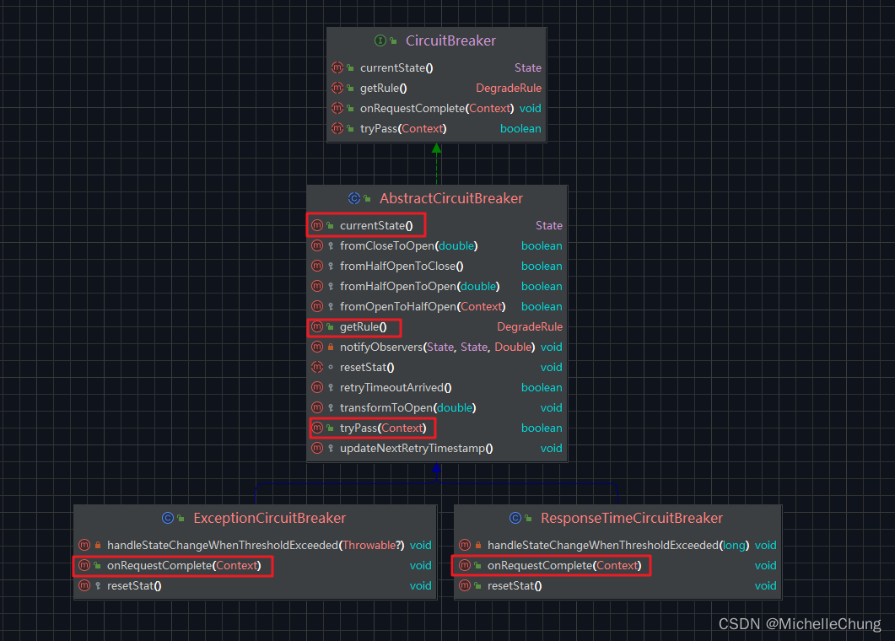

# Sentinel（四）熔断降级知识整理

---

## 前言
本文的开篇直接引用 `Sentinel` 官方 wiki 的描述进行说明：

> 除了流量控制以外，对调用链路中不稳定的资源进行熔断降级也是保障高可用的重要措施之一。一个服务常常会调用别的模块，可能是另外的一个远程服务、数据库，或者第三方 API 等。例如，支付的时候，可能需要远程调用银联提供的 API；查询某个商品的价格，可能需要进行数据库查询。然而，这个被依赖服务的稳定性是不能保证的。如果依赖的服务出现了不稳定的情况，请求的响应时间变长，那么调用服务的方法的响应时间也会变长，线程会产生堆积，最终可能耗尽业务自身的线程池，服务本身也变得不可用。
> 现代微服务架构都是分布式的，由非常多的服务组成。不同服务之间相互调用，组成复杂的调用链路。以上的问题在链路调用中会产生放大的效果。复杂链路上的某一环不稳定，就可能会层层级联，最终导致整个链路都不可用。因此我们需要对不稳定的弱依赖服务调用进行熔断降级，暂时切断不稳定调用，避免局部不稳定因素导致整体的雪崩。熔断降级作为保护自身的手段，通常在客户端（调用端）进行配置。

在这段文字中很好地说明了熔断降级的使用场景以及作用，结合《实战Alibaba Sentinel：深度解析微服务高并发流量治理》第6章的内容，本文做了一些知识整理。

## 参考目录
- [Sentinel 官方文档](https://sentinelguard.io/zh-cn/docs/introduction.html)
- [熔断降级](https://github.com/alibaba/Sentinel/wiki/%E7%86%94%E6%96%AD%E9%99%8D%E7%BA%A7)
- [《实战Alibaba Sentinel：深度解析微服务高并发流量治理》](https://weread.qq.com/web/bookDetail/19132860813ab6d85g019c35) 
本文依托于书本第6章内容进行下文断路器部分的展开。

## 版本说明
- `Sentinel`：`V1.8.6`

## 学习笔记
### 1、包结构
 `Sentinel` 关于熔断降级功能的主要包结构如下：

按照功能我简单整理成了表格：

| 类名                                      | 类型              | 说明              |
|-----------------------------------------|-----------------|-----------------|
| DegradeSlot                             | class           | 熔断插槽            |
| DegradeRule                             | class           | 熔断规则对象          |
| DegradeRuleManager                      | class           | 熔断规则管理器         |
| DegradeRuleManager.RulePropertyListener | private class   | 熔断规则管理器.规则属性监听器 |
| DegradeException                        | exception class | 熔断异常类           |
| CircuitBreaker                          | interface       | 断路器接口           |
| CircuitBreaker.State                    | enum            | 断路器状态枚举         |
| **AbstractCircuitBreaker**              | abstract class  | 抽象断路器           |
| CircuitBreakerStrategy                  | enum            | 断路器策略枚举         |
| **ExceptionCircuitBreaker**             | class           | 异常断路器           |
| **ResponseTimeCircuitBreaker**          | class           | 响应时间断路器（慢请求断路器） |
| CircuitBreakerStateChangeObserver       | interface       | 断路器状态改变观察者      |
| EventObserverRegistry                   | class           | 断路器事件观察者注册表     |

下文将按照这个表格的顺序对相关类进行说明。

### 2、`DegradeSlot`
这是在 `Sentinel` 核心调用链路的插槽之一。

> 这个 slot 主要针对资源的平均响应时间（RT）以及异常比率，来决定资源是否在接下来的时间被自动熔断掉。

跟其他 slot 一样实现了 `entry` 以及 `exit` 方法。

`DegradeSlot#entry`

slot 入口方法逻辑比较简单：

 1. 根据资源名称从熔断规则管理器中获取所有的断路器。
 2. 如果没有断路器直接返回。
 3. 遍历所有断路器：
	- 根据上下文进行断路器校验，如果校验不通过则抛出降级异常。

`DegradeSlot#exit`

在该方法中，如果请求执行没有异常，则再次遍历所有断路器并依次执行完成记录以及改变相关状态。

关于 `CircuitBreaker#onRequestComplete` 方法会在后文展开说明。

### 3、`DegradeRule`

关于对象属性的说明：

### 4、`DegradeRuleManager`

构建断路器方法：

`DegradeRuleManager.RulePropertyListener#buildCircuitBreakers`

`DegradeRuleManager#getExistingSameCbOrNew`

根据不同的降级策略创建不同的断路器。

### 5、`CircuitBreaker`

接口继承关系：

主要的实现类有三个：

 - 抽象断路器 `AbstractCircuitBreaker`
 - 响应时间断路器（慢请求断路器）`ResponseTimeCircuitBreaker`
 - 异常断路器 `ExceptionCircuitBreaker`

抽象断路器主要实现了方法：`getRule`，`tryPass`，`currentState`；另外两个策略断路器主要实现的是 `onRequestComplete`。

### 5.1 `CircuitBreaker.State` 
从 `CircuitBreaker.State` 枚举可知，断路器共有三种状态：

 - `OPEN` 开启状态
 - `HALF_OPEN` 半开启状态
 - `CLOSED` 关闭状态

根据书中的描述，我重新整理绘制了一下关于状态转换的图片：

断路器状态转换的具体方法都在抽象断路器 `AbstractCircuitBreaker` 中实现。
### 6、`AbstractCircuitBreaker`
关于抽象断路器的概述：

> 虽然不同熔断降级策略的熔断器实现逻辑不同，但差异只是阈值的判断不同或需要统计的指标数据不同，而是否放行请求只需要根据当前熔断器的状态判断，因此，Sentinel为不同熔断降级策略的熔断器提供了一个统一的抽象类——AbstractCircuitBreaker。

除了实现接口中的方法，抽象断路器定义了断路器状态转换的方法。

需要注意的是，断路器状态无法直接从开启状态到关闭状态，因此有四个状态转换方法：

 - `fromCloseToOpen` 从关闭到开启
 - `fromHalfOpenToOpen` 从半开启到开启
 - `fromHalfOpenToClose` 从半开启到关闭
 - `fromOpenToHalfOpen` 从开启到半开启

### 6.1、`AbstractCircuitBreaker#fromCloseToOpen`

> • 方法参数为触发值，即达到阈值时触发熔断器开启的当前值。
> • 方法可实现开启熔断器，更新下一次允许将熔断器关闭的时间，并通知状态改变观察者。

### 6.2、`AbstractCircuitBreaker#fromHalfOpenToOpen`

> • 方法参数为触发值，即达到阈值时触发熔断器开启的当前值。
> • 方法可实现开启熔断器，更新下一次允许将熔断器关闭的时间，并通知状态改变观察者。

### 6.3、`AbstractCircuitBreaker#fromHalfOpenToClose`

> 该方法可实现关闭熔断器并重置滑动窗口，重新统计熔断指标数据，最后通知状态改变观察者。其中调用的resetStat方法是一个抽象方法，由子类实现，用于重置滑动窗口。

### 6.4、`AbstractCircuitBreaker#fromOpenToHalfOpen`

> • 方法参数为调用链上下文。
> • 方法可实现将熔断器从 OPEN 状态变为 HALF_OPEN 状态，先通知状态改变观察者，再从 Context 实例中获取当前资源的 Entry 实例，向 Entry 实例注册一个 exit 回调处理器。该处理器在 Entry 实例的 exit 方法被调用时回调。
> • exit 回调处理器实现：如果当前请求被拒绝（不仅包括熔断器拒绝的，也包括限流、系统自适应等拒绝的），将熔断器从 HALF_OPEN 状态变为 OPEN 状态。

在该方法中，提出并解答了这个问题：

> 思考：为什么要在fromOpenToHalfOpen方法中注册exit回调处理器？

### 7、`CircuitBreakerStrategy`
在讲具体的断路器前，先来看看熔断策略。

三种熔断策略，对应两种不同的断路器，下面来看看具体的实现。

### 8、`ExceptionCircuitBreaker`

> 异常熔断器用于实现ERROR_RATIO、ERROR_COUNT这两种熔断降级策略，因此异常熔断器关心的是异常指标数据。

`ExceptionCircuitBreaker#onRequestComplete`

`ExceptionCircuitBreaker#handleStateChangeWhenThresholdExceeded`

该方法的主要逻辑（对应图中的说明）：

 1. 断路器开启状态，直接返回
 2. 断路器半开启状态：
	- 如果执行没有异常，关闭断路器
	- 如果执行有异常，打开断路器
 3. 计算请求异常数以及请求总数
 4. 如果总数 < 最小请求数，直接返回
 5. 如果降级策略为异常比例，则计算当前异常比例值
 6. 判断是否超过设定阈值，如果是则打开断路器

达到阈值后打开断路器的方法也是在抽象断路器中定义的： 

`AbstractCircuitBreaker#transformToOpen`

### 9、`ResponseTimeCircuitBreaker`
> 慢请求熔断器用于实现SLOW_REQUEST_RATIO熔断策略，因此慢请求熔断器关心的是耗时指标数据。

`ResponseTimeCircuitBreaker#onRequestComplete`

`ResponseTimeCircuitBreaker#handleStateChangeWhenThresholdExceeded`

该方法的主要逻辑（对应图中的说明）：

 1. 断路器开启状态，直接返回
 2. 断路器半开启状态：
	- 如果当前请求是慢请求（RT 大于最大允许值），打开断路器
	- 如果当前请求不是慢请求，关闭断路器
 3. 计算慢请求数以及请求总数
 4. 如果总数 < 最小请求数，直接返回
 5. 计算当前慢请求比例值
 6. 判断当前慢请求比例值是否超过设定阈值，如果是则打开断路器
 7. 判断当前慢请求比例是否等于设定阈值且设定阈值等于慢请求比例最大值，如果是则打开断路器

### 10、`CircuitBreakerStateChangeObserver`

`AbstractCircuitBreaker#notifyObservers`

（完）