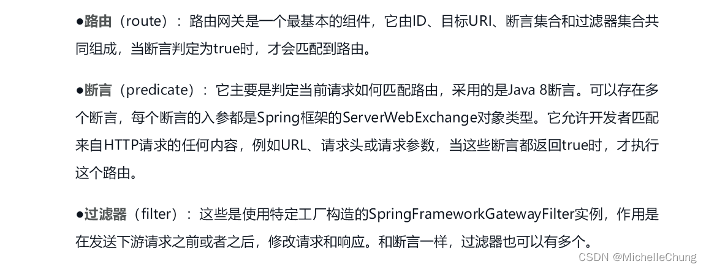

# Spring Cloud Gateway（一）关于配置文件参数
## 前言
关于 `Spring Cloud`，需要学习的知识点非常多，本篇是学习 `Spring Cloud Gateway` （以下简称为 `Gateway`）时一些知识点的汇总，主要围绕着配置文件 `ruoyi-gateway.yml` 展开。

## 参考目录
### 文档
- [Spring Cloud Gateway 官方文档](https://docs.spring.io/spring-cloud-gateway/docs/current/reference/html/)
- [若依文档 - 服务网关](http://doc.ruoyi.vip/ruoyi-cloud/cloud/gateway.html#%E6%9C%8D%E5%8A%A1%E7%BD%91%E5%85%B3)

### 书籍
- [Spring Cloud微服务和分布式系统实战](https://weread.qq.com/web/bookDetail/2fe329c071e041322feb53d)
  第9章 新网关——Spring Cloud Gateway
- [Spring微服务实战（第2版）](https://weread.qq.com/web/bookDetail/d293298072a35387d299103)
  第8章 使用Spring Cloud Gateway进行服务路由
- [深入理解Spring Cloud与实战](https://weread.qq.com/web/bookDetail/923320c07274b4b5923a28e)
  第9章 网关
- [Spring Cloud微服务架构进阶](https://weread.qq.com/web/bookDetail/c9932ea07163ff6ac993e0d)
  第8章 API网关：Spring Cloud Gateway

## 1、Gateway 框架配置
`ruoyi-gateway.yml`<br>

## 2、Gateway 执行过程

> 官方文档说明：<br>
>
> 


## 3、Gateway 执行原理

> 《Spring Cloud微服务和分布式系统实战》说明：<br>
> 
>
> 

## 4、框架配置参数整理分析
以第一个路由配置为例进行说明：

```yaml
spring:
  cloud:
    # 网关配置
    gateway:
      # 打印请求日志(自定义)
      requestLog: true
      discovery:
        locator:
          # 断言和过滤器使用小写服务id
          lowerCaseServiceId: true
          # 开启从注册中心动态创建路由的功能
          enabled: true
      routes:
        # 认证中心
        # 路由的ID，没有固定规则但要求唯一，建议配合服务名
        - id: ruoyi-auth
          # 匹配后的目标服务地址，供服务的路由地址
          # 需要注意的是 uri 的协议为 lb，表示启用 Gateway 的负载均衡功能。
          # lb://serviceName 是 spring cloud gateway 在微服务中自动为我们创建的负载均衡 uri
          uri: lb://ruoyi-auth
          # 断言
          predicates:
            # 路径相匹配的进行路由
            - Path=/auth/**
          filters:
            # 验证码处理
            - ValidateCodeFilter
            # StripPrefixGatewayFilterFactory
            # 此过滤器在将请求发送到下游之前从请求中删除路径的第一部分（称为前缀）。
            - StripPrefix=1
```

### 4.1、开启注册中心服务发现集成
`spring.cloud.gateway.discovery.locator.enabled=true`<br>


### 4.2、小写服务ID
`spring.cloud.gateway.discovery.locator.lowerCaseServiceId=true`<br>

### 4.3、负载均衡 `lb`
`spring.cloud.gateway.routes[0].uri=lb://ruoyi-auth`<br>

`uri` 参数可以直接填写具体路径，如：`http://localhost:8080/ruoyi-auth`，这里使用 `lb` 表示启用负载均衡功能：<br>

### 4.4、Path 路由断言
`spring.cloud.gateway.routes[0].predicates=[Path=/auth/**]`<br>

关于断言，一共有 12 种断言工厂：<br>

> <br>
> Path 路由断言配置：<br>
> 

Path 路由断言相对简单，只需要匹配相关路径即可。

`PathRoutePredicateFactory#apply`<br>


### 4.5、前缀网关过滤器
`spring.cloud.gateway.routes[0].filters=[StripPrefix=1]`

过滤器种类非常多，默认有 34 种：

> 
>
> 

去掉第一个前缀：

`StripPrefixGatewayFilterFactory#apply`<br>


（完）