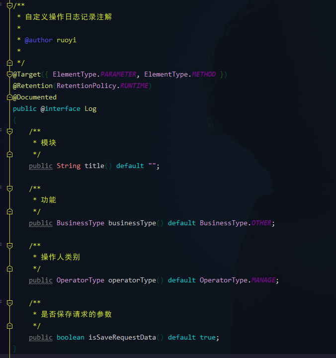

# AOP日志实现

## 一、概述
本文主要整理了关于若依框架的AOP日志功能实现，页面功能位于【系统管理 > 日志管理】。主要包括 **登录日志** 以及 **操作日志** 。

---
## 二、日志实现
#### 1、登录日志
登录日志页面展示：


登录方法： 
`com.ruoyi.web.controller.system.SysLoginController#login(LoginBody)`


登录验证：

`com.ruoyi.framework.web.service.SysLoginService#login(String, String, String, String)`

没有截取全部方法，主要目的是记录日志。


在登录验证方法中，红框标记的就是日志记录的方法，login方法中一共调用了5次。5次调用是针对不同的信息进行记录，参数一样。

```java
...
// 第一次 (验证码失效记录)
AsyncManager.me().execute(AsyncFactory.recordLogininfor(username, Constants.LOGIN_FAIL, MessageUtils.message("user.jcaptcha.expire")));
...
// 第二次 (验证码错误记录)
AsyncManager.me().execute(AsyncFactory.recordLogininfor(username, Constants.LOGIN_FAIL, MessageUtils.message("user.jcaptcha.error")));
...
// 第三次 (用户不存在/密码错误记录)
AsyncManager.me().execute(AsyncFactory.recordLogininfor(username, Constants.LOGIN_FAIL, MessageUtils.message("user.password.not.match")));
...
// 第四次 (异常捕捉记录)
AsyncManager.me().execute(AsyncFactory.recordLogininfor(username, Constants.LOGIN_FAIL, e.getMessage()));
...
// 第五次 (登录成功记录)
AsyncManager.me().execute(AsyncFactory.recordLogininfor(username, Constants.LOGIN_SUCCESS, MessageUtils.message("user.login.success")));
...

```
其中，```AsyncManager.me()```是创建一个异步管理器，说明日志记录是异步进行的操作。

```AsyncFactory.recordLogininfor(String, String, String, Object...)```是记录登录信息的主要方法。

```java
/**
  * 记录登录信息
  * 
  * @param username 用户名
  * @param status 状态
  * @param message 消息
  * @param args 列表
  * @return 任务task
  */
 public static TimerTask recordLogininfor(final String username, final String status, final String message,
         final Object... args)
 {
 	 // 从请求头获取 User-Agent 信息
 	 // e.g. User-Agent: Mozilla/5.0 (Windows NT 10.0; Win64; x64) AppleWebKit/537.36 (KHTML, like Gecko) Chrome/91.0.4472.77 Safari/537.36 Edg/91.0.864.37
     final UserAgent userAgent = UserAgentUtil.parse(ServletUtils.getRequest().getHeader("User-Agent"));
     // 获取 IP 地址
     final String ip = IpUtils.getIpAddr(ServletUtils.getRequest());
     return new TimerTask()
     {
         @Override
         public void run()
         {
             String address = AddressUtils.getRealAddressByIP(ip);
             StringBuilder s = new StringBuilder();
             s.append(getBlock(ip));
             s.append(address);
             s.append(getBlock(username));
             s.append(getBlock(status));
             s.append(getBlock(message));
             // 打印信息到日志
             sys_user_logger.info(s.toString(), args);
             // 获取客户端操作系统
             String os = userAgent.getOs().getName();
             // 获取客户端浏览器
             String browser = userAgent.getBrowser().getName();
             // 封装对象
             SysLogininfor logininfor = new SysLogininfor();
             logininfor.setUserName(username);
             logininfor.setIpaddr(ip);
             logininfor.setLoginLocation(address);
             logininfor.setBrowser(browser);
             logininfor.setOs(os);
             logininfor.setMsg(message);
             // 日志状态
             if (Constants.LOGIN_SUCCESS.equals(status) || Constants.LOGOUT.equals(status))
             {
                 logininfor.setStatus(Constants.SUCCESS);
             }
             else if (Constants.LOGIN_FAIL.equals(status))
             {
                 logininfor.setStatus(Constants.FAIL);
             }
             // 插入数据
             SpringUtils.getBean(ISysLogininforService.class).insertLogininfor(logininfor);
         }
     };
 }
```
---
#### 2、操作日志
操作日志页面展示：


操作日志的使用：


添加自定义注解```@Log```即可使用。
```java
@Log(title = "用户管理", businessType = BusinessType.INSERT)
```


其中 ```BusinessType```是操作功能枚举，```OperatorType```是操作人类别枚举。

操作日志处理类：
`com.ruoyi.framework.aspectj.LogAspect`

```java
...
protected void handleLog(final JoinPoint joinPoint, final Exception e, Object jsonResult)
{
    try
    {
        // 获得注解
        Log controllerLog = getAnnotationLog(joinPoint);
        if (controllerLog == null)
        {
            return;
        }

        // 获取当前的用户
        LoginUser loginUser = SpringUtils.getBean(TokenService.class).getLoginUser(ServletUtils.getRequest());

        // *========数据库日志=========*//
        SysOperLog operLog = new SysOperLog();
        operLog.setStatus(BusinessStatus.SUCCESS.ordinal());
        // 请求的地址
        String ip = IpUtils.getIpAddr(ServletUtils.getRequest());
        operLog.setOperIp(ip);
        // 返回参数
        operLog.setJsonResult(JSON.toJSONString(jsonResult));

        operLog.setOperUrl(ServletUtils.getRequest().getRequestURI());
        if (loginUser != null)
        {
            operLog.setOperName(loginUser.getUsername());
        }

        if (e != null)
        {
            operLog.setStatus(BusinessStatus.FAIL.ordinal());
            operLog.setErrorMsg(StrUtil.sub(e.getMessage(), 0, 2000));
        }
        // 设置方法名称
        String className = joinPoint.getTarget().getClass().getName();
        String methodName = joinPoint.getSignature().getName();
        operLog.setMethod(className + "." + methodName + "()");
        // 设置请求方式
        operLog.setRequestMethod(ServletUtils.getRequest().getMethod());
        // 处理设置注解上的参数
        getControllerMethodDescription(joinPoint, controllerLog, operLog);
        // 保存数据库
        AsyncManager.me().execute(AsyncFactory.recordOper(operLog));
    }
    catch (Exception exp)
    {
        // 记录本地异常日志
        log.error("==前置通知异常==");
        log.error("异常信息:{}", exp.getMessage());
        exp.printStackTrace();
    }
}
...
```
保存操作日志同样是异步操作。

```java
/**
 * 操作日志记录
 * 
 * @param operLog 操作日志信息
 * @return 任务task
 */
public static TimerTask recordOper(final SysOperLog operLog)
{
    return new TimerTask()
    {
        @Override
        public void run()
        {
            // 远程查询操作地点
            operLog.setOperLocation(AddressUtils.getRealAddressByIP(operLog.getOperIp()));
            SpringUtils.getBean(ISysOperLogService.class).insertOperlog(operLog);
        }
    };
}
```

