# AOP（二）自定义注解 @RepeatSubmit 实现防止表单重复提交
- - -
## 前言
关于 AOP 的使用很常见，最开始接触若依框架的时候就已经写过一篇关于日志AOP 的文章，前段时间好像刚好有关于 `@RepeatSubmit` 的一些讨论，所以就决定写篇博客，内容虽然不算难，但是也是作为【RuoYi-Vue-Plus】框架学习的一部分。
## 参考目录
- [框架wiki文档 - 防重幂等](https://gitee.com/JavaLionLi/RuoYi-Vue-Plus/wikis/%E6%A1%86%E6%9E%B6%E5%8A%9F%E8%83%BD/%E9%98%B2%E9%87%8D%E5%B9%82%E7%AD%89)

## 代码实现
### 1、Maven 引入
`ruoyi-framework/pom.xml`
```xml
<!-- SpringBoot 拦截器 -->
<dependency>
    <groupId>org.springframework.boot</groupId>
    <artifactId>spring-boot-starter-aop</artifactId>
</dependency>
```
### 2、AOP 注解： `@EnableAspectJAutoProxy`
`com.ruoyi.framework.config.ApplicationConfig`<br>
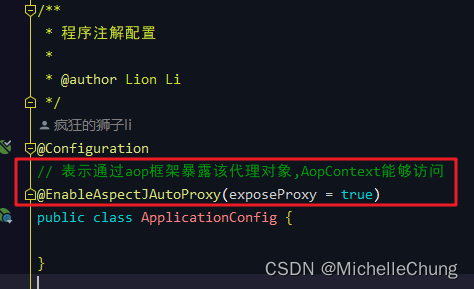
### 3、自定义注解：@RepeatSubmit
`com.ruoyi.common.annotation.RepeatSubmit`<br>
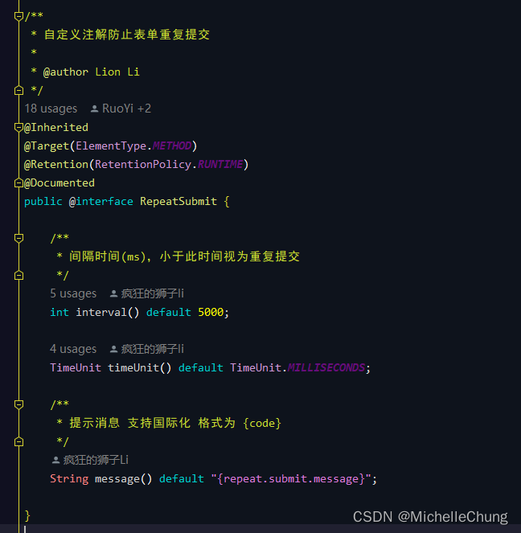
### 4、切面逻辑类：`RepeatSubmitAspect`
`com.ruoyi.framework.aspectj.RepeatSubmitAspect`<br>
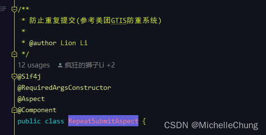

**注**：关于 AOP 的底层逻辑，可以参考之前我写的另外一个学习笔记专栏  [SpringBoot2 学习笔记](https://blog.csdn.net/michelle_zhong/category_11485196.html) ，里面有更详细的说明，因此这里不再展开。<br>
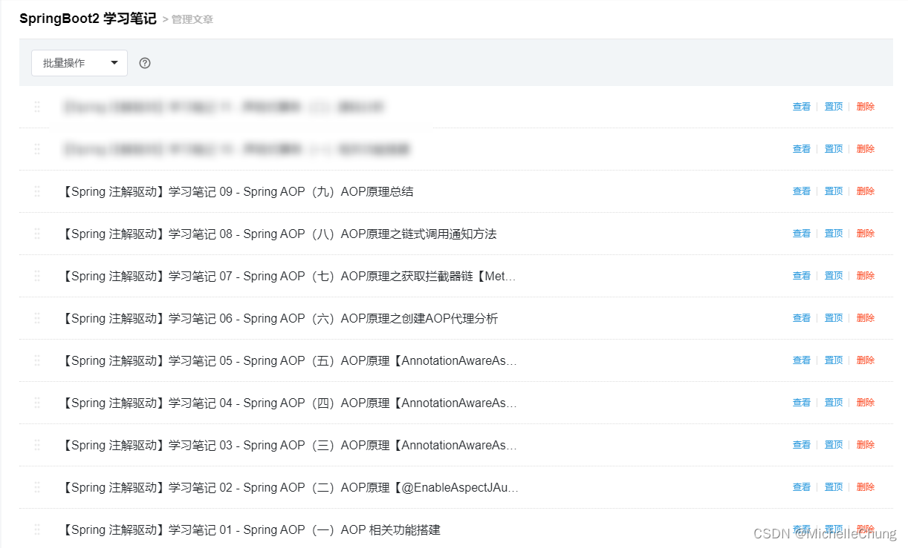
### 5、使用方式
使用方式很简单，也是在直接使用注解即可。也可以不设置参数，注解中都有设置默认值。<br>
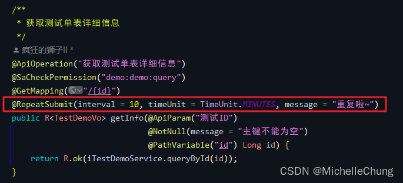
## 代码分析
### #0、流程简图
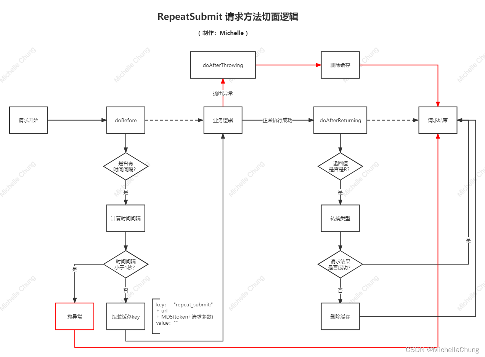

简单画了一下流程简图，逻辑不算复杂，看一下 `RepeatSubmitAspect` 也是可以看懂的。主要有以下三个方法：
- 请求之前执行的方法：`doBefore`
- 处理完请求后执行的方法：`doAfterReturning`
- 抛出异常处理的方法：`doAfterThrowing`

### #1、`doBefore`
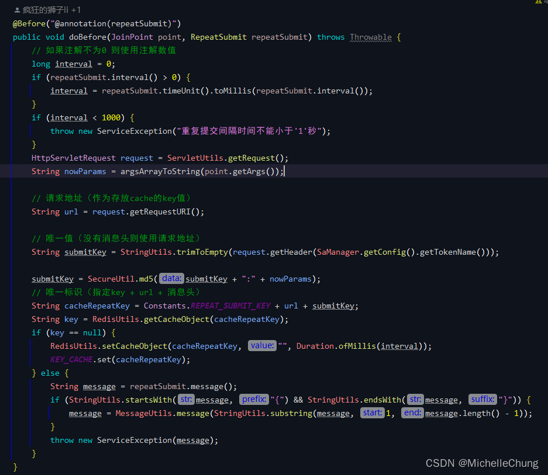

设置的注解参数：<br>
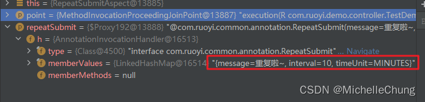

#### 步骤一：计算、判断时间间隔

如果设置了过期时间，则换算过期时间，且过期时间不能少于1秒，否则会抛出异常：<br>
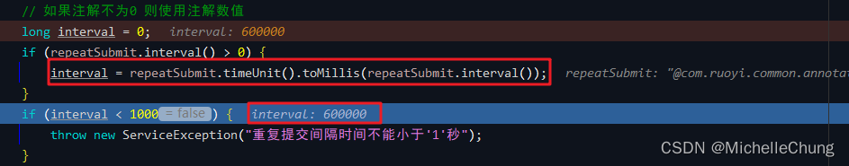

#### 步骤二：组装缓存的 key 值
key 的组成部分是：`指定key + url + MD5(消息头:请求参数)`

对所有参数进行拼装，并且判断是否需要过滤：<br>
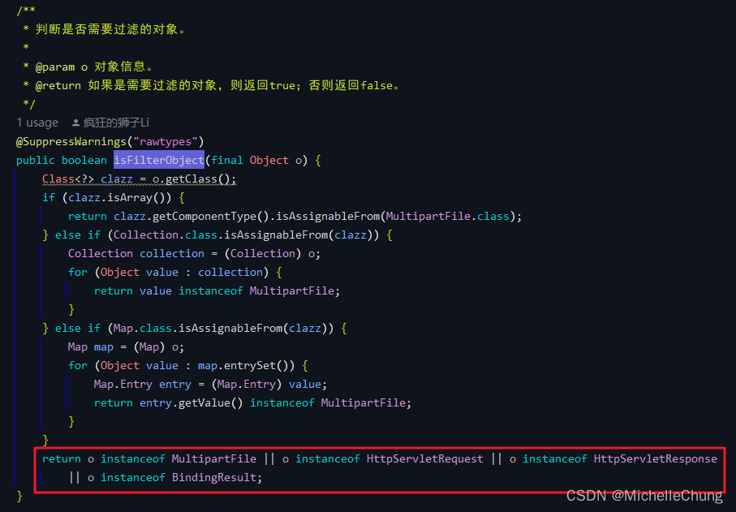

最终拼装结果：<br>
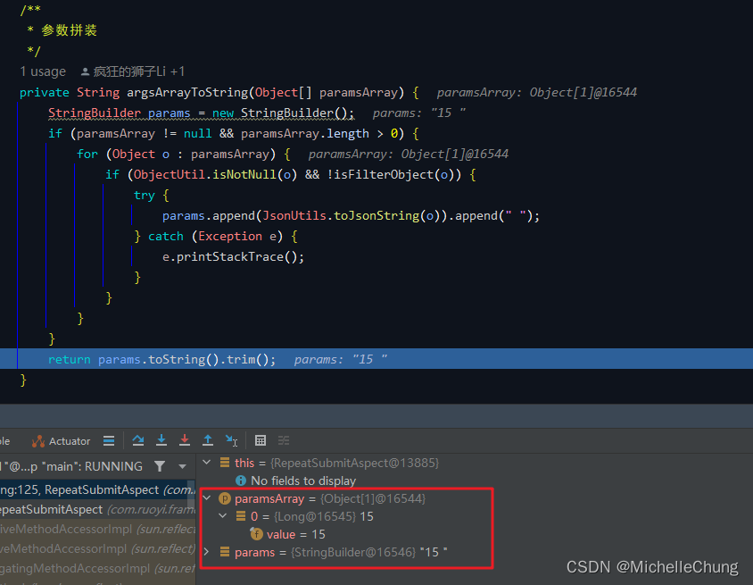

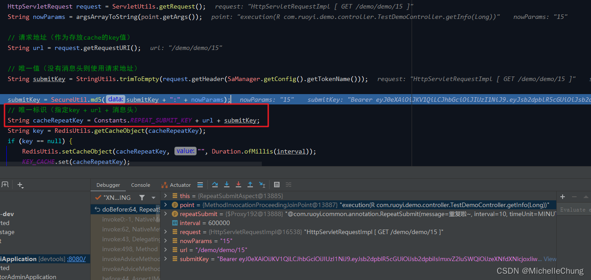

MD5 加密后进行拼装最终得到的 key 值：<br>
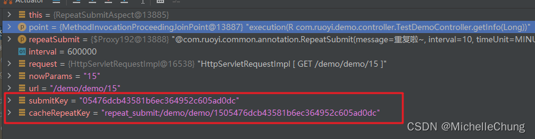
#### 步骤三：根据 key 判断缓存中是否有缓存对象
没有获取到对象说明是第一次访问，把当前 key-value 存入缓存中，并且把 key 值存入当前线程对象中，便于后面的方法进行获取。<br>
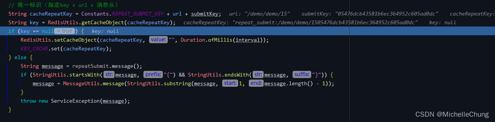

查看 Redis 缓存中的结果：<br>
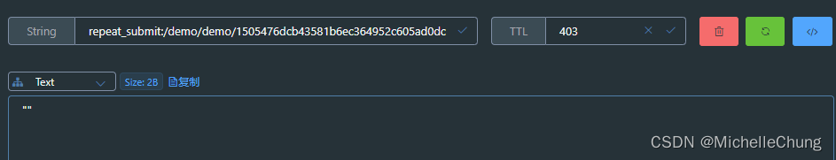

有获取到对象说明时间间隔还未结束，根据定义的信息抛出重复提交的异常。<br>
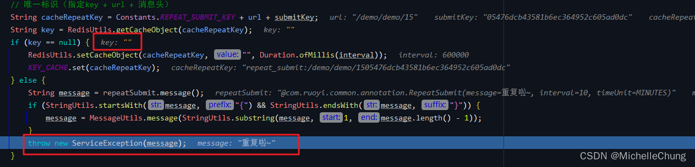
### #2、`doAfterReturning`
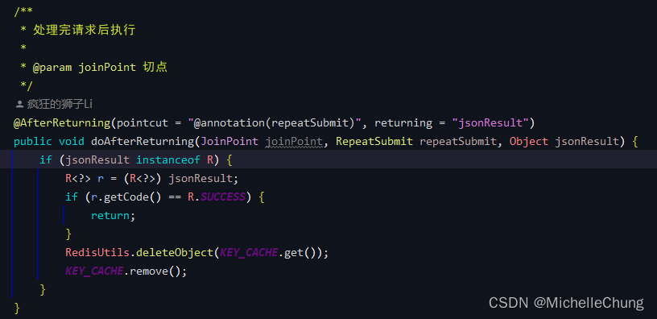

这一个方法的逻辑也比较简单。<br>

首先，先判断一下返回结果的类型，如果是 `R` 再进行转换。<br>

接着，判断返回是否成功，如果成功就直接返回，如果是有业务流程上的错误则删除缓存和线程中的对象。<br>
### #3、`doAfterThrowing`
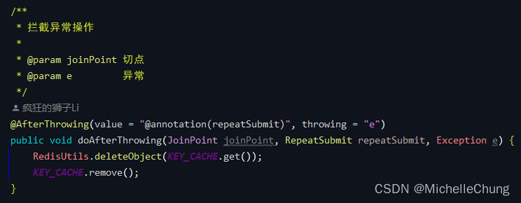

程序执行中捕获到抛出的异常，则直接删除缓存和线程中的对象。