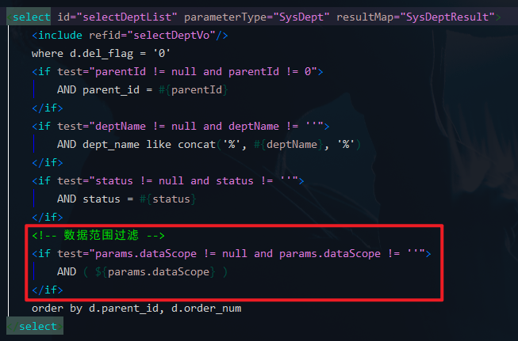
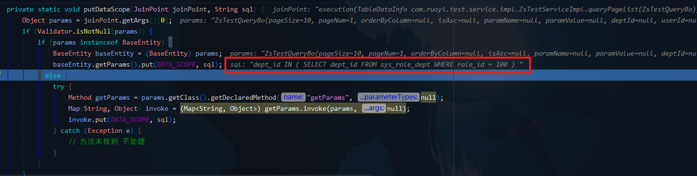

# 数据权限
- - -
## 一、概述
本文主要整理了若依框架中数据权限的功能实现，页面功能位于【系统管理 > 角色管理 > 数据权限】。


## 二、说明与举例
数据权限的使用在后台管理系统十分常见，一般情况而言，数据权限是 **配合角色进行使用** ，常用的数据权限划分包括部门以及用户个人。

数据权限和角色权限配合起来控制展示给用户的数据。如果分不清楚两个权限的区别，可以这样理解：<br>
**角色权限通常是控制菜单和按钮，即用户能够看到什么功能，做什么操作；数据权限则通常是根据用户本身的职务过滤后台返回的数据。**

举个例子，某个后台管理系统划分了三个模块以及每个模块分配了对应的角色（表1）：

| 系统模块   | 角色A  | 角色B  | 角色C  |
|--------|------|------|------|
| 人事模块   | 人事专员 | 人事经理 | 领导   |
| 业务模块   | 销售专员 | 销售经理 | 领导   |
 | 财务模块   | 财务专员 | 财务总监 | 领导   |

由上表，三个系统模块对应着三个部门，每个部门中角色B是部门负责人，角色C为统一领导人，因而此处赋予的角色数据权限如下（表2）：

| 系统模块   | 角色A     | 角色B     | 角色C    |
|--------|---------|---------|--------|
| 人事模块   | 本部门数据权限 | 本部门数据权限 | 全部数据权限 |
| 业务模块   | 本人数据权限  | 本部门数据权限 | 全部数据权限 |
| 财务模块   | 本部门数据权限 | 本部门数据权限 | 全部数据权限 |

*注 1：表 2 的数据权限不是固定的，可以根据真实业务进行灵活分配。为了理解简单起见，假设每个模块都只有一个列表数据，即每个部门都只有一个菜单和数据表。*

*注 2：这里只是简单举例，没有实际代码和表进行展示，后面的说明是从原理上进行说明，感兴趣的朋友可以根据上面的业务自行拓展练习。*

## 三、逻辑实现过程
- [若依官方文档关于数据权限的说明](https://doc.ruoyi.vip/ruoyi/document/htsc.html#%E6%95%B0%E6%8D%AE%E6%9D%83%E9%99%90)
- 本文使用的若依技术框架是扩展版本 [RuoYi-Vue-Plus](https://gitee.com/JavaLionLi/RuoYi-Vue-Plus) ，因为引入了Mybatis-plus， 对于模板生成也进行了修改，数据权限相关功能有所修改和扩展，下面的说明也主要是基于本框架进行说明。

#### 1、数据权限的使用
数据权限可以针对单表以及多表关联等不同维度进行，所以先从简单的单表进行说明。
##### 1.1、单表数据权限
若依使用了自定义注解 `@DataScope` 实现数据权限的功能。需要在对应的接口加上该注解，并在加入 Mybatis-plus 中 `.apply()` 方法对SQL进行注入即可实现数据的过滤。


这里需要特别强调的是，该框架对于数据权限功能进行了优化，因而对于官方文档中使用别名的情况是在多表中进行使用，单表只需要直接加上注解即可。

当然，如果想要在xml文件里面做单表的数据权限过滤也可以，参考 system 模块里面的 `selectDeptList` 查询部门管理数据接口。<br>



##### 1.2、多表数据权限
单表数据权限的实现一般是在相关数据库表中冗余了相关权限字段，例如部门id `dept_id`。而某些场景下需要多表关联进行数据权限的过滤。由于 Mybatis-plus 条件构造器目前不支持多表关联查询，因此需要在xml中进行数据权限的过滤。<br>


接口中的别名要与xml文件中定义的别名一致。<br>

#### 2、数据权限的实现
无论是单表还是多表数据权限，其核心部分都是SQL的组装，因此只需要了解SQL的组装过程，那么对于数据权限的实现应该也能了然于心了。<br>


对于数据权限的核心处理类是 `DataScopeAspect` 。<br>


<br>
*注 3：这里涉及到AOP相关的知识，如果不熟悉AOP的话建议先找来看下，篇幅所限，这里不再具体展开。*

`@Pointcut("@annotation(com.ruoyi.common.annotation.DataScope)")` 表示是通过注解实现切面。<br>

`@Before("dataScopePointCut()")` 代表在织入点方法执行前进行。

处理数据权限之前先清空相关参数，`putDataScope()`方法后面会细讲。<br>


若依数据权限的参数是 BaseEntity 中的 `private Map<String, Object> params = new HashMap<>();`，在上面的xml中也有`${params.dataScope}`的使用。

Map 中的 key 是 `dataScope` ，value是`拼接好的 SQL 语句`。<br>


参数清空后，处理数据权限。<br>


前面是获取注解的内容，判断当前用户是否需要过滤，一切准备就绪之后，终于到核心方法 `dataScopeFilter()` 。

```java

	... 省略部分代码 ...
	
	/**
	 * 数据范围过滤
	 *
	 * @param joinPoint 切点
	 * @param user      用户
	 * @param userAlias 别名
	 */
	public static void dataScopeFilter(JoinPoint joinPoint, SysUser user, String deptAlias, String userAlias, boolean isUser) {
		StringBuilder sqlString = new StringBuilder();

		// 将 "." 提取出,不写别名为单表查询,写别名为多表查询
		deptAlias = StrUtil.isNotBlank(deptAlias) ? deptAlias + "." : "";
		userAlias = StrUtil.isNotBlank(userAlias) ? userAlias + "." : "";

		for (SysRole role : user.getRoles()) {
			String dataScope = role.getDataScope();
			// 全部数据权限
			if (DATA_SCOPE_ALL.equals(dataScope)) {
				sqlString = new StringBuilder();
				break;
			} 
			// 自定数据权限
			else if (DATA_SCOPE_CUSTOM.equals(dataScope)) {
				sqlString.append(StrUtil.format(
					" OR {}dept_id IN ( SELECT dept_id FROM sys_role_dept WHERE role_id = {} ) ",
					deptAlias, role.getRoleId()));
			} 
			// 部门数据权限
			else if (DATA_SCOPE_DEPT.equals(dataScope)) {
				sqlString.append(StrUtil.format(" OR {}dept_id = {} ",
					deptAlias, user.getDeptId()));
			} 
			// 部门及以下数据权限
			else if (DATA_SCOPE_DEPT_AND_CHILD.equals(dataScope)) {
				sqlString.append(StrUtil.format(
					" OR {}dept_id IN ( SELECT dept_id FROM sys_dept WHERE dept_id = {} or find_in_set( {} , ancestors ) )",
					deptAlias, user.getDeptId(), user.getDeptId()));
			} 
			// 仅本人数据权限
			else if (DATA_SCOPE_SELF.equals(dataScope)) {
				if (isUser) {
					sqlString.append(StrUtil.format(" OR {}user_id = {} ",
						userAlias, user.getUserId()));
				} else {
					// 数据权限为仅本人且没有userAlias别名不查询任何数据
					sqlString.append(" OR 1=0 ");
				}
			}
		}

		if (StrUtil.isNotBlank(sqlString.toString())) {
			putDataScope(joinPoint, sqlString.substring(4));
		}
	}
	
	... 省略部分代码 ...

	private static void putDataScope(JoinPoint joinPoint, String sql) {
		// 获得切入点的参数
		Object params = joinPoint.getArgs()[0];
		if (Validator.isNotNull(params)) {
			// 判断参数是否属于 BaseEntity 或者其子类
			if (params instanceof BaseEntity) {
				BaseEntity baseEntity = (BaseEntity) params;
				// 将 SQL 放入 params 字段中
				baseEntity.getParams().put(DATA_SCOPE, sql);
			} 
			// 参数没有继承 BaseEntity
			else {
				try {
					// 反射获取参数中的 params 字段 getter 方法
					Method getParams = params.getClass().getDeclaredMethod("getParams", null);
					Map<String, Object> invoke = (Map<String, Object>) getParams.invoke(params, null);
					// 将 SQL 放入 params 字段中
					invoke.put(DATA_SCOPE, sql);
				} catch (Exception e) {
					// 方法未找到 不处理
				}
			}
		}
	}
```

这里代码看起来很长，所以断点会比较容易明白每个判断的内容是什么。

- 全部数据权限<br>
  
  该权限不做数据过滤，因此没有进行SQL拼接。页面返回所有的数据。<br>
  <br>
- 自定数据权限<br>
  <br>
  <br>
  <br>
  <br>
- <br>
  自定义数据权限实际上是自定义所能看到的部门，根据角色关联的部门过滤相关数据。<br>
  <br>
- 部门数据权限<br>
  <br>
  <br>
  <br>
  <br>
  <br>
  <br>

- 部门及以下数据权限

该权限与部门数据权限的区别在于用了 `find_in_set` 函数筛选部门。<br>
<br>

因为没有下属部门所以数据是一样的，但是SQL是不同的。<br>
<br>
- 仅本人数据权限

本人数据权限需要在注解加上`isUser = true`<br>
<br>
<br>
<br>
<br>

至此，5种数据权限都已经解析完了。

## 四、可能遇到的问题
#### 1、修改数据权限没有生效？
若依框架中修改数据权限不会清空用户数据缓存，因此需要重新登录新的数据权限才会生效。

#### 2、为什么需要 `sqlString.substring(4)` ?
<br>

框架中多个数据权限之间是用关键字 `OR` 来进行拼接的，如果没有 SQL 就会报错，当然只有一个权限时可能看不出来这个问题，所以最后合成的 SQL 需要去掉第一个 OR。