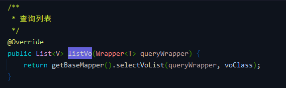
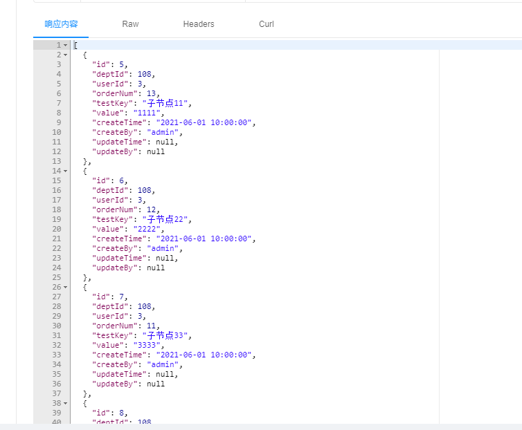

# 数据权限（一）数据权限调用流程分析（参照 Mybatis Plus 数据权限插件）
- - -
## 前言
之前写过一篇关于数据权限的文章【[【若依】开源框架学习笔记 06 - 数据权限](/ruoyi-vue-plus/data-permission/00_permission.md) 】，在原版若依和 3.4.0 及其以下版本的 RuoYi-Vue-Plus 中使用的都是基于切面方式实现的数据权限功能。

在 RuoYi-Vue-Plus 3.5.0 中，[狮子大佬](https://blog.csdn.net/weixin_40461281) 重写了数据权限的实现。

对于新的数据权限的使用方法也在框架wiki中有说明，所以本文只是在此基础上做简单的分析，仅作为学习之用，如有错误也请大佬们指出。

## 参考目录
- [框架 wiki - 数据权限](https://gitee.com/JavaLionLi/RuoYi-Vue-Plus/wikis/%E6%A1%86%E6%9E%B6%E5%8A%9F%E8%83%BD/%E6%95%B0%E6%8D%AE%E6%9D%83%E9%99%90)
- [Mybatis Plus 文档 - 数据权限](https://baomidou.com/pages/1864e1/#%E6%95%B0%E6%8D%AE%E8%8C%83%E5%9B%B4-%E6%95%B0%E6%8D%AE%E6%9D%83%E9%99%90)

框架中没有直接使用 Mybatis Plus 原生的数据权限插件，但是从写法来看应该对此有所借鉴，所以也可以参考一下 Mybatis Plus 的数据权限插件源码实现自己的数据权限功能。

## 代码分析

> 框架wiki中关于数据权限的简单说明： 

### 1、数据权限配置 `MybatisPlusConfig`
 
在 `MybatisPlusInterceptor` 拦截器中加入了自定义的数据权限拦截器组件 `PlusDataPermissionInterceptor`。

### 2、数据权限拦截器 `PlusDataPermissionInterceptor`

数据权限拦截器继承了 `JsqlParserSupport` Jsql 解析器，实现了 `InnerInterceptor` 拦截器接口： 
- `beforeQuery` ：`Executor.query ` 操作前置处理 - `InnerInterceptor`
  
- `beforePrepare` ：`StatementHandler.prepare` 操作前置处理 - `InnerInterceptor`
  
- `processSelect` ：处理查询 - `JsqlParserSupport`
- `processUpdate` ：处理更新 - `JsqlParserSupport`
- `processDelete` ：处理删除 - `JsqlParserSupport`
  

在 Mybatis Plus 数据权限插件源码中，也有类似的拦截器 `DataPermissionInterceptor`。不过只重写了两个方法 `beforeQuery` 和 `processSelect`。 

### 3、数据权限处理器 `PlusDataPermissionHandler`
在拦截器处理查询的方法中有调用 `setWhere` 方法进行 SQL 语句 Where 条件的设置。主要的逻辑就是调用处理器获取 SQL 的方法 `getSqlSegment`。

`PlusDataPermissionHandler#getSqlSegment` 

当然这个方法也是根据框架进行了扩展，源码中只是一个简单的接口。 

## 方法调用流程
### 1、测试方法
`TestDemoController#list()` 

这是一个新增的方法，原来 Demo 中有一个加上了分页的测试方法，这里暂时排除分页进行测试。

`TestDemoServiceImpl#queryList()` 

`buildQueryWrapper` 是根据请求参数构建条件构造器，测试方法中不传参数，则会查询全部数据。

`ServicePlusImpl#listVo()` 

`ServicePlusImpl` 是封装的通用实现类。

`BaseMapperPlus#selectVoList()` 

`this.selectList(wrapper)` 就是调用对应的 Mapper 的查询列表方法。

`TestDemoMapper#selectList` 

这里是对原生方法的重写，加入了自定义数据权限注解 `@DataPermission` 以及 `@DataColumn`。

如果 SQL 是自定义方法也是在对应方法上加上注解即可。 

### 2、超级管理员测试
#### 2.1、`beforeQuery()`
###### `PlusDataPermissionInterceptor#beforeQuery()`

首先判断忽略注解。 
`InterceptorIgnoreHelper#willIgnoreDataPermission()` 

`InterceptorIgnoreHelper#willIgnore()` 

结果为 `false`。

回到 `beforeQuery` 中，继续判断注解是否有效。 

`PlusDataPermissionHandler#isInvalid()` 

结果为 `false`。

最终得到 SQL 语句。 

SQL 解析器 `JsqlParserSupport#parserSingle` 

执行SQL解析。
###### `JsqlParserSupport#processParser()`

调用处理查询的方法。
###### `PlusDataPermissionInterceptor#processSelect()`

设置 Where 条件。 
`PlusDataPermissionInterceptor#setWhere()` 

###### `PlusDataPermissionHandler#getSqlSegment()`
根据注解以及权限获取 SQL 片段。 
 
- 1、通过方法 `findAnnotation(mappedStatementId)` 获取到注解内容。 
  `PlusDataPermissionHandler#findAnnotation()` 
  首先从 dataPermissionCacheMap 中获取，没有则通过 `AnnotationUtil.getAnnotation()` 方法获取，并存到 dataPermissionCacheMap 中。 
   
  然后返回得到的注解内容。

- 2、获取当前用户并判断权限。 
  首先通过 `DataPermissionHelper.getVariable("user")` 方法获取用户信息，如果没有，则通过查询数据库获取，并把用户信息通过 `DataPermissionHelper` 存到上下文中。 
   
   
   
  此处为超级管理员直接返回 where 语句。 
  

至此完成了 `beforeQuery()` 整个方法的流程。

#### 2.2、`beforePrepare()`

#### 2.3、执行输出
 

### 3、非超级管理员测试

**注：非超级管理员测试的流程和超级管理员基本相同，下面只分析不同的部分（主要是在where条件的获取不一样），如果有不了解的地方可以多 Debug。**

`PlusDataPermissionHandler#getSqlSegment()` 

非超级管理员用户，通过 `buildDataFilter()` 方法构造 SQL 查询条件。
#### 3.1、`buildDataFilter()`
###### `PlusDataPermissionHandler#buildDataFilter()`

- 1、获取拼接字符
  
- 2、从 `DataPermissionHelper` 获取用户信息并保存到上下文中。
  
- 3、获取用户角色信息并循环进行操作
   
  获取用户角色权限泛型。 
   
  循环数据权限注解信息并操作。 
   
  `@sdss.getDeptAndChild` 对应的是方法 `SysDataScopeServiceImpl#getDeptAndChild()`。 
   
   
  该方法获取用户权限部门id。解析得到 SQL 语句。 
   
- 4、处理 SQL 并返回
   
  此处需要截掉 OR 是因为只有一个条件时不需要 OR，否则 SQL 就变成了 `where OR ...`。

SQL 查询条件构造完成，返回 `PlusDataPermissionHandler#getSqlSegment()` 方法。 

由上面可得到最终的 SQL 语句查询条件。其余流程和上面超级管理员基本一致。

#### 3.2、执行输出

