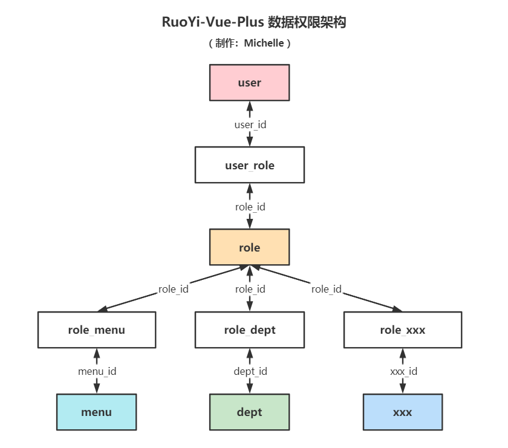
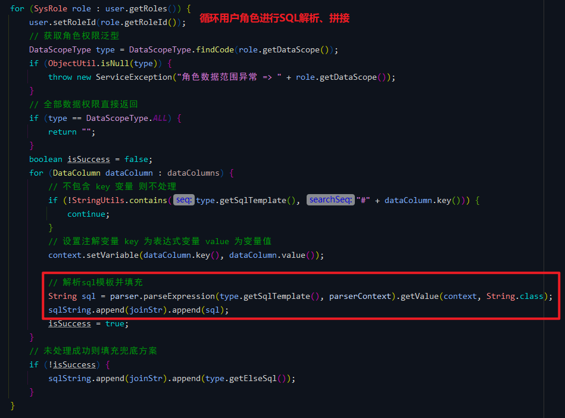
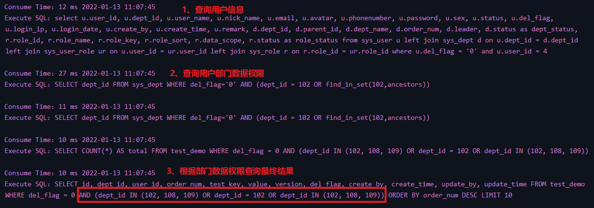
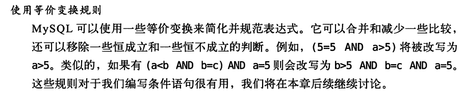
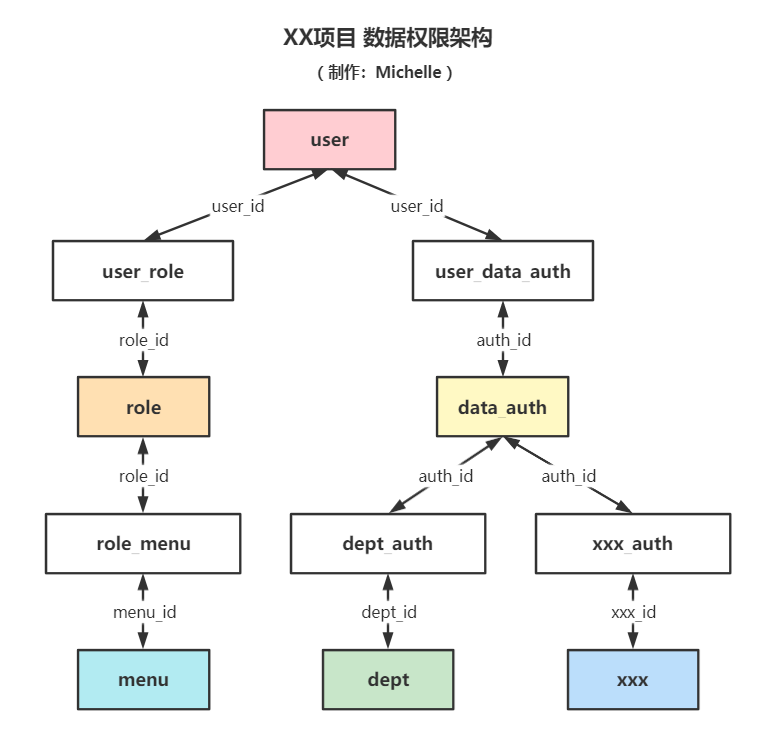

# 数据权限（二）关于权限架构的一些想法
- - -

## 前言
关于数据权限这块，前面写过的两篇文章已经大致分析过了，这篇文章的目的主要是记录一下对于这一块设计的一些个人的想法。

之所以有这样的想法，主要是因为之前做过的一个项目拥有十分复杂的业务数据权限，通过那个项目我也学习到不少的东西，在学习框架【RuoYi-Vue-Plus】的时候，我也比较了一下两者之间的区别，当然我不敢妄下断言孰优孰劣，所以这里只是作为简单的分享。

## 数据权限架构分析
### RuoYi-Vue-Plus 数据权限架构
（为了便于阅读，去掉了表前缀 "sys_"） 

如图，`role_xxx` 代表自定义新增数据权限，这个根据项目实际去定义，框架考虑通用性，一般的后台管理系统的权限依照目前的权限架构可以满足使用要求。

在框架中的数据权限虽然在代码层面重写了数据权限的实现，但是表结构还是和若依是一样的，即：**用户对应角色，角色对应权限**。

- 用户与角色关系为一对多，一个用户可选多个角色。
- 角色与菜单权限为一对多，一个角色可选多个菜单。
- 角色与其他数据权限为一对一，例如部门数据权限，角色【部长】对应部门数据权限为【部门及以下】。

在根据数据权限进行查询时，就会根据用户的角色拼接不同的数据权限进行查询。 

这里只是作为参考，之所以会出现重复是因为，我勾选的角色对应的部门数据权限所关联的部门是父子级别。

可能这里会和我一样有疑问的是，这样拼接重复会不会影响SQL执行的性能？ 
答案是 **不会**。

我去群里问了一下狮子大佬，得到的答复是：

> 这种在解析的时候就会优化掉。

后面我去找了一下相关的资料：

> 《高性能MySQL（第三版）》6.4.3 查询优化处理：

由此，这个拼接是可以的。当然就是在控制台看起来不太美观哈哈哈。

### XX项目 数据权限架构
（为了便于阅读，去掉了表前缀） 

如图，`xxx_auth` 代表自定义新增数据权限，这个根据项目实际去定义，之前的项目中数据权限一共有6种（或者说是6个维度），这里就不一一列举了。

这里面最大的不同是 **把菜单权限和其他数据权限做了区分，所有的权限对应是用户**。

- 用户与角色关系是一对多，一个用户可选多个角色。
- 角色只对应菜单权限，关系为一对多，主要是左侧菜单以及具体的操作按钮。
- 用户其他数据权限单独用数据权限作为对应。
- 用户与数据权限关系一对多，一个用户可以多个数据权限。

当时项目中采用的查询方式也不太一样，但效果和现在一样，是把权限过滤传入 SQL 中，具体代码就不贴出来了。

值得一提的是，有一个不同的地方：

|      | RuoYi-Vue-Plus (V3.5.0)                 | XX项目                                                          | 
|------|-----------------------------------------|---------------------------------------------------------------|
| 使用方式 | 在每次查询的时候，根据权限类型 `DataScopeType` 查出来再拼接。 | 在登录时先查出用户所有相关权限，然后存到缓存中，查询的时候直接从缓存中取出需要用到的数据权限。如果缓存没有，再查询数据库。 |

这里是我的理解，如果错误的话请大佬们在评论指出。