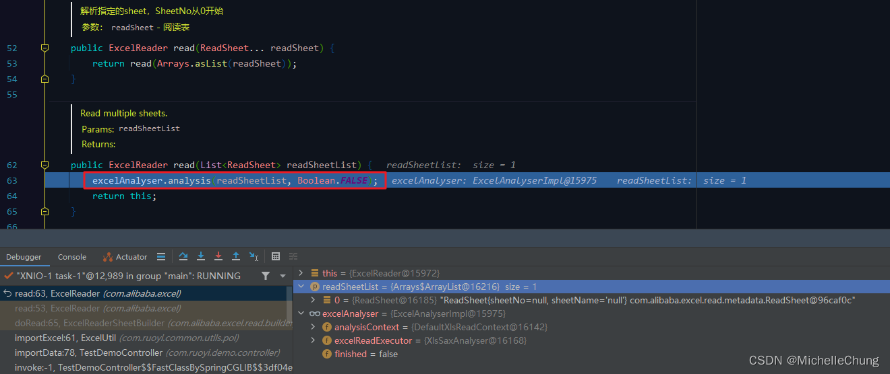
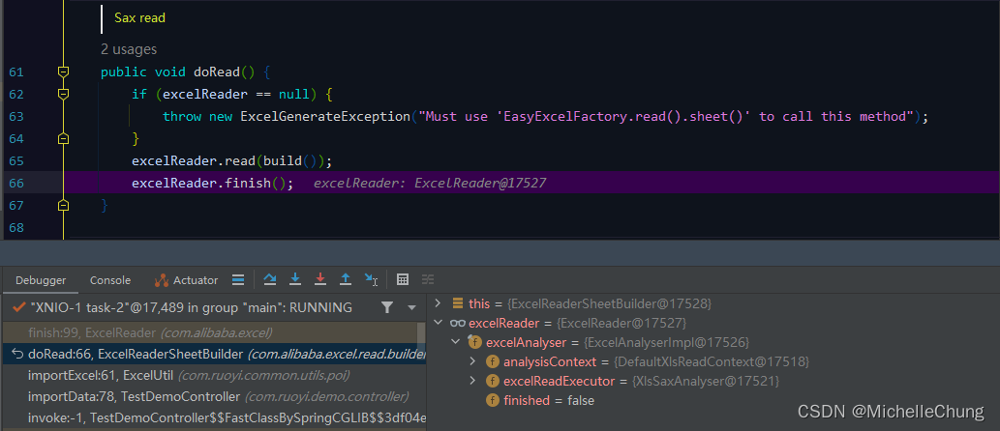

# Easy Excel（一）Excel 2003（*.xls）导入流程分析

## 前言
因为分析 Validator 校验器而给自己挖坑说要分析 Easy Excel 导入流程，今天终于要来填坑了。

因为内容比较多，所以分成了 `Excel 2003（*.xls）` 以及 `Excel 2007（*.xlsx）` 两种类型分析，并且分开两篇来讲，这篇先从 xls 下手。

## 参考目录
- [Easy Excel 官方文档](https://easyexcel.opensource.alibaba.com/docs/current/)

## 框架集成
### 1、Maven
总工程 `pom.xml`， Easy Excel 版本 `V3.1.1`，poi 版本 `V5.2.2` 

框架这里自行引入了 poi，可以参考 [官网描述](https://easyexcel.opensource.alibaba.com/qa/#%E5%85%B3%E4%BA%8E%E7%89%88%E6%9C%AC%E9%80%89%E6%8B%A9) 修改： 

### 2、框架集成公共部分
### 2.1、Excel 操作工具类 `ExcelUtil`
框架封装了工具类 `ExcelUtil`，可以直接进行调用。 

### 2.2、导入监听接口 `ExcelListener`

### 2.3、默认监听器 `DefaultExcelListener`

### 2.3.1、数据处理方法 `DefaultExcelListener#invoke`

此处只校验 `ImportGroup` 分组。

### 2.3.2、异常处理方法 `DefaultExcelListener#onException`

### 2.4、Excel 结果接口 `ExcelResult`

### 2.5、默认 Excel 结果对象 `DefautExcelResult`

### 2.5.1、导入结果 `DefautExcelResult#getAnalysis`

### 3、导入测试方法
### 3.1、导入测试接口 `TestDemoController#importData`

### 3.2、导入对象 `TestDemoImportVo`

导入数据： 

先说明一下调用分析流程：

1. 调用总共分两次，用到的数据是上图（**同样的文件，同样的内容**）。
2. 第一次是正常的调用分析，即不进行数据校验（会把相关字段注解注释），目的是先理顺请求流程。
3. 第二次是有异常的调用分析，即校验有标注组信息 `groups = {ImportGroup.class}` 的属性字段，其他默认分组不进行校验。

### 4、接口测试
### 4.1、导入成功

### 4.2、导入存在异常

## 执行流程分析
### 1、流程简图（非常重要）
为了便于理解和对比，所以我把两种类型文件的导入流程画在了一张图里面，**很多流程是相同的，不同的地方用不同的颜色进行了区分**，但是为了简洁和突出重点，并不是每一层都详细列了出来（中间省略了一些不太重要的深入调用，在下面 Debug 分析里面会把截图放出来）。 

**温馨提醒，由于流程步骤较多，结合这张图走不容易迷路。**

之前每次画图都可能需要 Debug 好几次才能把所有流程记录下来，不过这次想分享一个小技巧，但 **注意不是所有方法都适用**。

在分析异常报错时，抛出的异常如下图： 

由下往上就是所有的调用流程。

好了，废话不多说，下面进入正题。
### 2、（#1）`TestDemoController#importData`

### 3、（#2）`ExcelUtil#importExcel`

### 4、（#4）阅读器生成器 `EasyExcelFactory#read`

### 5、（#5）工作表 `ExcelReaderBuilder#sheet`

### 6、（#6）`ExcelReaderBuilder#build`

### 7、（#7）`ExcelReader#ExcelReader`

`ExcelAnalyserImpl#ExcelAnalyserImpl` 

### 8、（#8）根据类型选择执行器 `ExcelAnalyserImpl#choiceExcelExecutor`

### 8.1、获取 Excel 文件类型
`ExcelTypeEnum#valueOf` 

`ExcelTypeEnum#recognitionExcelType` 

得到文件类型为 `xls`，回到主方法 `ExcelAnalyserImpl#choiceExcelExecutor` 继续执行。 

工作表 `ExcelReaderSheetBuilder` 构建完成： 

### 9、（#9）读操作 `ExcelReaderSheetBuilder#doRead`

### 10、（#10）读取工作表 `ExcelReader#read`

### 11、（#11）解析 `ExcelAnalyserImpl#analysis`

在前面步骤 `#9` 已经通过文件类型确定了是 xls 解析器。
### 12、（03#1）xls 解析 `XlsSaxAnalyser#execute`

### 13、（03#2）处理工作表事件 `HSSFEventFactory#processWorkbookEvents`

`HSSFEventFactory#processEvents` 

### 14、循环解析
`HSSFEventFactory#genericProcessEvents` 

**注：此方法是循环工作表中的数据，因为循环很多，所以我只截取其中两次（表头、行数据）来进行说明。**

`HSSFRequest#processRecord` 

`FormatTrackingHSSFListener#processRecord` 

`MissingRecordAwareHSSFListener#processRecord` 

### 15、（03#3）处理工作表数据记录 `XlsSaxAnalyser#processRecord`

`BofRecordHandler#processRecord` 

这里是第一次循环处理完毕返回。

当所有表头解析完成之后，会调用 `DummyRecordHandler#processRecord`。

### 16、（03#4）处理工作表数据记录 `DummyRecordHandler#processRecord`

### 17、（#12）结束行 `DefaultAnalysisEventProcessor#endRow`

### 18、（#13）数据处理 `DefaultAnalysisEventProcessor#dealData`
### 18.1、构造表头

`DefaultAnalysisEventProcessor#buildHead` 

`ModelBuildEventListener#invokeHead` 

### 18.2、（#14）行数据处理 `DefaultExcelListener#invoke`
`DefaultAnalysisEventProcessor#dealData` 

`DefaultExcelListener#invoke` 

### 19、（#14）校验异常 `ValidatorUtils#validate`
在前一个步骤中如果校验不通过，则会抛出异常 `ConstraintViolationException` 

### 20、（#15）捕获异常 `DefaultAnalysisEventProcessor#dealData`

### 21、（#16）自定义异常处理 `onException`

`DefaultAnalysisEventProcessor#onException` 

`DefaultExcelListener#onException` 

### 22、解析完成（循环结束）
`HSSFEventFactory#genericProcessEvents` 

### 23、（#17）完成读取
`ExcelReaderSheetBuilder#doRead` 

`ExcelReader#finish` 

`ExcelAnalyserImpl#finish` 

### 24、（#18）返回结果

### 25、完成读取（有异常信息）
`ExcelUtil#importExcel` 

控制台只输出了校验通过的结果列表 

返回自定义信息（抛出异常）`DefautExcelResult#getAnalysis` 

控制台错误信息 

至此所有流程解析完毕。