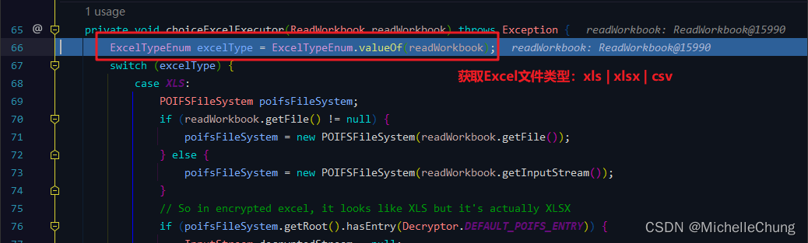
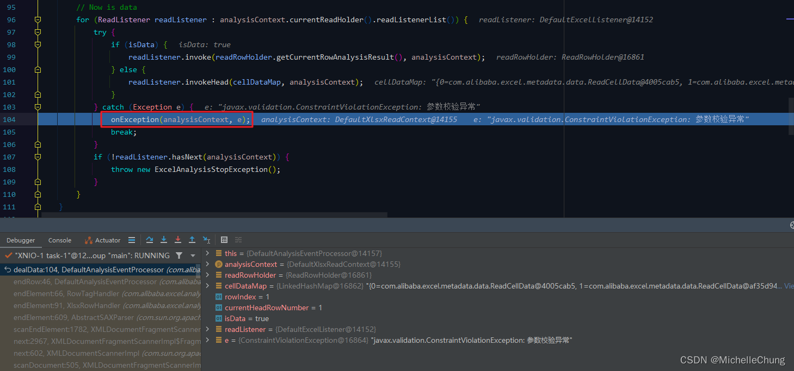
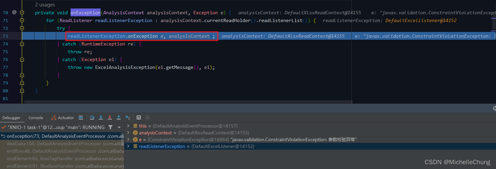
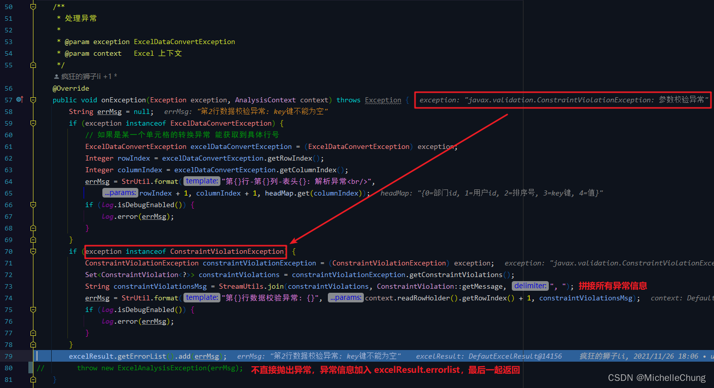
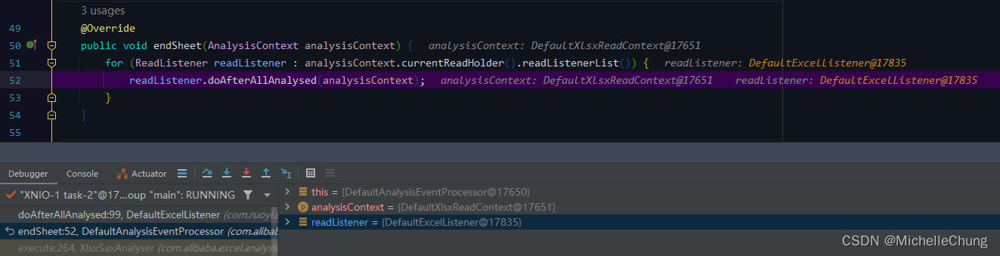
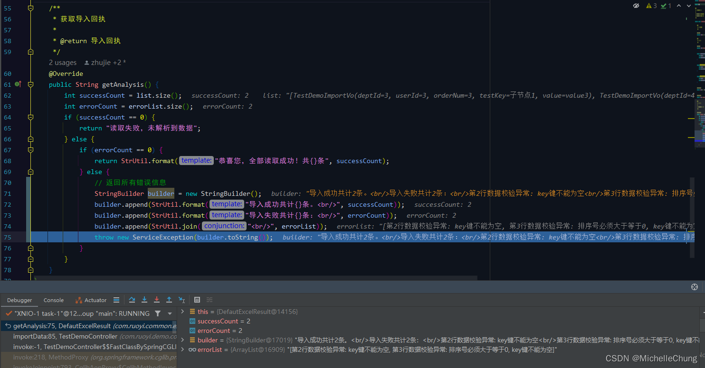

# Easy Excel（二）Excel 2007（*.xlsx）导入流程分析
- - -
## 前言
[上一篇博客](/ruoyi-vue-plus/easyexcel/01_import_2003.md) 写了 `Excel 2003（*.xls）` 文件的导入，这篇是 `Excel 2007（*.xlsx）`，虽然有一些流程是重复的，但还是会一步步列举出来。

## 参考目录
- [Easy Excel 官方文档](https://easyexcel.opensource.alibaba.com/docs/current/)

## 框架集成
**这一部分和上一篇博客是一样的，可以跳过直接看流程。**
### 1、Maven
总工程 `pom.xml`， Easy Excel 版本 `V3.1.1`，poi 版本 `V5.2.2`


框架这里自行引入了 poi，可以参考 [官网描述](https://easyexcel.opensource.alibaba.com/qa/#%E5%85%B3%E4%BA%8E%E7%89%88%E6%9C%AC%E9%80%89%E6%8B%A9) 修改：

### 2、框架集成公共部分
### 2.1、Excel 操作工具类 `ExcelUtil`
框架封装了工具类 `ExcelUtil`，可以直接进行调用。<br>

### 2.2、导入监听接口 `ExcelListener`

### 2.3、默认监听器 `DefaultExcelListener`

### 2.3.1、数据处理方法 `DefaultExcelListener#invoke`


此处只校验 `ImportGroup` 分组。

### 2.3.2、异常处理方法 `DefaultExcelListener#onException`

### 2.4、Excel 结果接口 `ExcelResult`

### 2.5、默认 Excel 结果对象 `DefautExcelResult`

### 2.5.1、导入结果 `DefautExcelResult#getAnalysis`

### 3、导入测试方法
### 3.1、导入测试接口 `TestDemoController#importData`

### 3.2、导入对象 `TestDemoImportVo`


导入数据：<br>


先说明一下调用分析流程：

1. 调用总共分两次，用到的数据是上图（**同样的文件，同样的内容**）。
2. 第一次是正常的调用分析，即不进行数据校验（会把相关字段注解注释），目的是先理顺请求流程。
3. 第二次是有异常的调用分析，即校验有标注组信息 `groups = {ImportGroup.class}` 的属性字段，其他默认分组不进行校验。

### 4、接口测试
### 4.1、导入成功


### 4.2、导入存在异常

## 执行流程分析
### 1、流程简图（非常重要）
为了便于理解和对比，所以我把两种类型文件的导入流程画在了一张图里面，**很多流程是相同的，不同的地方用不同的颜色进行了区分**，但是为了简洁和突出重点，并不是每一层都详细列了出来（中间省略了一些不太重要的深入调用，在下面 Debug 分析里面会把截图放出来）。<br>


**温馨提醒，由于流程步骤较多，结合这张图走不容易迷路。**

### 2、（#1）`TestDemoController#importData`

### 3、（#2）`ExcelUtil#importExcel`

### 4、（#4）阅读器生成器 `EasyExcelFactory#read`

### 5、（#5）工作表 `ExcelReaderBuilder#sheet`

### 6、（#6）`ExcelReaderBuilder#build`

### 7、（#7）`ExcelReader#ExcelReader`


`ExcelAnalyserImpl#ExcelAnalyserImpl`<br>

### 8、（#8）根据类型选择执行器 `ExcelAnalyserImpl#choiceExcelExecutor`

### 8.1、获取 Excel 文件类型
`ExcelTypeEnum#valueOf`<br>


由上图，Easy Excel 底层是根据魔数（Magic Number）确定文件类型。搜索一下 xlsx 文件的魔数：


插一个热知识：Java `*.class` 文件的魔数是 `cafe babe`。

其他类型文件魔数请参考以下网站：
```bash
https://www.garykessler.net/library/file_sigs.html
```

得到文件类型为 `xlsx`，回到主方法 `ExcelAnalyserImpl#choiceExcelExecutor` 继续执行。<br>


工作表 `ExcelReaderSheetBuilder` 构建完成：<br>

### 9、（#9）读操作 `ExcelReaderSheetBuilder#doRead`

### 10、（#10）读取工作表 `ExcelReader#read`

### 11、（#11）解析 `ExcelAnalyserImpl#analysis`


在前面步骤 `#9` 已经通过文件类型确定了是 xlsx 解析器。
### 12、（07#1）xlsx 解析 `XlsxSaxAnalyser#execute`


当前文件只有工作表 `sheet1` 有数据。<br>

### 13、（07#2）解析 xml 源 `XlsxSaxAnalyser#parseXmlSource`


`JAXPSAXParser#parse`<br>


### 14、（07#3）解析 xml 源 `AbstractSAXParser#parse`


`XMLParser#parse`<br>


### 15、（07#4）解析输入源 `XML11Configuration#parse`


### 16、（07#5）文档扫描 `XMLDocumentFragmentScannerImpl#scanDocument`


`do...while` 循环里面也有 `next()` 方法：<br>

### 16.1、`XMLDocumentFragmentScannerImpl.Driver#next`
`next()` 方法根据不同的事件有不同的实现类：<br>


`XMLDocumentScannerImpl#next`<br>


举几个例子（不同事件的 `next()` 实现方法）：

`XMLDeclDriver#next`<br>


`PrologDriver#next`<br>


还有结束行调用的 `FragmentContentDriver#next`。
### 17、（07#6）结束行 `FragmentContentDriver#next`


`XMLDocumentFragmentScannerImpl#scanEndElement`<br>


`AbstractSAXParser#endElement`<br>

### 18、（07#7）`XlsxRowHandler#endElement`


`XlsxRowHandler#endElement`


### 19、（07#8）`RowTagHandler#endElement`

### 20、（#12）结束行 `DefaultAnalysisEventProcessor#endRow`

### 21、（#13）数据处理 `DefaultAnalysisEventProcessor#dealData`
### 21.1、构造表头


`DefaultAnalysisEventProcessor#buildHead`<br>


`DefaultAnalysisEventProcessor#dealData`<br>


`ModelBuildEventListener#invokeHead`<br>

### 21.2、（#14）行数据解析
`DefaultAnalysisEventProcessor#dealData`<br>


`DefaultExcelListener#invoke`<br>

### 22、（#14）校验异常 `ValidatorUtils#validate`
在前一个步骤中如果校验不通过，则会抛出异常 `ConstraintViolationException`<br>

### 23、（#15）捕获异常 `DefaultAnalysisEventProcessor#dealData`

### 24、（#16）自定义异常处理 `onException`


`DefaultAnalysisEventProcessor#onException`<br>


`DefaultExcelListener#onException`<br>



### 25、解析完成（循环结束）
`XlsxSaxAnalyser#execute`<br>


`DefaultAnalysisEventProcessor#endSheet`<br>


`DefaultExcelListener#doAfterAllAnalysed`<br>


### 26、（#17）完成读取
`ExcelReaderSheetBuilder#doRead`<br>


`ExcelReader#finish`<br>


`ExcelAnalyserImpl#finish`<br>


### 27、（#18）返回结果

### 28、完成读取（有异常信息）
`ExcelUtil#importExcel`<br>


控制台只输出了校验通过的结果列表：<br>


返回自定义信息（抛出异常）`DefautExcelResult#getAnalysis`<br>


控制台错误信息：<br>


至此所有流程解析完毕。