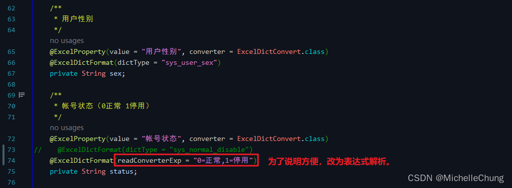
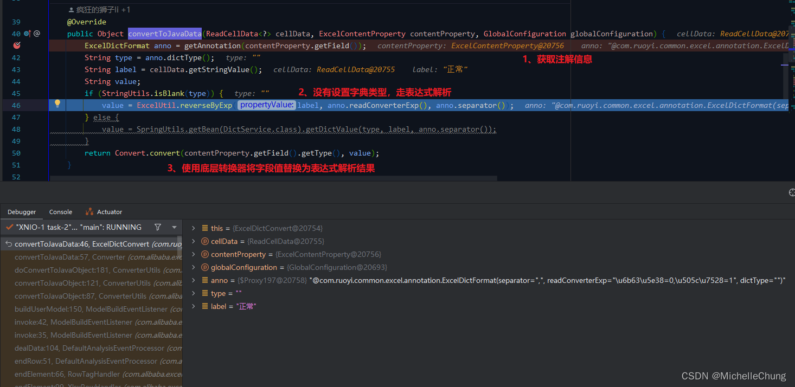

# Easy Excel（三）自定义转换器 ExcelDictConvert 源码分析
- - -
## 前言
在前两天测试新的 Easy Excel 自定义转换器 `ExcelEnumConvert` 时才发现之前没有分析过这一部分的功能，所以本篇来介绍一下框架中另外一个比较有代表性的自定义转换器 `ExcelDictConvert`。

自定义转换器在实际应用中也比较常见。举个栗子，某些字段值在数据库中使用诸如 `0`，`1`，`2` 这样的枚举值进行存储，而在 Excel 导入导出功能中，则需要对这些特定的字段进行转换，这时就需要使用自定义转换器进行转换，解析出所需要的值。

下面本文就以导入导出为例对这一功能进行说明，其他的自定义转换器也是类似的实现方式，感兴趣的朋友可以自行研究。

## 参考目录
- [Easy Excel 官方文档 - 自定义转换器](https://easyexcel.opensource.alibaba.com/docs/current/quickstart/read#%E8%87%AA%E5%AE%9A%E4%B9%89%E8%BD%AC%E6%8D%A2%E5%99%A8)

## 框架集成
### 1、Maven
- 框架分支：`5.X`
  （注：在框架 `4.X` （`dev`）分支也有该功能，只是文件目录不同）
-  Easy Excel 版本：`V3.2.0`
- poi 版本：`V5.2.3`

### 2、框架集成模块 `ruoyi-common-excel`
由于在框架 `5.X` 分支中对框架目录进行了重构，所以与 Excel 相关的功能被单独抽成了一个公共模块，方便使用。

关于本文自定义转换器功能所涉及的类分别是：
- 核心实现类 `ExcelDictConvert`
- 注解类 `ExcelDictFormat`
- 工具类 `ExcelUtil`

### 2.1、自定义转换器 `ExcelDictConvert`

实现字典值转换功能的核心类，实现了 Easy Excel 的 `com.alibaba.excel.converters.Converter` 接口。

按照官方文档，要实现自定义转换器的功能很简单，只需要实现 `Converter` 接口并实现指定类即可。

`com.alibaba.excel.converters.Converter`

由上图源码，右侧黄色背景的类都是 Easy Excel 已经实现的转换器，都是常见类型的转换器。

需要实现的方法如下：

`com.alibaba.excel.converters.Converter#convertToJavaData` 

`com.alibaba.excel.converters.Converter#convertToExcelData` 

框架中的实现方法如下：

### 2.2、自定义转换器注解 `ExcelDictFormat`

通过在对象字段上标注该注解实现转换功能，框架中定义了两种解析方式：`字典类型解析` 以及 `表达式解析`，后者可以自定义分隔符。

### 2.3、Excel 工具类 `ExcelUtil`
在之前的导入分析文章中也有涉及到这个类，这个类封装了常用的 Excel 处理方法，本文涉及到的方法有两个：`convertByExp` 以及 `reverseByExp`。这两个方法逻辑类似，理解了其中一个，另一个也能够理解。

`ExcelUtil#convertByExp` 

`ExcelUtil#reverseByExp` 

### 3、测试方法
### 3.1、用户导入
`SysUserController#importData` 

`SysUserImportVo` 

### 3.2、用户导出
`SysUserController#export` 

`SysUserExportVo` 

### 3.3、测试调用流程说明
本文的测试流程如下：

1. 由于转换器的实现方法分别对应 `读 Excel` （导入）和 `写 Excel`（导出），所以分两次进行调用。
2. 调用导出方法。
3. 使用导出方法得到的 Excel 表格结果进行修改后，调用导入方法。
4. 为了更好地说明不同的解析方法，所以对于相关转换字段的导入导出方法都进行了分析。
5. 导入导出方法的转换功能差异不大，所以只要理解了一个，另一个也能够理解。

## 执行流程分析
本文的分析重点集中在实现方法的核心类，对于中间的调用流程不会展开详细说明。

### 1、用户导出流程分析

`SysUserController#export` 

`ExcelUtil#exportExcel` 

`ExcelUtil#exportExcel` 

`ExcelWriterSheetBuilder#doWrite` 

### 1.1、方法调用链

从框架工具类到转换器经过的调用链如下：

然后就是核心方法 `ExcelDictConvert#convertToExcelData`。

### 1.2、性别字段转换分析（使用字典解析）
`ExcelDictConvert#convertToExcelData` 

该方法的主要逻辑如下图：

`SysDictTypeServiceImpl#getDictLabel` 

### 1.3、用户状态字段转换分析（使用表达式解析）
`ExcelDictConvert#convertToExcelData` 

`ExcelUtil#convertByExp` 

解析的结果： 

### 1.4、导出结果

### 2、用户导入流程分析
P.S. 对于导入流程，在之前的文章中分别以 Excel [2003 版本](01_import_2003.md) 以及 [2007 版本](02_import_2007.md) 为例进行了详细说明，感兴趣的朋友可以回头看看。

导入的数据：（根据前面导出的结果简单修改）

导入操作： 

`SysUserController#importData` 

`ExcelUtil#importExcel` 

### 2.1、方法调用链

### 2.2、性别字段转换分析（使用字典解析）
`ExcelDictConvert#convertToJavaData` 

`SysDictTypeServiceImpl#getDictValue` 

最终转换结果：

### 2.3、用户状态字段转换分析（使用表达式解析）
`ExcelDictConvert#convertToJavaData` 

`ExcelUtil#reverseByExp` 

### 1.5、导入结果

用户列表：

用户详情：

以上是关于自定义转换器的流程分析。

（完）