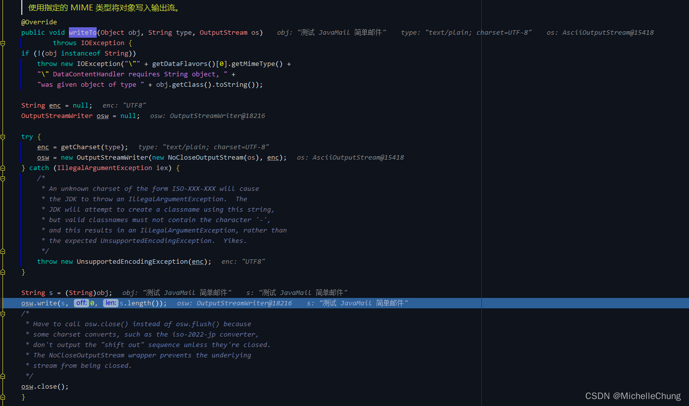

# 扩展笔记 01 - 集成 JavaMail 发送邮件
- - -
## 前言
前几天在群里听 [狮子大佬](https://blog.csdn.net/weixin_40461281?type=blog) 说 **框架 4.2+ 版本考虑集成邮件和短信**，等出来之后会再学习一下框架中的写法（短信比较像OSS，有多个不同的供应商，因此我个人感觉写法可能会比较像OSS模块）。因为最近需要用到邮件发送的功能，所以在 3.5.0 版本中做了简单集成，当然新版本也同样适用。
## 参考目录
- [发送Email - 廖雪峰的官方网站](https://www.liaoxuefeng.com/wiki/1252599548343744/1319099923693601)
  有关于发送邮件的过程说明和集成用法说明，通俗易懂。
- [Spring 官方文档 - Email](https://docs.spring.io/spring-framework/docs/5.3.19/reference/html/integration.html#mail)
  有详细的 Demo 可以参考。
- [Guide to Spring Email](https://www.baeldung.com/spring-email)
  本文是参考这里的步骤实现。

## 集成流程
集成的步骤和上面参考目录 [Guide to Spring Email](https://www.baeldung.com/spring-email) 差不多，功能不是特别难，所以比较容易实现。
### 1、Maven
在 common 模块引入：
```xml
<!-- mail-starter -->
<dependency>
	<groupId>org.springframework.boot</groupId>
	<artifactId>spring-boot-starter-mail</artifactId>
</dependency>
```

版本是 Spring Boot 的默认版本：<br>


点击进去也可以看到是 2.5.8 版本：<br>

### 2、yaml 配置文件
配置文件的写法可以参考框架扩展模块 `xxl-job` 的 yaml 文件。

```yaml
spring:
  # 邮件
  mail:
    # from 要和 username 一致, 否则报错
    from: xxx@qq.com
    # 邮件服务地址
    host: smtp.qq.com
    # 用户名
    username: xxx@qq.com
    # 授权码 (设置 - 账户 - POP3/SMTP服务)
    password: xxx
    # QQ邮箱加密端口，不同邮箱的端口不一样
    port: 465
    properties:
      mail:
        smtp:
          socketFactory:
            class: javax.net.ssl.SSLSocketFactory
          ssl:
            trust: smtp.qq.com
          # 是否需要用户认证
          auth: true
          starttls:
          	# 启用TLS加密
            enable: true
            required: true
```
需要注意的点：
1. `from` 要和 `username` 一致，否则会报错
2. `password` 不是邮箱的密码而是授权码，以QQ邮箱为例获取授权码：
   <br>
   <br>
   点击生成授权码：<br>
   <br>
   手机发送短信，然后点击我已发送：<br>
   <br>
   生成授权码，复制到 yaml 文件中：<br>
   <br>
3. 不同邮箱的加密端口不一样：

> 图片来源： [发送Email - 廖雪峰的官方网站](https://www.liaoxuefeng.com/wiki/1252599548343744/1319099923693601) <br>
> 
### 3、邮件属性 MailProperties
```java
@Data
@Component
@ConfigurationProperties(prefix = "spring.mail")
public class MailProperties {
   
    private String host;

    private String username;

    private String password;

    private String from;

    private Integer port;

    @Value("${spring.mail.properties.mail.smtp.auth}")
    private Boolean auth;

    @Value("${spring.mail.properties.mail.smtp.starttls.enable}")
    private Boolean starttlsEnable;

    @Value("${spring.mail.properties.mail.smtp.ssl.trust}")
    private String sslTrust;

}
```
### 4、邮件配置 MailConfig
```java
@Component
@Configuration
public class MailConfig {

    @Resource
    private MailProperties mailProperties;

    public String getFrom() {
        return mailProperties.getFrom();
    }

    public JavaMailSender getMailSender(String username, String password) {
        JavaMailSenderImpl mailSender = new JavaMailSenderImpl();
        mailSender.setHost(mailProperties.getHost());
        mailSender.setPort(mailProperties.getPort());
        // 如果没有自定义的用户，就使用配置类里面的用户
        mailSender.setUsername(StringUtils.blankToDefault(username, mailProperties.getUsername()));
        mailSender.setPassword(StringUtils.blankToDefault(password, mailProperties.getPassword()));

        Properties props = mailSender.getJavaMailProperties();
        // starttls.enable = true 时为 smtps
        props.put("mail.transport.protocol", "smtps");
        props.put("mail.smtp.auth", mailProperties.getAuth());
        props.put("mail.smtp.starttls.enable", mailProperties.getStarttlsEnable());
        props.put("mail.smtp.ssl.trust", mailProperties.getSslTrust());
        props.put("mail.debug", "true");

        return mailSender;
    }

}
```

> 关于邮件配置属性：（图片来源： [Guide to Spring Email](https://www.baeldung.com/spring-email)） <br>

### 5、简单邮件发送测试
```java
 	@GetMapping("/sendSimpleMessage")
    public void sendSimpleMessage(String to, String subject, String text) {
        SimpleMailMessage message = new SimpleMailMessage();
        // 邮件发送人
        message.setFrom(mailConfig.getFrom());
        // 邮件接收人（可以使用 String[] 发送给多个用户）
        message.setTo(to);
        // 邮件标题
        message.setSubject(subject);
        // 邮件内容
        message.setText(text);
        // 发送邮件
        mailConfig.getMailSender(null, null).send(message);
    }
```


邮件发送成功：<br>


控制台输出（隐去了邮箱地址）：

```bash
DEBUG: Jakarta Mail version 1.6.7
DEBUG: successfully loaded resource: /META-INF/javamail.default.providers
DEBUG: Tables of loaded providers
DEBUG: Providers Listed By Class Name: {com.sun.mail.smtp.SMTPTransport=javax.mail.Provider[TRANSPORT,smtp,com.sun.mail.smtp.SMTPTransport,Oracle], com.sun.mail.imap.IMAPSSLStore=javax.mail.Provider[STORE,imaps,com.sun.mail.imap.IMAPSSLStore,Oracle], com.sun.mail.pop3.POP3Store=javax.mail.Provider[STORE,pop3,com.sun.mail.pop3.POP3Store,Oracle], com.sun.mail.smtp.SMTPSSLTransport=javax.mail.Provider[TRANSPORT,smtps,com.sun.mail.smtp.SMTPSSLTransport,Oracle], com.sun.mail.imap.IMAPStore=javax.mail.Provider[STORE,imap,com.sun.mail.imap.IMAPStore,Oracle], com.sun.mail.pop3.POP3SSLStore=javax.mail.Provider[STORE,pop3s,com.sun.mail.pop3.POP3SSLStore,Oracle]}
DEBUG: Providers Listed By Protocol: {imap=javax.mail.Provider[STORE,imap,com.sun.mail.imap.IMAPStore,Oracle], smtp=javax.mail.Provider[TRANSPORT,smtp,com.sun.mail.smtp.SMTPTransport,Oracle], pop3=javax.mail.Provider[STORE,pop3,com.sun.mail.pop3.POP3Store,Oracle], imaps=javax.mail.Provider[STORE,imaps,com.sun.mail.imap.IMAPSSLStore,Oracle], smtps=javax.mail.Provider[TRANSPORT,smtps,com.sun.mail.smtp.SMTPSSLTransport,Oracle], pop3s=javax.mail.Provider[STORE,pop3s,com.sun.mail.pop3.POP3SSLStore,Oracle]}
DEBUG: successfully loaded resource: /META-INF/javamail.default.address.map
DEBUG: getProvider() returning javax.mail.Provider[TRANSPORT,smtps,com.sun.mail.smtp.SMTPSSLTransport,Oracle]
DEBUG SMTP: useEhlo true, useAuth false
DEBUG SMTP: trying to connect to host "smtp.qq.com", port 465, isSSL true
220 newxmesmtplogicsvrszc7.qq.com XMail Esmtp QQ Mail Server.
DEBUG SMTP: connected to host "smtp.qq.com", port: 465
EHLO PC-20180305GXML
250-newxmesmtplogicsvrszc7.qq.com
250-PIPELINING
250-SIZE 73400320
250-AUTH LOGIN PLAIN XOAUTH XOAUTH2
250-AUTH=LOGIN
250-MAILCOMPRESS
250 8BITMIME
DEBUG SMTP: Found extension "PIPELINING", arg ""
DEBUG SMTP: Found extension "SIZE", arg "73400320"
DEBUG SMTP: Found extension "AUTH", arg "LOGIN PLAIN XOAUTH XOAUTH2"
DEBUG SMTP: Found extension "AUTH=LOGIN", arg ""
DEBUG SMTP: Found extension "MAILCOMPRESS", arg ""
DEBUG SMTP: Found extension "8BITMIME", arg ""
DEBUG SMTP: protocolConnect login, host=smtp.qq.com, user=xxx@qq.com, password=<non-null>
DEBUG SMTP: Attempt to authenticate using mechanisms: LOGIN PLAIN DIGEST-MD5 NTLM XOAUTH2 
DEBUG SMTP: Using mechanism LOGIN
DEBUG SMTP: AUTH LOGIN command trace suppressed
DEBUG SMTP: AUTH LOGIN succeeded
DEBUG SMTP: use8bit false
MAIL FROM:<xxx@qq.com>
250 OK
RCPT TO:<xxx@qq.com>
250 OK
DEBUG SMTP: Verified Addresses
DEBUG SMTP:   xxx@qq.com
DATA
354 End data with <CR><LF>.<CR><LF>.
Date: Fri, 29 Apr 2022 11:16:40 +0800 (CST)
From: xxx@qq.com
To: xxx@qq.com
Message-ID: <237838440.0.1651202200219@PC-20180305GXML>
Subject: =?UTF-8?B?5rWL6K+V6YKu5Lu2?=
MIME-Version: 1.0
Content-Type: text/plain; charset=UTF-8
Content-Transfer-Encoding: base64

5rWL6K+VIEphdmFNYWlsIOeugOWNlemCruS7tg==
.
250 OK: queued as.
DEBUG SMTP: message successfully delivered to mail server
QUIT
221 Bye.
```

具体的信息解析可以参考廖雪峰老师的博客 [发送Email - 廖雪峰的官方网站](https://www.liaoxuefeng.com/wiki/1252599548343744/1319099923693601)。
### 6、复杂邮件发送
如果是需要发送带附件的邮件，需要使用 `MimeMessage` 以及 `MimeMessageHelper`，具体实现有多种，可以参考前面的参考目录自行实现。

> 图片来源： [Guide to Spring Email](https://www.baeldung.com/spring-email) <br>
图片来源： [发送Email - 廖雪峰的官方网站](https://www.liaoxuefeng.com/wiki/1252599548343744/1319099923693601) <br>


## 底层调用流程
### ##、流程简图

### #1、发送邮件请求 `JavaMailSenderImpl#send`
接口：<br>


实现方法：<br>


### #2、`JavaMailSenderImpl#doSend`


### #3、`SMTPTransport#sendMessage`


### #4、`MimeMessage#writeTo`

### #5、`MimeBodyPart#writeTo`


### #6、`DataHandler#writeTo`

### #7、`ObjectDataContentHandler#writeTo`

### #8、`text_plain#writeTo`

