# 扩展笔记 02 - 集成 WebSocket 发送消息到客户端
- - -
## 前言
[上一篇文章](https://blog.csdn.net/Michelle_Zhong/article/details/124476806) 集成了 `JavaMail` 到框架中，除了邮件发送以外，也学习了另外一种消息推送的方式 —— `WebSocket`。

主要的需求是从服务端发送消息到客户端，前端控制台能够接收并打印出消息（前端也可以将控制台的消息以弹窗的形式展示，在本文中只是将消息打印到客户端控制台）。

### 关于需求实现的对比（轮询与 `WebSocket` ）
从服务端到客户端的消息也可以用 **轮询** 的方式实现，但是轮询相对而言比较耗费资源，客户端每隔一段时间就要请求接口查询有没有新的消息，有的话就获取并展示。

轮询之所以比较耗费资源，原因之一是因为间隔的时间不能太长，如果要求实时性比较高的情况下，轮询的时间间隔设置得小，请求的次数就会很密集。

相比之下，`WebSocket` 的优势就体现在当有新消息的时候直接由服务端推送到客户端，两者只需要保持连接即可。

但是 `WebSocket` 也不是万能的，某些场景下 `WebSocket` 的消息可能会丢失（客户端没有接收到），而轮询的消息一般是持久化的消息，丢失的可能性比 `WebSocket` 小。

### 关于本篇文章
本文的主要目的还是学习为主，因为技术所限不会太过深入，有很多不错参考的目录也会一一列举出来。

`WebSocket` 的使用场景还有很多，在找资料的时候也有很多使用场景是 **实时聊天**，有兴趣的朋友可以自行去查找一下，在这里就不详细说明了。

我个人认为，技术没有优劣，只有合适与否。

## 参考目录
### 代码实现参考
- [SpringBoot+Vue整合WebSocket实现前后端消息推送](https://blog.csdn.net/BADAO_LIUMANG_QIZHI/article/details/114392573)
  这篇文章的大部分代码是参照这篇博客去实现的，有些地方根据实际情况作出了改动，所以下文只贴出改动的代码，其他代码可以去这篇博客查看。
- [WebSockets](https://developer.mozilla.org/zh-CN/docs/Web/API/WebSockets_API)
### 原理分析参考
- [阮一峰老师 - WebSocket 教程](https://www.ruanyifeng.com/blog/2017/05/websocket.html)
- [廖雪峰老师 - 使用WebSocket](https://www.liaoxuefeng.com/wiki/1252599548343744/1282384966189089)
- [websocket的源码分析,使用,还有一些常见疑问](https://www.jianshu.com/p/f991742fea07)

## 集成流程
代码集成的环境依然是【RuoYi-Vue-Plus】V3.5.0 版本，但集成的功能与版本关联性不大。

### 1、Maven
在 common 模块引入：
```xml
<!-- websocket -->
<dependency>
	<groupId>org.springframework.boot</groupId>
	<artifactId>spring-boot-starter-websocket</artifactId>
</dependency>
```
版本是 Spring Boot 的默认版本：<br>
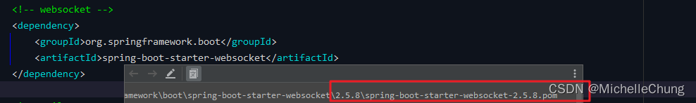

点击进去也可以看到是 2.5.8 版本：<br>
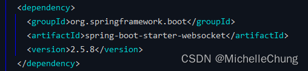
### 2、WebSocket 配置类 `WebSocketConfig`
在 framework 模块 config 下添加：

```java
@EnableWebSocket
@Configuration
public class WebSocketConfig {

    @Bean
    public ServerEndpointExporter serverEndpointExporter(){
        return  new ServerEndpointExporter();
    }

}
```
### 3、实体类 `WebSocketClient`
可以放在 common 模块下，方便调用。
### 4、WebSocket 服务 `WebSocketService`
同样放在 common 模块。

需要标注注解 `@ServerEndpoint`，该注解声明并创建了 WebSocket 端点, 并且指明了请求路径：

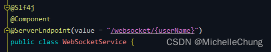

`userName` 为客户端请求时携带的参数，用于服务端区分客户端使用。

该类还有几个方法：

- `@OnOpen` 注解标注的方法：连接建立成功调用的方法。
- `@OnClose` 注解标注的方法：连接关闭调用的方法。
- `@OnMessage` 注解标注的方法：收到客户端消息后调用的方法。
- `@OnError` 注解标注的方法：连接发生异常时候触发的方法。
- 向指定客户端发送消息的方法：<br>
  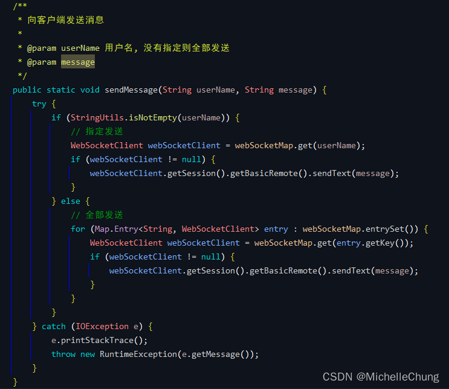
- 批量向客户端发送消息<br>
  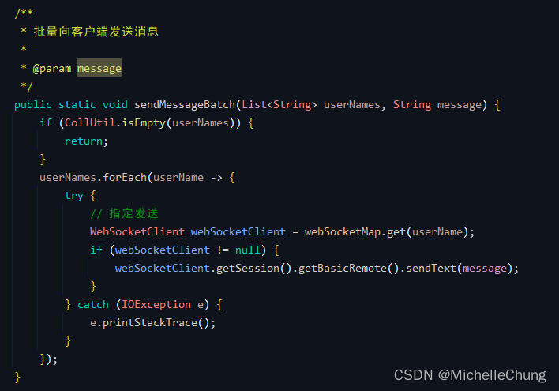
### 5、测试方法
测试方法在 Demo 模块新加入一个测试的方法直接调用步骤 4 中的方法即可。

实际使用可以是异步方式调用：
```java
	/**
     * 通过 websocket 发送消息到客户端
     *
     * @param userNames    用户名集合
     * @param title        消息标题
     * @param content      消息内容
     * @param sendUserName 发送人
     */
    @Async
    @Override
    public void sendMessageByWebSocket(List<String> userNames, String title, String content, String sendUserName) {
        log.info("sendMessageByWebSocket");
        // 筛选在线用户
        List<String> names = new ArrayList<>();
        // 获取所有登录用户
        Collection<String> keys = RedisUtils.keys(Constants.LOGIN_TOKEN_KEY + "*");
        keys.forEach(key -> {
            LoginUser loginUser = RedisUtils.getCacheObject(key);
            if (ObjectUtil.isNotNull(loginUser)) {
                // 匹配登录用户企业
                if (userNames.contains(loginUser.getUsername())) {
                    names.add(loginUser.getUsername());
                }
            }
        });

        // 发送消息
        JSONObject jsonObject = new JSONObject();
        jsonObject.putOpt("title", title);
        jsonObject.putOpt("content", content);
        jsonObject.putOpt("from", sendUserName);
        WebSocketService.sendMessageBatch(names, jsonObject.toString());
    }
```

### 6、权限修改
使用 `WebSocket` 需要允许匿名访问，直接修改配置文件（`application.yml`）中的路径即可。

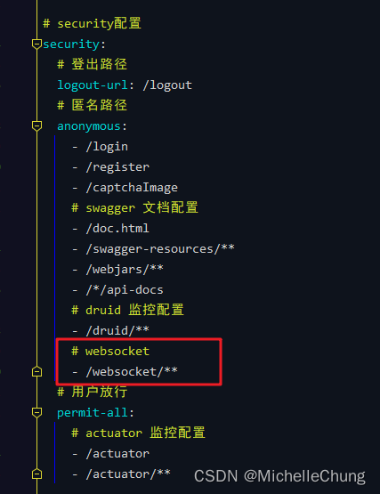
### 7、`ruoyi-ui` 前端修改
需要加入的文件 `WebSocket.vue`：<br>
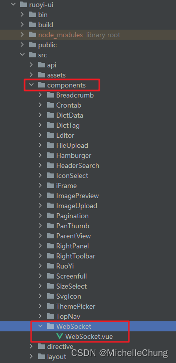

原博客中客户端与服务端绑定参数的 `userName` 是直接写死在代码里面的，但是实际使用不会直接写，所以咨询了前端小姐姐之后改为了获取客户端当前用户的用户名 `userName` 进行绑定，用户名是唯一的，比较符合使用场景。

`WebSocket.vue` 文件中改动的地方如下：<br>
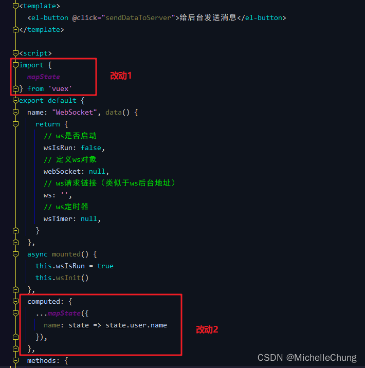<br>
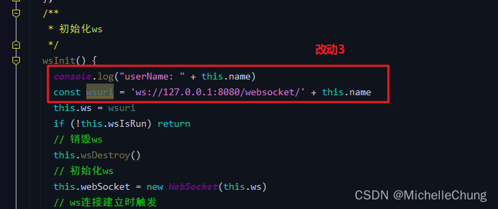

完整代码：
```xml
<template>
  <el-button @click="sendDataToServer">给后台发送消息</el-button>
</template>

<script>
import {
  mapState
} from 'vuex'
export default {
  name: "WebSocket", data() {
    return {
      // ws是否启动
      wsIsRun: false,
      // 定义ws对象
      webSocket: null,
      // ws请求链接（类似于ws后台地址）
      ws: '',
      // ws定时器
      wsTimer: null,
    }
  },
  async mounted() {
    this.wsIsRun = true
    this.wsInit()
  },
  computed: {
    ...mapState({
      name: state => state.user.name
    }),
  },
  methods: {
    sendDataToServer() {
      if (this.webSocket.readyState === 1) {
        this.webSocket.send('来自前端的数据')
      } else {
        throw Error('服务未连接')
      }
    },
    /**
     * 初始化ws
     */
    wsInit() {
      console.log("userName: " + this.name)
      const wsuri = 'ws://127.0.0.1:8080/websocket/' + this.name
      this.ws = wsuri
      if (!this.wsIsRun) return
      // 销毁ws
      this.wsDestroy()
      // 初始化ws
      this.webSocket = new WebSocket(this.ws)
      // ws连接建立时触发
      this.webSocket.addEventListener('open', this.wsOpenHanler)
      // ws服务端给客户端推送消息
      this.webSocket.addEventListener('message', this.wsMessageHanler)
      // ws通信发生错误时触发
      this.webSocket.addEventListener('error', this.wsErrorHanler)
      // ws关闭时触发
      this.webSocket.addEventListener('close', this.wsCloseHanler)

      // 检查ws连接状态,readyState值为0表示尚未连接，1表示建立连接，2正在关闭连接，3已经关闭或无法打开
      clearInterval(this.wsTimer)
      this.wsTimer = setInterval(() => {
        if (this.webSocket.readyState === 1) {
          clearInterval(this.wsTimer)
        } else {
          console.log('ws建立连接失败')
          this.wsInit()
        }
      }, 3000)
    },
    wsOpenHanler(event) {
      console.log('ws建立连接成功')
    },
    wsMessageHanler(e) {
      console.log('wsMessageHanler')
      console.log(e)
      //const redata = JSON.parse(e.data)
      //console.log(redata)
    },
    /**
     * ws通信发生错误
     */
    wsErrorHanler(event) {
      console.log(event, '通信发生错误')
      this.wsInit()
    },
    /**
     * ws关闭
     */
    wsCloseHanler(event) {
      console.log(event, 'ws关闭')
      this.wsInit()
    },
    /**
     * 销毁ws
     */
    wsDestroy() {
      if (this.webSocket !== null) {
        this.webSocket.removeEventListener('open', this.wsOpenHanler)
        this.webSocket.removeEventListener('message', this.wsMessageHanler)
        this.webSocket.removeEventListener('error', this.wsErrorHanler)
        this.webSocket.removeEventListener('close', this.wsCloseHanler)
        this.webSocket.close()
        this.webSocket = null
        clearInterval(this.wsTimer)
      }
    },
  }
}
</script>

<style scoped>

</style>

```
## 效果演示
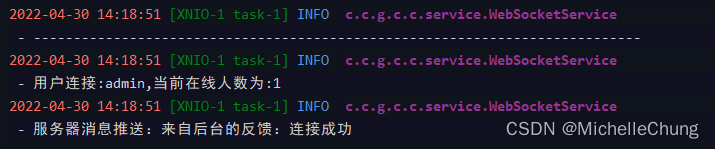

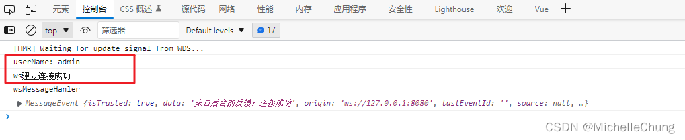

服务端调用推送测试：<br>
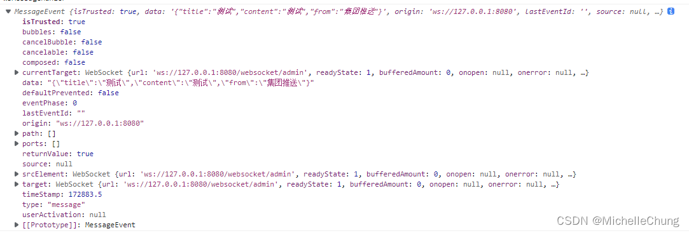
## 底层调用流程
### ##、流程简图
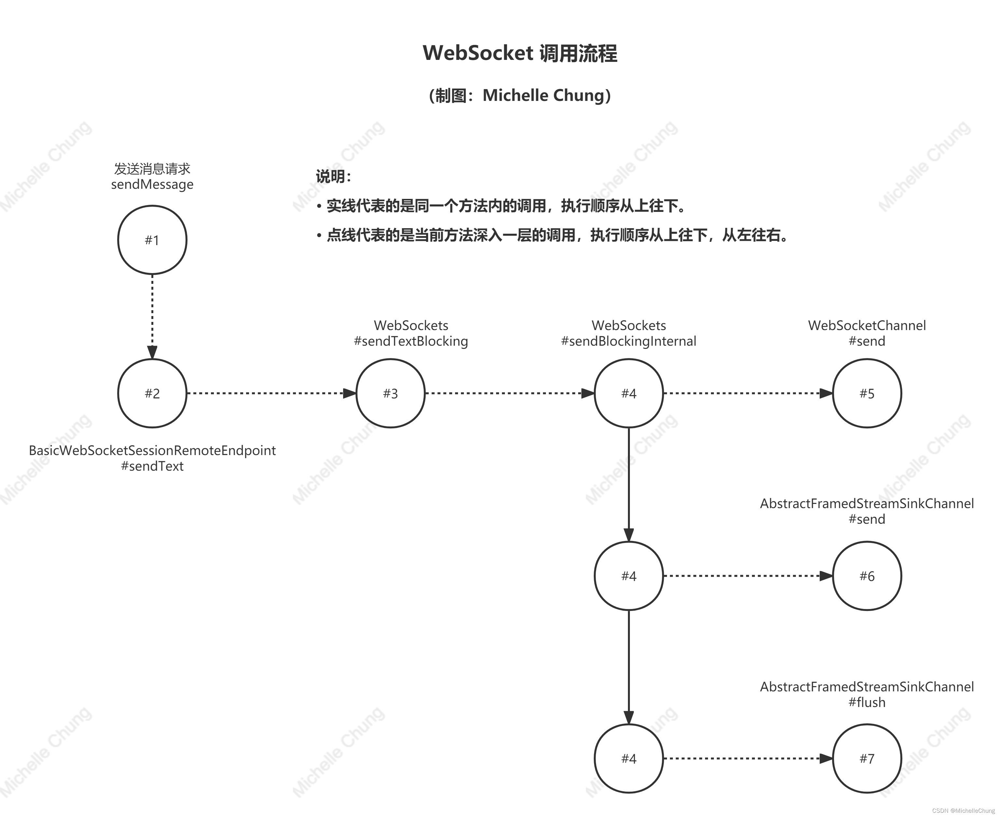
### #1、发送消息请求 `WebSocketService#sendMessage`
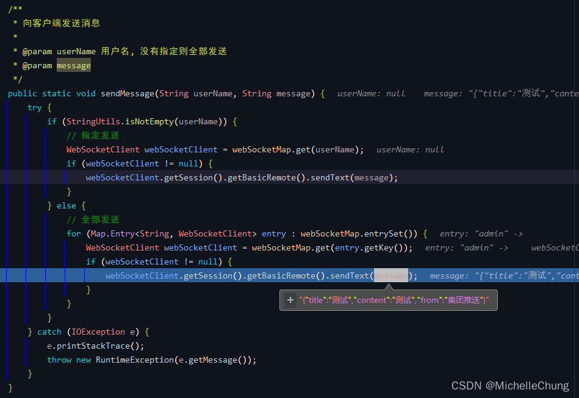
### #2、`BasicWebSocketSessionRemoteEndpoint#sendText`
`sendText` 接口：<br>
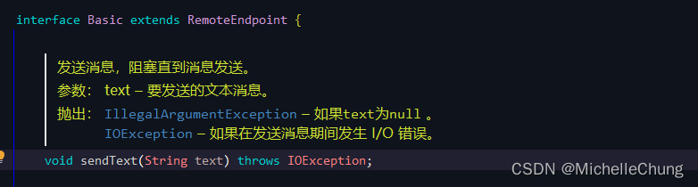

`sendText` 实现方法：<br>
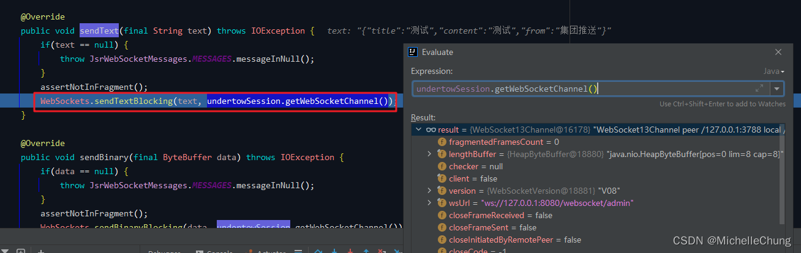

【RuoYi-Vue-Plus】使用的是容器框架是 `Undertow`，所以实现类是 `io.undertow.websockets` 包下面的方法：<br>
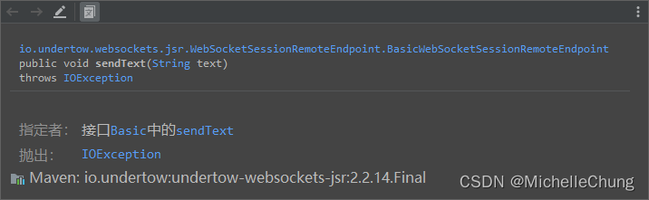
### #3、`WebSockets#sendTextBlocking`
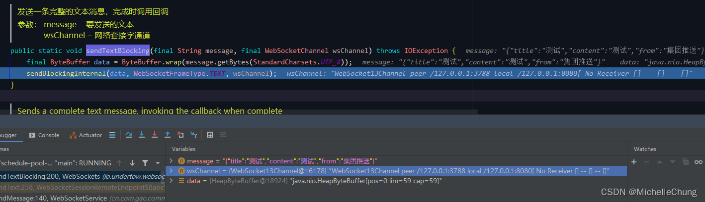
### #4、发送消息的方法 `WebSockets#sendBlockingInternal`
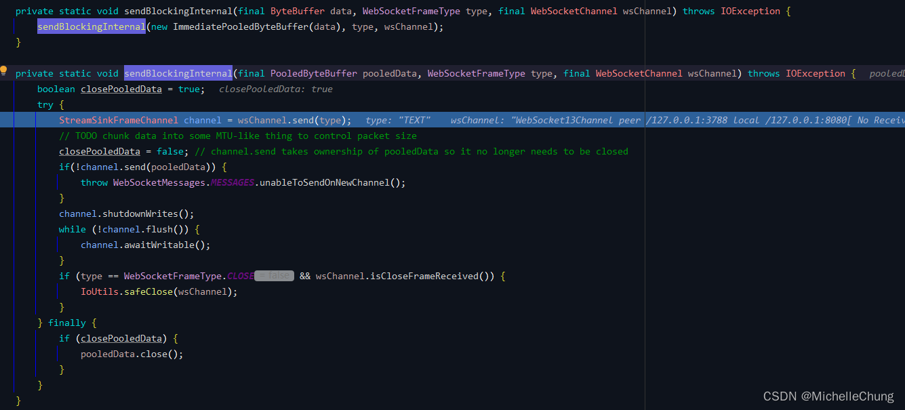
### #5、`WebSocketChannel#send`
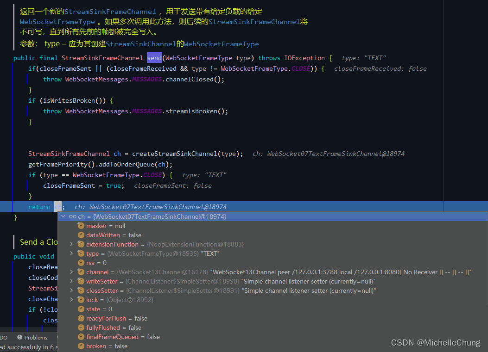
### #6、`AbstractFramedStreamSinkChannel#send`
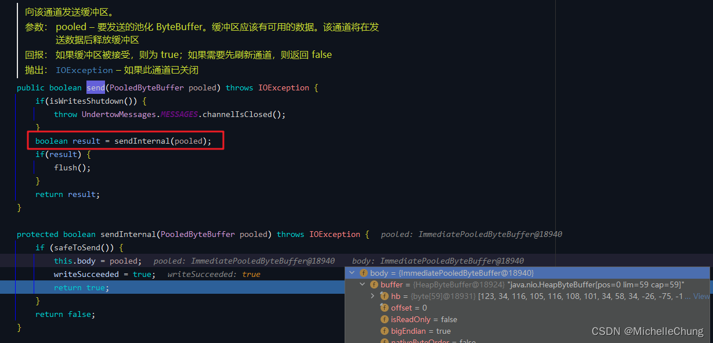
### #7、`AbstractFramedStreamSinkChannel#flush`
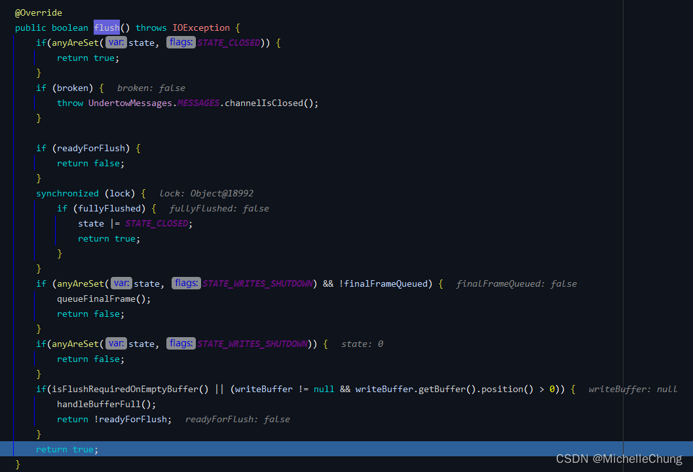

步骤 5、6、7 完成后消息发送完成，回到步骤 4：<br>
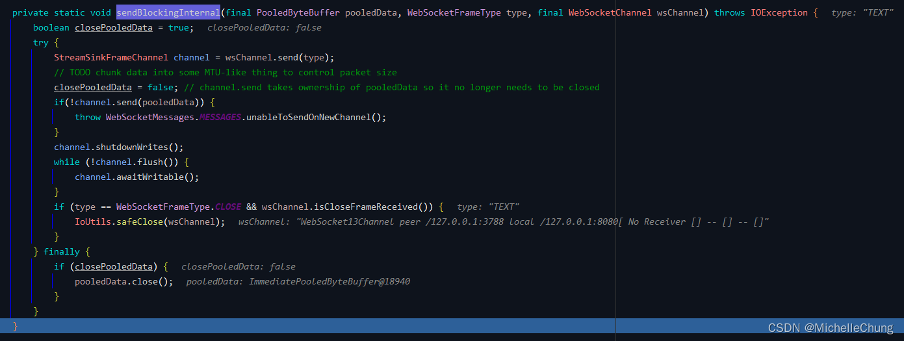
