# 扩展笔记 03 - 实现简单的 EasyExcel 自定义导入监听器
- - -
## 前言
这篇先不说原理，来玩一下简单的内容，参考框架内的 EasyExcel 导入监听器（`DefaultExcelListener` 以及 `SysUserImportListener`），我仿照着写了一个新的 `TestDemoImportListener`，用来测试单表导入功能。

之所以写了一个新的监听器，有以下的原因：

一来，是因为上篇博客有说到，校验器的配置（`ValidatorConfig`）使用的是 **异常快速返回** 模式，即读取到错误信息就直接返回不再进行后面的数据校验了，而我想实现的需求是==可以一次性读完全部的数据之后再将错误信息返回==。

二来，为了学习借鉴一下，更好地了解 EasyExcel 导入（读 Excel）的整个调用流程。（导入的流程分析放到下篇，EasyExcel 相关的内容估计可以单开一个系列了……）

## 参考目录
- [EasyExcel 官方文档 - 最简单的读的监听器](https://easyexcel.opensource.alibaba.com/docs/current/quickstart/read#%E6%9C%80%E7%AE%80%E5%8D%95%E7%9A%84%E8%AF%BB%E7%9A%84%E7%9B%91%E5%90%AC%E5%99%A8)
  官方文档也有相关的 demo。

## 实现效果
导入数据：

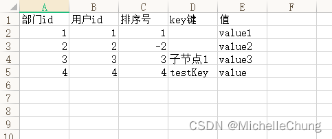

导入结果：

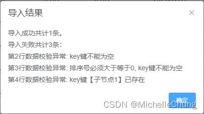
## 代码实现
### 步骤1：修改配置 `ValidatorConfig`
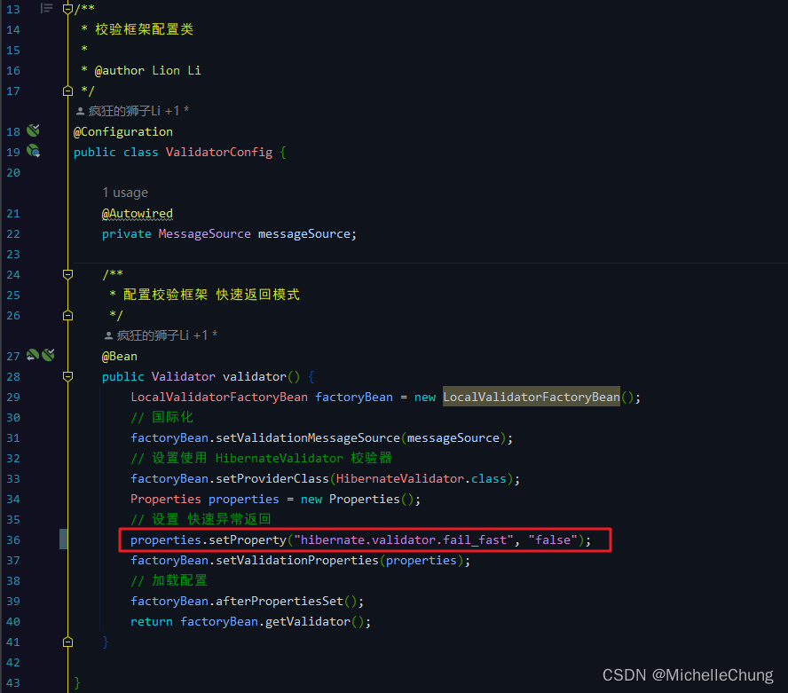

**注：这一步如果不修改，则同一行数据违反多个约束时只会返回一个违反约束信息。**

### 步骤2：新增 Validator 校验分组 `ImportGroup`
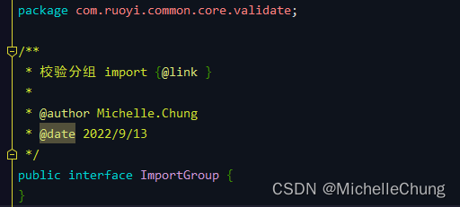

为了和其他校验分组区分开，所以新建了一个分组。

### 步骤3：修改 `TestDemoImportVo` 属性分组
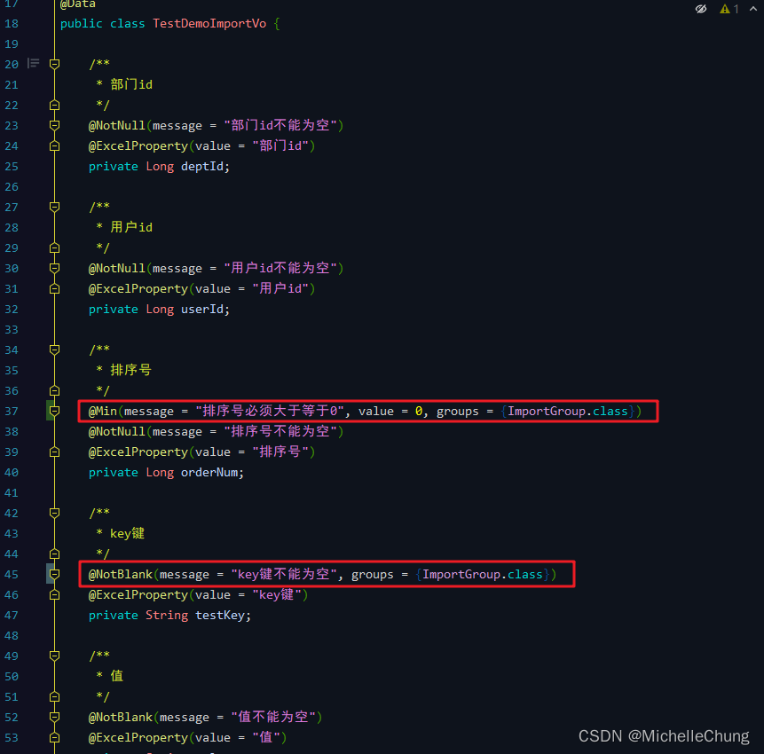

有标注组信息 `groups = {ImportGroup.class}` 的才去校验，其他默认分组不进行校验。

### 步骤4：创建自定义导入监听器 `TestDemoImportListener`
```java
/**
 * TestDemo 自定义导入 {@link }
 *
 * @author Michelle.Chung
 * @date 2022/9/13
 */
@Slf4j
public class TestDemoImportListener extends AnalysisEventListener<TestDemoImportVo> implements ExcelListener<TestDemoImportVo> {

    private final TestDemoMapper testDemoMapper;
    /**
     * excel 表头数据
     */
    private Map<Integer, String> headMap;
    /**
     * 导入成功的数据列表
     */
    private final List<TestDemoImportVo> list;
    /**
     * 导入异常的数据列表
     */
    private final List<String> errorList;
    /**
     * 当前行数
     */
    private int rowNum;

    public TestDemoImportListener() {
        this.testDemoMapper = SpringUtils.getBean(TestDemoMapper.class);
        this.list = new ArrayList<>();
        this.errorList = new ArrayList<>();
    }

    @Override
    public void invoke(TestDemoImportVo demoVo, AnalysisContext context) {
        // 当前行数
        this.rowNum = context.readRowHolder().getRowIndex() + 1;
        // 只校验 ImportGroup 分组
        ValidatorUtils.validate(demoVo, ImportGroup.class);
        // 判断key是否重复
        Long count = testDemoMapper.selectCount(
            new LambdaQueryWrapper<TestDemo>()
                .eq(TestDemo::getTestKey, demoVo.getTestKey()));
        if (count > 0) {
            // 错误信息
            StringBuilder failureMsg = new StringBuilder()
                .append(StrUtil.format("第{}行数据校验异常: ", this.rowNum))
                .append(StrUtil.format("key键【{}】已存在<br/>", demoVo.getTestKey()));
            errorList.add(failureMsg.toString());
        } else {
            list.add(demoVo);
        }
    }

    /**
     * 处理异常
     *
     * @param exception ExcelDataConvertException
     * @param context   Excel 上下文
     */
    @Override
    public void onException(Exception exception, AnalysisContext context) throws Exception {
        String errorMsg = null;
        if (exception instanceof ExcelDataConvertException) {
            // 如果是某一个单元格的转换异常 能获取到具体行号
            ExcelDataConvertException excelDataConvertException = (ExcelDataConvertException) exception;
            Integer columnIndex = excelDataConvertException.getColumnIndex();
            errorMsg = StrUtil.format("第{}行-第{}列-表头{}: 解析异常<br/>",
                this.rowNum, columnIndex + 1, headMap.get(columnIndex));
            if (log.isDebugEnabled()) {
                log.error(errorMsg);
            }
        }
        if (exception instanceof ConstraintViolationException) {
            ConstraintViolationException constraintViolationException = (ConstraintViolationException) exception;
            Set<ConstraintViolation<?>> constraintViolations = constraintViolationException.getConstraintViolations();
            String constraintViolationsMsg = StreamUtils.join(constraintViolations, ConstraintViolation::getMessage, ", ");
            errorMsg = StrUtil.format("第{}行数据校验异常: {}", this.rowNum, constraintViolationsMsg);
            if (log.isDebugEnabled()) {
                log.error(errorMsg);
            }
        }
        errorList.add(errorMsg);
    }

    @Override
    public void invokeHeadMap(Map<Integer, String> headMap, AnalysisContext context) {
        this.headMap = headMap;
        log.info("解析到一条表头数据: {}", JsonUtils.toJsonString(headMap));
    }

    @Override
    public void doAfterAllAnalysed(AnalysisContext context) {
        log.info("所有数据解析完成！");
    }

    @Override
    public ExcelResult<TestDemoImportVo> getExcelResult() {
        return new ExcelResult<TestDemoImportVo>() {
            @Override
            public List<TestDemoImportVo> getList() {
                return list;
            }

            @Override
            public List<String> getErrorList() {
                return errorList;
            }

            @Override
            public String getAnalysis() {
                int successCount = list.size();
                int errorCount = errorList.size();
                if (successCount == 0) {
                    return "读取失败，未解析到数据";
                } else {
                    if (errorCount == 0) {
                        return StrUtil.format("恭喜您，全部读取成功！共{}条", successCount);
                    } else {
                        // 返回所有错误信息
                        StringBuilder builder = new StringBuilder()
                            .append(StrUtil.format("导入成功共计{}条。<br/>", successCount))
                            .append(StrUtil.format("导入失败共计{}条：<br/>", errorCount))
                            .append(StrUtil.join("<br/>", errorList));
                        throw new ServiceException(builder.toString());
                    }
                }
            }
        };
    }

}
```

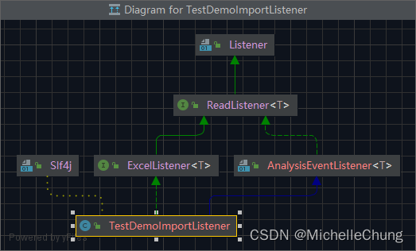

该类实现了 `ReadListener#invoke` 方法：<br>
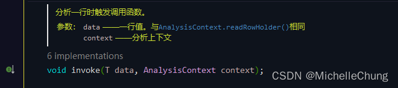

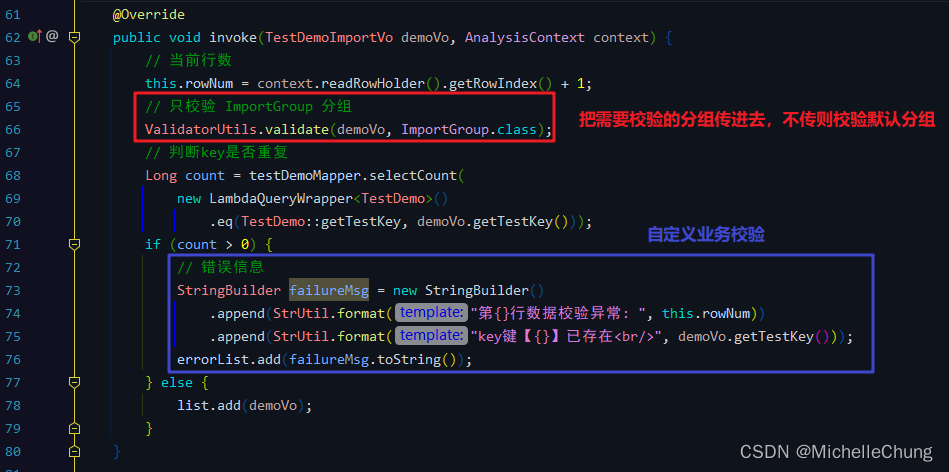

框架中封装了校验工具 ValidatorUtils，底层使用的就是校验配置类 `ValidatorConfig` 里面定义的 Validator （底层调用的是 `ValidatorImpl#validate` 方法，详细的流程可以参考 [上一篇博客](https://blog.csdn.net/Michelle_Zhong/article/details/126817270)），校验完成会把错误的结果进行返回。<br>
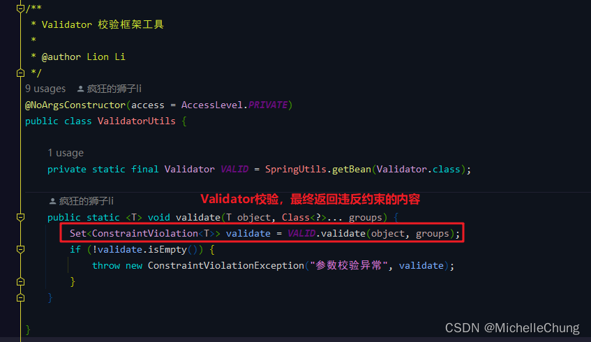

如果有错误信息，会抛出约束违法异常 `ConstraintViolationException`，监听器中也重写了异常的处理方法 `ReadListener#onException`：<br>
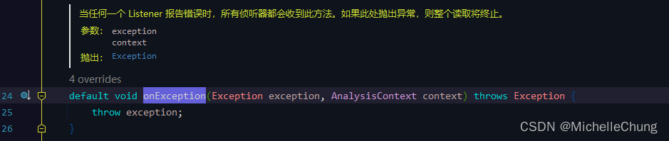

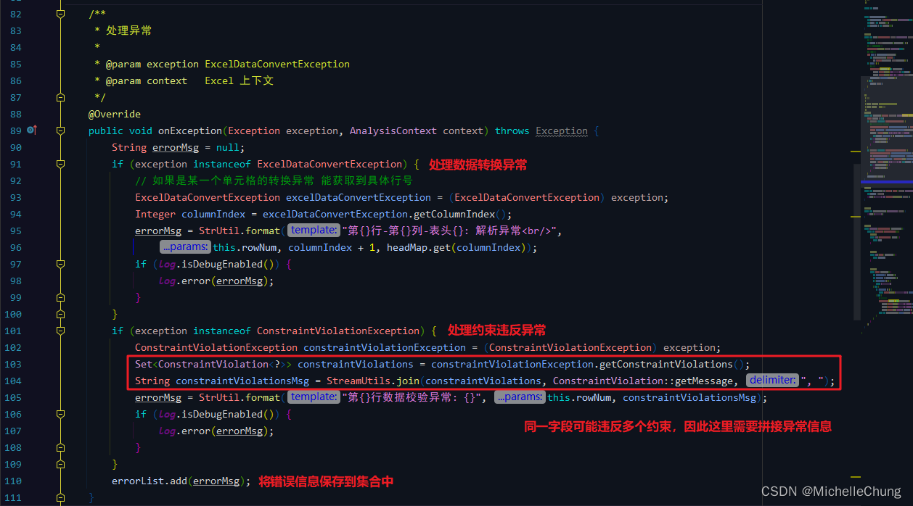

返回解析结果：<br>
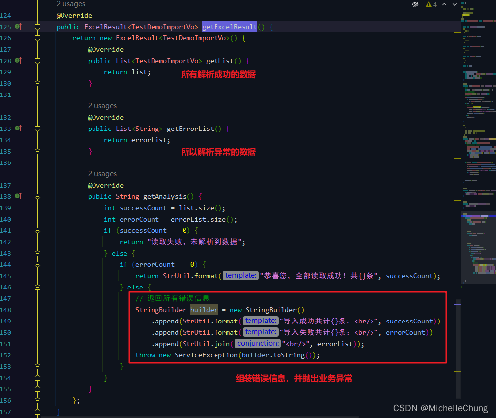
### 步骤5：调用接口 `TestDemoController#importData`
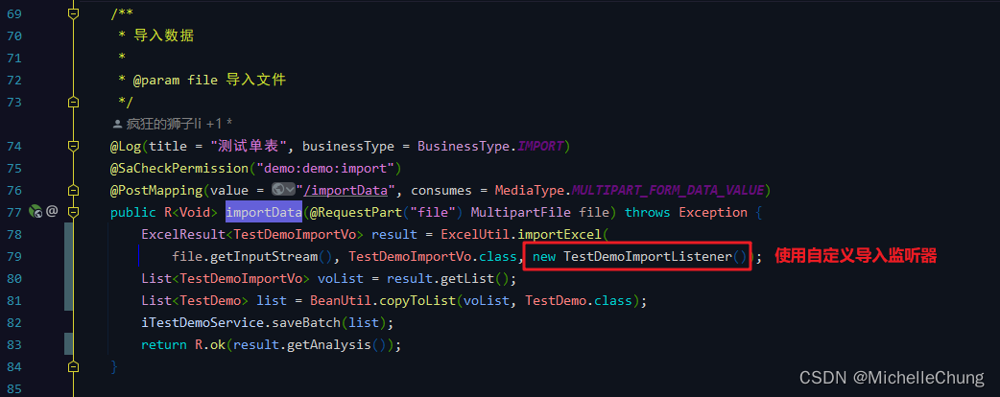

至此，所有的步骤都完成了。