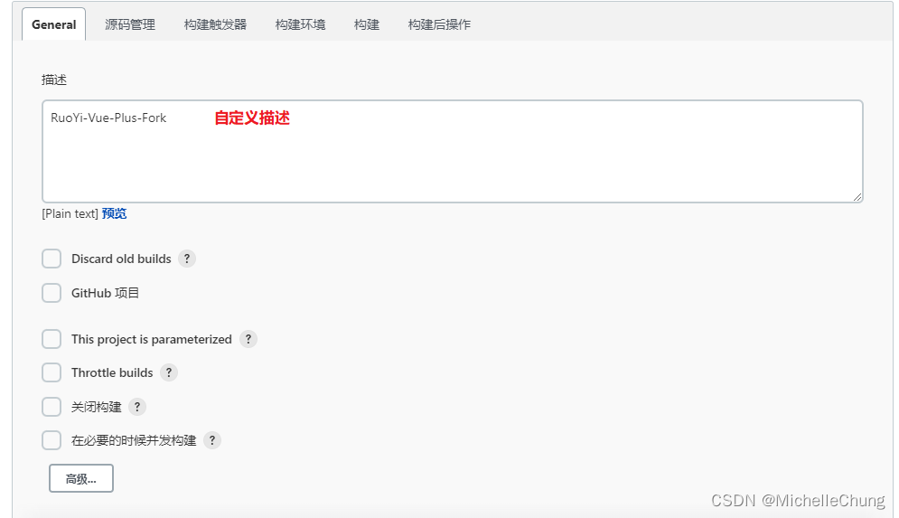
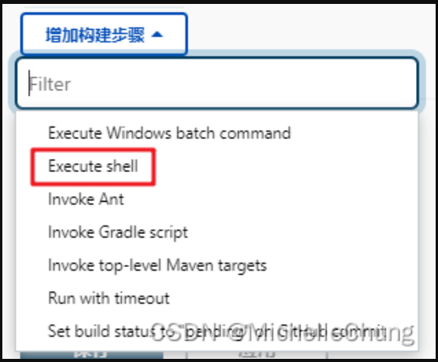
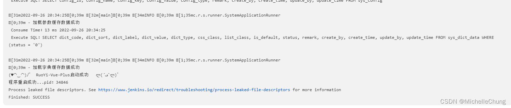

# 扩展笔记 04 - CentOS 8 配置 Jenkins 自动发布
- - -
## 前言

一般来说，很多用【RuoYi-Vue-Plus】框架的朋友都是用 Docker 部署的，这篇笔记主要是写给那些直接运行 jar 的新手朋友，以及顺便整理一下以前的笔记，记录一下过程中遇到的一些坑。

## 准备环境

- Jenkins `2.346.3`（配套 JDK 1.8）
- JDK `1.8.0_191`
- Maven `3.8.6`
- Git `2.9.5`

## 安装步骤

### 1、Maven 安装

因为网络原因，下载镜像比较慢，所以直接到官网下载压缩包安装。

[下载传送门](https://maven.apache.org/download.cgi)<br>


```powershell
# 解压
cd /usr/local
tar -zxvf apache-maven-3.8.6-bin.tar.gz

# 配置环境变量
vim /etc/profile
# 在末尾增加配置
export MAVEN_HOME=/usr/local/apache-maven-3.8.6
export PATH=$MAVEN_HOME/bin:$PATH
# 配置生效
source /etc/profile

# 校验
mvn -v
```


### 2、Jenkins 安装

**坑1：版本不对应导致无法启动。**

文章开头就强调了 Jenkins 版本以及 JDK 版本，因为一直用 JDK 1.8，所以一开始配置好 JDK 环境之后，直接就拉了最新版的 Jenkins 安装，后面就一直报错。

[Jenkins 官方文档说明](https://www.jenkins.io/doc/administration/requirements/java/)：<br>
<br>
试过装了 OpenJDK 11 也是有问题，所以后面选择装了低版本 `2.346.3`，使用 war 包直接运行。[下载传送门](https://get.jenkins.io/war-stable/2.346.3/)

```powershell
# 创建软连接（ Jenkins 默认路径 /usr/bin/java ）
ln -s /usr/java/jdk1.8.0_191/bin/java /usr/bin/java

# war 包启动
cd /usr/local/jenkins
nohup java -jar jenkins.war &
# 查看结果
tail -100f nohup.out
```

<br>
启动成功后访问页面

```powershell
http://<ip>:8080
```

安装的时候没有截图，所以有些地方不一样会标注出来。

用上面的密码解锁，然后开始安装。<br>


下面就不一一截图了，操作并不复杂，我大致写一下流程：

1. 完成上面的解锁。
2. 安装推荐的插件，等待安装完毕。
3. 创建账户。


看到这里代表安装完成。

### 3、Jenkins 配置


### 3.1、配置 Maven


### 3.2、配置 Git

**坑2：Jenkins Git 版本太低导致无法连接远程仓库。**

这里一开始是找不到 Git 路径，在系统找到路径并且填写之后在后面配置项目的时候会有问题（报错 `Failed to connect to repository`），所以这里需要自行在服务器安装一个 Git。

具体步骤请参考：[jenkins添加Git项目时报错Failed to connect to repository : Error performing git command: git ls-remote -h（春天的菠菜）](https://blog.csdn.net/legend818/article/details/104148913)

安装完成后配置地址：<br>


### 4、配置项目

经过前面的步骤之后终于到配置项目的环节了。




### 4.1、源码管理

复制远程仓库地址：<br>


### 4.2、构建



打包脚本：<br>


这里命令表示跳过测试，指定打包 test 环境（根据实际情况设置)

```powershell
mvn clean package -Dmaven.test.skip=true -P test
```

部署运行脚本：<br>


```powershell
#!/bin/bash

PID=$(ps -ef | grep  ruoyi-admin.jar | grep -v grep | awk '{ print $2 }')
 
if [ -z "$PID" ]
then
    echo "程序未启动。"
else
    echo "程序在启动中，正在停止..."
    kill -9 $PID
fi

# backup
cd /usr/jar/ruoyi-vue-plus-9595
rm -rf *bak
if [ -f ruoyi-admin.jar ]
then
	cp ruoyi-admin.jar ruoyi-admin.jar.bak
fi  

OLD_BUILD_ID=$BUILD_ID
BUILD_ID=dontKillMe

# copy new jar to dest
cd  /root/.jenkins/workspace/RuoYi-Vue-Plus-Fork/ruoyi-admin/target
cp ruoyi-admin.jar /usr/jar/ruoyi-vue-plus-9595

echo '开始启动程序 ...'
cd /usr/jar/ruoyi-vue-plus-9595

nohup java -jar ruoyi-admin.jar &
echo "starting ruoyi-admin..."

BUILD_ID=$OLD_BUILD_ID

sleep 20

#根据重启后是否有当前应用判断启动是否成功
endPID=$(ps -ef | grep  ruoyi-admin.jar | grep -v grep | awk '{ print $2 }')
 
if [ -z "$endPID" ]
then
    echo "程序启动失败。"
else
    echo "程序重启成功...pid："${endPID} 
fi

```

注意：根据自己的项目情况修改文件路径以及文件名。


第一次打包需要下载依赖时间会比较久，请耐心等待。




执行完毕，项目启动成功。