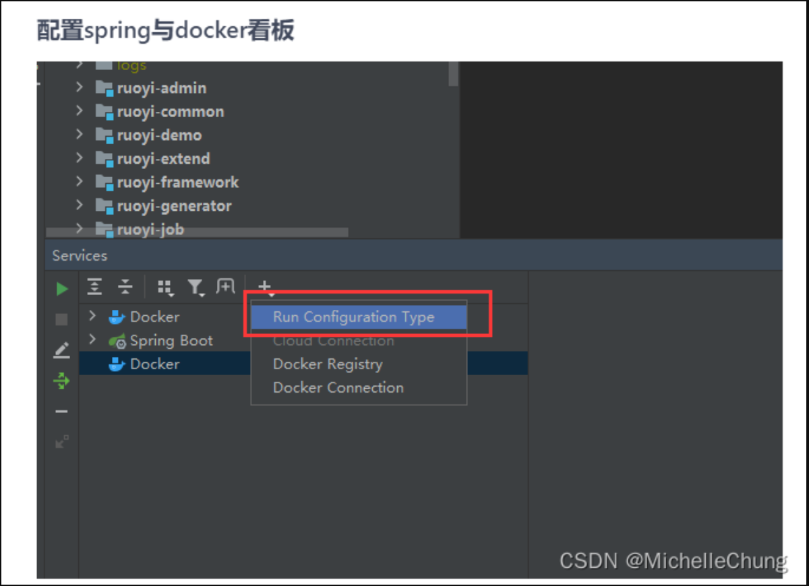
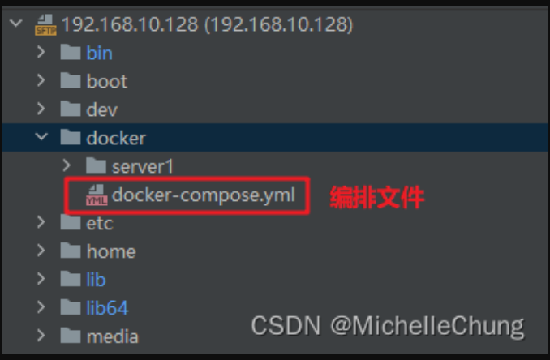
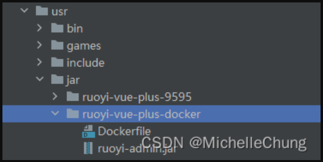
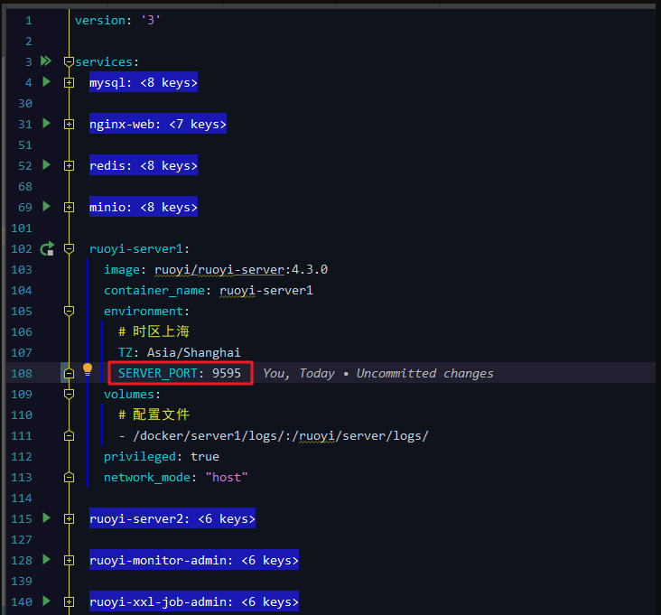
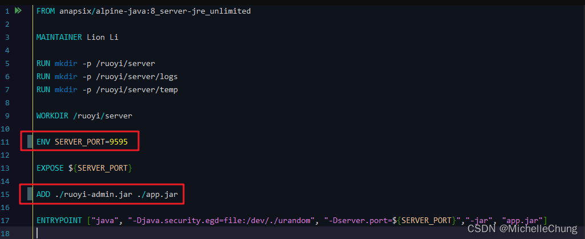
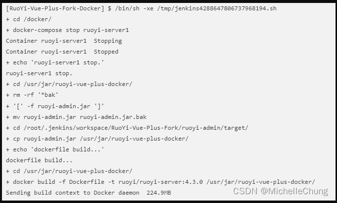
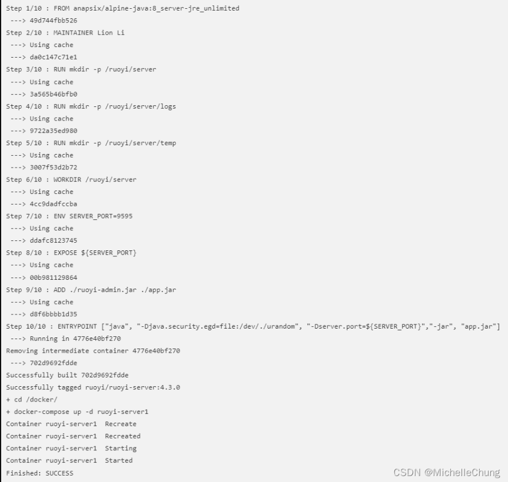
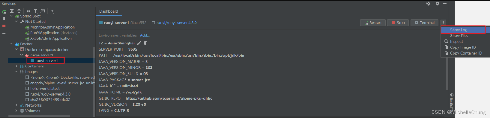
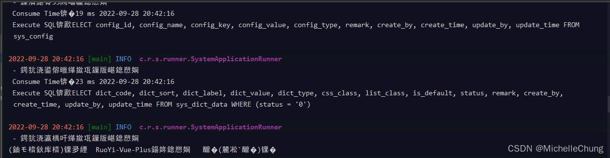
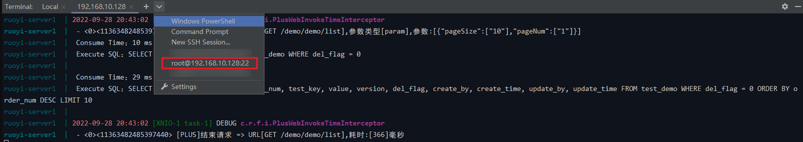

# 扩展笔记 05 - CentOS 8 配置 Jenkins + Docker 自动发布
- - -
## 前言
承接上篇，狮子大佬提议写一篇 Jenkins + Docker 部署的，今天学习并尝试了一下，顺便记录一下操作步骤。

关于 Jenkins 的安装请按照上一篇文章进行操作，本文主要是在框架 wiki 文档的基础上进行一些补充。

## 参考目录
- [框架Wiki - 应用部署](https://gitee.com/JavaLionLi/RuoYi-Vue-Plus/wikis/快速开始/应用部署)<br>
根据 wiki 可以使用 idea 的 Docker 插件进行部署。在本文中，Jenkins 的主要作用是节省了本地打包传包的步骤，如果是使用 Docker 构建等步骤，其实也是很方便的。

## 操作步骤

### 1、需要注意的点

因为操作步骤比较多，很容易会出现错漏的地方，所以这里简单说明一下。

> **注意这里两个 Docker 是不一样的！！！**
>
> <br>
**请根据文档中的安装配置步骤进行操作，下面把链接也一起放出来。**

> **请优先阅读 [idea环境配置](https://gitee.com/JavaLionLi/RuoYi-Vue-Plus/wikis/pages?sort_id=5985043&doc_id=1469725)**
>
> **重点: 一知半解的必看**
>
> [docker安装](https://lionli.blog.csdn.net/article/details/83153029)<br>
> [docker-compose安装](https://lionli.blog.csdn.net/article/details/111220320)<br>
> [docker网络模式讲解](https://lionli.blog.csdn.net/article/details/109603785)<br>
> [docker 开启端口 2375 供外部程序访问](https://lionli.blog.csdn.net/article/details/92627962)<br>


### 2、文件以及路径说明

**注：本文中的服务使用的是服务器已有的 Nginx、Redis、MySQL、MinIO，如果是全部环境都使用 Docker 部署，建议严格按照 wiki 文档操作。**

使用的文件：

1. Docker 构建（必须）：`ruoyi-admin/Dockerfile`
2. 容器编排（必须）：`script/docker/docker-compose.yml`
3. Nginx 配置文件（非必须，可以自行配置）：`script/docker/nginx/conf/nginx.conf`

路径说明：

1. 文件夹 `/docker/`<br>
   <br>
   因为其他环境非 Docker 部署，因此没有上传其他的文件以免混淆。

2. 文件夹 `/usr/jar/ruoyi-vue-plus-docker`<br>
   <br>
   这里是放 jar 包以及构建文件的路径，可以自定义。

因为存放的路径和本地有所不同所以需要进行简单的修改。

### 3、文件修改

### 3.1、`docker-compose.yml`
这里比较简单，只是修改一下端口即可。（其他没有使用的部分暂时折叠了。）<br>

### 3.2、`Dockerfile`
修改端口以及路径。<br>


### 4、Jenkins 脚本

```shell
# stop
cd /docker/
docker-compose stop ruoyi-server1
echo "ruoyi-server1 stop."

# backup
cd /usr/jar/ruoyi-vue-plus-docker/
rm -rf *bak
if [ -f ruoyi-admin.jar ]
then
	mv ruoyi-admin.jar ruoyi-admin.jar.bak
fi   

# copy new jar to dest
cd /root/.jenkins/workspace/RuoYi-Vue-Plus-Fork/ruoyi-admin/target/
cp ruoyi-admin.jar /usr/jar/ruoyi-vue-plus-docker/

# dockerfile build
echo "dockerfile build..."
cd /usr/jar/ruoyi-vue-plus-docker/
docker build -f Dockerfile -t ruoyi/ruoyi-server:4.3.0 /usr/jar/ruoyi-vue-plus-docker/

# docker-compose up
cd /docker/
docker-compose up -d ruoyi-server1
```

### 5、查看输出日志

### 5.1、Jenkins 日志



### 5.2、服务日志

有两种途径：

1. idea Docker 插件 log
2. 命令查看

途径一：




如果觉得乱码难受可以在 SSH 工具中使用命令查看。

途径二：

众所周知，idea 也集成了 SSH 工具😏（当然其他 SSH 工具也可以，看个人习惯）。

命令：

```shell
# 到 docker-compose 文件目录下运行 docker-compose logs -f [服务名]
cd /docker
docker-compose logs -f ruoyi-server1
```


以上，是部署的简单操作步骤内容，可以自行学习尝试。