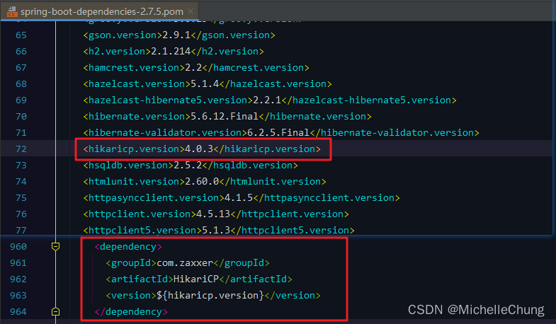
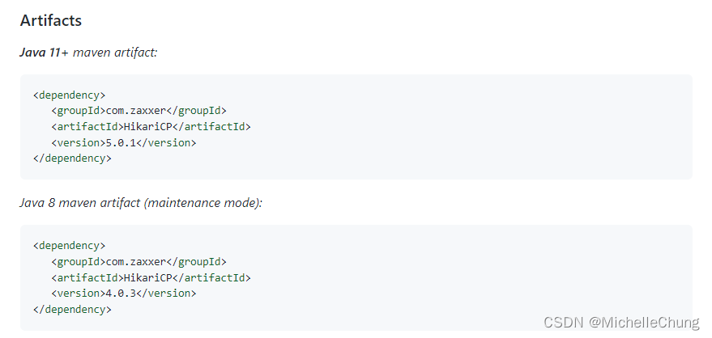
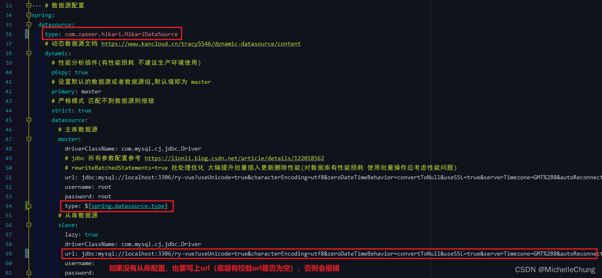
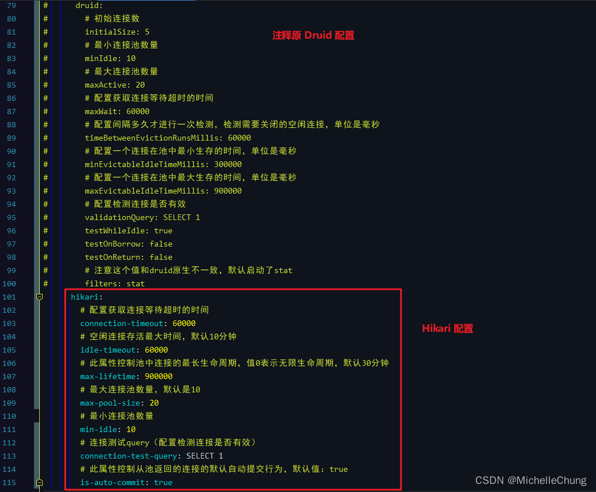
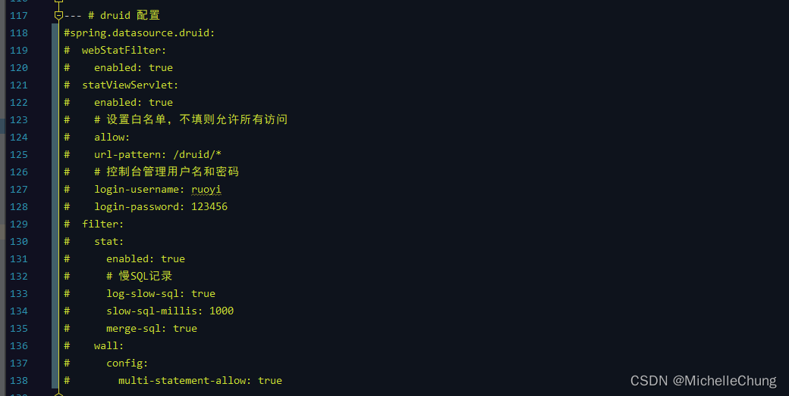
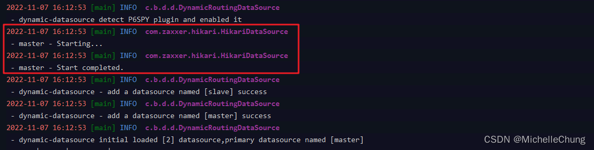

# 扩展笔记 06 - 数据源 Druid 修改为 HikariCP

## 前言
前段时间群里有讨论数据源问题，关于 `Druid` 与 `HikariCP`。两者孰优孰劣本文不进行探讨，只是对于集成 `HikariCP` 做了简单的实现，提供有需要替换数据源的朋友一个参考。

## 参考目录
- [Github - HikariCP](https://github.com/brettwooldridge/HikariCP)
- [SpringBoot集成连接池 - 数据库连接池和默认连接池HikariCP](https://pdai.tech/md/spring/springboot/springboot-x-mysql-HikariCP.html#springboot%E9%9B%86%E6%88%90%E8%BF%9E%E6%8E%A5%E6%B1%A0---%E6%95%B0%E6%8D%AE%E5%BA%93%E8%BF%9E%E6%8E%A5%E6%B1%A0%E5%92%8C%E9%BB%98%E8%AE%A4%E8%BF%9E%E6%8E%A5%E6%B1%A0hikaricp)
- [springBoot默认HikariDataSource配置](http://www.lanxinbase.com/?p=2482)
- [动态数据源HikariCp参数配置](https://github.com/baomidou/dynamic-datasource-spring-boot-starter/blob/master/src/main/java/com/baomidou/dynamic/datasource/spring/boot/autoconfigure/hikari/HikariCpConfig.java)

## 操作步骤
### 1、修改 pom 文件
- 框架版本 `V4.3.1`
- Spring Boot 版本 `2.7.5`

把原本的 Druid 相关的依赖注释即可：

主目录 `pom.xml`<br>


framework 模块 `ruoyi-framework/pom.xml`<br>


因为 Spring Boot 默认数据源即为 `HikariCP`，因此如果没有对版本的特别要求，不需要额外引入依赖。



注：最新版本的 `HikariCP` 要求 JDK 版本为 11+，Java 8 支持的最高版本为 `V4.0.3`。

> 
### 2、修改 application 文件
修改数据源相关配置：

更换数据源类型：


修改数据源配置：




```yaml
hikari:
	# 配置获取连接等待超时的时间
	connection-timeout: 60000
	# 空闲连接存活最大时间，默认10分钟
	idle-timeout: 60000
	# 此属性控制池中连接的最长生命周期，值0表示无限生命周期，默认30分钟
	max-lifetime: 900000
	# 最大连接池数量，默认是10
	max-pool-size: 20
	# 最小连接池数量
	min-idle: 10
	# 连接测试query（配置检测连接是否有效）
	connection-test-query: SELECT 1
	# 此属性控制从池返回的连接的默认自动提交行为，默认值：true
	is-auto-commit: true
```
其他配置请查看参考目录的文档进行配置。

### 3、删除 DruidConfig
删除配置文件 `DruidConfig`，文件路径 `ruoyi-framework/src/main/java/com/ruoyi/framework/config/DruidConfig.java`。

### 4、启动测试


上图说明切换成功。

（完）