# 扩展笔记 07 - CentOS 7 集成 Prometheus + Grafana 监控初体验

## 前言
在微服务框架【RuoYi-Cloud-Plus】上，[狮子大佬](https://blog.csdn.net/weixin_40461281) 新集成了 Prometheus（普罗米修斯）和 Grafana 监控模块（目前在 [dev 分支]((https://gitee.com/JavaLionLi/RuoYi-Cloud-Plus/tree/dev/)) 上可以尝鲜），因为一般情况下很少接触这一类的功能，出于学习的目的就尝试着自己在 Vue 框架上集成了一下，本文只是记录一下集成的过程。

同类型的教程非常多，本文只是在此基础上结合了一下【RuoYi-Vue-Plus】框架进行集成，其他框架可以自行尝试。

**注，通常情况下单体服务不需要用到这一类型的监控功能，本文的主要目的是学习。**

## 参考目录
### 官方文档
- [Prometheus](https://prometheus.io/docs/prometheus/2.37/getting_started/)
- [Grafana](https://grafana.com/docs/grafana/latest/)

### 博客参考
- [CentOS7安装部署Prometheus+Grafana（super_pcm）](https://www.jianshu.com/p/967cb76cd5ca)
- [Prometheus + Spring Boot 应用监控（狂乱的贵公子）](https://www.cnblogs.com/cjsblog/p/14434883.html)

### 相关书目
- [Prometheus云原生监控：运维与开发实战](https://weread.qq.com/web/bookDetail/23d328c072106cb723d1641)
- [Prometheus监控实战](https://weread.qq.com/web/bookDetail/4ca32c50718f639f4ca492b)

## 操作步骤
### 1、Prometheus
### 1.1、安装 Prometheus
本文使用的版本是 LTS 版本 `V2.37.2`。（[传送门](https://prometheus.io/download/)）

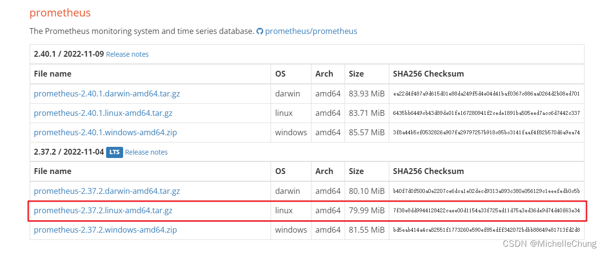

安装方式有多种，可以使用 wget 直接下载，因为网速问题，这里演示下载安装包上传的方式。步骤如下：

首先，官网下载安装包 `prometheus-2.37.2.linux-amd64.tar.gz`。

接着，使用 ftp 工具上传到虚拟机（CentOS 7）目录 `/usr/local` ，解压并重命名文件。

```bash
# 进入目录
cd /usr/local/
# 解压
tar -zxvf prometheus-2.37.2.linux-amd64.tar.gz
# 重命名文件
mv prometheus-2.37.2.linux-amd64 prometheus
```

创建 systemd 服务启动 Prometheus（可选步骤，此处是方便开机启动服务）

```bash
# 创建并编辑文件
vim /etc/systemd/system/prometheus.service
```

文件内容：

```bash
[Unit]
Description=Prometheus
Documentation=https://prometheus.io/
After=network.target
[Service]
Type=simple
User=root
ExecStart=/usr/local/prometheus/prometheus --config.file=/usr/local/prometheus/prometheus.yml 
Restart=on-failure
[Install]
WantedBy=multi-user.target
```

启动服务：

```bash
systemctl start prometheus
```

查看服务状态：

```bash
systemctl status prometheus
```

设置开机启动：

```bash
systemctl enable prometheus
```
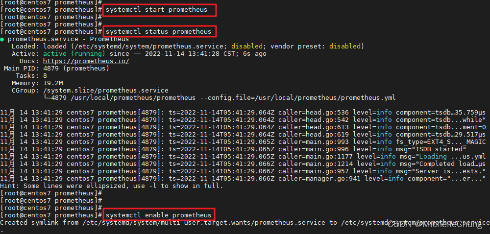

Prometheus 默认端口是 9090，因为虚拟机开启了防火墙，所以此处需要开放防火墙端口 9090（可选步骤，如果没有开启防火墙可以直接忽略）

查看防火墙状态：
```bash
firewall-cmd --state
```
开放端口并重启：

```bash
# 开放端口
firewall-cmd --zone=public --add-port=9090/tcp --permanent

# 重启防火墙
systemctl restart firewalld.service
```

### 1.2、配置 Prometheus
因为框架中原本就集成了 Spring Boot Admin 监控，所以只需要增加 Prometheus 相关的配置即可。

pom 文件加入依赖：
`ruoyi-framework/pom.xml`<br>


`application.yml`<br>
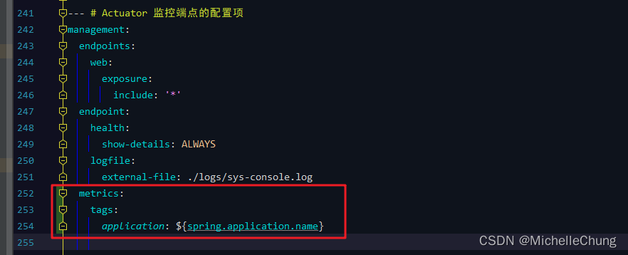

回到虚拟机中，编辑 Prometheus 配置文件：

```bash
vim /usr/local/prometheus/prometheus.yml
```

添加节点信息：（IP 根据实际自行设置即可，也可以参照官方文档进行配置）

```bash
- job_name: "ruoyi-vue-plus"
  metrics_path: '/actuator/prometheus'
  static_configs:
     - targets: ['192.168.2.79:9595']
```
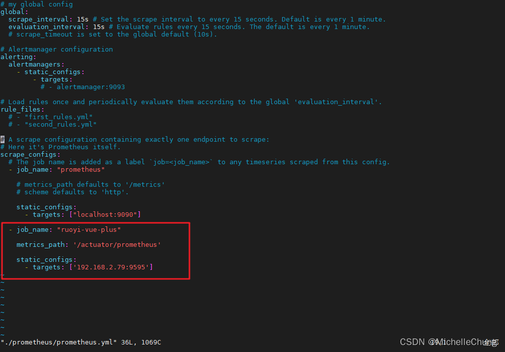

重启 Prometheus：

```bash
systemctl restart prometheus
```
### 1.3、访问控制台

访问控制台：`http://192.168.10.127:9090/`

这里的 IP `192.168.10.127` 是虚拟机的 IP，根据实际情况设置即可。

菜单选择：Status > Targets


### 2、Grafana
### 2.1、安装 Grafana
[官网安装教程传送门](https://grafana.com/docs/grafana/latest/setup-grafana/installation/rpm/)

这里没有选择最新版本下载，选了 `V9.2.0`。因为网速问题，所以去阿里云镜像站下载的 rpm 安装包。（[传送门](https://mirrors.aliyun.com/grafana/yum/rpm/?spm=a2c6h.25603864.0.0.64fe43736yRWIH)）

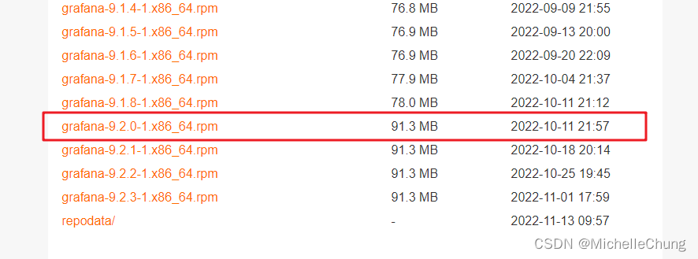

使用 ftp 工具将安装包上传到虚拟机（CentOS 7）目录 `/usr/local` ，使用 `yum` 命令安装：

```bash
yum -y install grafana-9.2.0-1.x86_64.rpm
```

因为是使用安装包，不需要再设置 `systemd `，直接重新加载即可：

```bash
systemctl daemon-reload
```
启动服务：

```bash
systemctl start grafana-server
```

查看服务状态：

```bash
systemctl status grafana-server
```

设置开机启动：

```bash
systemctl enable grafana-server
```
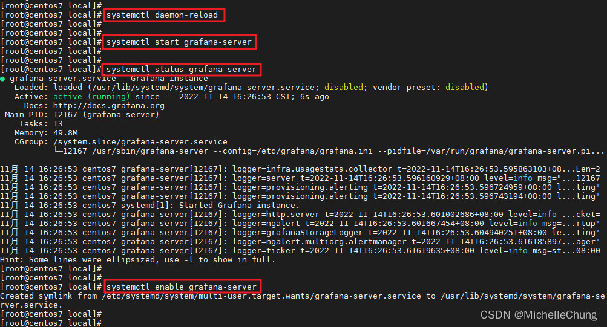

Grafana 默认端口是 3000，所以此处需要开放防火墙端口 3000（可选步骤，如果没有开启防火墙可以直接忽略）

开放端口并重启：

```bash
# 开放端口
firewall-cmd --zone=public --add-port=3000/tcp --permanent

# 重启防火墙
systemctl restart firewalld.service
```

### 2.2、访问控制台
访问控制台：`http://192.168.10.127:3000/`

这里的 IP `192.168.10.127` 是虚拟机的 IP，根据实际情况设置即可。

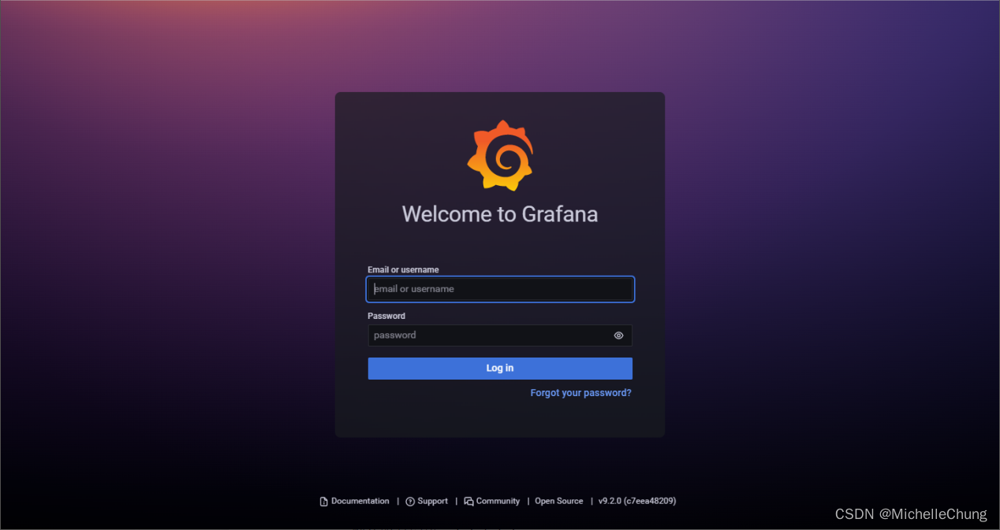

默认账号密码 `admin/admin`

第一次访问会要求修改密码，也可以选择跳过。

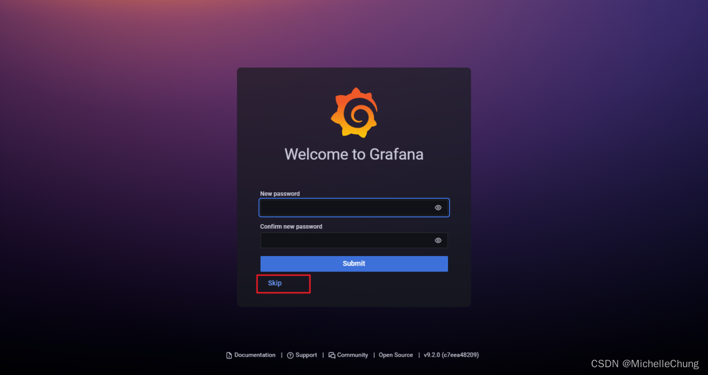

主页：


### 3、Grafana 大屏配置
Grafana 有丰富的大屏组件可以提供下载（[传送门](https://grafana.com/grafana/dashboards/)），这里介绍简单的几种。
### 3.1、添加 Prometheus 数据源
添加数据源入口：<br>
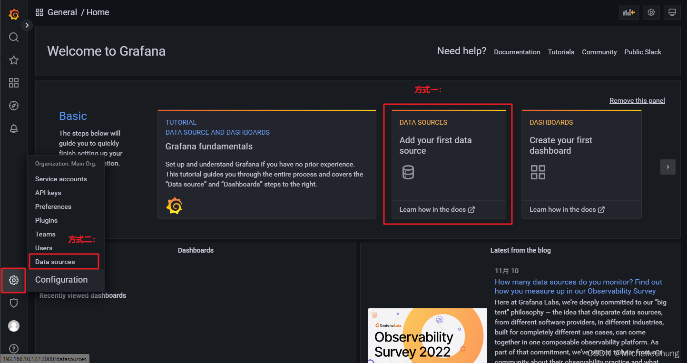

选择 Prometheus：<br>
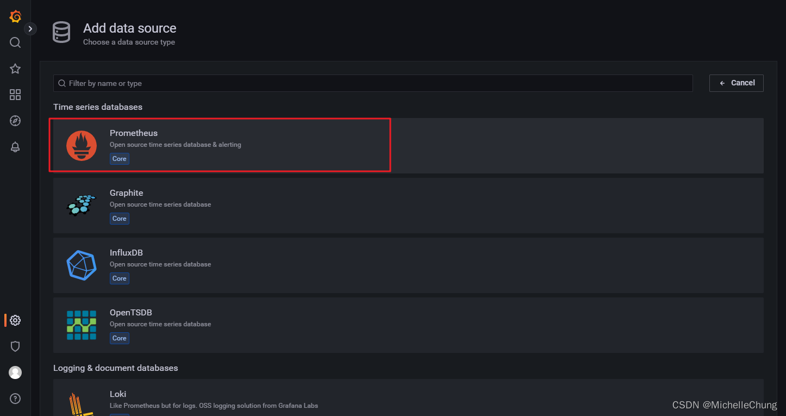

填写地址并保存：<br>
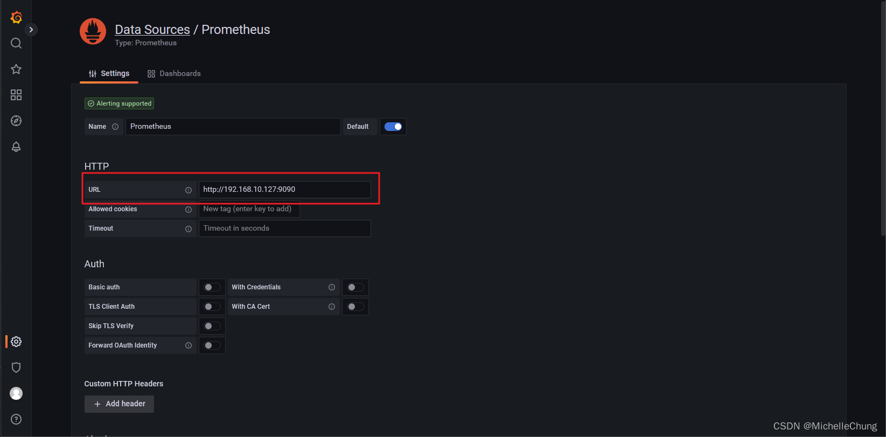
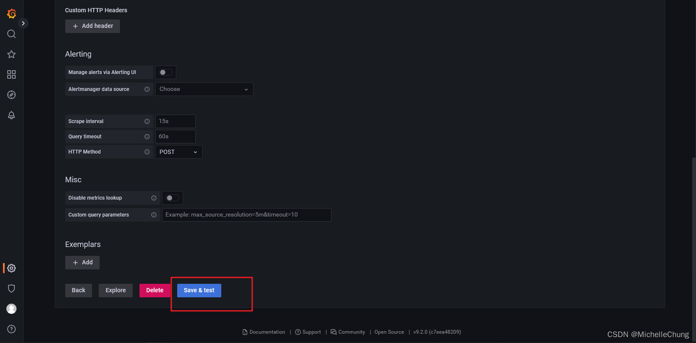
### 3.2、导入 dashboards 仪表板
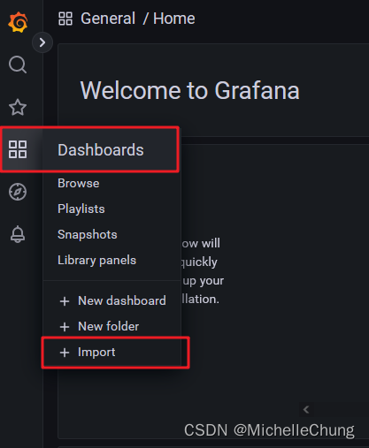

方式有两种：上传 json 文件或者是直接输入 ID。<br>


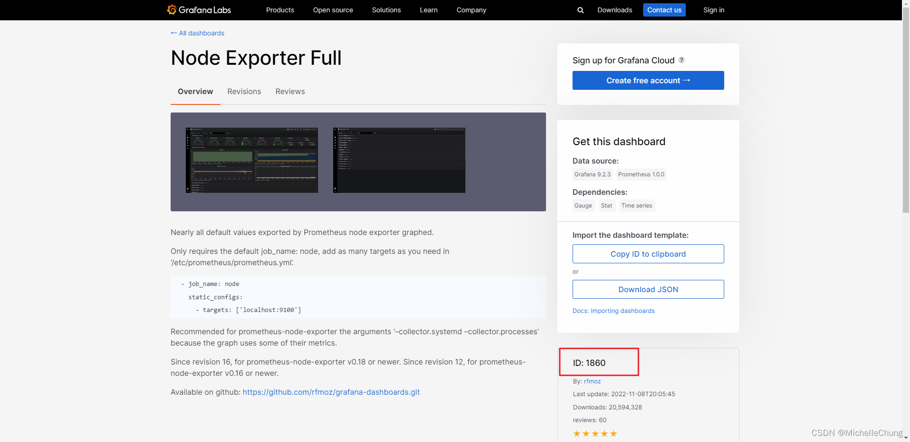

输入 ID，点击 Load：<br>
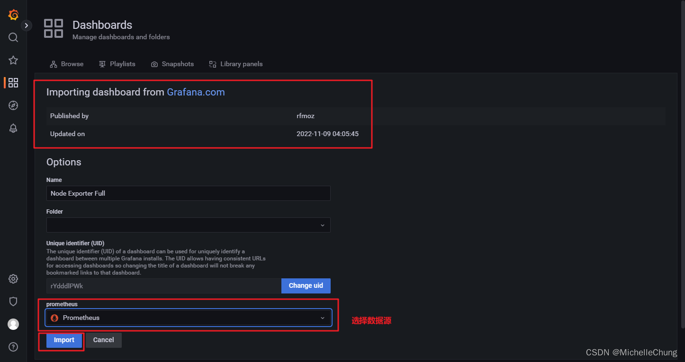

点击导入即可查看大屏数据：<br>
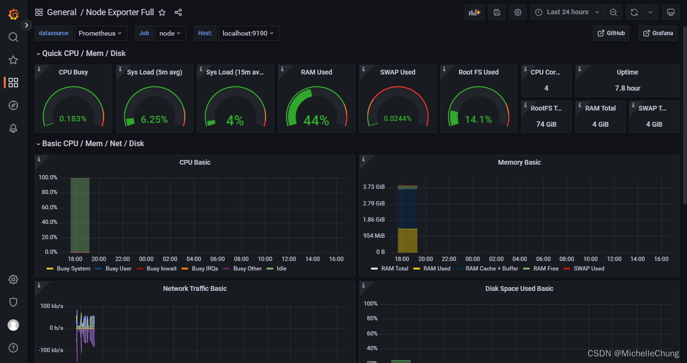

几个推荐的大屏：

1 SLS JVM监控大盘 `ID: 12856`<br>


Spring Boot HikariCP / JDBC `ID: 6083`<br>

### 3.3、配置 node_exporter 监控主机数据
需要在 Prometheus 官网下载相应的文件：<br>

下载好文件之后使用 ftp 工具上传到虚拟机（CentOS 7）目录 `/usr/local` ，解压并重命名文件。

```bash
# 进入目录
cd /usr/local/
# 解压
tar -zxvf node_exporter-1.4.0.linux-amd64.tar.gz
# 重命名文件
mv node_exporter-1.4.0.linux-amd64 node_exporter
```
<br>
可以参考 Prometheus 配置 systemd 并设置开机启动，这里使用 nohup 后台启动。

因为默认端口是 `9100`，和框架 xxl-job 端口有冲突，所以可以指定端口 `9190` 启动：

```bash
cd /usr/local/node_exporter/

nohup ./node_exporter --web.listen-address=:9190 &
```

修改 Prometheus 配置文件，增加相关信息：<br>
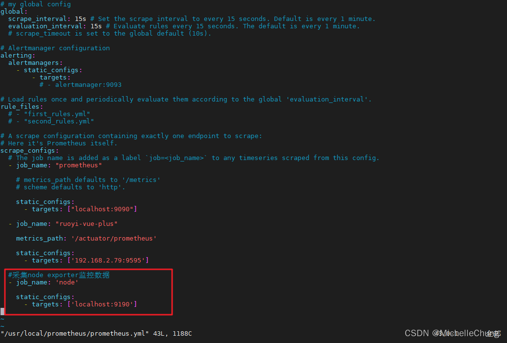

重启 Prometheus，查看控制台：<br>


导入 Grafana Dashboard `ID: 9276`<br>


（完）