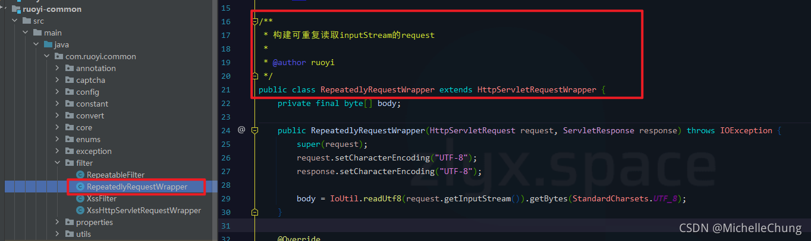
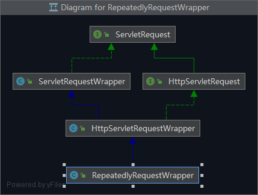
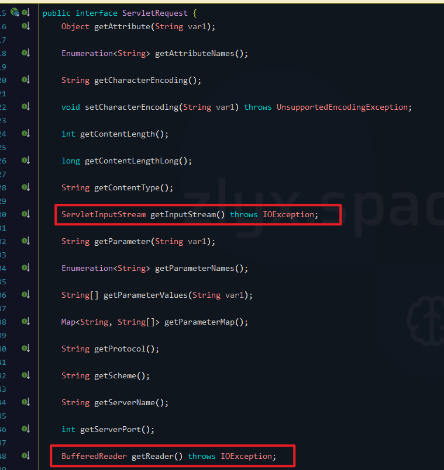
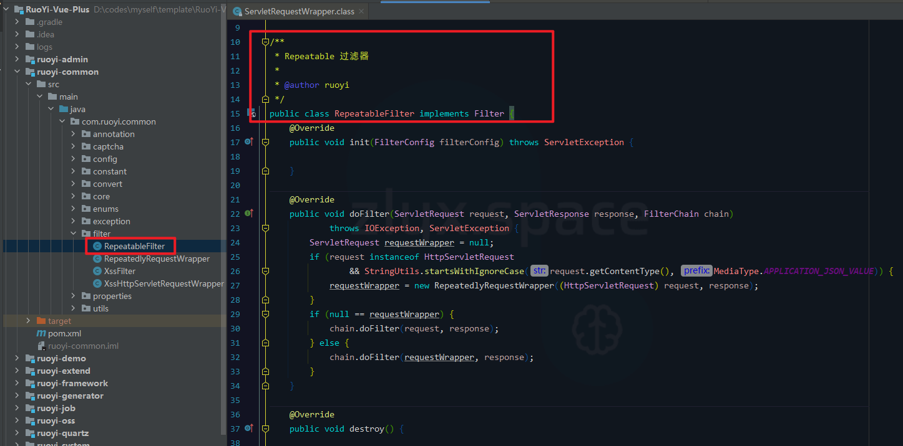

# RepeatedlyRequestWrapper 源码分析（构建可重复读取 InputStream 的 Request）

## 一、概述
本文主要是对框架中【ruoyi-common】模块中的 `com.ruoyi.common.filter.RepeatedlyRequestWrapper` 进行分析。该类的主要作用是 **构建可重复读取 InputStream 的 Request** 。


之所以想说这个类是因为之前的项目中有遇到这样的情景，今天在看框架目录结构的时候突然看到，所以拿出来单独讲讲。

简单说一下当时项目的情况：
- 定义了一个全局的响应处理器 `GlobalResponseBodyAdvice` ，继承了 `ResponseBodyAdvice` 。
- 重写了方法 `beforeBodyWrite` ，该方法用于在接口响应之前实现自定义的业务。**当时的业务主要是为了获取请求参数并记录日志。**
- 如果使用原生的 `HttpServletRequest ` ，**只能读取一次，如果想要二次读取就会报错。** 因此需要能够重复读取 InputStream 的方法。

当然这是以前的老项目了，现在若依的框架有更好的方式记录日志。

## 二、源码分析
### 1、类继承关系

### 2、有参构造器

```java
// 用于保存流的 byte[]
private final byte[] body;

// 有参构造器
public RepeatedlyRequestWrapper(HttpServletRequest request, ServletResponse response) throws IOException {
    super(request);
    request.setCharacterEncoding("UTF-8");
    response.setCharacterEncoding("UTF-8");

	// 读取流并保存到数组 body（IoUtil 是 Hutool 中工具类）
    body = IoUtil.readUtf8(request.getInputStream()).getBytes(StandardCharsets.UTF_8);
}
```

### 3、重写接口 `ServletRequest` 方法


```java
@Override
public BufferedReader getReader() throws IOException {
    return new BufferedReader(new InputStreamReader(getInputStream()));
}

@Override
public ServletInputStream getInputStream() throws IOException {
	// 从 body 中创建新的流 
    final ByteArrayInputStream bais = new ByteArrayInputStream(body);
    return new ServletInputStream() {
        @Override
        public int read() throws IOException {
            return bais.read();
        }

        @Override
        public int available() throws IOException {
            return body.length;
        }

        @Override
        public boolean isFinished() {
            return false;
        }

        @Override
        public boolean isReady() {
            return false;
        }

        @Override
        public void setReadListener(ReadListener readListener) {

        }
    };
}
```
### 4、添加到过滤器 `RepeatableFilter`


```java
@Override
public void doFilter(ServletRequest request, ServletResponse response, FilterChain chain)
        throws IOException, ServletException {
    ServletRequest requestWrapper = null;
    // 判断请求是否属于 HttpServletRequest，并且 Content-type 是否是 "application/json"
    if (request instanceof HttpServletRequest
            && StringUtils.startsWithIgnoreCase(request.getContentType(), MediaType.APPLICATION_JSON_VALUE)) {
        // 判断结果：HttpServletRequest 请求，Content-type 是 "application/json"
        // 创建包装类 RepeatedlyRequestWrapper 封装原生 HttpServletRequest 请求 
        requestWrapper = new RepeatedlyRequestWrapper((HttpServletRequest) request, response);
    }
    if (null == requestWrapper) {
    	// 如果为空 --> 使用原生 HttpServletRequest 请求 
        chain.doFilter(request, response);
    } else {
    	// 如果不为空 -->  使用包装类 RepeatedlyRequestWrapper
        chain.doFilter(requestWrapper, response);
    }
}
```

经过以上步骤即可完成构建可重复读取 InputStream 的 Request。