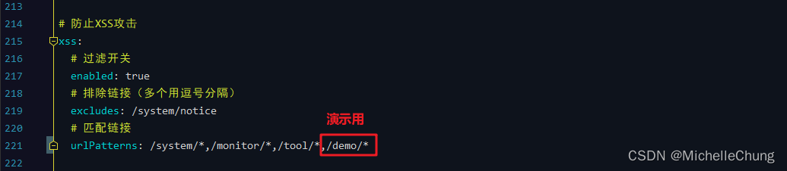
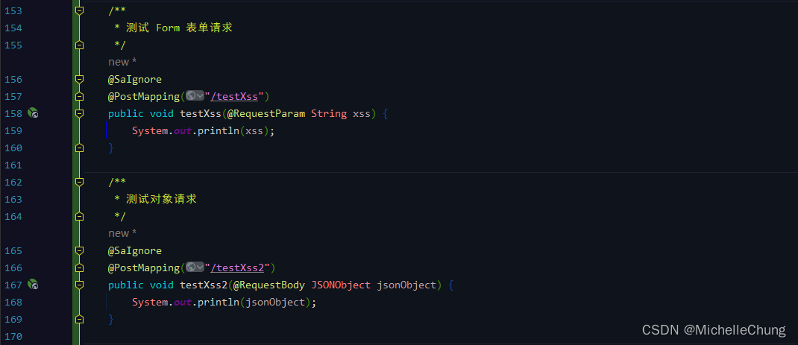
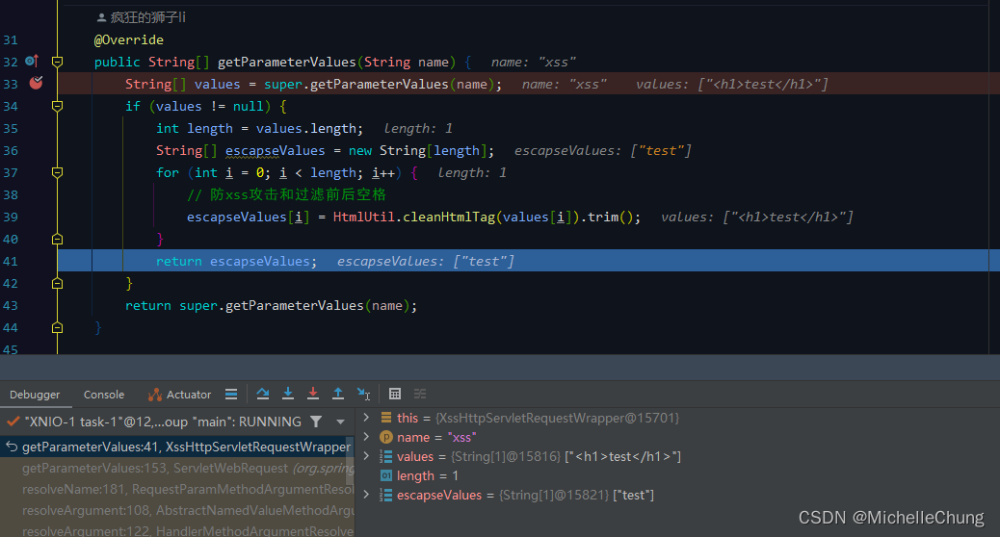

# XSS 过滤器以及 @Xss 注解简单分析

## 前言
之前在对接口进行传参时发现富文本包含的标签全部被过滤掉了，例如：`<h1>test</h1>` 变成了 `test`，但是框架自带的通知公告方法是正常的，请教了 [狮子大佬](https://blog.csdn.net/weixin_40461281) 后才知道原来是因为 XSS 过滤。这个其实是很早之前框架就带上的功能，一开始不知道是做什么的，后面就忘记了，所以本文来简单分析一下。

## 参考目录
### 关于 XSS 攻击
- [前端安全系列（一）：如何防止XSS攻击？](https://tech.meituan.com/2018/09/27/fe-security.html)
- [这一次，彻底理解XSS攻击](https://juejin.cn/post/6912030758404259854)

## 框架集成
### 配置说明
关于 XSS 过滤功能是通过过滤器来实现的，相关的配置如下表：

| 方法 / 类 名称                                                       | 功能                |
|-----------------------------------------------------------------|-------------------|
| com.ruoyi.common.filter.XssFilter                               | 防止 XSS 攻击的过滤器     |
| com.ruoyi.framework.config.properties.XssProperties             | XSS 过滤器配置对象       |
| com.ruoyi.framework.config.FilterConfig#xssFilterRegistration   | 注册 XSS 过滤器        |
| com.ruoyi.common.filter.XssHttpServletRequestWrapper            | XSS 过滤处理请求包装类     |
| com.ruoyi.common.xss.Xss                                        | 自定义 XSS 校验注解      |
| com.ruoyi.common.xss.XssValidator                               | 自定义 XSS 校验注解实现    |

详细的代码就不一一贴出来了，可以到相关类中进行查看。

框架中对于 XSS 的过滤有两种方式：

- 方式一：`application.yml` 配置
- 方式二：`@Xss` 注解

下面会通过 demo 的方式对这两种方式进行简单分析。

### 测试方法一：通过过滤器
`application.yml` 配置：

`TestDemoController` 测试接口：

在 XSS 过滤处理请求包装类 `XssHttpServletRequestWrapper` 中对于不同类型的请求参数使用的过滤方法不同，所以此处进行分开。

`@SaIgnore` 注解是 Sa-Token 忽略鉴权注解，可以不需要登录获取 Token 直接请求接口。

`TestDemoController#testXss` 请求结果：

`TestDemoController#testXss2` 请求结果：

### 测试方法二：通过 `@Xss` 注解
关于 `@Xss` 注解使用可以参考若依官方文档（[传送门](http://doc.ruoyi.vip/ruoyi/document/htsc.html#%E8%87%AA%E5%AE%9A%E4%B9%89%E6%B3%A8%E8%A7%A3%E6%A0%A1%E9%AA%8C)）。

文档中是对请求对象中的参数加上注解，可以参考框架 `SysUser` 对象。

测试接口简化了写法，直接对 Form 表单参数进行校验：

需要注意的是，**对参数的校验会在 Xss 过滤器过滤之后**，进行注解校验测试时，不用打开 Xss 过滤器或者将配置文件中的过滤链接去掉。

`TestDemoController#testXss3` 请求结果：

## 功能调用流程分析
### XSS 过滤器启动初始化
首先根据配置中的条件注册过滤器：

`FilterConfig#xssFilterRegistration` 

根据配置保存需要排除的接口：

`XssFilter#init` 

### Form 表单请求过滤
测试方法一中的第一个方法：

请求接口为 `/demo/demo/testXss`： 

`XssFilter#doFilter` 

过滤器会匹配是否是需要排除的接口。

进入包装类过滤： 
`XssHttpServletRequestWrapper#getParameterValues` 

过滤方法： 

返回过滤后的参数： 

### JSON 对象请求过滤
测试方法一中的第二个方法：

请求接口为 `/demo/demo/testXss2`： 

`XssFilter#doFilter` 

同上，也会对接口进行匹配，看是否需要放行。

接着进入包装类方法过滤标签： 
`XssHttpServletRequestWrapper#getInputStream` 

过滤后： 

### `@Xss` 注解校验
测试方法二中的方法：

请求接口为 `/demo/demo/testXss3`： 

校验方法：

`XssValidator#isValid` 

校验结果：

校验不通过，返回异常信息。

（完）