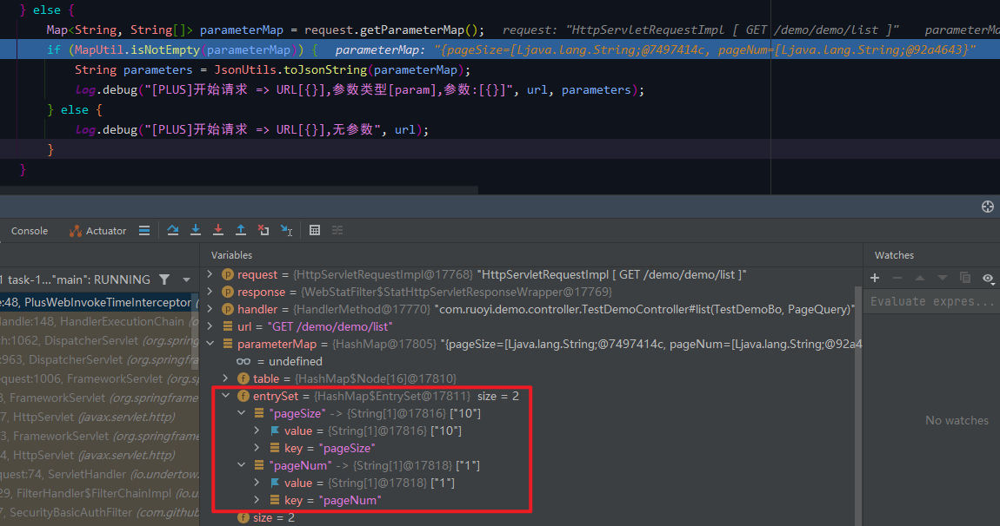

# 全局接口调用时间统计拦截器 PlusWebInvokeTimeInterceptor

## 前言
朋友们新年好！之前的一段时间一直在看尚硅谷新的MySQL的视频（老师讲得真好，推荐大家去看看），今天终于看完了，受益匪浅。
前几天【RuoYi-Vue-Plus】发布了4.0的 [公测版本](https://gitee.com/JavaLionLi/RuoYi-Vue-Plus/tree/4.X-beta1/)，大家有兴趣可以去码云上拉下来看看。今天在看框架目录的时候，看到了 `PlusWebInvokeTimeInterceptor` 这个类，虽然功能不算难，但是可以拿出来学习一下。

这个类主要解决的问题是接口调用时间的统计，以前的项目中一般使用的都是 `ThreadLocal`进行上下文参数传递，但是这里使用了一个全新的类（或者说是我以前没用过的类） `TransmittableThreadLocal`；统计时间使用的方式一般是接口调用前后获取系统当前时间 `System.currentTimeMillis()` 相减之差即为调用时间，这样的方式虽然可以达到目的，但是说实话代码看起来不太美观，框架中使用了一个专门用于时间统计的类 `StopWatch`，调用方式也很简单。

## 参考目录
- [GitHub - transmittable-thread-local](https://github.com/alibaba/transmittable-thread-local)

## 代码分析
### 1、代码功能实现
主要步骤：
1. 继承拦截器接口 `HandlerInterceptor`
2. 重写相关方法 `preHandle`、`postHandle`、`afterCompletion`
3. 注册拦截器到容器中 
步骤1： 

步骤2： 

步骤3： 

### 2、功能实现分析
以测试单表的接口 `/demo/demo/list` 为例进行请求。
#### 2.1、`PlusWebInvokeTimeInterceptor#preHandle`
首先判断是否是生产环境下的配置：是，直接返回true，否，继续下面的逻辑。

生产环境中不进行计时考虑的应当是减少系统性能的消耗。 

然后判断参数类型是否是JSON，并在控制台中打印请求参数。 

请求参数不是JSON，从请求中获取 `parameterMap`。 

然后将参数格式化并输出到控制台。 

控制台打印结果如下： 

最后新建一个计时器 `StopWatch` 并保存到 `TransmittableThreadLocal` 中。 

关于 `TransmittableThreadLocal` 的功能、需求场景、好处等建议查看一下 github 官方文档的描述，这里就不再赘述了。

#### 2.2、`PlusWebInvokeTimeInterceptor#afterCompletion`
同上，首先判断是否是生产环境下的配置：是，直接返回，否，继续下面的逻辑。

然后从 `TransmittableThreadLocal` 中获取秒表并停止计时，然后打印到控制台中。 

控制台打印结果如下（因为debug所以时间比较长）： 

最后调用 `remove()` 方法，防止内存泄漏。