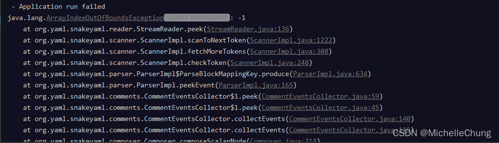
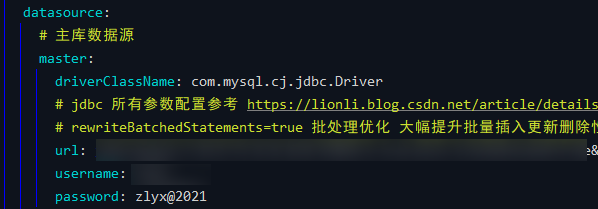
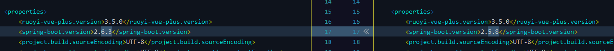
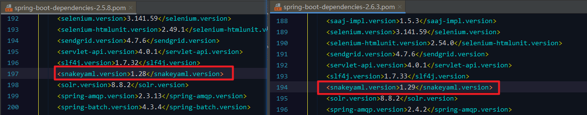
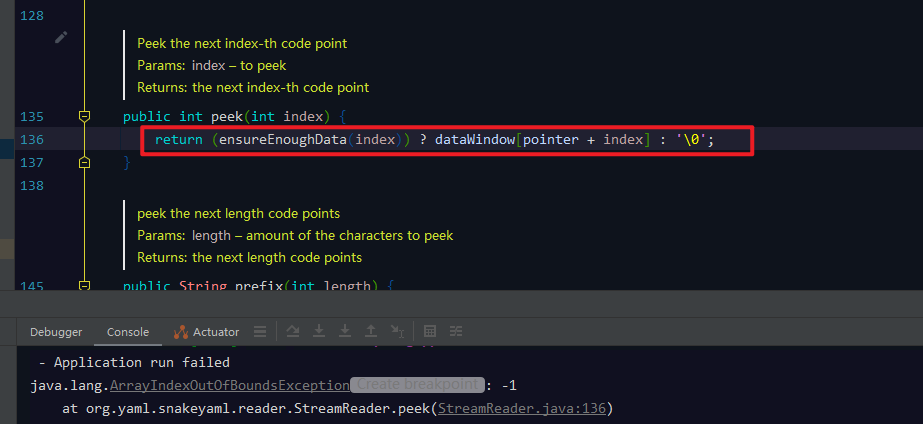

# 问题笔记 01 - 启动报错：Application run failed java.lang.ArrayIndexOutOfBoundsException: -1
- - -
今天更新了框架 dev 分支想去看一下更新的内容，但是遇到了一个不太常见的报错，所以在这里记录一下。

报错截图（文末有详细报错信息）：<br>


去搜了一下，没找到想要的答案，所以就请教了一下 [狮子大佬](https://blog.csdn.net/weixin_40461281) ，原来是配置文件的特殊符号所导致的问题。

原来的数据库密码：有一个特殊符号 `@`<br>


修改后：


修改之后就启动成功了。<br>
>  <br>
<br>


在框架 3.5.0 版本中，Spring Boot 版本是 2.5.8，在 dev 分支中，版本更新到了 2.6.3：<br>


对比了一下两个版本的 yaml 解析器版本：<br>


后面也下载了源码看了一下，本来想 debug 看一下抛出错误的地方是什么导致的，但是能力所限，没找到。如果有大佬知道的话，也欢迎在评论区指点一二，谢谢。

报错的方法：<br>

详细报错信息：<br>

```
 - Application run failed
java.lang.ArrayIndexOutOfBoundsException: -1
	at org.yaml.snakeyaml.reader.StreamReader.peek(StreamReader.java:136)
	at org.yaml.snakeyaml.scanner.ScannerImpl.scanToNextToken(ScannerImpl.java:1222)
	at org.yaml.snakeyaml.scanner.ScannerImpl.fetchMoreTokens(ScannerImpl.java:308)
	at org.yaml.snakeyaml.scanner.ScannerImpl.checkToken(ScannerImpl.java:248)
	at org.yaml.snakeyaml.parser.ParserImpl$ParseBlockMappingKey.produce(ParserImpl.java:634)
	at org.yaml.snakeyaml.parser.ParserImpl.peekEvent(ParserImpl.java:165)
	at org.yaml.snakeyaml.comments.CommentEventsCollector$1.peek(CommentEventsCollector.java:59)
	at org.yaml.snakeyaml.comments.CommentEventsCollector$1.peek(CommentEventsCollector.java:45)
	at org.yaml.snakeyaml.comments.CommentEventsCollector.collectEvents(CommentEventsCollector.java:140)
	at org.yaml.snakeyaml.comments.CommentEventsCollector.collectEvents(CommentEventsCollector.java:119)
	at org.yaml.snakeyaml.composer.Composer.composeScalarNode(Composer.java:214)
	at org.yaml.snakeyaml.composer.Composer.composeNode(Composer.java:184)
	at org.yaml.snakeyaml.composer.Composer.composeValueNode(Composer.java:314)
	at org.yaml.snakeyaml.composer.Composer.composeMappingChildren(Composer.java:305)
	at org.yaml.snakeyaml.composer.Composer.composeMappingNode(Composer.java:286)
	at org.yaml.snakeyaml.composer.Composer.composeNode(Composer.java:188)
	at org.yaml.snakeyaml.composer.Composer.composeValueNode(Composer.java:314)
	at org.yaml.snakeyaml.composer.Composer.composeMappingChildren(Composer.java:305)
	at org.yaml.snakeyaml.composer.Composer.composeMappingNode(Composer.java:286)
	at org.yaml.snakeyaml.composer.Composer.composeNode(Composer.java:188)
	at org.yaml.snakeyaml.composer.Composer.composeValueNode(Composer.java:314)
	at org.yaml.snakeyaml.composer.Composer.composeMappingChildren(Composer.java:305)
	at org.yaml.snakeyaml.composer.Composer.composeMappingNode(Composer.java:286)
	at org.yaml.snakeyaml.composer.Composer.composeNode(Composer.java:188)
	at org.yaml.snakeyaml.composer.Composer.getNode(Composer.java:115)
	at org.yaml.snakeyaml.constructor.BaseConstructor.getData(BaseConstructor.java:135)
	at org.springframework.boot.env.OriginTrackedYamlLoader$OriginTrackingConstructor.getData(OriginTrackedYamlLoader.java:99)
	at org.yaml.snakeyaml.Yaml$1.next(Yaml.java:514)
	at org.springframework.beans.factory.config.YamlProcessor.process(YamlProcessor.java:198)
	at org.springframework.beans.factory.config.YamlProcessor.process(YamlProcessor.java:166)
	at org.springframework.boot.env.OriginTrackedYamlLoader.load(OriginTrackedYamlLoader.java:84)
	at org.springframework.boot.env.YamlPropertySourceLoader.load(YamlPropertySourceLoader.java:50)
	at org.springframework.boot.context.config.StandardConfigDataLoader.load(StandardConfigDataLoader.java:54)
	at org.springframework.boot.context.config.StandardConfigDataLoader.load(StandardConfigDataLoader.java:36)
	at org.springframework.boot.context.config.ConfigDataLoaders.load(ConfigDataLoaders.java:107)
	at org.springframework.boot.context.config.ConfigDataImporter.load(ConfigDataImporter.java:128)
	at org.springframework.boot.context.config.ConfigDataImporter.resolveAndLoad(ConfigDataImporter.java:86)
	at org.springframework.boot.context.config.ConfigDataEnvironmentContributors.withProcessedImports(ConfigDataEnvironmentContributors.java:116)
	at org.springframework.boot.context.config.ConfigDataEnvironment.processWithProfiles(ConfigDataEnvironment.java:311)
	at org.springframework.boot.context.config.ConfigDataEnvironment.processAndApply(ConfigDataEnvironment.java:232)
	at org.springframework.boot.context.config.ConfigDataEnvironmentPostProcessor.postProcessEnvironment(ConfigDataEnvironmentPostProcessor.java:102)
	at org.springframework.boot.context.config.ConfigDataEnvironmentPostProcessor.postProcessEnvironment(ConfigDataEnvironmentPostProcessor.java:94)
	at org.springframework.boot.env.EnvironmentPostProcessorApplicationListener.onApplicationEnvironmentPreparedEvent(EnvironmentPostProcessorApplicationListener.java:102)
	at org.springframework.boot.env.EnvironmentPostProcessorApplicationListener.onApplicationEvent(EnvironmentPostProcessorApplicationListener.java:87)
	at org.springframework.context.event.SimpleApplicationEventMulticaster.doInvokeListener(SimpleApplicationEventMulticaster.java:176)
	at org.springframework.context.event.SimpleApplicationEventMulticaster.invokeListener(SimpleApplicationEventMulticaster.java:169)
	at org.springframework.context.event.SimpleApplicationEventMulticaster.multicastEvent(SimpleApplicationEventMulticaster.java:143)
	at org.springframework.context.event.SimpleApplicationEventMulticaster.multicastEvent(SimpleApplicationEventMulticaster.java:131)
	at org.springframework.boot.context.event.EventPublishingRunListener.environmentPrepared(EventPublishingRunListener.java:85)
	at org.springframework.boot.SpringApplicationRunListeners.lambda$environmentPrepared$2(SpringApplicationRunListeners.java:66)
	at java.util.ArrayList.forEach(ArrayList.java:1257)
	at org.springframework.boot.SpringApplicationRunListeners.doWithListeners(SpringApplicationRunListeners.java:120)
	at org.springframework.boot.SpringApplicationRunListeners.doWithListeners(SpringApplicationRunListeners.java:114)
	at org.springframework.boot.SpringApplicationRunListeners.environmentPrepared(SpringApplicationRunListeners.java:65)
	at org.springframework.boot.SpringApplication.prepareEnvironment(SpringApplication.java:338)
	at org.springframework.boot.SpringApplication.run(SpringApplication.java:296)
	at com.ruoyi.RuoYiApplication.main(RuoYiApplication.java:20)
```
