# 问题笔记 02 - Knife4j | Swagger 文档页面空白 以及 文档参数无法显示问题
- - -
## 前言
今天遇到一个很（sao）不（得）常（一）见（匹）的问题，所以必须要把这部血泪史记录一下。

**注：因为是开发中的项目，所以适当打码，不影响问题描述**

首先描述一下问题：（框架版本是V3.5.0，但是和版本相关性不大）

## 问题一：文档页面空白
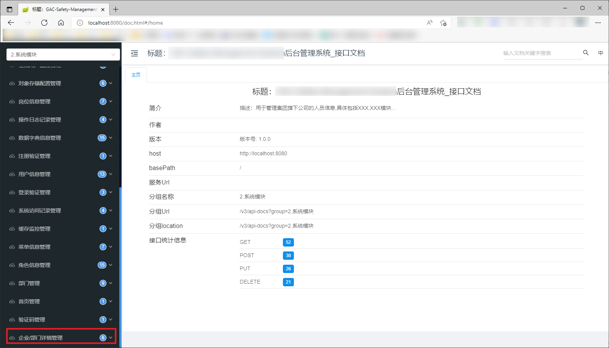

这是接口文档页面（系统模块），红框是我新增的模块，点击模块下的任意接口，页面就会变成空白： 
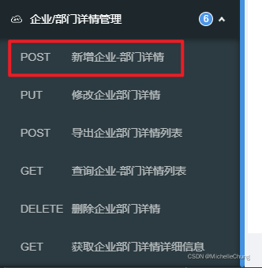

以第一个新增接口为例： 
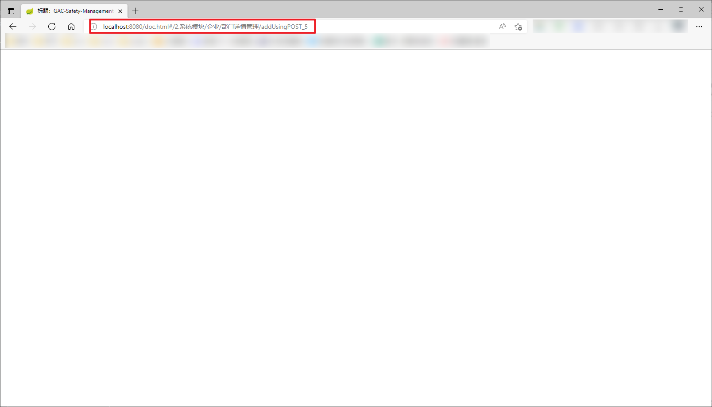

这个问题的原因我很快找到了，解决了问题一，却又出现了问题二，因为问题一和问题二造成的原因一致，所以我先把问题二说完再一起说解决方案。

## 问题二：文档参数无法显示

问题一解决了，点开可以看到正常的接口页面了，但是新的问题接踵而至，参数没了： 
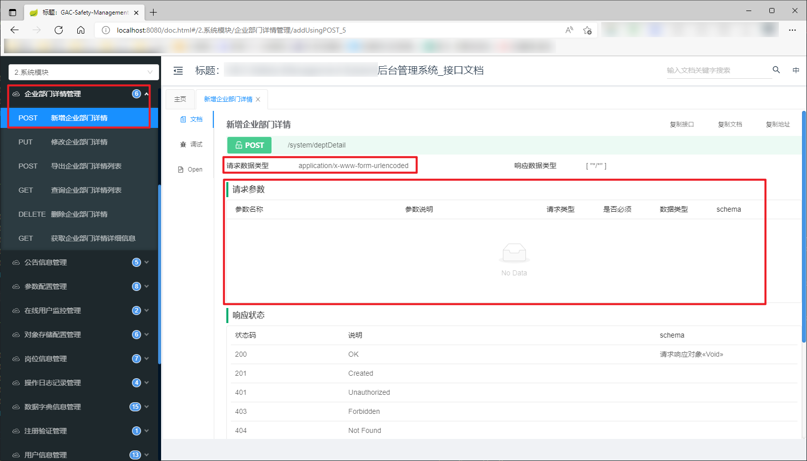

这是用页面代码生成器生成的接口代码： 
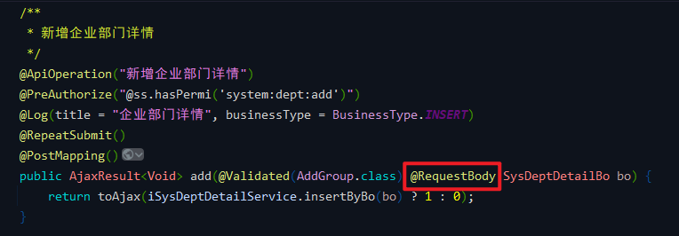 
`@RequestBody` 应该接收的是 JSON 参数，但是页面却是 Form 表单。（这里要感谢 [狮子大佬](https://blog.csdn.net/weixin_40461281) 提醒，一开始没注意这里）

正常的新增接口： 
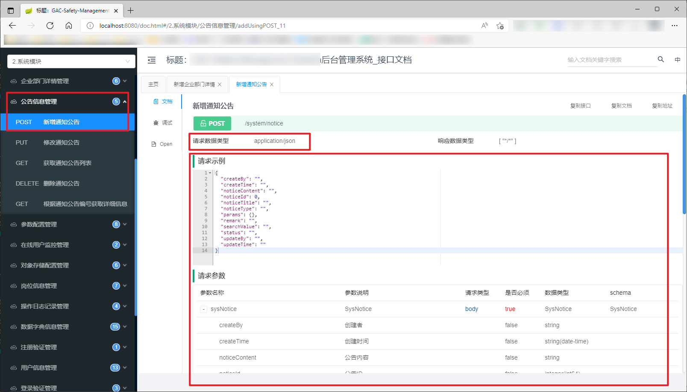

接口代码： 
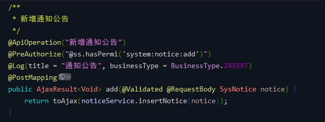

如果去掉 `@RequestBody` ，问题确实可以解决一部分（JSON 参数变成了表单）： 
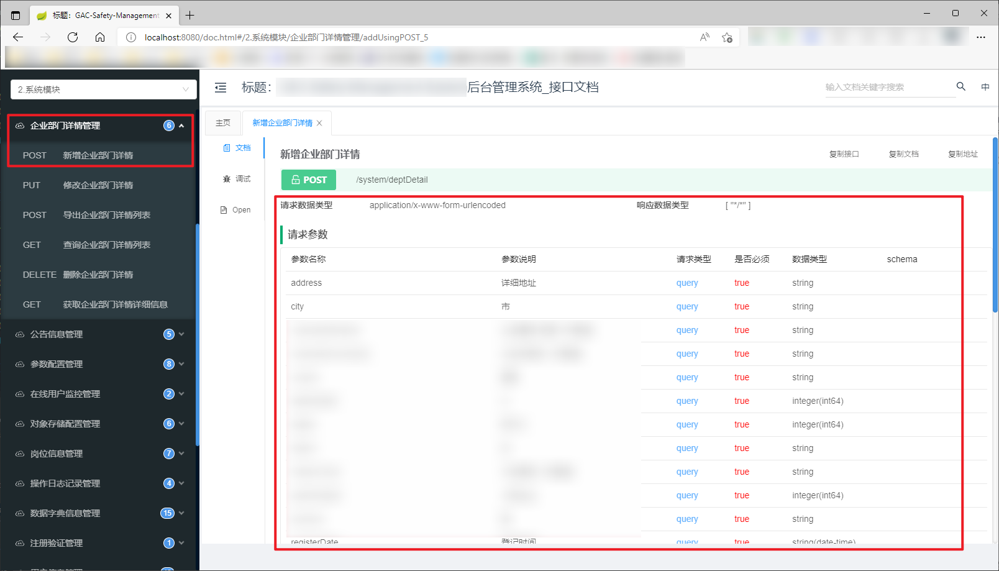
## 问题原因
首先说重点，问题的原因在于 `/` ，没错就是斜杠。

我猜测的原因是因为 `/` 作为特殊符号，前后内容会被解析成路径。

你问我为啥会有斜杠？（**大概是我脑子进水了所以弄了这么个花里胡哨的注释**）

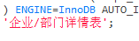

这个注释会出现在生成的代码里面。

举个栗子（`controller`）： 
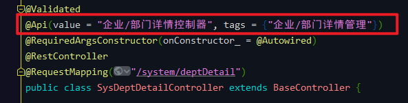

这就是导致问题一的原因。

再举个栗子（`SysDeptDetailBo`）： 
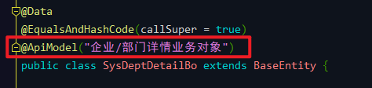

这是请求接口时的业务参数，就是导致问题二的原因。

下面我来扯下怎么解决的这两个问题（没兴趣的朋友请直接到最后解决方案）：

问题一是偶然之间发现的，一开始看到一片空白我也懵了，重启也不管用，然后在改其他接口的时候发现了猫腻： 
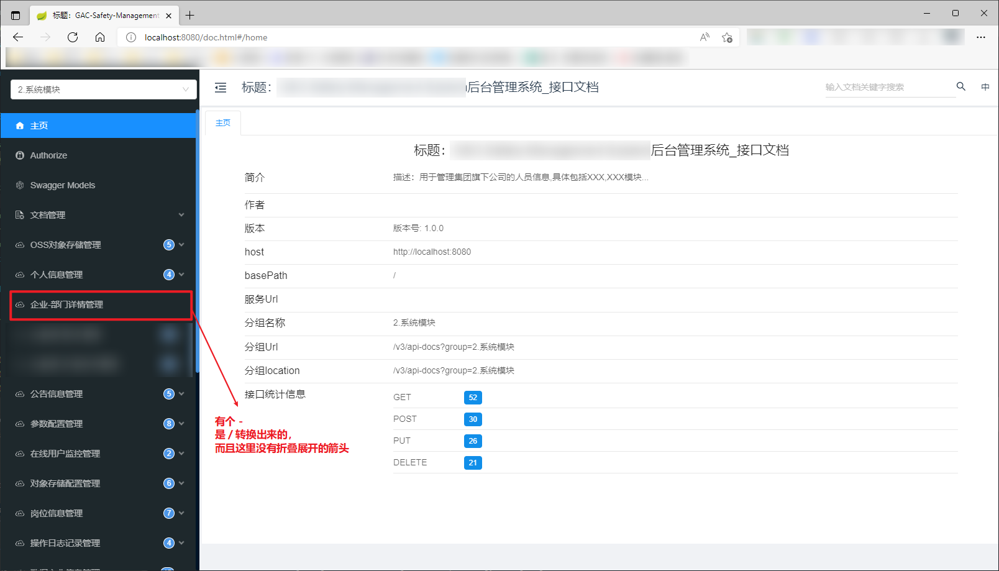

拉到最下面就是有问题的菜单： 
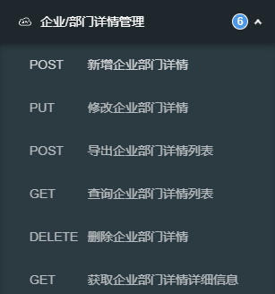

这里点开就会出现空白页。问题一就是这么找到的。

解决完问题一之后忘记还有 `Bo` 这回事，所以问题二搞了挺长时间没解决，最后去群里找大佬请教，经过提醒点开请求参数发现了 `@ApiModel` 参数里面有 `/`，去掉之后所有问题终于迎刃而解。

## 解决方案

1. 把代码所有注解里面的 `/` 去掉。
2. 把数据库注释里面花里胡哨的 `/` 去掉，改用 `,` 或者其他非特殊符号。
