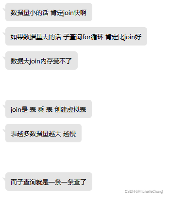

# 问题笔记 03 - 解决 Mybatis-Plus 主子表一对多 SQL 分页数据条数不一致的问题
- - -
## 前言
一对多关系是项目中非常常见的数据库表关联关系，不可避免的会出现需要写 SQL 进行多表关联查询，实现的方式也有很多种。

以前用的比较笨的方式就是先把主表查询出来，然后再循环主表查询子表信息集合然后返回。后来也有用过多线程方式同时查询，会比单线程循环更快一些。

在【RuoYi-Vue-Plus】中使用了 mapper.xml 中的 `<collection>` 标签来进行结果集合并，但是如果使用分页参数，会出现返回条数不一致的问题。

搜索了一圈之后发现常用的解决方法就是使用子查询。

然后向 [狮子大佬](https://blog.csdn.net/weixin_40461281) 讨教了一下，在原来的基础上进行一些修改，也能解决这个问题。

## 表结构说明
| 表属性    | 表名（虚构）   | 表别名  | 关联字段（虚构）       |
|--------|----------|------|----------------|
| 主表     | ATable   | a    | -              |
| 子表（从表） | AaTable  | aa   | a.aid = aa.aid |
| 子表（从表） | AbTable  | ab   | a.aid = ab.aid |
| 子表（从表） | AcTable  | ac   | a.aid = ac.aid |

注：用虚构表以及虚构表字段来说明，实际使用进行替换即可。
## 方式一：子查询方式
### 1、xml 主表字段
```xml
	<resultMap type="ATable" id="ATableResult">
        <result property="aid" column="aid"/>
        <result property="aColumn" column="a_column"/>
        <result property="delFlag" column="del_flag"/>
        
        <collection property="aas"
	                column="aid"
	                ofType="AaTable"
	                select="selectAaTableResult"/>
	    
	    <collection property="abs"
	                column="aid"
	                ofType="AbTable"
	                select="selectAbTableResult"/>
	    
	    <collection property="acs"
	                column="aid"
	                javaType="AcTable"
	                select="selectAcTableResult"/>
    </resultMap>

	<select id="selectAaTableResult" resultType="AaTable">
            select
                aa.id,
                aa.aid
            from AaTable aa
            where aa.del_flag = '0'
                and aa.aid = #{aid}
    </select>

    <select id="selectAbTableResult" resultType="AbTable">
            select
                ab.id,
                ab.aid
            from AbTable ab
            where ab.del_flag = '0'
                and ab.aid = #{aid}
    </select>

    <select id="selectAcTableResult" resultType="AcTable">
            select
                ac.id,
                ac.aid
            from AcTable ac
            where ac.del_flag = '0'
                and ac.aid = #{aid}
    </select>
```
### 2、标签 `<collection>` 参数说明
`<collection>` 标签参数说明：

- property ：对应主表返回的字段名称
- column ：子查询中的关联字段名（对应子查询 `<select>` 中的查询参数）
- ofType ：子查询对象类型（对应子查询 `<select>` 中的 resultType）
- select ：子查询调用方法id（对应子查询 `<select>` 中的 id）

### 3、xml 查询 SQL
```xml
<select id="selectATable" resultType="ATable">
            select
                a.aid,
                a.a_column
            from ATable a
            where a.del_flag = '0'
    </select>
```
只需要查主表字段，不需要查询子表。

### 4、使用说明
- 适用于数据量大的情况。
- 效率上稍微慢点，需要循环去查询。

## 方式二：拆分方式
拆分方式是在原本的 join 表写法基础上进行了拆分的写法，感谢狮子大佬提供的思路。

### 1、思路说明

1. 用分页方法把结果集的主表 id 查询出来，得到 `Page<Long>` 结果集。
2. 用 id 结果集查询所有关联表参数。

### 2、实现类代码
```java
public TableDataInfo<ATable> queryPageList(PageQuery pageQuery) {
        // 用id进行分页（如果有查询条件，可以再加一个Bo对象构造筛选条件）
        Page<Long> page = baseMapper.selectATableIdList(pageQuery.build());
        List<Long> idList = page.getRecords();
        if (CollUtil.isNotEmpty(idList)) {
            // join结果集
            List<ATable> voList = baseMapper.selectATableList(idList);
            // 构造分页对象
            Page<ATable> result = new Page<>(page.getCurrent(), page.getSize(), page.getTotal());
            result.setRecords(voList);
            return TableDataInfo.build(result);
        } else {
            return TableDataInfo.build(new ArrayList<>());
        }
    }
```
### 3、xml 主表字段
```xml
	<resultMap type="ATable" id="ATableResult">
        <result property="aid" column="aid"/>
        <result property="aColumn" column="a_column"/>
        <result property="delFlag" column="del_flag"/>
        
		<collection property="aas" 
                    javaType="java.util.List" 
                    resultMap="AaTableResult"/>
        
        <collection property="abs" 
                    javaType="java.util.List" 
                    resultMap="AbTableResult"/>
        
        <collection property="acs" 
                    javaType="java.util.List" 
                    resultMap="AcTableResult"/>
    </resultMap>

	<resultMap id="AaTableResult" type="AaTable">
        <id property="aaid" column="aaid"/>
        <result property="aid" column="aid"/>
        <result property="aaColumn" column="aa_column"/>
    </resultMap>

    <resultMap id="AbTableResult" type="AbTable">
        <id property="abid" column="abid"/>
        <result property="aid" column="aid"/>
        <result property="abColumn" column="ab_column"/>
    </resultMap>
    
	<resultMap id="AcTableResult" type="AcTable">
        <id property="acid" column="acid"/>
        <result property="aid" column="aid"/>
        <result property="acColumn" column="ac_column"/>
    </resultMap>
```
### 4、标签 `<collection>` 参数说明
`<collection>` 标签参数说明：
- property ：对应主表返回的字段名称
- javaType ：返回列表 `java.util.List`
- resultMap：映射的集合对象 id（对应 `<resultMap>` 中的 id）

这里的写法也可以参考框架中 `SysUser.xml` 中的 `roles` 字段。

### 5、xml 查询 SQL
```xml
	<!-- 查询主表 id 集合 -->
	<select id="selectATableIdList" resultType="java.lang.Long">
        select
            a.aid
        from ATable a
        where a.del_flag = '0'
    </select>

	<!-- 查询联表字段 -->
	<select id="selectPageAccidentList" resultMap="GacAccidentResult">
        select
            a.aid,
            aa.aaColumn,
            ab.abColumn,
            ac.acColumn
        from ATable a
            left join AaTable aa on a.aid = aa.aid and aa.del_flag = '0'
            left join AbTable ab on a.aid = ab.aid and ab.del_flag = '0'
            left join AcTable ac on a.aid = ac.aid and ac.del_flag = '0'
        where a.aid in
        <foreach collection="ids" item="id" open="(" separator="," close=")">
            #{id}
        </foreach>
    </select>
```
### 6、使用说明
- 适用于数据量小的情况。
- 速度较快。

> 狮子大佬的说明：
> 
> 

join 写法一般都是使用 `主表 left join 子表` 的方式，如果子表值为空，也会在集合中返回，可以使用标签属性 `notNullColumn` 进行限制。写法如下：

```xml
	<resultMap type="ATable" id="ATableResult">
        <result property="aid" column="aid"/>
        <result property="aColumn" column="a_column"/>
        <result property="delFlag" column="del_flag"/>
        
		<collection property="aas" 
					notNullColumn="aaid"
                    javaType="java.util.List" 
                    resultMap="AaTableResult"/>
        
        <collection property="abs" 
					notNullColumn="abid"
                    javaType="java.util.List" 
                    resultMap="AbTableResult"/>
        
        <collection property="acs" 
					notNullColumn="acid"
                    javaType="java.util.List" 
                    resultMap="AcTableResult"/>
    </resultMap>
```

将子表的主键id设置为非空字段，如果子表中没有数据，则在主表中的字段列表为空。