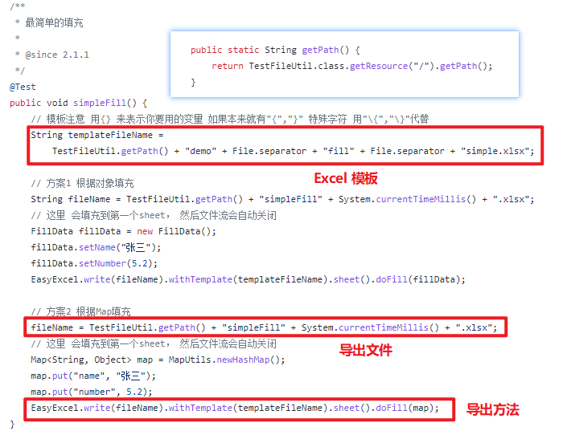
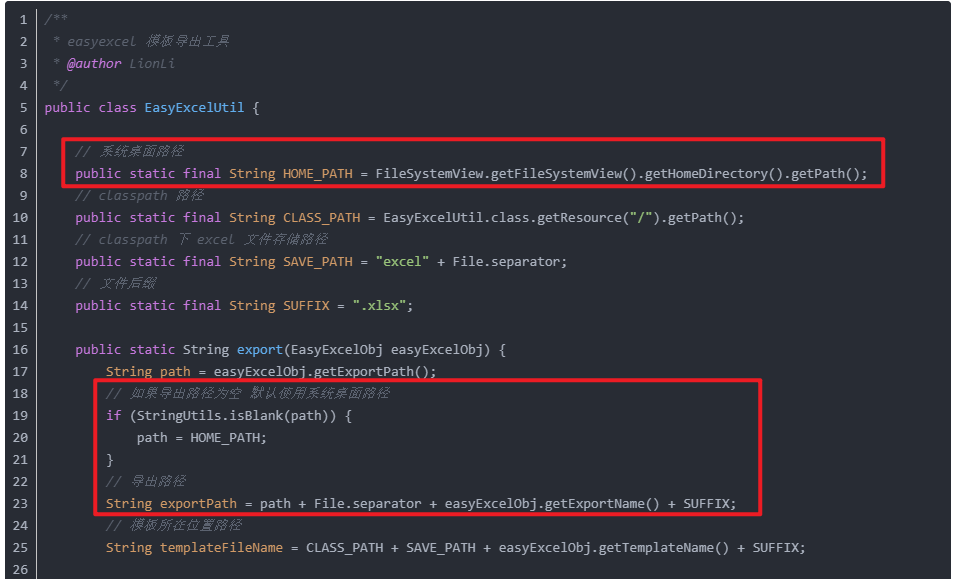
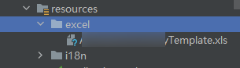
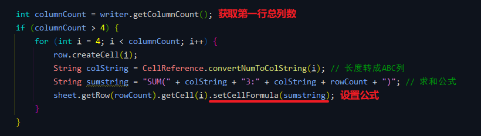

# 问题笔记 04 - EasyExcel 导出 Excel 问题合集
- - -
## 前言
导出需求在后台管理中十分常见，在框架中也有集成相关的框架组件，在默认的生成方法中也有导出方法，但是最近遇到比较复杂的导出需求，也踩了一些坑，所以在此记录一下。

常用的导出都是像框架中的导出方法是传入表头以及数据集合全部写出到空白 Excel 表中，无论是使用 Apache POI 还是 EasyExcel 都不难实现，也有很多现有的方法，但是如果是对模板填充就没有这么简单。

## 参考目录
### EasyExcel 使用参考
- [EasyExcel 官方文档 - 填充 Excel](https://www.yuque.com/easyexcel/doc/fill)
- [EasyExcel 官方 Demo](https://github.com/alibaba/easyexcel/blob/master/src/test/java/com/alibaba/easyexcel/test/demo/fill/FillTest.java)
- [狮子大佬的博客 - springboot2.X 整合 easyexcel 2.X (附带模板导出工具类)](https://lionli.blog.csdn.net/article/details/114638766)
### 问题解决参考
- [Hutool - 压缩工具-ZipUtil](https://hutool.cn/docs/#/core/%E5%B7%A5%E5%85%B7%E7%B1%BB/%E5%8E%8B%E7%BC%A9%E5%B7%A5%E5%85%B7-ZipUtil)
- [Hutool - ClassPath资源访问-ClassPathResource](https://hutool.cn/docs/#/core/IO/%E8%B5%84%E6%BA%90/ClassPath%E8%B5%84%E6%BA%90%E8%AE%BF%E9%97%AE-ClassPathResource)
- [关于使用this.getClass().getResource()获取文件时遇到的坑](https://blog.csdn.net/haoxiaoyong1014/article/details/107452595)
- [POI读取Excel时报错java.util.zip.ZipException: invalid stored block lengths](https://blog.csdn.net/a823007573/article/details/102970460)
## 需求说明
1. 首先是查询到需要导出的数据，这一步主要是 SQL + 业务代码。
2. 根据自定义模板 key 将数据填充到 Excel 模板的指定单元格中，这一步比较复杂的点在于模板的 key 和第 1 步的数据需要对应准确。
3. 将 Excel 表导出。

前面两步都算顺利，看着 Demo 能顺利导出，但是问题出现在第三步。

## 问题一：Excel 导出本地
### 问题说明
找了很多例子，导出的实现都是直接导出到本地，但是我想达到的需求是：Excel 不要直接导出到本地，需要返回二进制流到前端，让前端进行下载。

> 官方 Demo 写法：导出到资源文件夹下<br>
> <br>
狮子大佬的写法：导出到系统桌面或者自定义路径下<br>


和前端小姐姐沟通过，她无法获取到导出路径，所以一开始这里卡了挺久。

### 问题解决方案
这里和同事小哥讨论了之后，他提供了一种“曲线救国”的思路，目前也是采用这种方式实现上面的需求。

实现方式：
1. 将单个或多个 Excel 文件导出到本地，以 UUID 命名一个文件夹，将文件夹路径返回给前端。
2. 前端拿到文件夹路径后，请求下载文件接口：==后端将文件夹压缩为压缩包，然后读取压缩包二进制流输出到前端，同时删除本地文件夹以及压缩包==。

压缩方法：
```java
// 生成zip文件
ZipUtil.zip(url);
```
获取 byte[] 并写出到前端：
```java
byte[] bytes = FileUtil.readBytes(path + ".zip");
// 写出到前端（可以参考框架方法 ExcelUtil#exportExcel）
response.reset();
response.setContentType(MediaType.APPLICATION_OCTET_STREAM_VALUE + "; charset=UTF-8");
// fileName 可以自定义
FileUtils.setAttachmentResponseHeader(response, "fileName.zip");
OutputStream stream = new BufferedOutputStream(response.getOutputStream());
stream.write(bytes);
stream.flush();
stream.close();
```
删除文件夹：
```java
FileUtil.del(url);
```

## 问题二：模板文件读取报错
### 问题说明
Excel 模板不要写死在绝对路径，放在资源文件夹下，但是读取的时候报错了。

模板文件存放位置：



这个问题看起来好像不难，但是也卡了挺久，找了好多方法，换了几种写法都不大好使，报错的内容也不一样……

举几个栗子：
> 报错一：<br>
Create workbook failure<br>
报错二：<br>
Failed to execute 'createObjectURL' on 'URL': Overload resolution failed.<br>
报错三：<br>
Invalid header signature; read 0xE011BDBFEFBDBFEF, expected 0xE11AB1A1E011CFD0 - Your file appears not to be a valid OLE2 document<br>
报错四：<br>
Unexpected record signature: 0X9

报错当时没有截图，就只是复制了一些控制台的打印直接去搜索，所以只记得大概这几种。

最开始的写法（参考官方 Demo 写法）：
```java
// 获取资源文件夹路径
this.getClass().getResource("/").getPath();
```
### 问题解决方案
一开始以为是 `getResource()` 方法有问题，搜了一波之后还是没有解决问题，后面换成了 Hutool 的写法：
```java
InputStream stream = new ClassPathResource("/excel/Template.xls").getStream();

// 模板文件传入 InputStream，原本是传入文件路径
EasyExcel.write(fileName).withTemplate(stream).sheet().doFill(map);
```
报错变了，然后再去搜索就是需要配置 maven 对资源文件不进行压缩：

```xml
<plugins>
	<plugin>
	    <groupId>org.apache.maven.plugins</groupId>
	    <artifactId>maven-resources-plugin</artifactId>
	    <version>3.1.0</version>
	    <configuration>
	        <!--配置不需要压缩的文件-->
	        <nonFilteredFileExtensions>
	            <nonFilteredFileExtension>xlsx</nonFilteredFileExtension>
	            <nonFilteredFileExtension>xls</nonFilteredFileExtension>
	        </nonFilteredFileExtensions>
	    </configuration>
	</plugin>
</plugins>
```
配置好之后重新打包重启之后问题二也顺利解决了。

## 补充说明
在需求第 2 步中，模板其实有一些单元格是写了 SUM 函数的单元格，大家用过 Excel 的话都很熟悉这个函数是用来合计指定单元格的，但是用 EasyExcel 导出的时候，填充了单元格之后，**导出的文件 SUM 函数并不会执行**，但是如果双击填充了数据单元格的话，Excel 又会进行合计（所以我在做这块的时候真的无力吐槽……），找了一圈只能放弃 SUM。

> EasyExcel Issue 截图：<br>
> 

所以后面只能修改模板，把 SUM 函数的单元格也变成模板填充单元格，在程序中进行计算。

记得很久之前用过Apache POI设置单元格公式，找了一下以前的代码证明我的记忆没错乱，改天有时间的话看看能不能优化一下这里的模板。<br>

