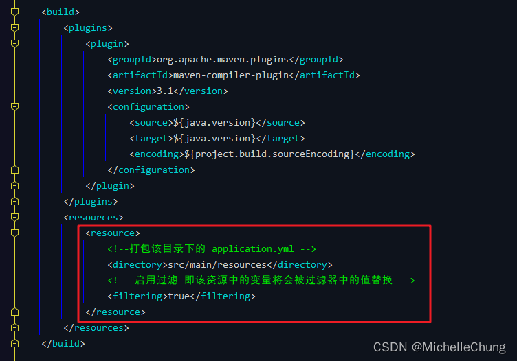
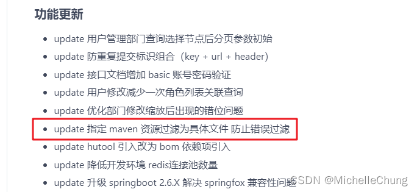
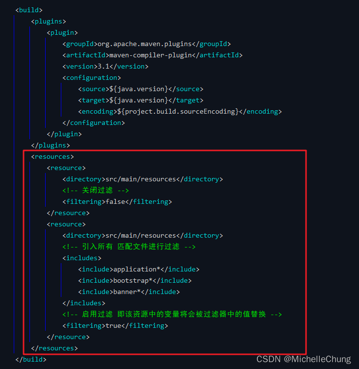
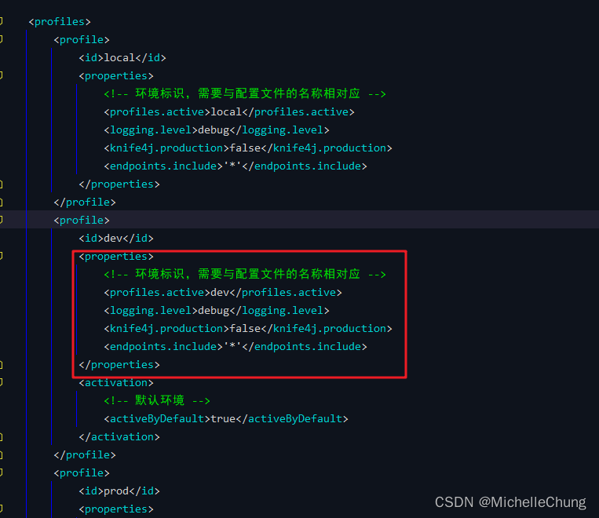
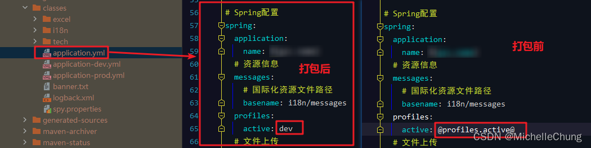
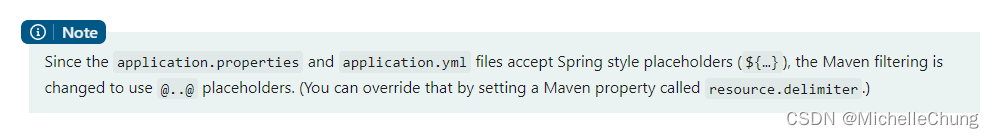
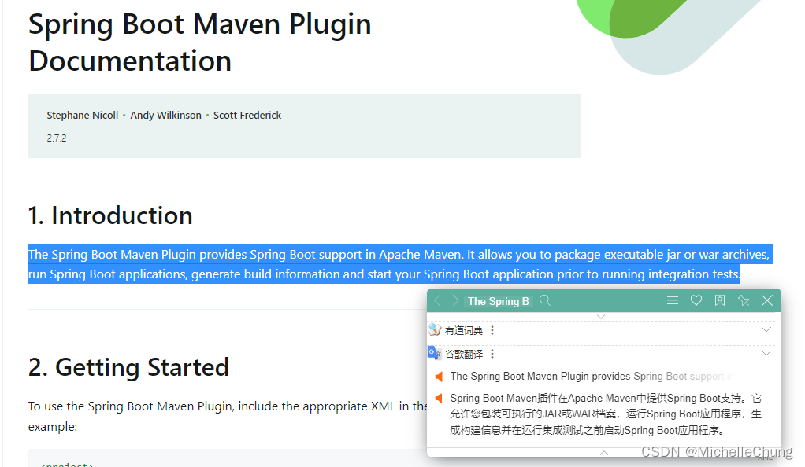
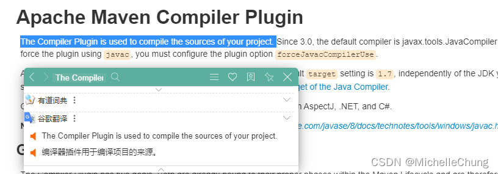

# 问题笔记 05 - V3.5.0 Maven 打包导致文件损坏问题
- - -
## 前言
在上一次的 [问题博客](/ruoyi-vue-plus/issues/04_EasyExcel_export.md) 中有涉及到一个问题是关于 Maven 打包的问题，没想到在这个问题上又栽了一遍，还是有必要单独出（shui）一篇博客出来说一下。

## 参考目录
- [Apache Maven Resources Plugin - Filtering](https://maven.apache.org/plugins/maven-resources-plugin/examples/filter.html#filtering)
- [Apache Maven Resources Plugin - Including and excluding files and directories](https://maven.apache.org/plugins/maven-resources-plugin/examples/include-exclude.html#including-and-excluding-files-and-directories)

## 问题说明
在使用框架 V3.5.0 版本的时候会有一个问题就是 Maven 打包会损坏资源文件。

问题出现在这里：父工程 `pom.xml`<br>

## 问题解决方法
### 方式一：
上次的博客提供了一种解决方法，增加一个插件：

```xml
<plugin>
    <groupId>org.apache.maven.plugins</groupId>
    <artifactId>maven-resources-plugin</artifactId>
    <version>3.1.0</version>
    <configuration>
        <!--配置不需要压缩的文件-->
        <nonFilteredFileExtensions>
            <nonFilteredFileExtension>xlsx</nonFilteredFileExtension>
            <nonFilteredFileExtension>xls</nonFilteredFileExtension>
        </nonFilteredFileExtensions>
    </configuration>
</plugin>
```

### 方式二：
后来我去看框架更新日志才看到在 V4.0.0 已经解决了这个问题：<br>


参考新版的写法可以直接修改 `<resources>` 配置：<br>


```xml
<resources>
    <resource>
        <directory>src/main/resources</directory>
        <!-- 关闭过滤 -->
        <filtering>false</filtering>
    </resource>
    <resource>
        <directory>src/main/resources</directory>
        <!-- 引入所有 匹配文件进行过滤 -->
        <includes>
            <include>application*</include>
            <include>bootstrap*</include>
            <include>banner*</include>
        </includes>
        <!-- 启用过滤 即该资源中的变量将会被过滤器中的值替换 -->
        <filtering>true</filtering>
    </resource>
</resources>
```

## 一些扩展知识
### 1、关于 `<filtering>` 标签
启用过滤的目的是在打包的时候替换配置，举个例子：<br>



### 2、关于写法 `@..@`
在 Apache Maven Resources Plugin 文档中演示的写法都是 `${...}` ，这里除了这种还有就是上图的 `@..@` 写法。这种写法是来自于 [Spring 官方说明](https://docs.spring.io/spring-boot/docs/2.7.2/maven-plugin/reference/htmlsingle/#using) 的：


大致意思就是 `application.properties` 和 `application.yml` 文件接受 Spring 风格的占位符 `${...}`，Maven `<filtering>` 改为使用 `@..@` 占位符写法。

### 3、关于 `spring-boot-maven-plugin` 以及 `maven-compiler-plugin`
在查资料的时候发现 Spring 文档写的是 `spring-boot-maven-plugin` 这个插件，和 `maven-compiler-plugin` 看起来有点像，就去搜索了一下，原来这俩不能说一模一样，简直毫无关系。

> `spring-boot-maven-plugin` 说明：<br>
> 
>
> `maven-compiler-plugin` 说明：<br>
> 

说句人话：
- `spring-boot-maven-plugin` 用于 Spring Boot 项目打包。
- `maven-compiler-plugin` 用户项目代码编译。