# 问题笔记 06 - p6spy 日志打印 SQL 时间格式化问题

## 前言
今天遇到一个之前没有注意的问题，群里有人提及控制台打印的日志格式有问题，无法直接执行。经过一番排查之后找到了解决的方法，在此记录一下。
## 参考目录
- [p6spy sql打印时，日期格式显示问题](https://segmentfault.com/q/1010000020263100)
  谷歌大法找到的解决方案。
- [p6spy 官方文档 - 配置使用说明](https://p6spy.readthedocs.io/en/latest/configandusage.html)
  官方文档也写了相关的配置，只是比较难找。

## 问题说明
如下图：控制台打印的日志时间格式是 `yyyy-MM-dd'T'HH:mm:ss.SSSZ`，而非我们常用的 `yyyy-MM-dd HH:mm:ss`。
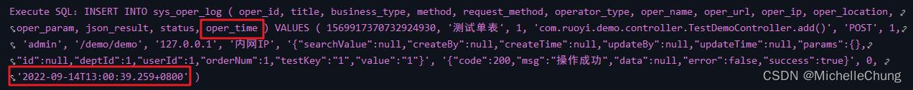
## 问题解决方法
修改 p6spy 配置文件 `spy.properties`
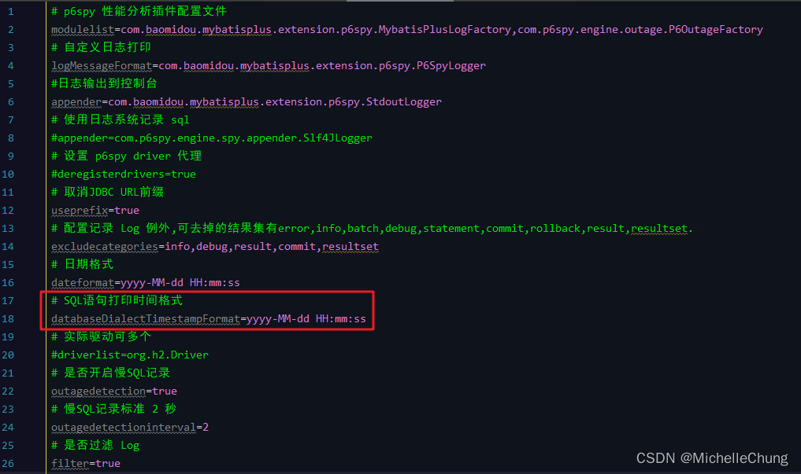

增加配置：

```bash
databaseDialectTimestampFormat=yyyy-MM-dd HH:mm:ss
```
执行效果：<br>
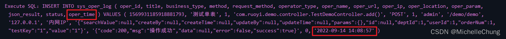
## 问题分析
### 1、官方文档说明

> 官方文档说明：<br>
> 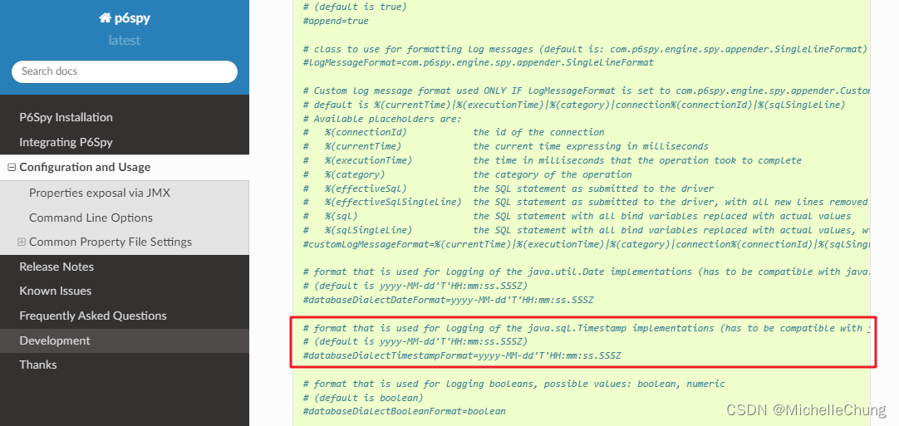
### 2、默认配置
p6spy 默认配置 `P6SpyOptions`<br>
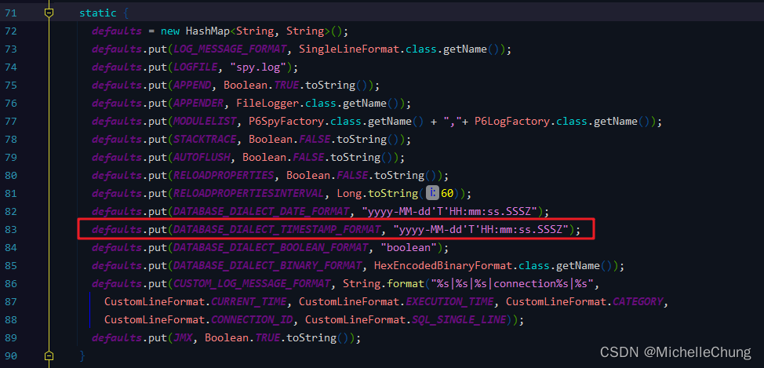
### 3、配置加载流程简单说明
### 3.1、配置文件加载 `SpyDotProperties#SpyDotProperties`
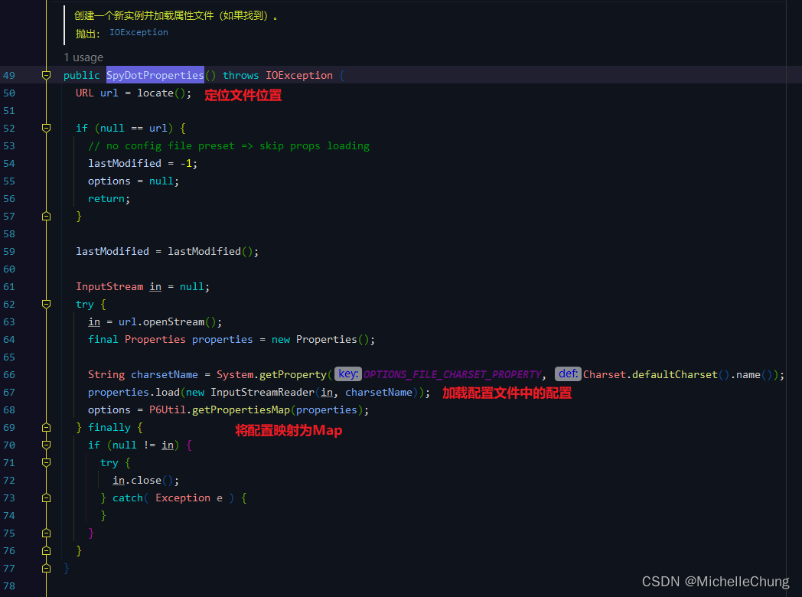
### 3.2、注册模块 `P6ModuleManager#registerModule`
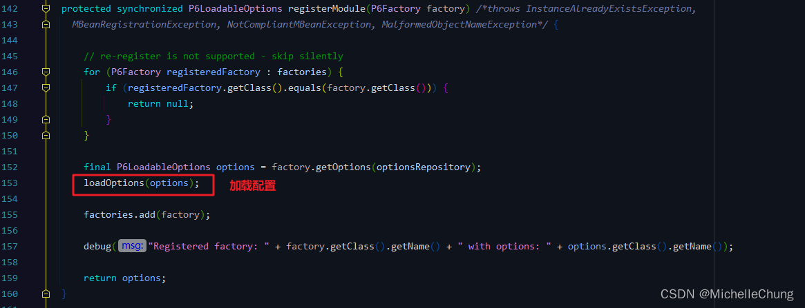
### 3.3、加载配置 `P6ModuleManager#loadOptions`
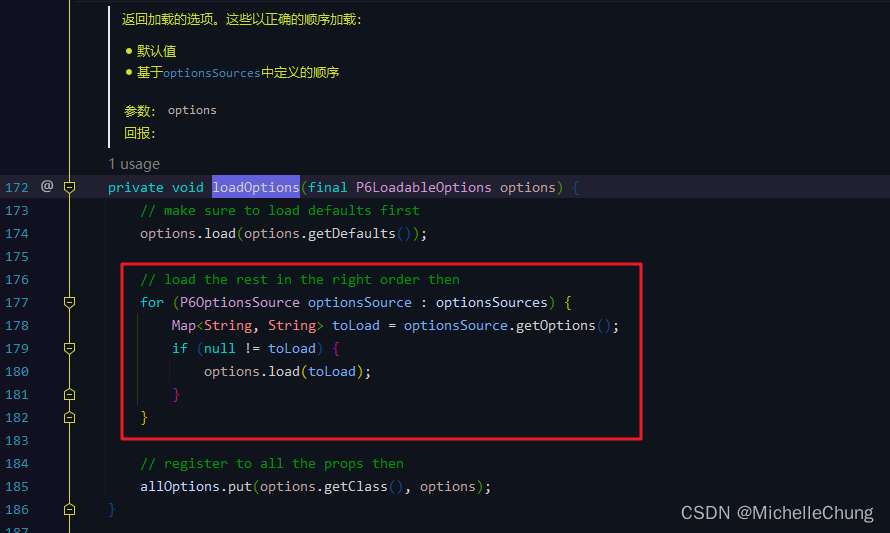

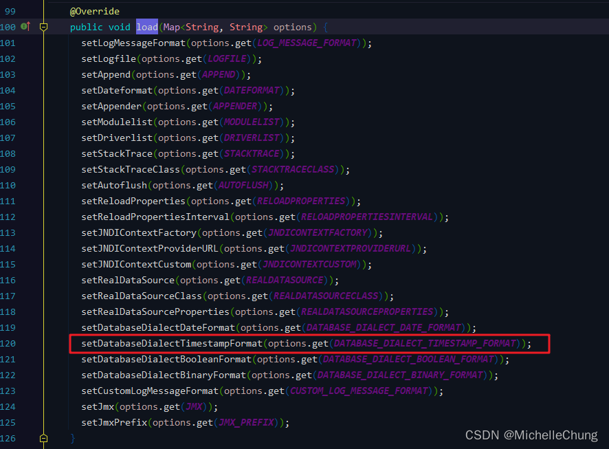

### 4、格式化方法 `Value#convertToString`
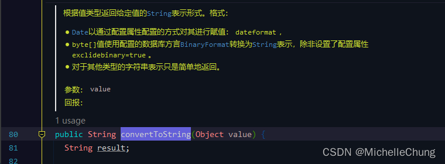

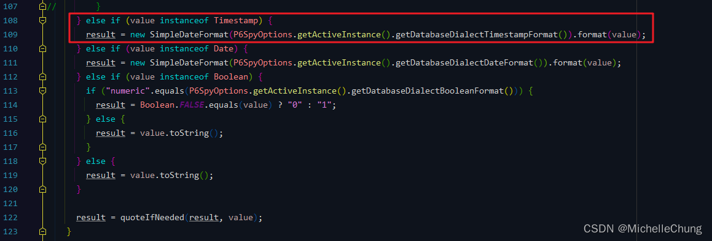
