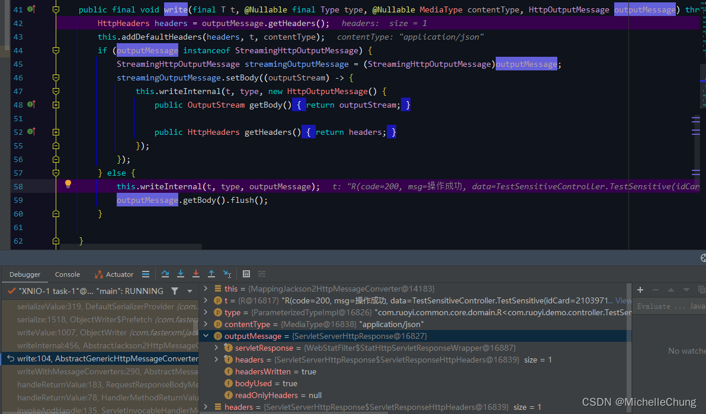
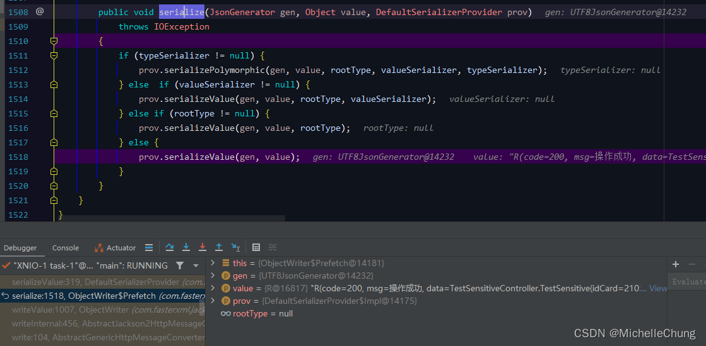
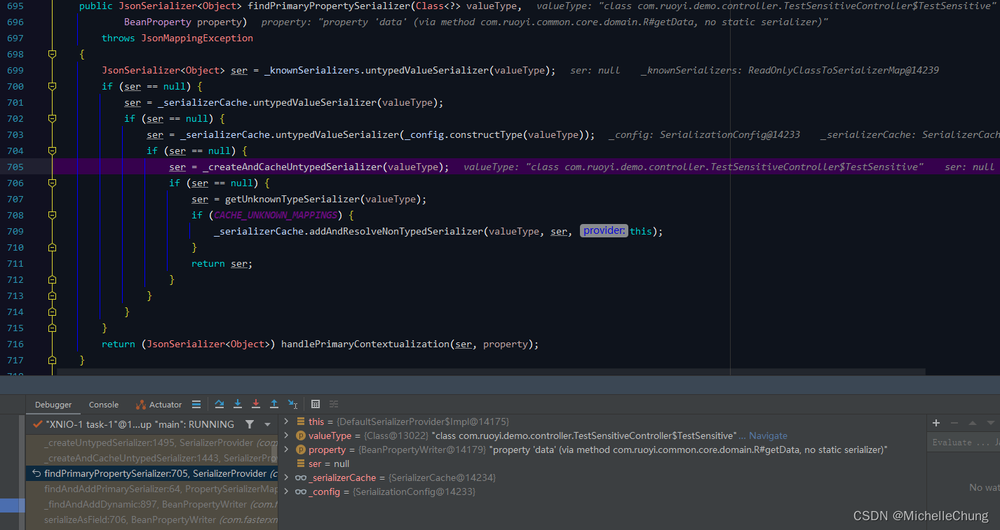
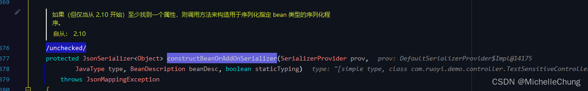
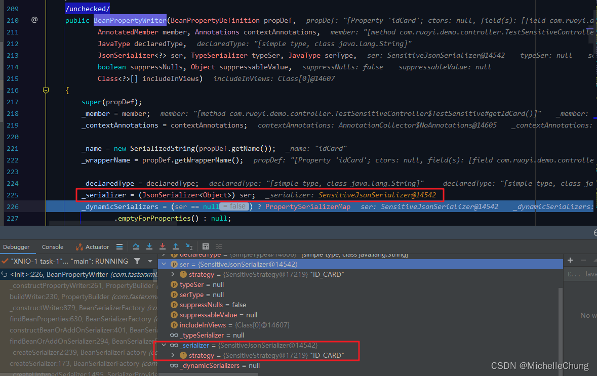

# 数据脱敏 Json 序列化工具 SensitiveJsonSerializer
- - -
## 前言
在框架 V4.0.0 版本更新了序列化脱敏的功能。

在 Demo 模块也增加了数据脱敏的测试类 `TestSensitiveController`，本文来简单分析一下该功能的调用流程。
## 参考目录
- [GitHub - Jackson](https://github.com/FasterXML/jackson)

## 功能代码实现及测试
### 1、数据脱敏注解 `Sensitive`

### 2、脱敏策略枚举 `SensitiveStrategy`

这里所使用的的脱敏工具类底层是 Hutool 的 `DesensitizedUtil`。
### 3、脱敏 Json 序列化器 `SensitiveJsonSerializer`

### 4、测试类 `TestSensitiveController`

需要注意的是，由于在序列化工具中定义了 admin 用户不进行数据脱敏，因此使用 test 用户进行测试，测试结果如下：

## 功能调用流程分析
### ##、流程简图（重点）
首先按照惯例，请记住这张图（后面的流程截图都是基于此）： 

**温馨提醒，由于流程步骤较多（比起以往的多很多），结合这张图走不容易迷路。**
### #1、处理返回结果 `RequestResponseBodyMethodProcessor#handleReturnValue`
由于前置步骤较多，这里从 REST 请求的处理返回值方法开始进行分析，这里是 Spring Web MVC REST 处理流程的其中一个步骤（处理 HandleMethod 执行结果），如果不熟悉的话可以找相关资料复习一下，这里不做详细说明。

执行过程： 

### #2、使用消息转换器转换返回结果 `AbstractMessageConverterMethodProcessor#writeWithMessageConverters`
在该方法中有以下执行步骤： 

1. 判断返回值类型是否是字符类型？
   否 —— 解析返回值类型 R  
   
2. 判断是否是资源类型？
   否  
   
3. 判断是否设置了 contentType ？
   否 —— 获取 selectedMediaType 为 application/json  
   
4. 遍历所有消息转换器，使用转换器写出消息。
   
### #3、`AbstractGenericHttpMessageConverter#write`

### #4、`AbstractJackson2HttpMessageConverter#writeInternal`

### #5、返回值序列化为JSON对象 `com.fasterxml.jackson.databind.ObjectWriter#writeValue`

### #6、`Prefetch#serialize`

### #7、`DefaultSerializerProvider#serializeValue`

### #8、`DefaultSerializerProvider#_serialize`

### #9、`BeanSerializer#serialize`

### #10、循环序列化返回值对象所有字段 `BeanSerializerBase#serializeFields`

### #11、`BeanPropertyWriter#serializeAsField`
### #11.1、判断Json序列化器是否为空？
**注：第一次请求时为空，后续请求不为空。** 

是：获取序列化器 `BeanPropertyWriter#_findAndAddDynamic`； 
否：执行步骤 `#26` 序列化。 
### #11.2、获取序列化器 `BeanPropertyWriter#_findAndAddDynamic`

### #12、`BeanPropertyWriter#_findAndAddDynamic`

### #13、`PropertySerializerMap#findAndAddPrimarySerializer`

### #14、`SerializerProvider#findPrimaryPropertySerializer`

### #15、`SerializerProvider#_createAndCacheUntypedSerializer`

### #16、`BeanSerializerFactory#createSerializer`

### #17、`BeanSerializerFactory#_createSerializer2`

### #18、`BeanSerializerFactory#findBeanOrAddOnSerializer`

### #19、构造序列化器 `BeanSerializerFactory#constructBeanOrAddOnSerializer`
 

 

执行完后面的流程后获得的序列化器： 

### #20、获取所有Bean对象属性 `BeanSerializerFactory#findBeanProperties`

### #21、循环构造BeanPropertyWriter `BeanSerializerFactory#_constructWriter`

### #21.1、`PropertyBuilder#buildWriter`

### #22、`PropertyBuilder#_constructPropertyWriter`

### #23、`BeanPropertyWriter#BeanPropertyWriter`

**注：将 Json 序列化器保存到上下文中，后面调用不再需要新建。**
### #24、`SerializerProvider#handlePrimaryContextualization`

### #25、创建自定义上下文序列化器 `SensitiveJsonSerializer#createContextual`

### #26、`SensitiveJsonSerializer#serialize`

继续执行步骤 `#11`。 

### #27、自定义数据脱敏 Json 序列化工具 `SensitiveJsonSerializer#serialize`

### #27.1、获取脱敏策略，根据脱敏策略脱敏

### #27.2、JsonGenerator 写出内容
在步骤 `#27` 方法中，不同字段对应了不同脱敏策略，由于逻辑比较简单可以自行理解，因此这里只展示其中一种，其他流程同理。

至此，完成了所有字段的序列化流程后，将向客户端返回 REST HTTP 消息。