# 翻译功能 Translation 源码分析

## 前言
朋友们新年好呀，好久没有更新专栏了，有一部分原因是前段时间比较懒（诶不是，是工作比较忙），还有一部分原因是最近投入到了 [框架 5.X 版本](https://gitee.com/JavaLionLi/RuoYi-Vue-Plus/tree/5.X/) 的开发当中，目前在开发多租户相关的功能。多说两句，5.X 是基于 `Spring Boot 3.X` 和 `JDK 17`，因此不再向下兼容了，是一次大升级，不过功能还不完善，所以目前只能学习使用，投入生产还需要一段时间。

回到这篇文章，想说说 [狮子大佬](https://blog.csdn.net/weixin_40461281?type=blog) 开发的一个新的功能：翻译功能。

之所以会有这个功能，起因是 5.X 改变了字段存储的类型：`表结构创建人和修改人字段使用ID存储`，但是前端展示还是维持原本的样子，因此需要把 id 转换成原本的内容再返回。**框架采用的是和脱敏功能类似的方式，通过自定义注解 + 自定义序列化器来实现**，具体的过程下面细说。

## 参考目录
- [翻译功能](https://gitee.com/JavaLionLi/RuoYi-Vue-Plus/wikis/%E6%A1%86%E6%9E%B6%E5%8A%9F%E8%83%BD/%E6%89%A9%E5%B1%95%E5%8A%9F%E8%83%BD/%E7%BF%BB%E8%AF%91%E5%8A%9F%E8%83%BD)
  
主要是关于该功能的使用说明以及扩展说明。 
- [【RuoYi-Vue-Plus】学习笔记 28 - 数据脱敏 Json 序列化工具 SensitiveJsonSerializer](01%20-%20数据脱敏%20Json%20序列化工具%20SensitiveJsonSerializer.md)
  
关于序列化过程的解析可以参考以前的这篇文章，本文不再重复这一部分，主要说明翻译功能的实现以及调用流程。

## 功能代码实现及测试
### 目录结构说明
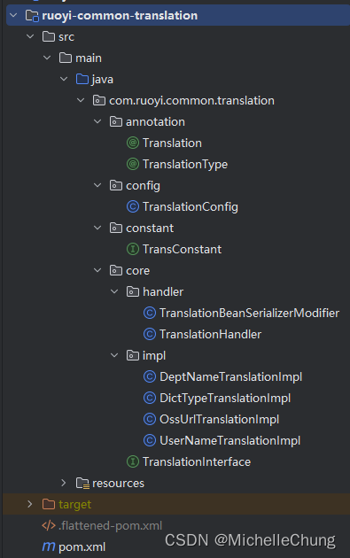

| 类                                 | 说明          | 功能                             |
|-----------------------------------|-------------|--------------------------------|
| Translation                       | 通用翻译注解      | 标注需要翻译的字段，用于实体类字段上             |
| TranslationType                   | 翻译类型注解      | 标注翻译字段的实现类型，用于实现类上标注           |
| TransConstant                     | 翻译常量        | TranslationType 类型常量           |
| TranslationConfig                 | 翻译模块配置类     | 配置初始化，设置序列化修改器                 |
| TranslationBeanSerializerModifier | Bean 序列化修改器 | 解决序列化过程中 Null 被单独处理问题          |
| TranslationHandler                | 翻译处理器       | 对标注了 `@Translation` 注解的字段进行翻译  |
| TranslationInterface              | 翻译接口        | 提供翻译接口用于自定义翻译扩展                |
| *TranslationImpl                  | 翻译实现类       | 根据 TranslationType 提供不同的翻译数据   |

### 测试类
系统目前内置了几种常用的翻译功能，包括：`用户 id 转账号`，`部门 id 转名称`，`字典类型转标签`，`ossId 转 url`。本文以用户id转账号为例进行说明。

`com.ruoyi.demo.domain.vo.TestDemoVo` 
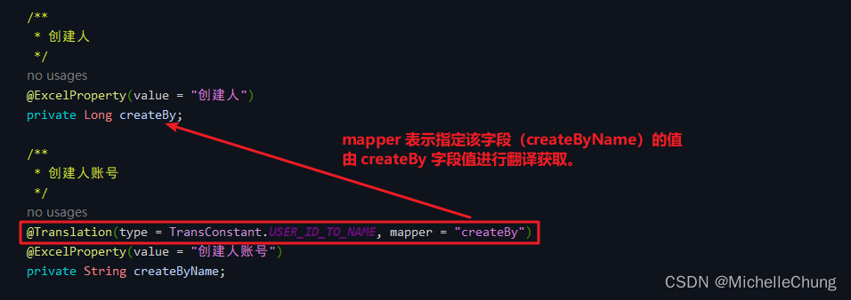

如上图，只需要在实体类字段上标注好注解即可，mapper是指定取相应字段的值进行翻译。

调用列表接口 `/demo/demo/list`，查看页面返回值。 
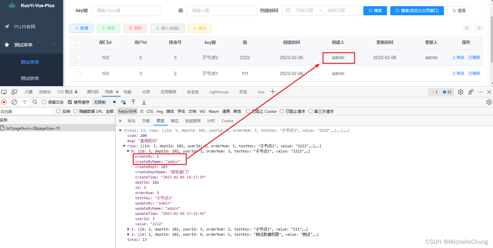
## 功能调用流程分析
### 1、翻译配置初始化 `TranslationConfig#init`
初始化方法流程如下： 
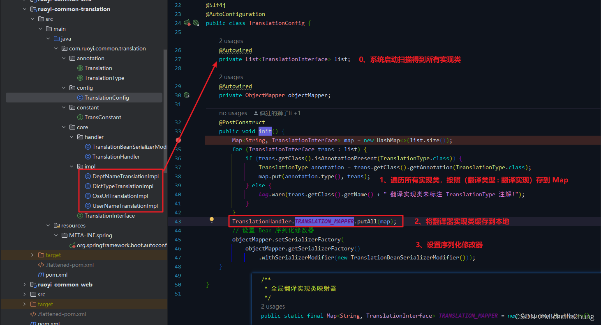

系统启动时，会自动扫描所有类，因此根据所有 `TranslationInterface` 实现类的长度创建一个map。 
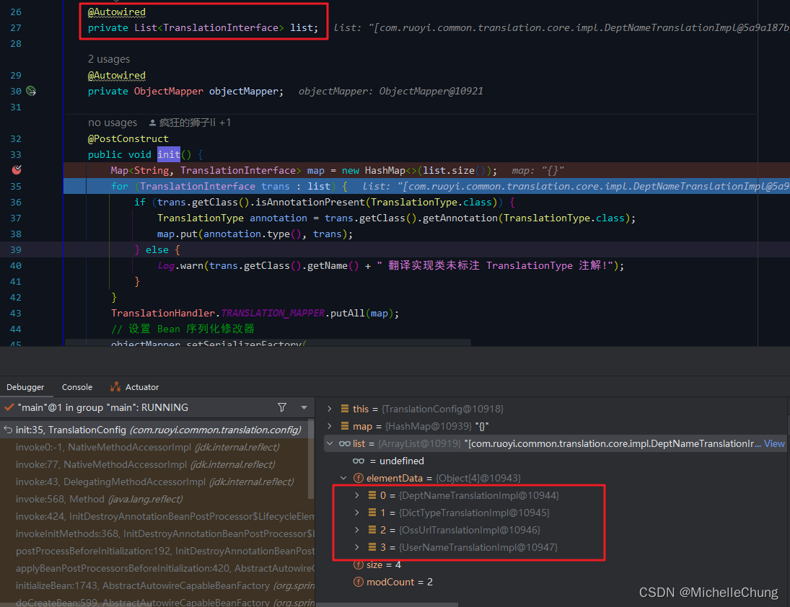

遍历所有实现类并按照 key 为翻译类型（实现类上标注的 type），value 为翻译实现的结构存到 map。 
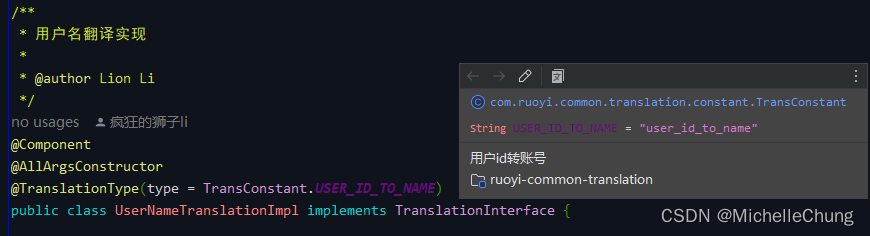

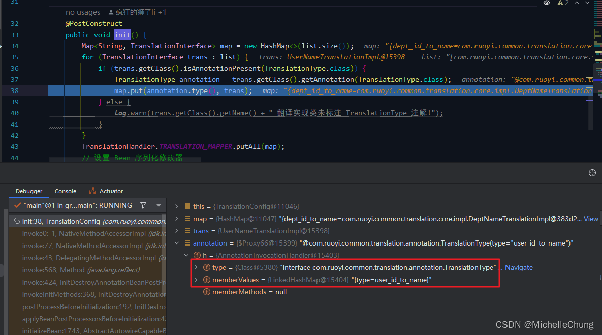

保存到 `TRANSLATION_MAPPER` ： 
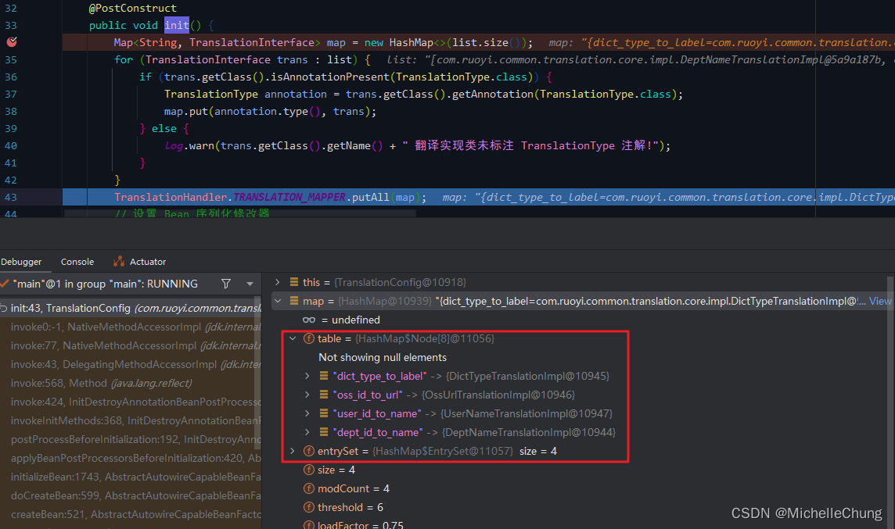

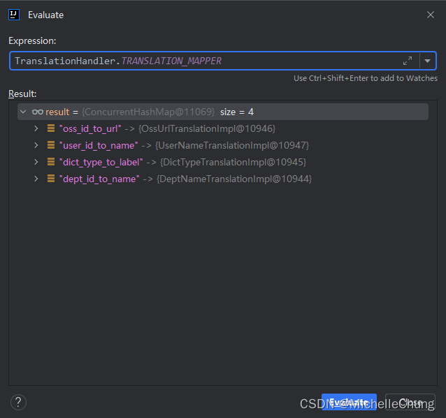
### 2、翻译功能的实现
注意这里只分析系统自定义的部分，关于完整的序列化流程这里不再展开，如果有兴趣的朋友可以参考之前的笔记 28（在上面参考目录有列出）。
### 2.1、创建自定义上下文序列化器 `TranslationHandler#createContextual`
在第一次进行 Bean 属性序列化操作的时候，会先创建上下文序列化器，然后会缓存到本地，便于下次的序列化操作。 
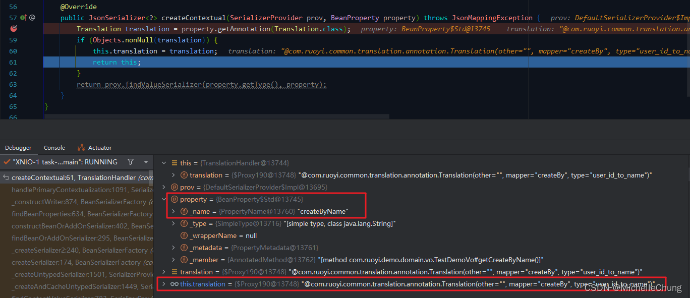
### 2.2、设置空值序列化器 `TranslationBeanSerializerModifier#changeProperties`
当 Bean 属性值为 null，会有专门的空值序列化操作，这里设置了翻译功能的空值序列化器还是 `TranslationHandler`。如果不设置，则会走默认的序列化器。 
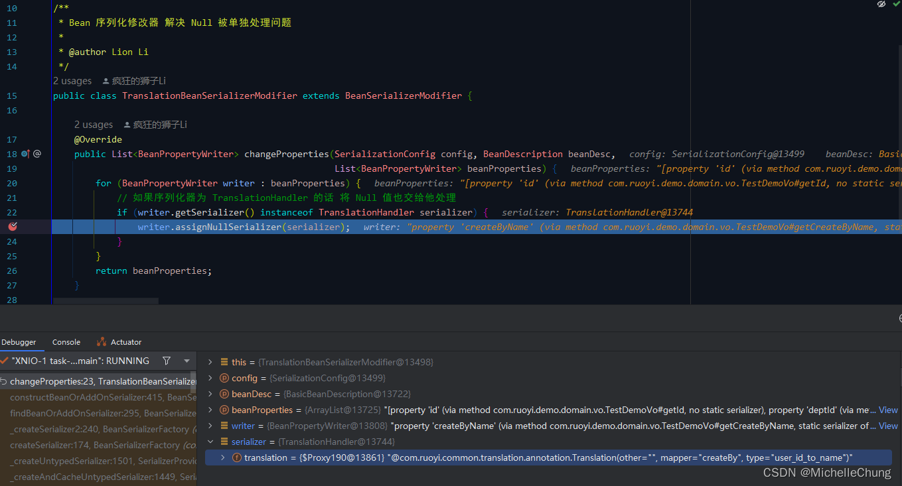

查看设置了序列化器的字段： 
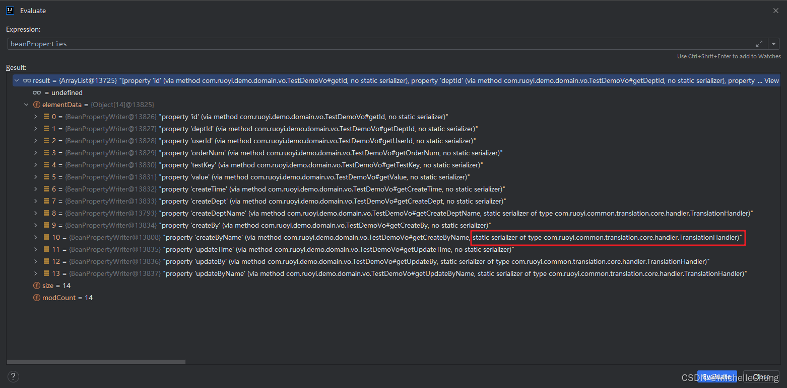

序列化器以及空值序列化器： 
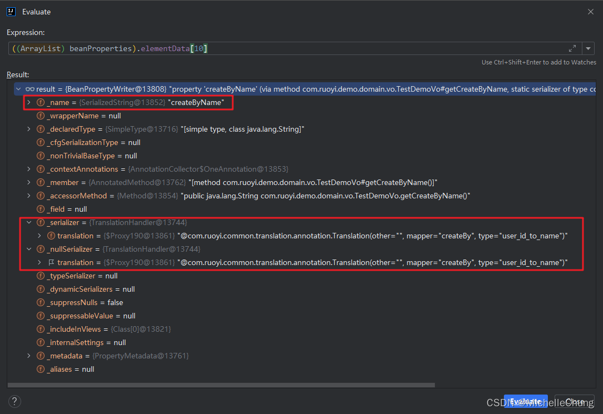
### 2.3、属性值的翻译实现 `TranslationHandler#serialize`
上面说到需要设置空值序列化器，当需要序列化该空字段的时候，会调用以下方法： 

`BeanPropertyWriter#serializeAsField` 
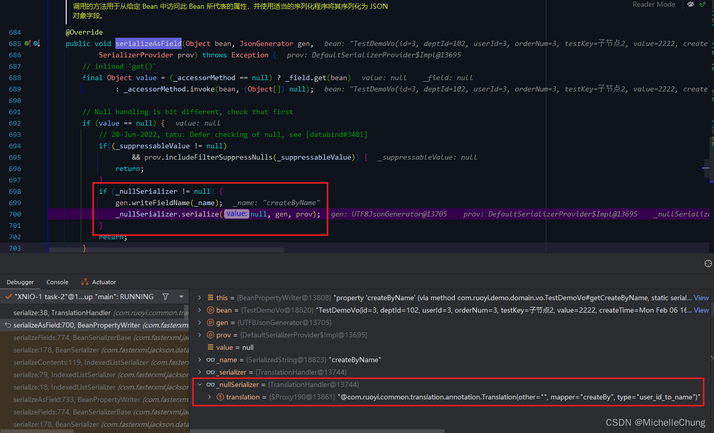

`TranslationHandler#serialize` 
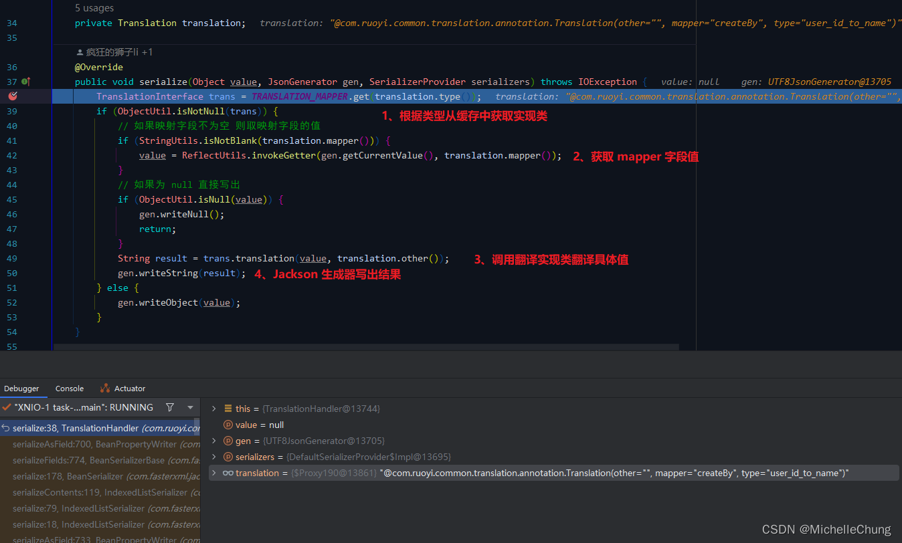

首先获取实现类，通过反射获取注解标注的映射的字段值： 
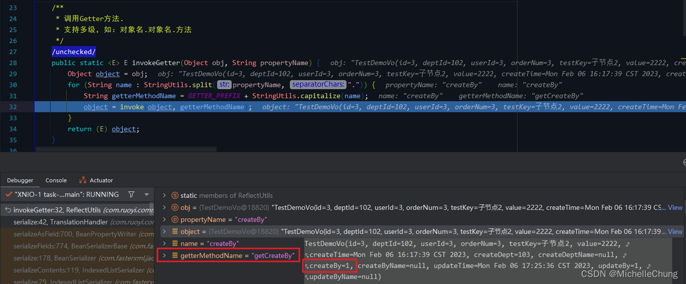

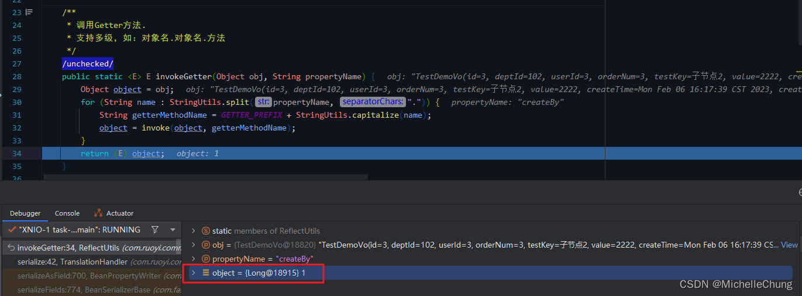

然后调用实现类的方法进行翻译： 

`UserNameTranslationImpl#translation` 
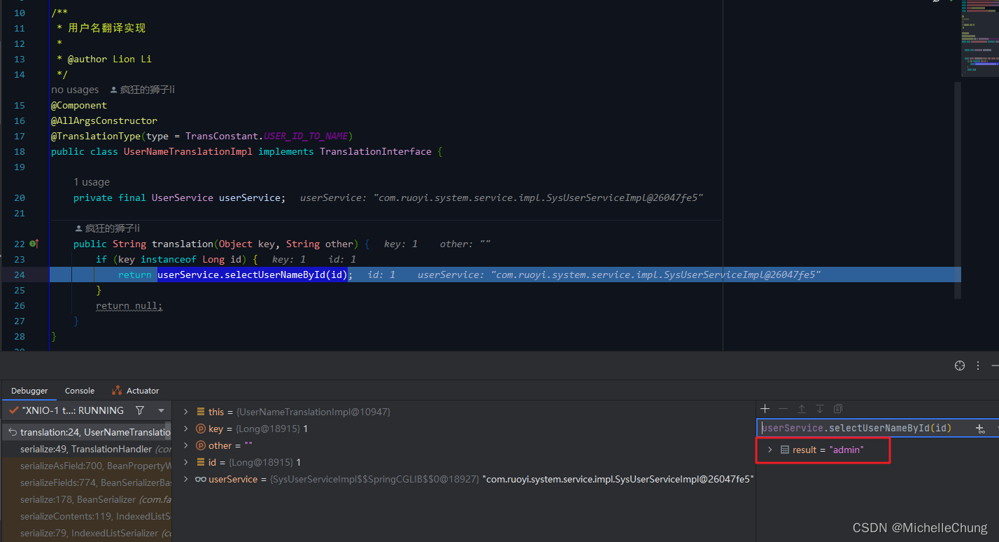

最后返回结果并由生成器写出最终结果到属性中： 
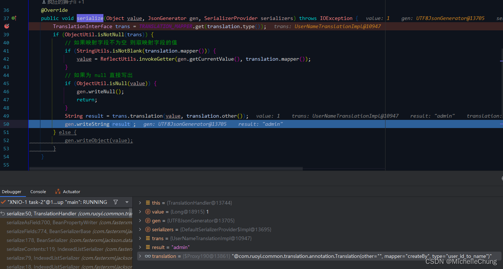

至此便完成了一个属性值的翻译功能。其他几种翻译实现过程是一样的，只是实现类不同，如果有需要也可以根据自身实际情况进行定制化。

（完）