# Token 验证 （JWT）
- - -
## 一、概述
在上一篇文章登录认证流程当中，登录认证通过后，最后一步是生成 token 返回给前端，因此这篇文章主要是对于 token 生成的一些整理。

## 二、Token 生成流程
请求头 token 信息： 
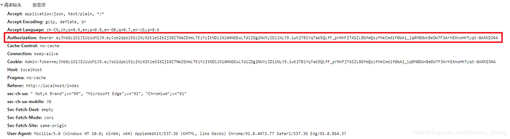

创建 token： 

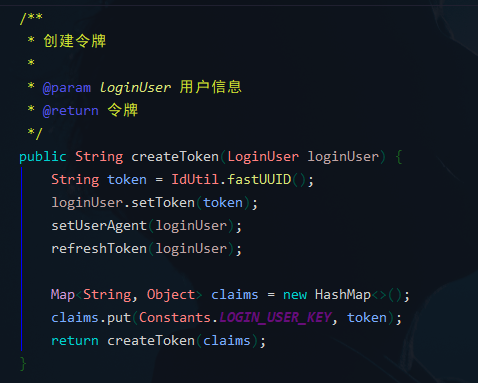

1. token 是用 Hutool 生成的 UUID 字符串，保存到 LoginUser 对象中。LoginUser 实现了 Spring Security 中的 UserDetails 接口，用于保存登录用户信息。

2. 设置用户代理信息 `setUserAgent` ： 
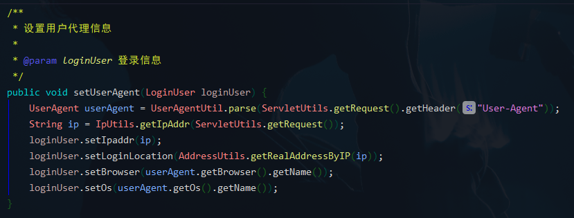 
3. 设置令牌有效期 `refreshToken` ： 
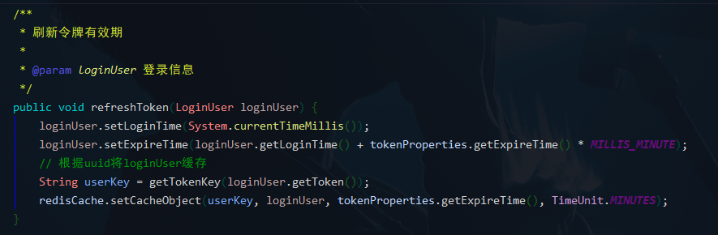 
该方法设置用户的登录时间、token 过期时间，以及将登录用户信息缓存到 Redis 中。

4. 生成 JWT 令牌 `createToken` ： 
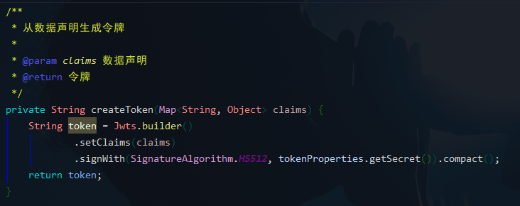 
claims 保存了 token 信息，签名算法是 HS512，秘钥是在配置文件中配置的： 
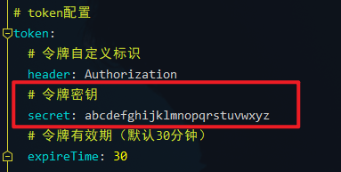 
*注：JWT属于对称加密，因此不能泄露秘钥信息，否则任何人都可以通过秘钥生成 token 并通过校验。*

## 三、Token 验证流程
若依框架中使用了 Spring Security + JWT 进行权限验证，在 Spring Security 配置 `SecurityConfig` 中也加入了 JWT 过滤器`JwtAuthenticationTokenFilter` ： 
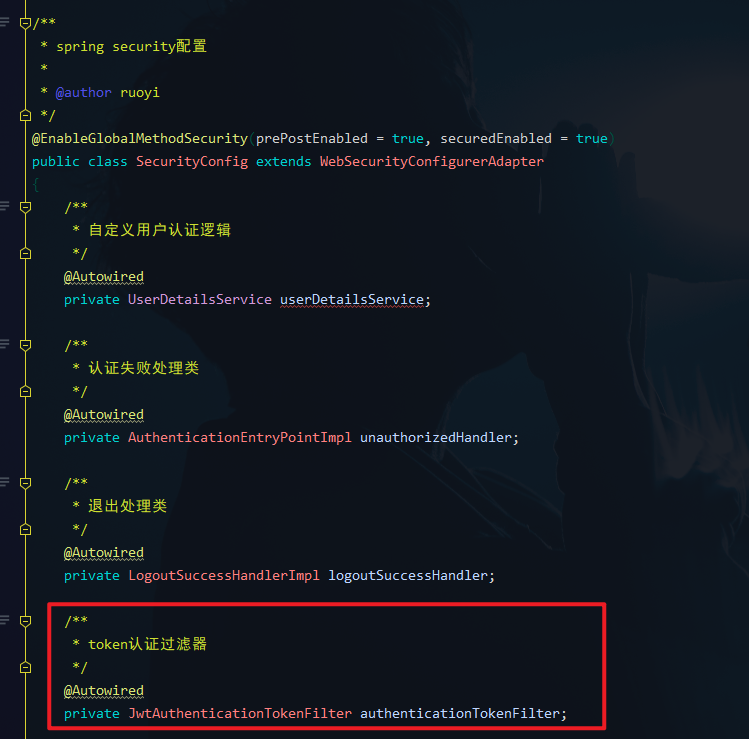

在方法 `configure(HttpSecurity)` 中： 
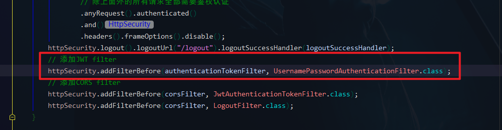

在项目启动过程中也能看到启动信息： 
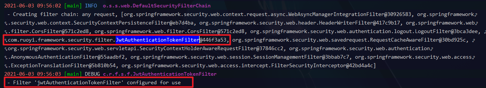

查看 token 过滤器 `JwtAuthenticationTokenFilter` ： 
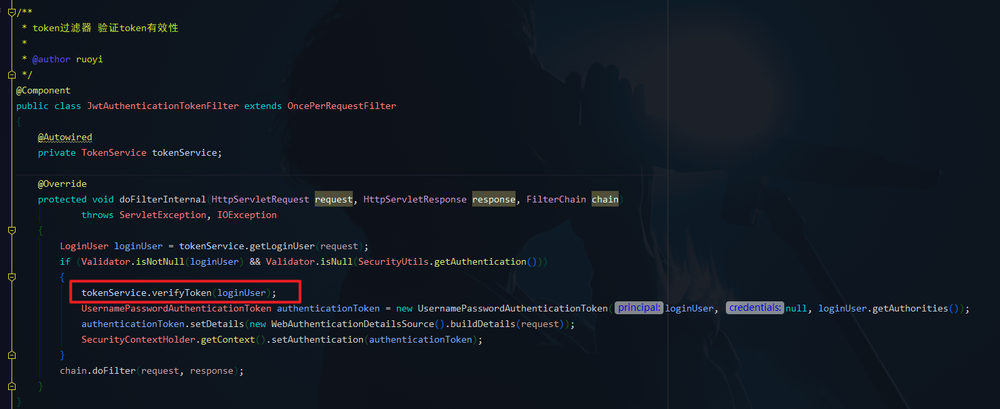
1. 获取用户信息 `getLoginUser` ： 
 
1.1. 获取请求token `getToken` ： 
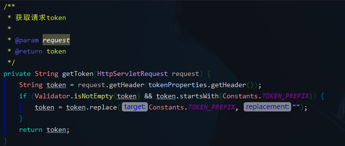 
1.2. JWT 解析 token `parseToken` ： 
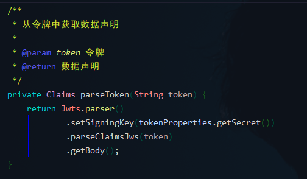 
1.3. 根据返回的信息到缓存中获取用户信息并返回： 
`LoginUser user = redisCache.getCacheObject(userKey);` 

2. 验证 token 有效期 `verifyToken` ： 
 
验证通过会刷新令牌有效期，否则会在过滤器抛出异常 token 失效，需要重新登录。