# Spring 事件监听器 @EventListener 注解简单分析
- - -
## 前言
因为之前比较忙所以匿了一段时间，顺便当了神雕大侠（“阳过”）。前段时间框架已经发布了新版本 V4.4.0，而在最新的 dev 分支中使用了事件监听器对代码进行解耦，所以这篇文章来简单分析一下它的源码。

## 参考目录
- [Spring 官方文档 - Standard and Custom Events](https://docs.spring.io/spring-framework/docs/current/reference/html/core.html#context-functionality-events)
- [狮子大佬的博客 - SpringBoot 事件机制使用方式与特性讲解](https://lionli.blog.csdn.net/article/details/128241806?spm=1001.2014.3001.5502)
- [it_lihongmin - Spring源码-事件监听机制（@EventListener实现方式）](https://blog.csdn.net/it_lihongmin/article/details/102940643)

事件的使用其实非常简单，特别是使用 Spring 提供的注解 `@EventListener`，只需要传入指定的参数即可，下面将从初始化以及方法调用两个方面进行简单的分析。

为了简单起见，我使用的是自定义方法，并且是在4.X分支（主分支）下进行演示，dev分支已经使用事件重构了OSS加载配置以及日志记录配置等方法，有兴趣的话可以自行查看。

## 测试方法
### 配置说明
- 框架版本：`V4.4.0`
- Spring Boot 版本：`V2.7.6`
  
### 测试方法
`com.ruoyi.demo.controller.TestDemoController`
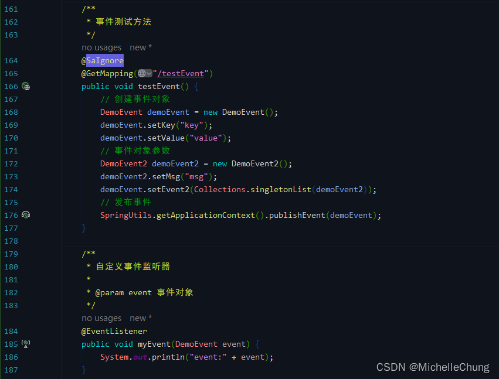

事件对象： 
`com.ruoyi.demo.domain.event.DemoEvent` 

`com.ruoyi.demo.domain.event.DemoEvent2` 

## 功能调用流程分析
### 事件监听器初始化
由注解 `@EventListener` 标注的方法即为事件监听器。

`org.springframework.context.event.EventListener` 

可以看到红框中的注释，指出了主要的处理类是 `EventListenerMethodProcessor`。

`org.springframework.context.event.EventListenerMethodProcessor` 

这实际上是一个后置处理器，有一个重要的方法： 
`EventListenerMethodProcessor#afterSingletonsInstantiated` 
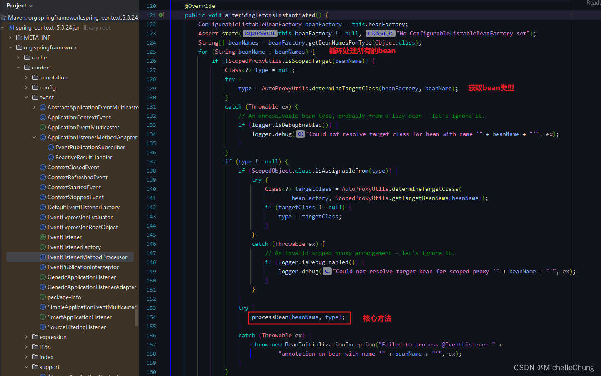

最主要的逻辑是处理bean的方法： 
`EventListenerMethodProcessor#processBean` 
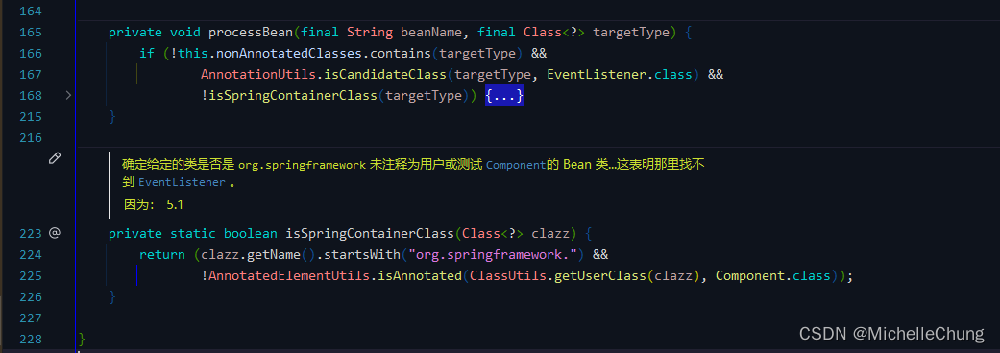

最开始需要做判断：
1. `nonAnnotatedClasses` 是没有注解的类的集合，if内部的方法在每次处理 bean 时都会把新的放进去；
2. `isCandidateClass` 判断是否是候选类；
3. `isSpringContainerClass` 判断是否是 Spring 容器类。

判断通过进入方法体： 

当有符合的方法，则包装成 `ApplicationListenerMethodAdapter`。 
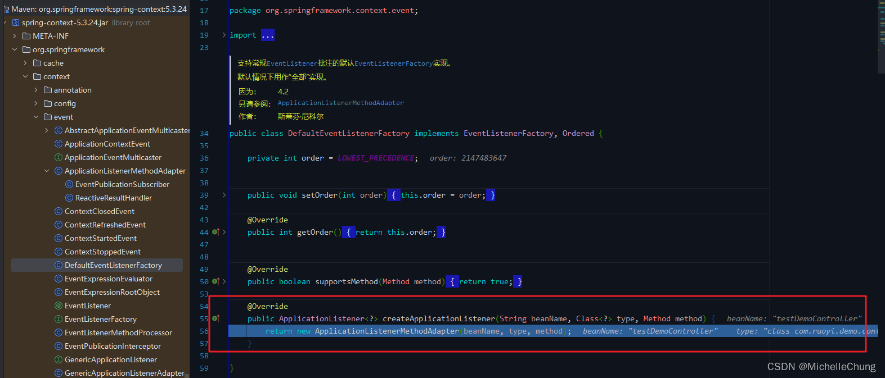

`ApplicationListenerMethodAdapter#ApplicationListenerMethodAdapter` 

最终将监听器存入Spring context。 
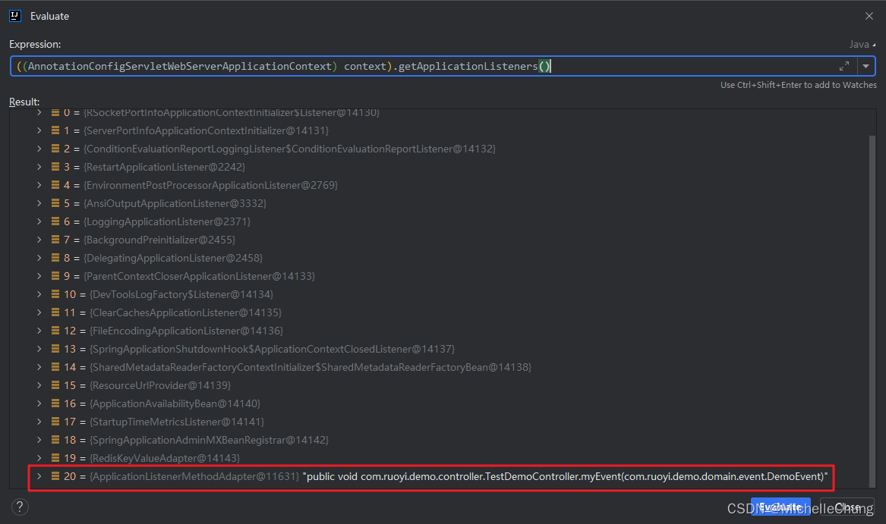
### 事件发布流程
发布事件操作很简单，只需要调用 `ApplicationContext` 的 `publishEvent` 方法即可。 

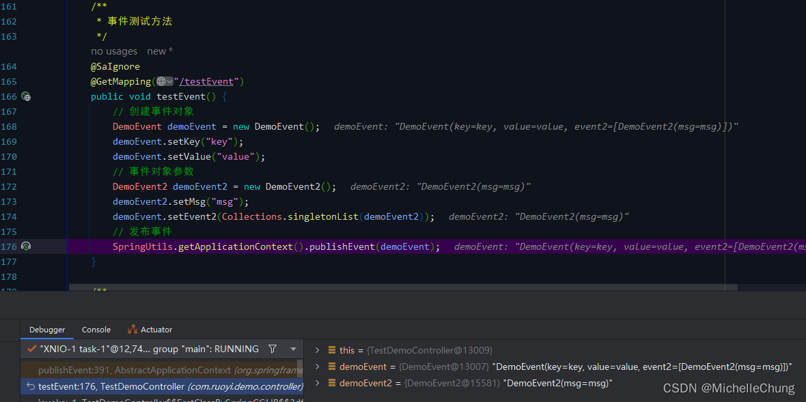

`org.springframework.context.ApplicationEventPublisher` 
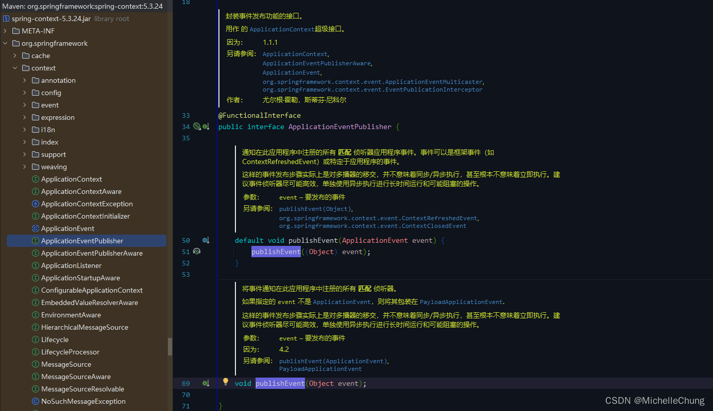

`AbstractApplicationContext#publishEvent` 

同一个方法可以有多个监听器。 

`SimpleApplicationEventMulticaster#multicastEvent` 

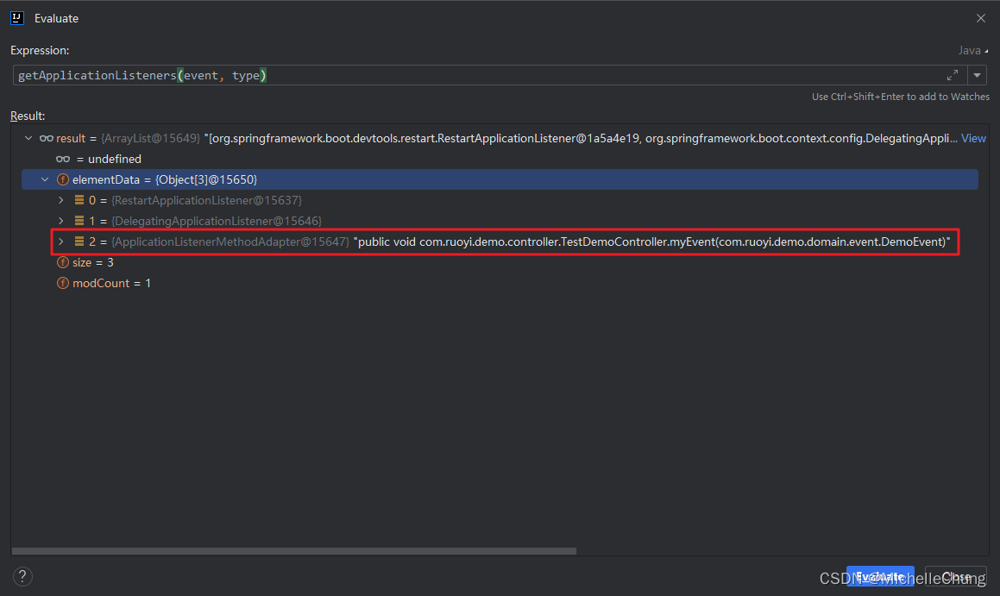

`SimpleApplicationEventMulticaster#invokeListener` 
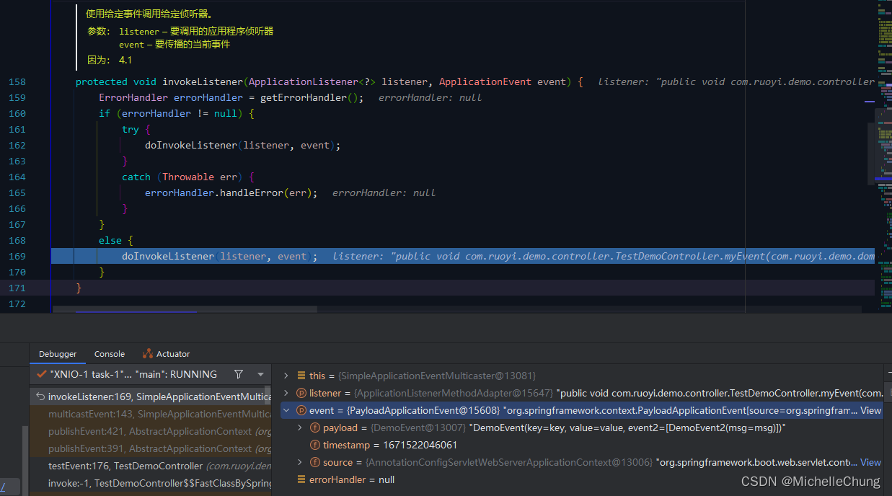

`SimpleApplicationEventMulticaster#doInvokeListener` 

注意这里是调用 `ApplicationListenerMethodAdapter` 的方法： 

`ApplicationListenerMethodAdapter#onApplicationEvent` 

`ApplicationListenerMethodAdapter#processEvent` 

`ApplicationListenerMethodAdapter#doInvoke` 
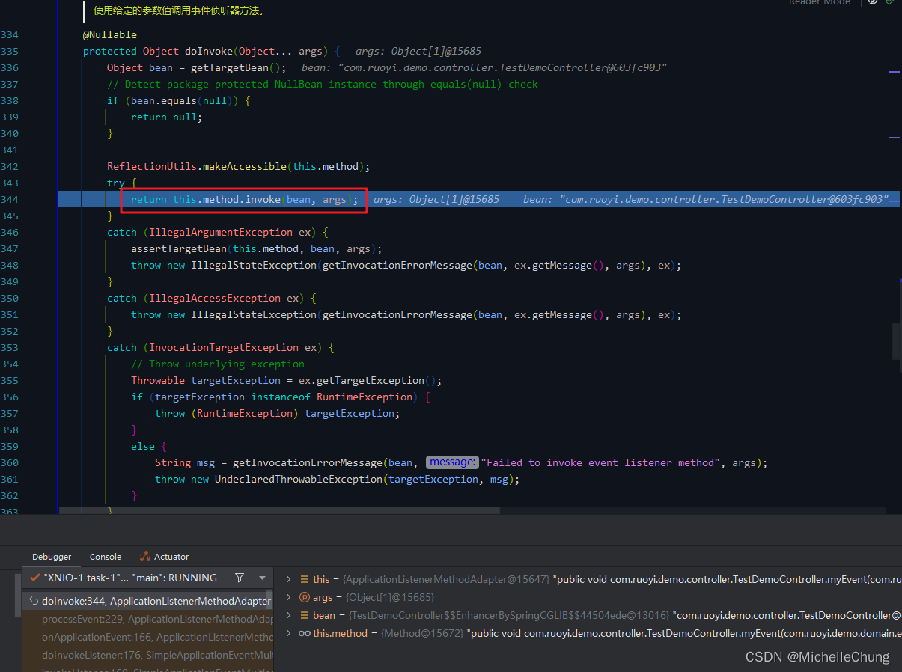

这里实际上就是调用具体事件监听器的方法： 
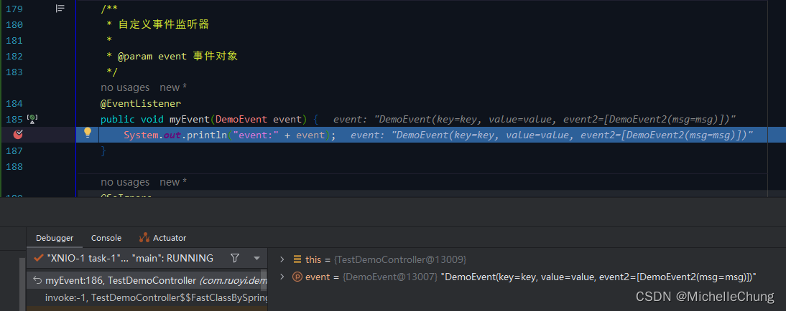

控制台的打印： 

（完）