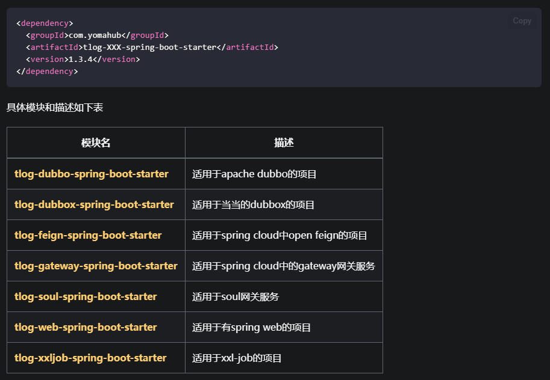

# 日志框架 TLog

## 参考资料
- [TLog官方文档](https://yomahub.com/tlog/)
- [TLog官方文档 - 按需依赖](https://yomahub.com/tlog/docs/dependency/dependency-ondemand)
- [TLog官方文档 - Logback框架适配器](https://yomahub.com/tlog/docs/log-adaptor-type/log-adaptor-type-logback)
- [TLog官方文档 - 自动打印调用参数和时间](https://yomahub.com/tlog/docs/invoke-time)

## 一、概述
本文章主要记录框架中相关 TLog 配置。
## 二、相关配置
### 1、Maven
[TLog官方文档 - 按需依赖](https://yomahub.com/tlog/docs/dependency/dependency-ondemand)：<br>


`RuoYi-Vue-Plus` 框架中和官网不太一样。

主pom依赖（版本1.3.3）：
```xml
<dependency>
    <groupId>com.yomahub</groupId>
    <artifactId>tlog-spring-boot-configuration</artifactId>
    <version>${tlog.version}</version>
</dependency>

<dependency>
    <groupId>com.yomahub</groupId>
    <artifactId>tlog-webroot</artifactId>
    <version>${tlog.version}</version>
    <exclusions>
        <exclusion>
            <artifactId>javassist</artifactId>
            <groupId>org.javassist</groupId>
        </exclusion>
        <exclusion>
            <artifactId>guava</artifactId>
            <groupId>com.google.guava</groupId>
        </exclusion>
    </exclusions>
</dependency>

<dependency>
    <groupId>com.yomahub</groupId>
    <artifactId>tlog-feign</artifactId>
    <version>${tlog.version}</version>
</dependency>

<dependency>
    <groupId>com.yomahub</groupId>
    <artifactId>tlog-xxl-job</artifactId>
    <version>${tlog.version}</version>
</dependency>
```
### 2、Logback框架适配器
[TLog官方文档 - Logback框架适配器](https://yomahub.com/tlog/docs/log-adaptor-type/log-adaptor-type-logback)：<br>
<br>
`ruoyi-admin` 模块下修改 `logbak.xml` ：<br>

包含 `console` 、`file_console` 、`file_info` 、`file_error` 、`sys-user`<br>


### 3、自动打印调用参数和时间
[TLog官方文档 - 自动打印调用参数和时间](https://yomahub.com/tlog/docs/invoke-time)：<br>


`ruoyi-admin` 模块下 `application.yml` ：<br>

```yaml
# tlog 全局访问性能拦截
tlog:
  enable-invoke-time-print: true
```
### 4、TLogConfig
`ruoyi-framework` 模块下 `com.ruoyi.framework.configTLogConfig.java` ：<br>

