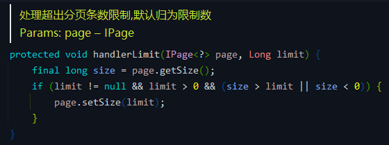

# Mybatis Plus 分页插件实现分页功能
- - -
## 前言
前段时间框架发布了新版本 3.5.0，其中有一项是重构了分页功能。虽然分页功能并不复杂，但是基本上任何项目都会涉及到分页，而且我比较喜欢框架中对于分页功能的实现的代码，对比自己以前的项目简洁许多，所以这次就单独拿来说一下。

## 参考目录
- [框架 wiki - 分页功能](https://gitee.com/dromara/RuoYi-Vue-Plus/wikis/%E6%A1%86%E6%9E%B6%E5%8A%9F%E8%83%BD/%E5%88%86%E9%A1%B5%E5%8A%9F%E8%83%BD)
- [Mybatis Plus 文档 - 分页插件](https://baomidou.com/pages/97710a/)

在框架 wiki 中也有分页功能的描述以及使用。

## 代码分析
### 1、分页构建使用
`TestDemoServiceImpl#customPageList()` 

`TestDemoMapper#customPageList()` 

和 MP 原本的分页使用一样，在 `XXMapper` 中加上分页参数（**注意分页参数要放在首位**），SQL中无需再加分页参数。

框架中构建 `page` 参数比以前要简单很多，在 `PageQuery` 中对分页参数构建进行了封装，只需要调用 `pageQuery.build()` 方法即可，不需要再 `new Page()`。

### 1.1、构建分页参数
`PageQuery#build()` 

`PageQuery#buildOrderItem()` 

### 2、分页插件 `paginationInnerInterceptor`
`MybatisPlusConfig#paginationInnerInterceptor()` 

官方文档属性介绍： 

### 2.1、分页溢出处理 `overflow`
`PaginationInnerInterceptor#continuePage()` 

`PaginationInnerInterceptor#handlerOverflow()` 

当属性 `overflow` 设置为 `true`，会判断当前页码是否超过最大页码，如果超过则调用 `handlerOverflow()` 方法，将当前页码设置为第1页。

### 2.2、单页条数限制 `maxLimit`
`PaginationInnerInterceptor#handlerLimit()` 

在组件中设置 `limit` 为 -1，因此没有限制单页最大条数。

`PaginationInnerInterceptor#beforeQuery()` 

