# Mybatis-Plus（一）自动填充功能的实现与分析

## 前言
### 关于 `Mybatis-Plus `
`Mybatis-Plus` 相信很多人都不陌生。

> MyBatis-Plus (opens new window)（简称 MP）是一个 MyBatis (opens new window)的增强工具，在 MyBatis 的基础上只做增强不做改变，为简化开发、提高效率而生。

作为一款强大的开发工具，很多框架都是必备的（当初我从学习若依到 `RuoYi-Vue-Plus` 也是因为这个原因）。虽然在日常开发中很常使用，但是实际上对于底层的了解知之甚少（比如本人）。所以借由 `RuoYi-Vue-Plus` 框架的学习，也顺带学习一下 `Mybatis-Plus` 里面一些好用的功能。

### 关于字段自动填充
在数据库表设计时，常常有固定字段需要填充，例如`创建人`、`创建时间`、`修改人`、`修改时间`等。时间字段也可以通过 MySQL 数据库的默认值进行填充，但是创建人、修改人就无法通过默认值进行填充，如果在每个操作接口都手动插入，则平添了许多无用功。MP 则很好地帮助我们解决了这个问题。因此本文来简单分析一下自动填充的实现以及调用过程。

## 参考目录
- [MP官方文档 - 自动填充功能](https://baomidou.com/pages/4c6bcf/)

## 自动填充的代码实现
按照官方文档的说明，主要是两个步骤：
1. 注解填充字段
2. 自定义实现类

**注：本文以插入自动填充为例进行说明。**
### 0、测试调用的方法
本文使用的测试方法是：新增测试单表 `TestDemoController#add`
### 1、注解填充字段
在框架中，自动填充字段都抽取成了 `BaseEntity`，每个业务实体类都会继承这个实体类。 
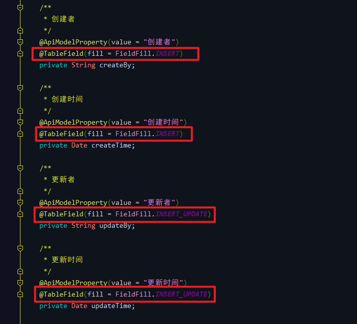

测试方法的实体类 `TestDemo` 
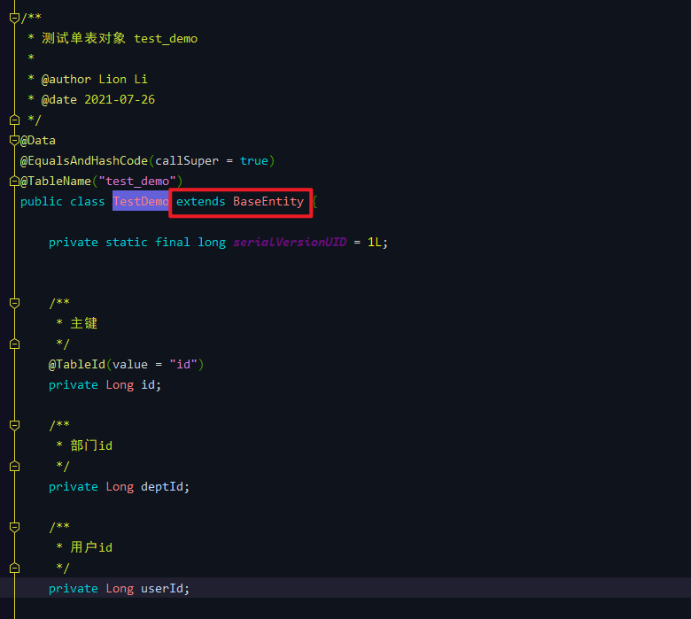
### 2、自定义实现类 `CreateAndUpdateMetaObjectHandler`
`CreateAndUpdateMetaObjectHandler` 实现了 `MetaObjectHandler` 接口，重写了 `insertFill` （插入填充）以及 `updateFill` （更新填充）方法。 
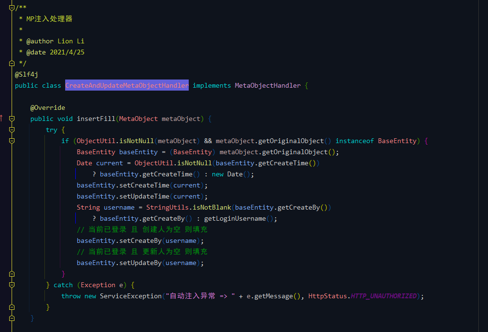

基于以上步骤，框架实现了自动填充的功能。个人觉得，往往简单的实现背后都是基于强大的封装。所以下面来分析一下它的调用流程。

## 自动填充的调用流程分析
### ##、流程简图（重点）
首先，请记住这张图（后面的流程截图都是基于此）： 
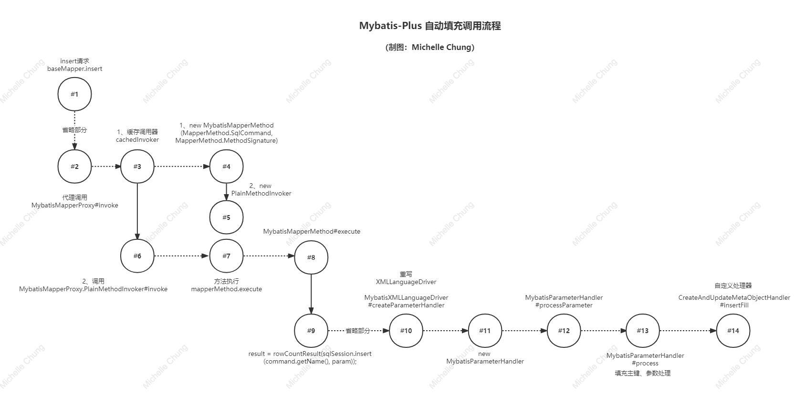

说明：
- 实线代表的是同一个方法内的调用，执行顺序从上往下。
- 点线代表的是当前方法深入一层的调用，执行顺序从上往下，从左往右。

因为底层的流程比较复杂，很容易绕晕，所以就制作了一张调用简图（UML类图不太会，所以用了这种简陋的图，请见谅），**再次温馨提醒，结合这张图走不容易迷路**。

### #1、insert 请求
测试方法的实现类。 
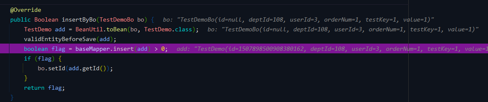
### #2、处理器调用 `MybatisMapperProxy#invoke`
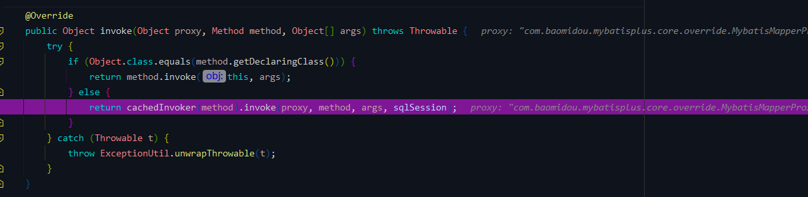
### #3、缓存调用器 `MybatisMapperProxy#cachedInvoker`
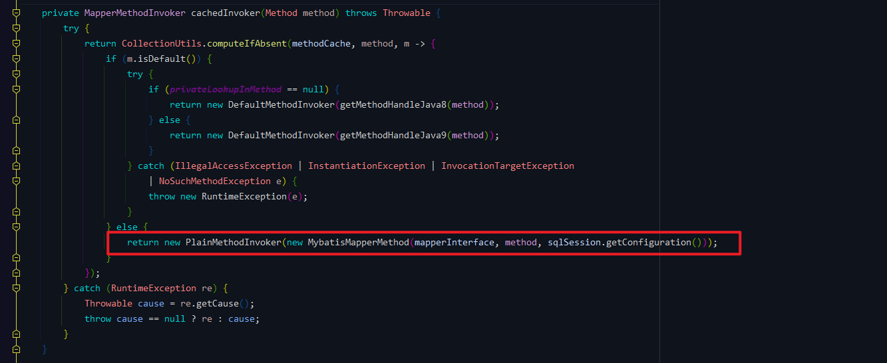
### #4、`MybatisMapperMethod`
将 SQL 信息封装到该对象。 

### #5、`PlainMethodInvoker`
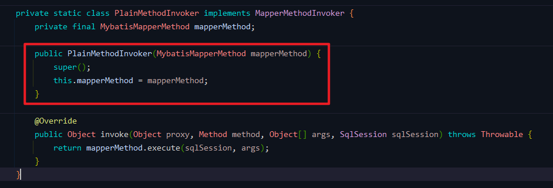
### #6、`PlainMethodInvoker#invoke`
此处是接着步骤 #2 继续执行。 

### #7、`PlainMethodInvoker#invoke` 方法执行
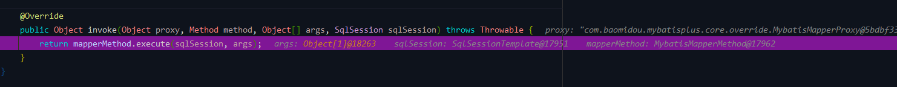
### #8、`MybatisMapperMethod#execute`
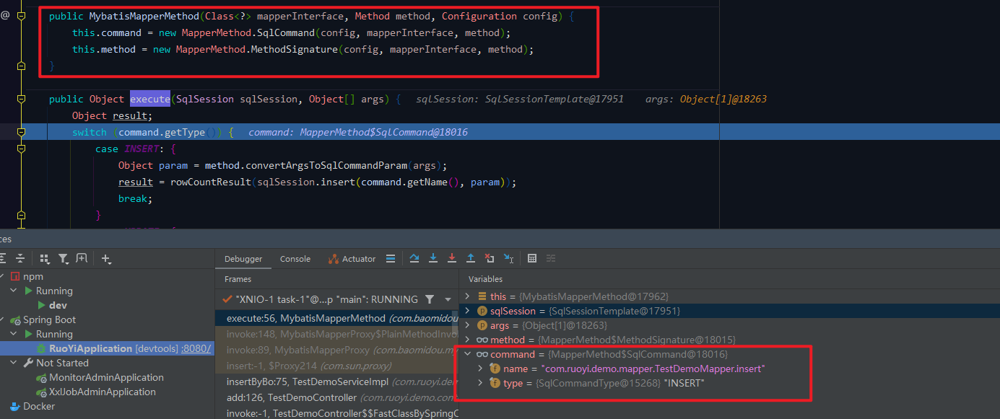

在 #4 中保存了 SQL 的信息，因此先判断类型，此处是 `INSERT`，进入方法体中继续执行。 
### #9、`MybatisMapperMethod#execute`
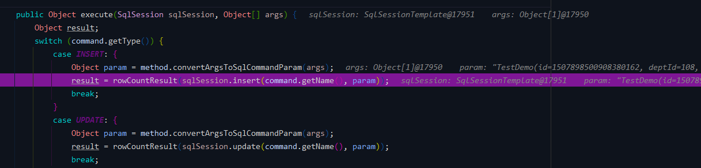
### #10、`MybatisXMLLanguageDriver#createParameterHandler`
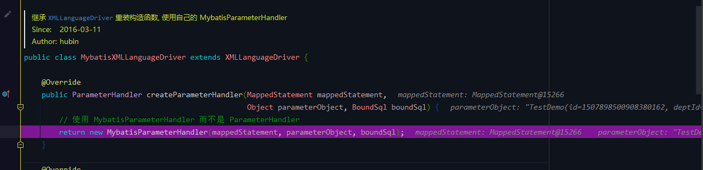

此方法重写了 `XMLLanguageDriver` 中的 `createParameterHandler` 方法。
### #11、构造方法 `new MybatisParameterHandler`
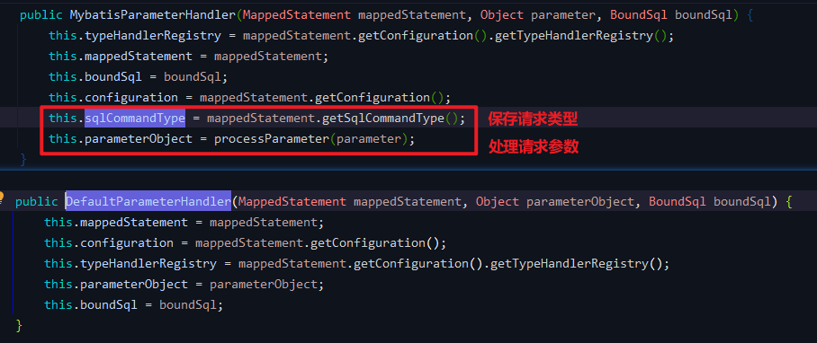
- 上面的是`MybatisXMLLanguageDriver#createParameterHandler`
- 下面的是`XMLLanguageDriver#createParameterHandler`

新的构造方法保存了请求类型以及进行了参数的处理。
### #12、`MybatisParameterHandler#processParameter`
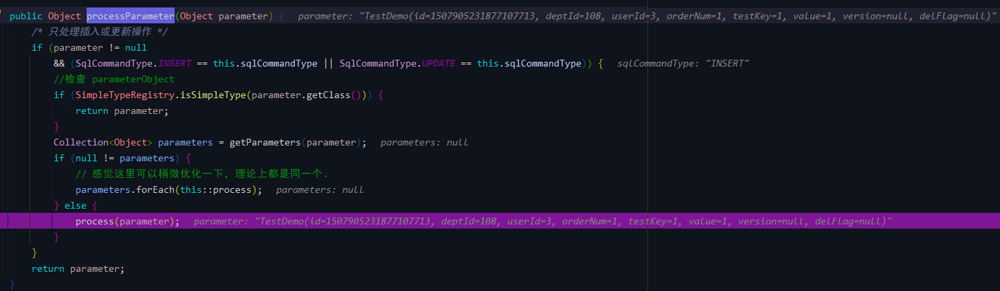
### #13、处理参数 `MybatisParameterHandler#process`
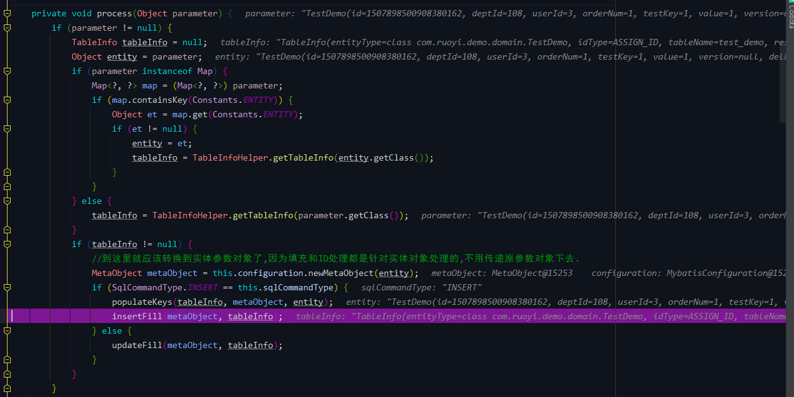

这个方法主要有下面几个步骤：
1. 获取到表字段信息 `TableInfo`。
2. 填充主键 `populateKeys`（根据 `IdType` 自动生成主键）。
3. 字段自动填充 `insertFill`。

`MybatisParameterHandler#insertFill` 
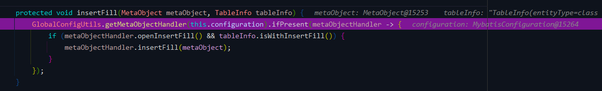 
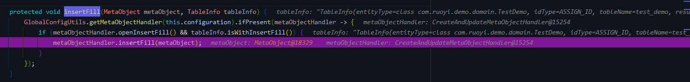
### #14、自定义自动填充方法 `CreateAndUpdateMetaObjectHandler#insertFill`
到这一步终于来到了自定义的方法。 
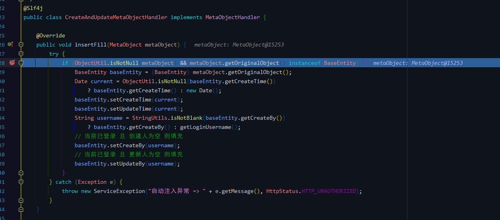 

自定义方法可以根据自己的需要进行定制。 

这一步完成之后，则完成了自动填充的功能，所有的参数进行返回，然后继续执行对数据库的操作方法。 

整个过程比较复杂，建议多 debug 几次进行理解，更新操作的自动填充与此类似，就不再赘述，感兴趣的朋友可以自行测试一下。 