# Mybatis-Plus（二）多租户插件功能的实现与分析

## 前言
最近项目里面使用了 `MyBatis-Plus` （简称 MP）的多租户插件功能，虽然在【RuoYi-Vue-Plus】原框架中没有引入该插件，但是在项目 wiki 的扩展项目里面有其他人集成的相关开源代码，当然也可以参照官方文档进行集成。

本文是基于框架 V3.5.0 版本进行分析。

## 参考目录
- [MP官方文档 - 多租户插件](https://baomidou.com/pages/aef2f2/#tenantlineinnerinterceptor)
- [MP官方 Demo](https://gitee.com/baomidou/mybatis-plus-samples/blob/master/mybatis-plus-sample-tenant/src/main/java/com/baomidou/mybatisplus/samples/tenant/config/MybatisPlusConfig.java)

## 多租户插件功能的代码实现
多租户插件功能的实现主要有以下步骤：

1. 在相关表添加多租户字段
2. 在 MP 拦截器 `MybatisPlusInterceptor` 中添加多租户插件拦截器 `TenantLineInnerInterceptor`
3. 根据业务对多租户插件拦截器 `TenantLineInnerInterceptor` 进行配置（多租户字段、需要进行过滤的表等）

在数据库相关表中加入租户id字段 `tenant_id`（别忘了相关实体类也要加上）。<br>
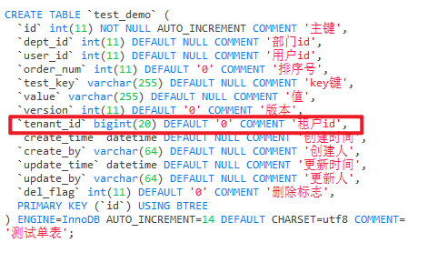<br>
### 0、测试调用的方法
`TestDemoController#list()`<br>
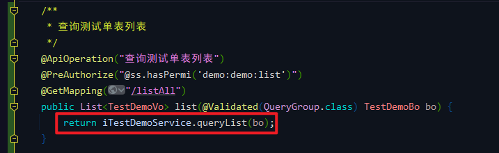<br>

这是一个新增的方法（在分析数据权限调用流程时也使用过该方法），原来 Demo 中有一个加上了分页的测试方法，这里暂时排除分页进行测试。<br>

`TestDemoServiceImpl#queryList()`<br>
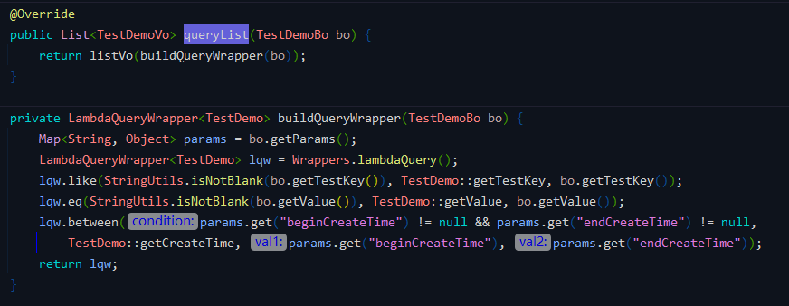<br>

`buildQueryWrapper` 是根据请求参数构建条件构造器，测试方法中不传参数，则会查询全部数据。<br>

**注：不要使用超级管理员账号进行测试，因为该账号默认拥有所有权限，多租户插件不会对超管账号进行拦截，看不到实际效果。建议新建账号及角色进行测试。**

### 1、数据权限配置 `MybatisPlusConfig`
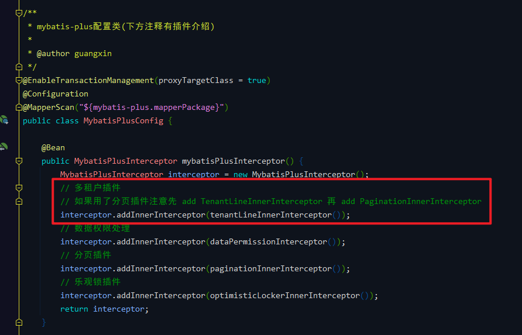<br>

**注：如果用了分页插件注意先 add TenantLineInnerInterceptor 再 add PaginationInnerInterceptor。（在官方 Demo 中也有提及）**
### 2、多租户插件拦截器 `TenantLineInnerInterceptor`
`MybatisPlusConfig#tenantLineInnerInterceptor`<br>
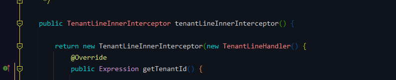<br>

完整配置：

```java
public TenantLineInnerInterceptor tenantLineInnerInterceptor() {

        return new TenantLineInnerInterceptor(new TenantLineHandler() {
            @Override
            public Expression getTenantId() {

                if (SecurityUtils.getTenantId() != null) {
                    //多租户模式，租户id从当前用户获取
                    return new LongValue(SecurityUtils.getTenantId());
                } else {
                    //多租户模式，租户id为null
                    return new LongValue(0);
                }

            }

            @Override
            public String getTenantIdColumn() {
                // 对应数据库租户ID的列名
                return "tenant_id";
            }

            // 这是 default 方法,默认返回 false 表示所有表都需要拼多租户条件
            @Override
            public boolean ignoreTable(String tableName) {
                String loginUser = String.valueOf(SecurityUtils.getAuthentication());
                // 判断是否登录，如果登录则过滤
                if (loginUser.contains("LoginUser")) {
                    // 判断是否平台超级管理员，如果是平台超级管理员则拥有所有数据权限
                    if (!SecurityUtils.isSuperAdmin()) {
                        // 需要过滤租户的表
                        List<String> tableNameList = Arrays.asList(
                            // 系统模块
                            "sys_user" , "sys_role" , "sys_dept" , "sys_post" , "sys_oper_log" , "sys_notice",
                            // 测试模块
                            "test_demo", "test_tree"
                            // ... 省略业务模块表 ...
                        );
                        return !tableNameList.contains(tableName);
                    }
                }
                return true;
            }
        });
    }
```

基于以上步骤，框架实现了完成了多租户插件的功能集成，下面来分析一下调用流程。<br>

## 多租户插件功能的调用流程分析
### ##、流程简图（重点）
首先按照惯例，请记住这张图（后面的流程截图都是基于此）：<br>
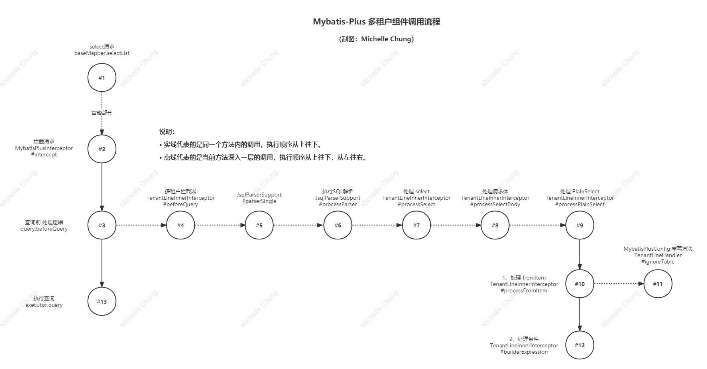

**温馨提醒，结合这张图走不容易迷路。**
### #1、select 请求
测试方法实现类，没有传参。<br>
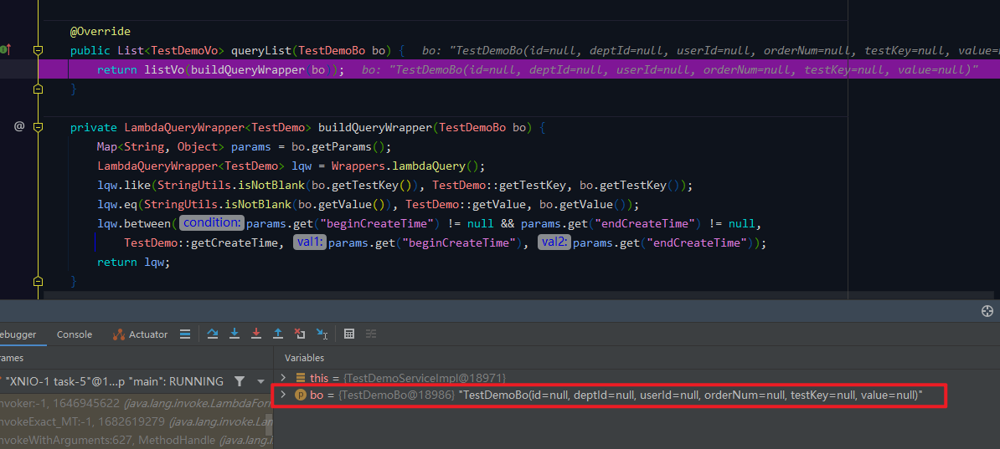
### #2、拦截请求 `MybatisPlusInterceptor#intercept`
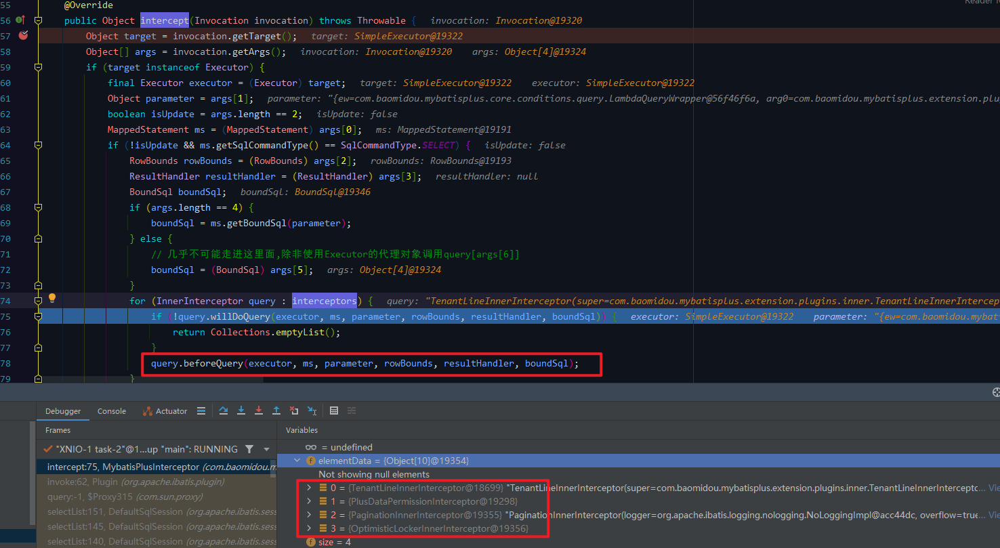

循环所有的拦截器对请求进行处理 `query.beforeQuery` 。<br>

### #4、多租户拦截器 `TenantLineInnerInterceptor#beforeQuery`
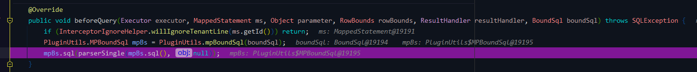
### #5、 `JsqlParserSupport#parserSingle`
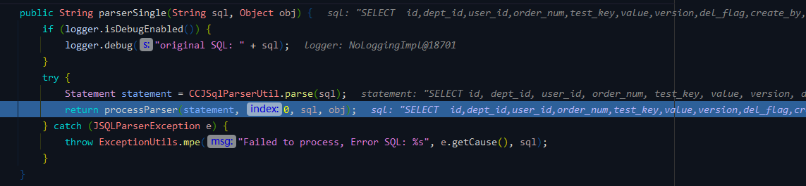
### #6、执行SQL解析 `JsqlParserSupport#processParser`
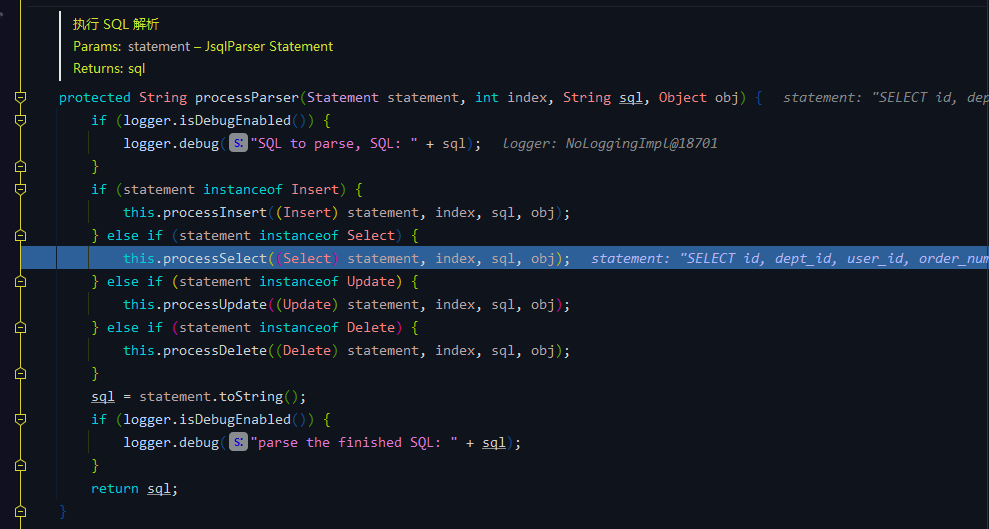

判断 SQL 为 `Select`，进入相关的处理逻辑。
### #7、处理 select `TenantLineInnerInterceptor#processSelect`
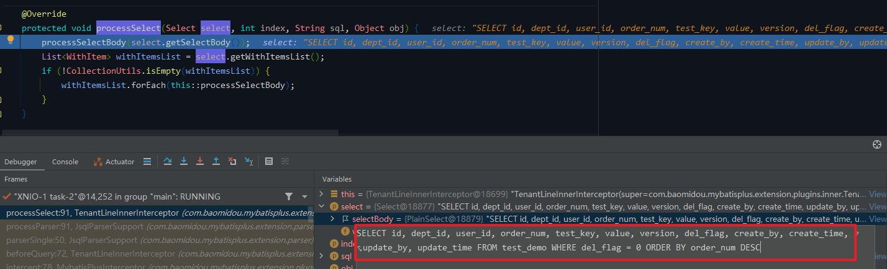
### #8、处理请求体 `TenantLineInnerInterceptor#processSelectBody`
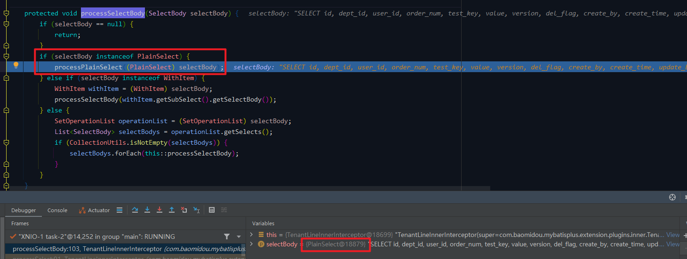

判断请求体类型为 `PlainSelect`，进入下面的处理逻辑。
### #9、处理 PlainSelect `TenantLineInnerInterceptor#processPlainSelect`
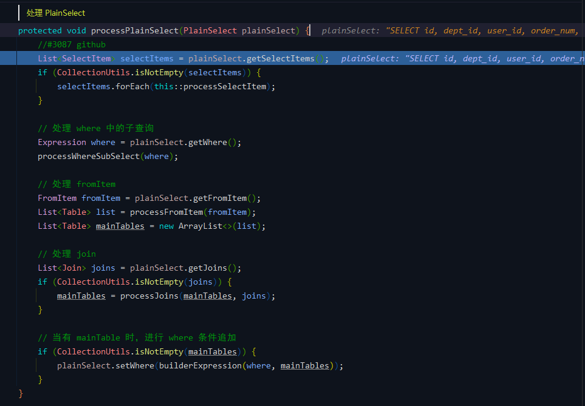

在这个方法中对 SQL 对象进行解析处理，对不同的部分分别进行了处理，在测试方法中主要关心的步骤是：
- 处理 fromItem
- 处理 where 条件

### #10、处理 fromItem `TenantLineInnerInterceptor#processFromItem`
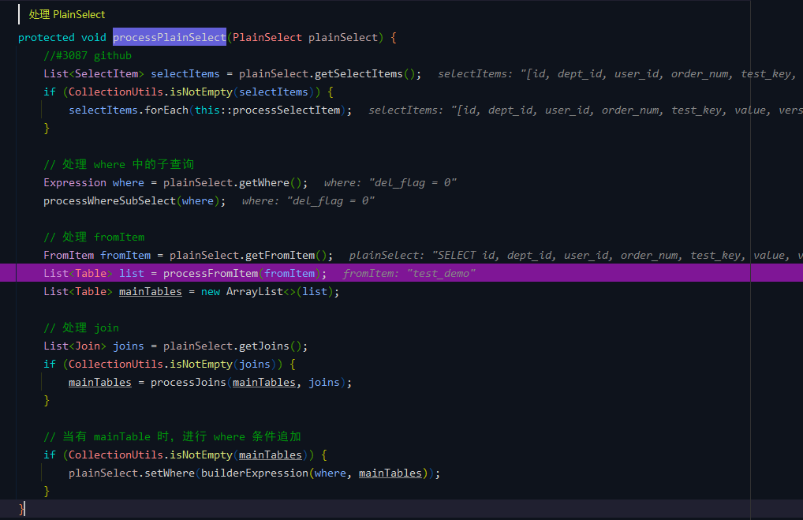

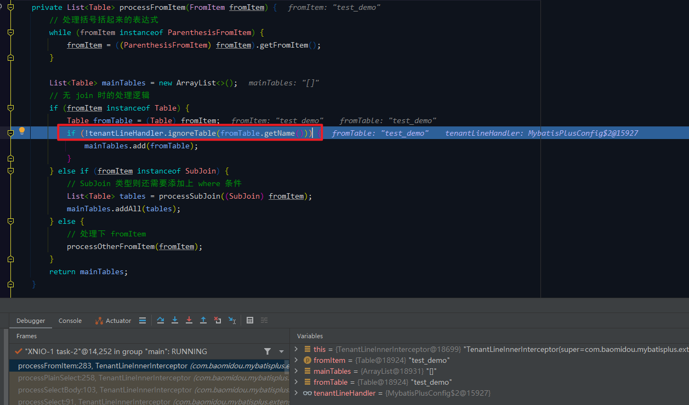

在这里有一个 if 判断方法 `if (!tenantLineHandler.ignoreTable(fromTable.getName()))`，判断当前表名是否忽略多租户插件功能，正是我们引入插件功能时在配置文件重写的方法。

### #11、`MybatisPlusConfig` 重写方法 `TenantLineHandler#ignoreTable`
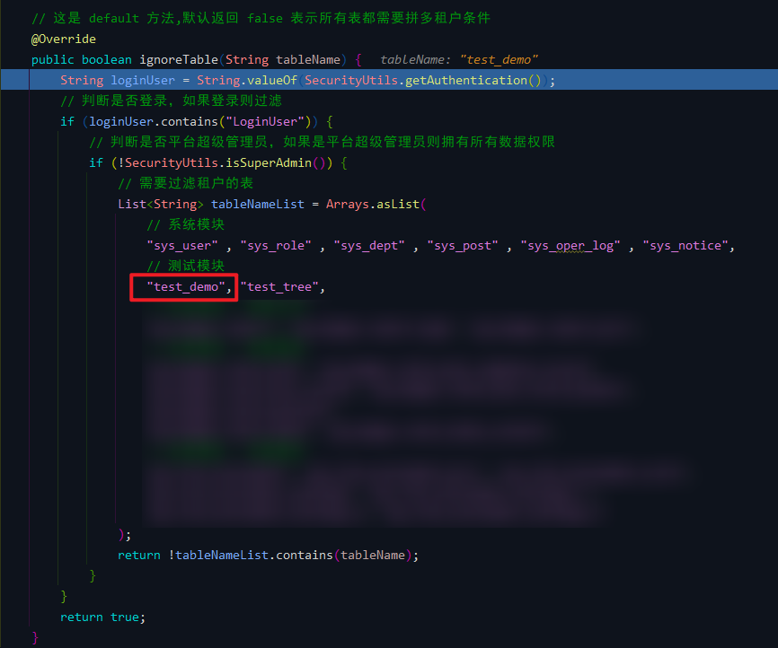

包含需要过滤的表，因此判断为 `true`。<br>

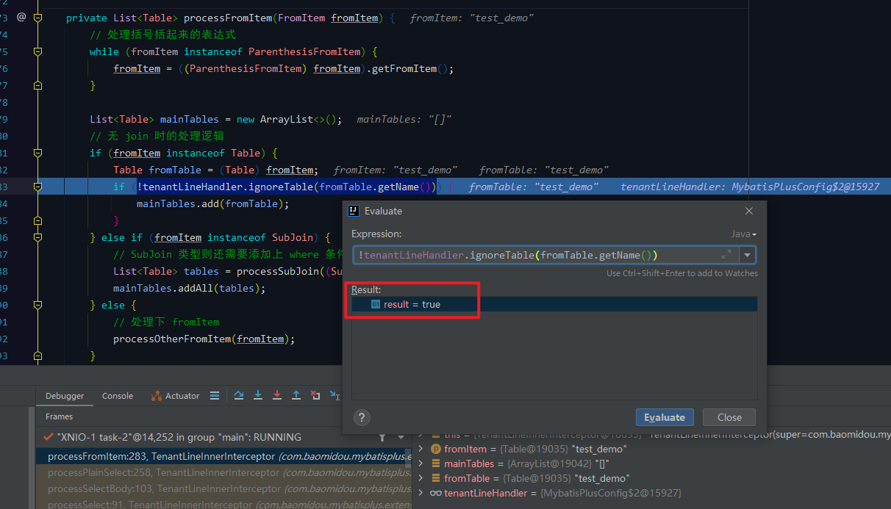

处理完 `FromItem` 后继续回到 `PlainSelect` 方法中往下执行，处理 where 条件。
### #12、处理条件 `TenantLineInnerInterceptor#builderExpression`
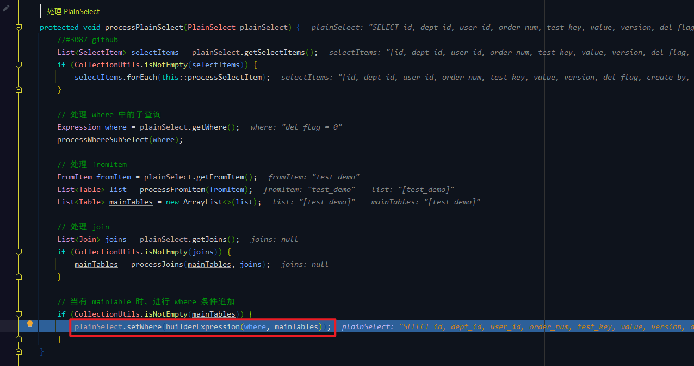

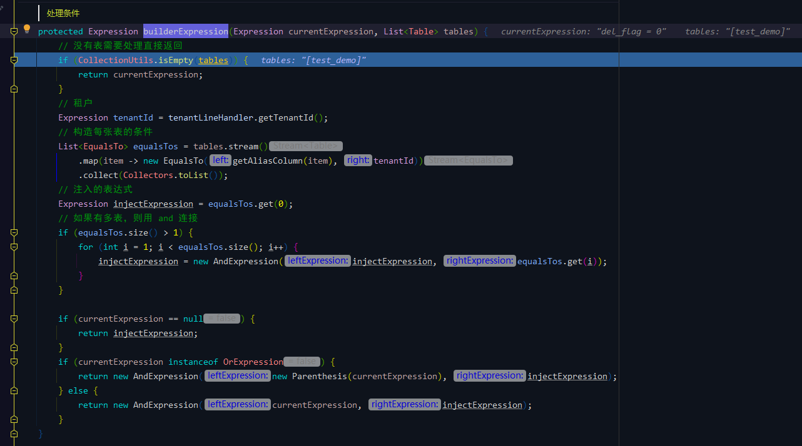

在该方法中获取到 租户id 信息，进行条件构造，最终返回 where 条件表达式。<br>
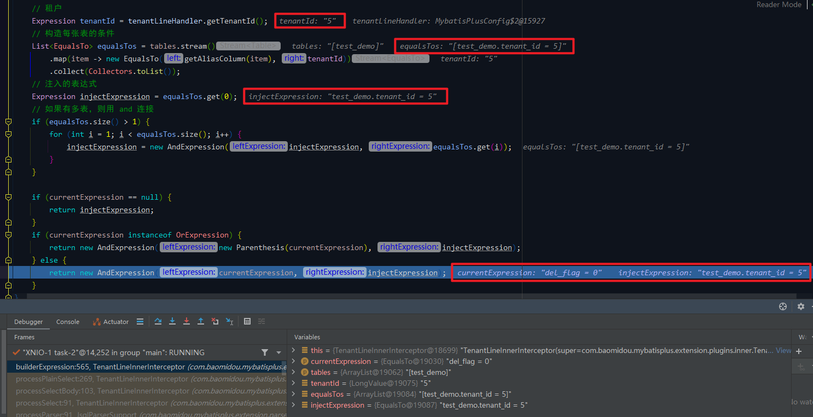

回到 `PlainSelect` 方法中，查看最终处理完的对象信息：<br>
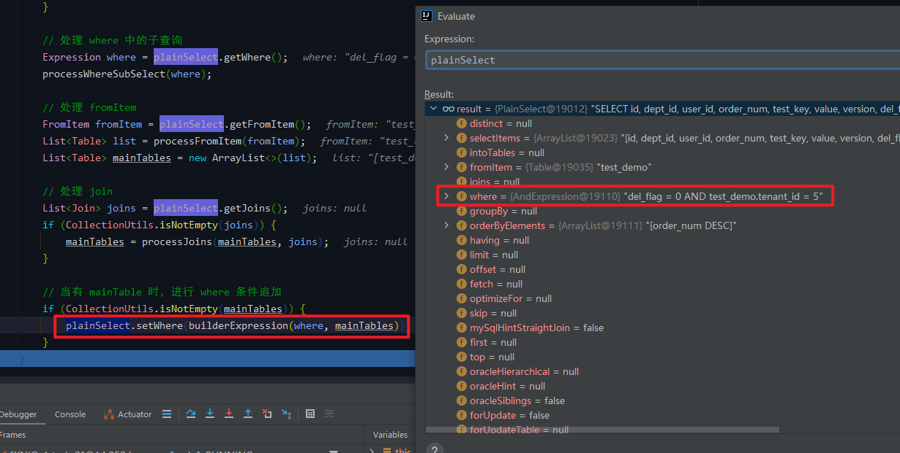

处理完成一步步回到前面的方法（#6）中，得到最终的 SQL 语句：<br>
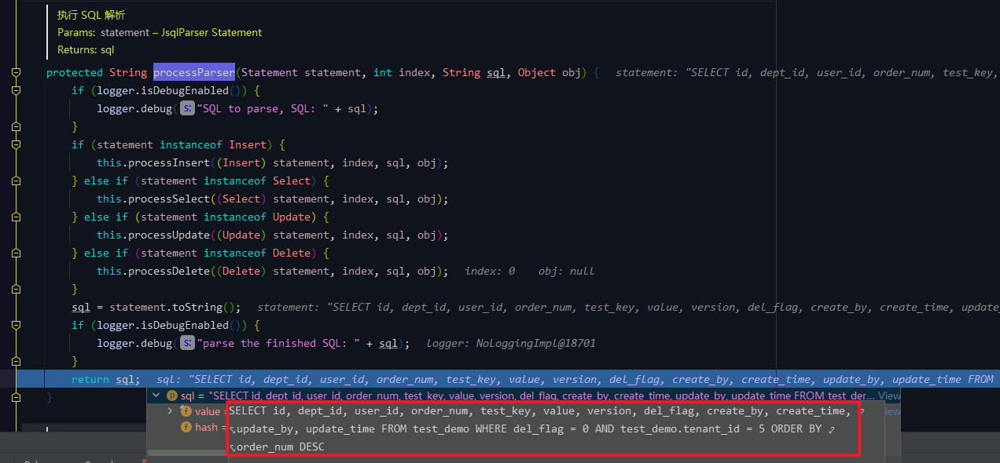

流程结束，控制台最终输出结果如下：<br>
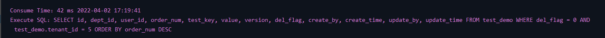

整个过程其实并不算太难，主要是使用拦截器根据不同的请求方法进行处理，我们需要配置好相关字段，并告诉拦截器字段名称，如何获取字段值，以及哪些表需要进行拦截处理即可。

不能理解的话建议多 Debug 几遍查看整个流程。